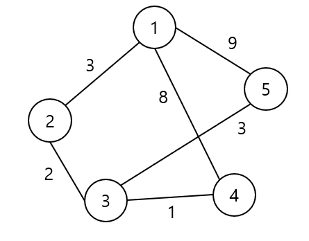
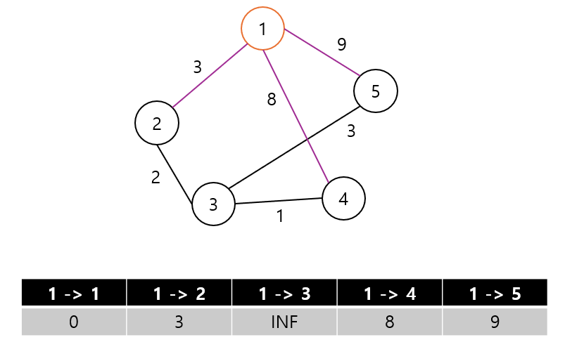
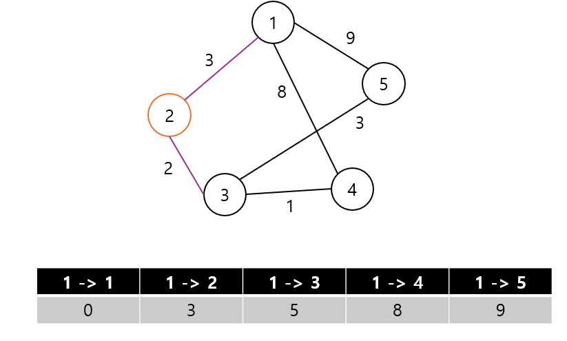
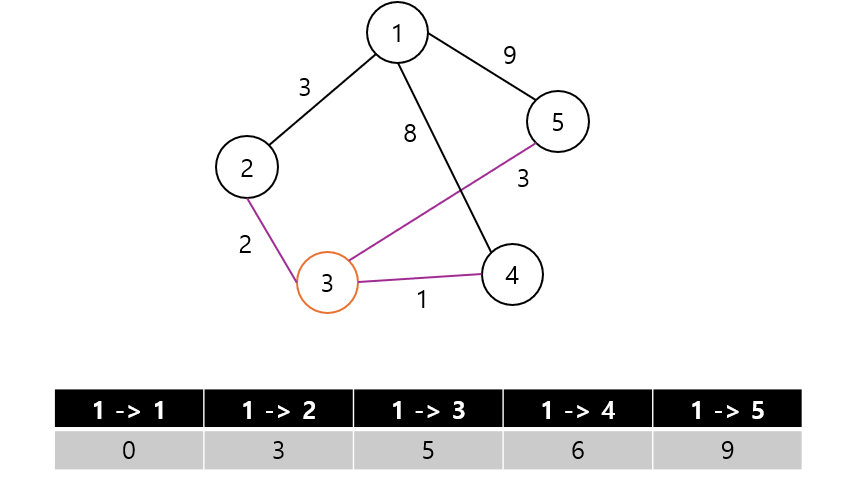
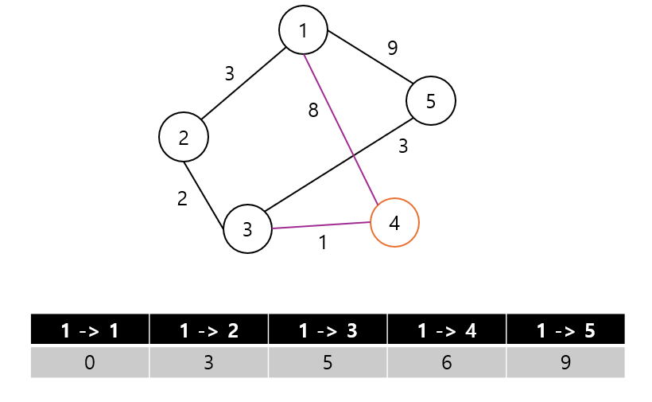

> 특정 한 노드를 1로 지정해 다른 노드들로 가는 비용을 업데이트 한다

> 2번 노드와 가장 가깝기 때문에 2번 노드로 이동하고 1번 노드는 방문처리를 한다  
> 3번 노드를 방문 할 수 있기 때문에 3번노드의 비용을 업데이트한다

> 2번노드에서 1번 노드는 방문했기 때문에 3번노드로 이동한다  
> 4번노드까지의 거리가 1->4 로 가는 비용 8 보다 1->2->3->4로 가면 비용이 6이기때문에 업데이트를 해준다

> 4번 노드로 이동했지만 5로 가는 간선이 없고 나머지는 방문처리 된 노드들이기때문에 탐색이 종료된다
