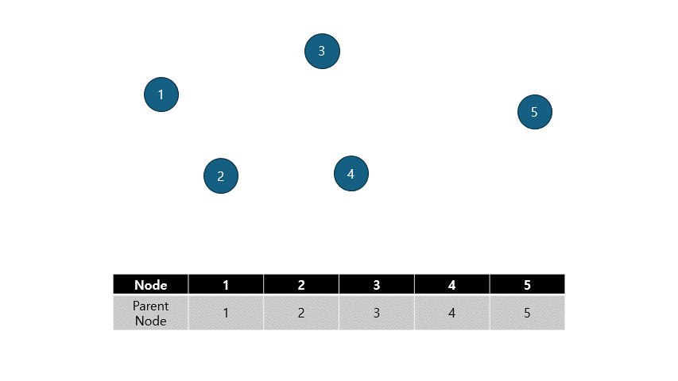
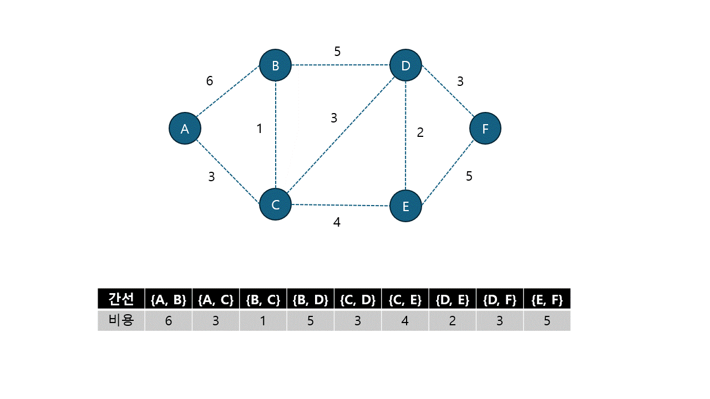

# MST가 무엇이고, 어떻게 구할 수 있을지 설명해 주세요.

## MST(Minimum Spanning Tree) 최소 신장 트리

> Spanning Tree는 그래프의 모든 노드를 포함하면서 사이클이 없는 부분 그래프이다.<br>
> 가중치(weight)를 갖는 무방향 그래프에서 모든 노드를 포함하면서 사이클이 없는 부분 그래프 중에서 전체 가중치 합이 최소인 트리를 최소 신장 트리라고 한다

## Algorithm

### `Union Find`

> `합집합 찾기` : 임의의 두 원소를 선택했을 때 같은 집합인지 판별하는 방법



#### makeSet(초기화)

- 각 노드를 하나의 집합으로 만들기

#### unoin(합치기)

- 두 집합을 합치기

#### find(찾기)

- 주어진 노드의 대표노드를 반환

### `Kruskal Algorithm`



> 1.  그래프의 간선들을 가중치 기준으로 오름차순 정렬한다.
> 2.  정렬된 간선들 중 순서대로 사이클을 형성하지 않는 간선들을 채택한다.
> 3.  선택된 간선을 MST 집합에 넣는다.
> 4.  MST 집합의 원소 개수가 N - 1개가 될 때까지 2, 3을 반복한다.

### `Prim Algorithm`


> 1.  시작 단계는 시작 노드만이 MST 집합에 속한다.
> 2.  트리 집합에 속한 정점들과 인접한 정점들 중 가장 낮은 가중치의 간선과 연결된 정점에 대해 간선과 정점을 MST 트리 집합에 넣는다. (사이클을 막기 위해 연결된 정점이 이미 트리가 속한다면 그 다음 순서를 넣는다.)
> 3.  2번 과정을 MST 집합의 원소 개수가 그래프의 정점의 개수가 될 때까지 반복한다. (간선의 가중치를 더해서 최소 신장 트리 비용 산출)

### Kruskal 과 Prim 중, 어떤 것이 더 빠를까요?

#### `Kruskal`

1. 간선을 정렬하는데의 시간복잡도 - O(ElogE)
2. 간선 선택하는데 걸리는 시간 복잡도 - O(ElogV)

   E >= V 이기 때문에 따라서 `ElogE`의 시간 복잡도를 가진다

#### `Prim`

1. 각 단계에서 최소 가중치 간선을 찾기 위해 모든 노드 쌍의 간선을 확인해야한다 이때 각 노드에서 다른 모든 노드로의 간선을 확인하는 데 `O(V)`의 시간이 걸린다
2. 이 과정을 모든 노드에 대해 반복하기에 전체 시간복잡도는 `O(V^2)`가 된다

   인접 리스트 표현식일 때에는 O(ElogV)의 시간 복잡도를 가진다

> 인접리스트 : 그래프의 한 꼭짓점에서 연결되어 있는 꼭짓점들을 하나의 연결 리스트로 표현하는 방법

> `E` - 간선 수 / `V` - 노드 수

```
밀집 그래프일 때에는 E가 커기지 때문에 Prim이 좋지만 희소 그래프일 때에는 Kruskal이 시간 복잡도가 더 작기때문에 좋다
```

### Kruskal 과 Prim 알고리즘을 통해 얻어진 결과물은 무조건 트리인가요?, 만약 그렇다면 증명해 주세요. 그렇지 않다면, 반례를 설명해 주세요.

> Tree 구조는 사이클이 없이 모든 정정이 연결되어있는 그래프로, 정점의 N개면 간선의 개수는 N-1개이다.<br>
> Union Find를 통해 싸이클이 형성되지 않게 만들기 때문에 무조건 트리형태로 나타난다.
