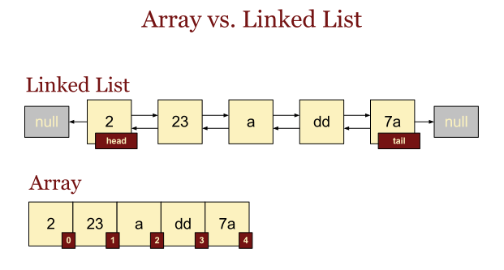
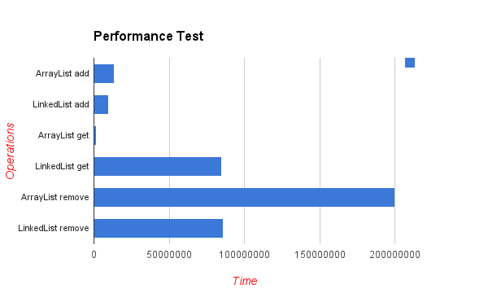

# 배열과 리스트
> - 배열과 리스트는 프로그래밍에서 자주 사용되는 자료 구조로, 여러 개의 데이터를 저장할 수 있다.
> - 둘 다 `선형 자료 구조`이다.
> - 하지만, 이 두 자료 구조는 사용 방법과 특성이 다르다.

## 배열
> - 동일한 자료형의 원소들을 `연속적인` 메모리 공간에 저장하는 자료 구조
>   - `Cache Hit Rate`가 높다.
> - 배열의 `크기는 고정`되어 있으며, 선언 시에 크기를 지정해야 한다.
> - ```java
>   int[] arr = new int[5];

### Cache Hit Rate
> - CPU가 참조하고자 하는 메모리가 캐시에 존재하고 있는 경우
> - 비율이 높을수록 좋은 성능
> - 참조 지역성 원리
>   - 동일한 값 또는 해당 값에 관계된 스토리지 위치가 자주 액세스되는 특성, `지역성의 원리`라고도 부른다.
>   - 공간 지역성 : 참조된 주소와 인접한 주소의 내용이 다시 참조되는 특성
>   - 시간 지역성 : 최근에 참조된 주소는 빠른 시간 내에 다시 참조되는 특성
>   - 순차 지역성 : 데이터가 순차적으로 액세스되는 특성, 공간 지역성에 편입되어서 설명되기도 한다.
>   - 배열은 메모리 상 연속적으로 데이터가 저장되어 있기 때문에,
>   - 공간 지역성이 좋아 높은 Cache Hit Rate를 보인다.

## 리스트
> - 원소들을 `연결`하여 저장하는 자료 구조이다.
> - 메모리 상에 `비연속적`으로 저장된다.
> - 원소의 개수가 `가변적`이다.
> - ```java
>   List<Integer> list = new ArrayList<>();


> Array(List)는 index가 있고, LinkedList는 각 원소마다 앞,뒤 원소의 위치값을 가지고 있다.


## LinkedList vs ArrayList
> - LinkedList와 ArrayList는 List 인터페이스를 구현한 클래스이다.

### ArrayList
> - 기본적으로 배열을 사용한다.
> - 크기를 지정하지 않고 동적으로 값을 삽입하고 삭제할 수 있다.
> - 조회
>   - 각 데이터의 `index`를 가지고 있고 무작위 접근이 가능하기 때문에, 해당 index의 데이터를 한 번에 가져올 수 있다.
>   - `O(1)`의 시간 복잡도를 가진다.
> - 삽입/삭제
>   - 삽입과 삭제시 ArrayList는 그만큼 위치를 맞춰주어야 한다.
>   - 중간에 삭제하면 뒤에 있는 데이터들을 앞으로 당겨야 하고, 중간에 삽입하면 뒤에 있는 데이터들을 뒤로 밀어야 한다.
>   - 삽입과 삭제가 많다면 ArrayList는 비효율적이다.
>   - `O(n)`의 시간 복잡도를 가진다.

### LinkedList
> - 내부적으로 양방향의 연결리스트로 구성되어 있어 참조하려는 원소에 따라 `정방향/역방향`으로 순회 가능
>   - 배열의 단점을 보완하기 위해 LinkedList가 고안된 것
> - 조회
>   - 순차적 접근이기 때문에 검색의 속도가 느리다
> - 삽입/삭제
>   - 가리키고 있는 주소값만 변경해주면 되기 때문에 ArrayList에 비해 상당히 효율적


> - 조회 시에는 `ArrayList`가 우위에 있지만,
> - 삽입/삭제 시에는 `LinkedList`가 뛰어난 성능을 보여준다.
> - `정적`인 데이터에 조회가 빈번하면 ArrayList
> - `동적`인 데이터라면 LinkedList

### 번외) Vector
> - ArrayList와 동일한 내부 구조를 가지고 있다.
> - Vector는 동기화된 메소드로 구성되어 있다.
>   - 멀티 스레드 환경에서 안전하게 사용할 수 있다.(Thread-Safe)

---

## 링크드 리스트를 사용해서 구현할 수 있는 다른 자료구조에 대해 설명해 주세요.
> - 배열로 구현할 수 있는 자료구조는 대부분 만들 수 있다.
>   - 대표적으로 스택이나 큐가 있다.
> - 그 외에도 해시 테이블, 이진 탐색 트리 같은 것들이 있다.