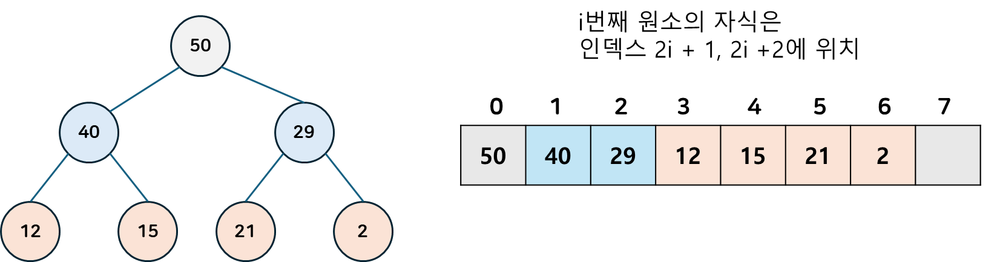

## 힙이란?
알고리즘에서 `힙`이란, 모든 노드에 대해 `힙 속성`을 만족하는 `완전 이진 트리` 자료구조입니다.  
힙 내 가장 큰 원소를 찾는데 $O(1)$의 시간이 들며, 원소의 삽입/삭제에 $O(logN)$ 의 짧은 시간이 소요된다는 특징이 있습니다. 
이러한 힙의 특성을 활용해, 가장 작은(또는 가장 큰) 요소가 항상 트리의 루트에 있는 `우선순위 큐`를 구현하는데 자주 사용됩니다.  
뿐만 아니라 힙의 가장 큰 원소를 계속해서 꺼내어 $O(nlogn)$ 만에 정렬하는 힙소트 알고리즘이나, 프림,다익스트라와 같은 최단경로 알고리즘에서도 중요하게 사용됩니다.
### 힙 속성
`힙 속성`은 힙의 종류에 따라 달라지게 되며, 해당 속성들은 `부모-자식` 관계에서만 성립하고 형제나 사촌 노드간에는 별다른 순서가 존재하지 않습니다.
#### `최대 힙(Max Heap)`
부모 노드 값이 자식 노드보다 크거나 같다 .
#### `최소 힙(Min Heap)`
부모 노드 값이 자식 노드보다 작거나 같다.
### 구현
다른 `이진 트리`들을 `배열`로 구현하는 것 처럼, `힙` 역시 배열로 구현 가능합니다.
#### 구조
 

배열을 이용해 구현하게 되면 다음과 같은 구조를 갖게 됩니다.  
배열의 첫 인덱스에 루트 노드 값이, 그 다음 2개의 원소는 루트 노드의 자식, 그 다음 4개의 원소는 루트 노드 자식의 자식, ... 과 같은 형태로 계속 진행됩니다.  
부모를 구할 땐 $(i-1)/2$  을 내림한 값이 부모 원소의 인덱스입니다.  
힙을 구현하기 위해 만들어야 하는 배열의 크기는 $2^n-1$ (n = 높이) 입니다.
#### 연산
`힙` 에서 주로 사용되는 연산은 `루트 값 구하기`, `삽입`, `삭제`, 그리고 주어진 배열을 힙의 속성을 만족하도록 정렬하는 `Heapify`가 있습니다.  
아래 예시에서는 힙이 `최대 힙`이라고 가정하고 설명하겠습니다.  
##### Heapify(index)
```java
// 최대 힙에 대해 힙 균형을 유지하는 Heapfify 연산
void Heapify(int i) 
{ 
    int l = i * 2; 
    int r = i * 2 + 1; 
    int largest = i; 
    if (l < heapSize && arr[l] > arr[i]) 
        largest = l; 
    if (r < heapSize && arr[r] > arr[largest]) 
        largest = r; 
    if (largest != i) { 
		// 자식과 부모 노드를 바꾼다.
        swap(arr[i], arr[largest]); 
		// 이후, (바꾸기 전에) 자식이 위치했던 위치에 대해 함수를 재귀적으로 호출한다.
        Heapify(largest); 
    } 
} 
```
`index`의 값과, `index`의 두 자식들의 값을 비교하여 자식의 값이 더 크다면 해당 자식과 현재 노드의 값을 바꾼 뒤, (원래 자식이 위치해있던) index로 계속해서 연산을 이어나가는 방식으로 힙의 균형을 맞춥니다.
##### 삽입(value)
```java
void insert(int x) 
{
    heapSize++; 
    int i = heapSize - 1; 
    arr[i] = x; 
	// 부모가 자식보다 높을 때 까지 반복합니다.
    while (i != 0 && arr[parent(i)] < arr[i]) { 
        swap(arr[i], arr[parent(i)]); 
        i = parent(i); 
    } 
} 
```
배열의 마지막 원소 뒤에 삽입할 값 `value` 를 넣은 뒤, 부모 원소가 현재 노드의 원소보다 높을 때까지 부모-자식을 바꾸는 연산을 지속합니다.
##### 최대 값 삭제
```java
int removeMax() 
{ 
	// 힙에 루트노드만 있다면 루트노드를 반환합니다.
    if (heapSize == 1) { 
        heapSize--; 
        return arr[0]; 
    } 

	// 최대 값(루트 노드의 값)을 저장 한 뒤
    int root = arr[0];
	// 힙의 가장 마지막 값과 바꿔주고 힙의 크기를 줄입니다.
    arr[0] = arr[heapSize - 1]; 
    heapSize--; 

	// 이후 힙의 속성을 만족시키기 위해 index 0(루트 노드) 부터 heapify 연산을 수행합니다.
    MaxHeapify(0); 
  
    return root; 
} 
```
루트 노드 값(`배열 index 0인 값`)을 추출한 뒤, 루트 값을 힙 마지막 값(`heapsize - 1에 위치한`)과 바꾸고 힙의 크기를 1 줄입니다.  
이후 `heapify()` 연산을 수행해 힙 속성을 만족하도록 정렬합니다.
## 왜 이진탐색트리와 달리 편향이 발생하지 않을까?
이진 힙은 **`완전 이진 트리`** 에 속하기 때문에, *마지막 레벨(리프 노드)을 제외한* 트리의 나머지 레벨들은 모두 **완전히 채워져** 있습니다.  
따라서 이러한 정의에 의해 편향이 발생하지 않고, 두 하위 트리의 가능한 최대 균형 차이는 `1` 입니다. (리프 레벨에서 왼쪽 하위 트리의 노드만 부분적으로 채워져 있을 경우)
## 힙 정렬의 시간복잡도?
힙 정렬은 **$O(nlogn)$ 의 시간 복잡도**를 갖습니다.  
힙 정렬은 힙의 가장 작은(또는 큰) 원소(=루트 노드에 존재하는 값)를 뽑아내고, 다시 힙을 재정렬(`heapify`)하는 작업을 힙이 빌 때 까지 반복합니다.  
힙을 재정렬 하는데 $O(logn)$의 시간 복잡도가 발생하고, 전체 원소에 대해 수행(=n번 수행)하므로 $O(nlogn)$의 시간복잡도를 갖게 됩니다.  
### 힙 정렬은 Stable한가?
`안정적인 정렬(Stabele Sorting)` 은 동일한 키(즉, 값)를 가진 레코드들의 상대적인 순서를 유지하는 정렬을 말합니다.  
즉, 동일한 키를 가진 두 레코드 X, Y가 있다고 할 때, 원본 리스트에서 X가 Y보다 먼저 나타났다면, 정렬 후에도 X가 Y보다 먼저 나온 경우 안정적인 정렬이라고 할 수 있습니다.
힙 정렬은 *Heapify 하는 과정에서 원본 리스트에서의 순서를 따지지 않기 때문*에 **Unstable하다**고 할 수 있습니다.  
다만, 추가적인 수정을 통해 Stable한 정렬로 만들 수 있습니다.

# 참고 문서
- [Introduction to Heap - Data Structure and Algorithm Tutorials - GeeksforGeeks](https://www.geeksforgeeks.org/introduction-to-heap-data-structure-and-algorithm-tutorials/)
- [CS 161 Lecture 4 - Heaps.pdf (stanford.edu)](https://web.stanford.edu/class/archive/cs/cs161/cs161.1168/lecture4.pdf)
- [Heap vs Binary Search Tree | Baeldung on Computer Science](https://www.baeldung.com/cs/heap-vs-binary-search-tree) 
- [Heap Sort in Java | Baeldung](https://www.baeldung.com/java-heap-sort)
- [Stable and Unstable Sorting Algorithms - GeeksforGeeks](https://www.geeksforgeeks.org/stable-and-unstable-sorting-algorithms/)
- [Why Isn’t Heapsort Stable? | Baeldung on Computer Science](https://www.baeldung.com/cs/why-isnt-heapsort-stable)
- [자료구조 개념 이해하기 ‘힙과 힙 정렬 알고리즘’ | 요즘IT (wishket.com)](https://yozm.wishket.com/magazine/detail/2312/)
