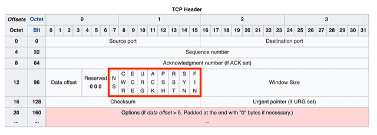

# 3-Way Handshake

### ACK, SYN 같은 정보는 어떻게 전달하는 것 일까요?

| 필드  | 의미                                                                                                                                                                                                                                                             |
| :---: | :--------------------------------------------------------------------------------------------------------------------------------------------------------------------------------------------------------------------------------------------------------------- |
| `URG` | Urgent Pointer(긴급 포인터) 필드에 값이 채워져있음을 알리는 플래그. 이 포인터가 가리키는 긴급한 데이터는 높게 처리되어 먼저 처리된다. 요즘에는 많이 사용되지 않는다.                                                                                             |
| `ACK` | Acknowledgment(승인 번호) 필드에 값이 채워져있음을 알리는 플래그. 이 플래그가 0이라면 승인 번호 필드 자체가 무시된다.                                                                                                                                            |
| `PSH` | Push 플래그. 수신 측에게 이 데이터를 최대한 빠르게 응용프로그램에게 전달해달라는 플래그이다. 이 플래그가 0이라면 수신 측은 자신의 버퍼가 다 채워질 때까지 기다린다. 즉, 이 플래그가 1이라면 이 세그먼트 이후에 더 이상 연결된 세그먼트가 없음을 의미하기도 한다. |
| `RST` | Reset 플래그. 이미 연결이 확립되어 ESTABLISHED 상태인 상대방에게 연결을 강제로 리셋해달라는 요청의 의미이다.                                                                                                                                                     |
| `SYN` | Synchronize 플래그. 상대방과 연결을 생성할 때, 시퀀스 번호의 동기화를 맞추기 위한 세그먼트임을 의미한다.                                                                                                                                                         |
| `FIN` | Finish 플래그. 상대방과 연결을 종료하고 싶다는 요청인 세그먼트임을 의미한다.                                                                                                                                                                                     |

---

### 2-Way Handshaking 를 하지않는 이유에 대해 설명해 주세요.

 

패킷의 순서를 모르기 떄문에 생기는 문제

한쪽만 연결되어있는 문제

---

### 두 호스트가 동시에 연결을 시도하면, 연결이 가능한가요? 가능하다면 어떻게 통신 연결을 수행하나요?

---

### SYN Flooding 에 대해 설명해 주세요.

> 서버의 ACK에 응답하지않고 SYN 요청을 마구잡이로 하여 TCP Connection을 무수히 많이 만들어 서버의 리소스를 과도하게 소모시켜 정상적으로 Connection을 열 수 없게 하는 공격 방법이다

---

### 위 질문과 모순될 수 있지만, 3-Way Handshake의 속도 문제 때문에 이동 수를 줄이는 0-RTT 기법을 많이 적용하고 있습니다. 어떤 방식으로 가능한 걸까요?
