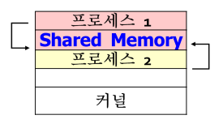
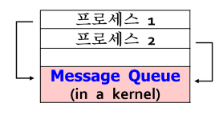
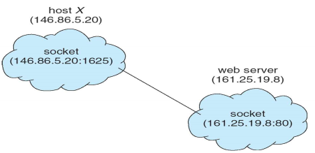
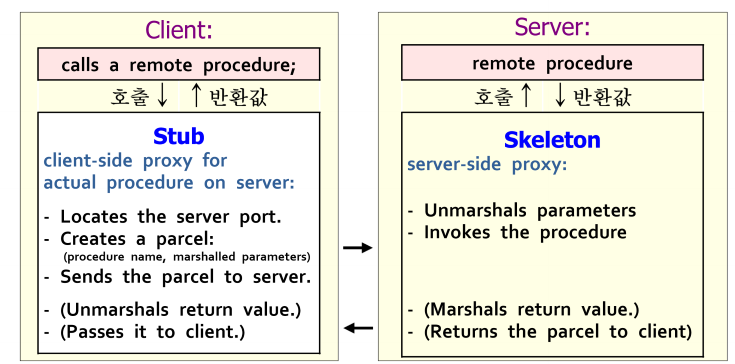
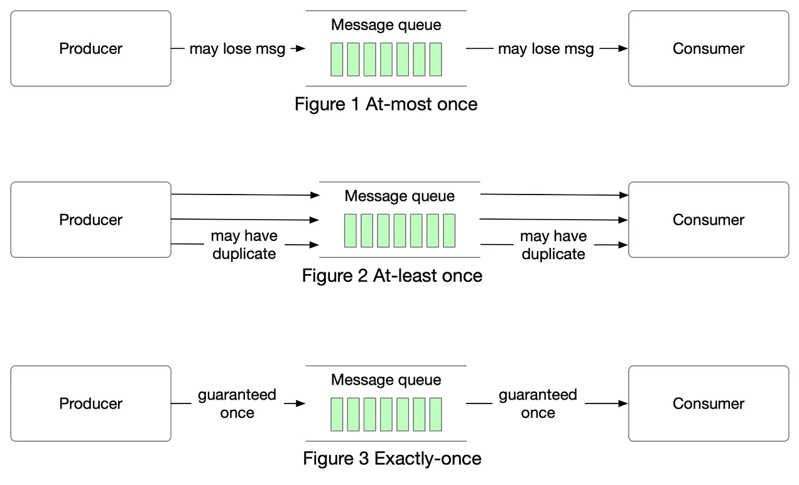

## IPC가 무엇이고, 어떤 종류가 있는지 설명해 주세요.
`프로세스 간 통신(IPC, Inter-Process Communication)`이란, OS상에서 프로세스간에 정보 공유, 모듈화 등을 이유로 데이터와 정보를 공유하는 행위 또는 방법을 의미합니다.  
기본적으로 프로세스들은 서로 독립적이기 때문에 영향을 주지도, 받지도 않습니다. 하지만 정보 공유, 성능 제고, 모듈화 등의 이유로 프로세스간 협력이 필요한 경우, 그들간의 정보 공유를 위한 IPC 메커니즘이 필요하게 됩니다.  
`IPC`는 `공유 메모리 모델`, `메시지 전송 모델` 두 가지의 **근본적인 모델**과, **Client-Server 시스템**에서 주로 사용되는 `socket`, `RPC(Remote Procedure Call)`, `pipe` 등의 모델이 있습니다.  
### `공유 메모리 모델(Shared Memory Model)`

`공유 메모리 모델(Shared Memory Model)`이란, 한 프로세스의 주소공간에 `shared memory`를 설정하고 다른 프로세스가 해당 공간을 함께 사용하는 방식을 말합니다.  
`공유 메모리 모델`은 하기한 순서대로 진행되며, 한 번 공유 메모리 구역을 설정하고 나면 그 후 통신은 커널이 관여하지 않는다는 특징이 있습니다. (메모리 설정시에는 커널 관여)  
1. 한 프로세스가 자신의 주소공간에 Shared Memory 설정(시스템 호출)
2. 다른 프로세스는 공유메모리를 자신의 주소공간에 attach(시스템 호출)
3. 이후 해당 공간을 읽고 씀
### `메시지 전송 모델(Message Passing Model)`

`메시지 전송 모델(Message Passing Model)`이란, 커널 내부의 `메시지 큐`를 활용해 프로세스간 통신을 수행하는 방식을 말합니다.  
고정길이 또는 가변길이 메시지를 송/수신자 간에 주고받는 방식으로, 프로세스간 메모리 공유 없이 동작하므로 **`분산 환경`에 적합**합니다.  
#### 통신 방법에 따른 명명 방식
`메시지 전송 모델`의 경우, 메시지를 주고 받을떄 송신자-수신자를 명시하느냐에 따라 `직접 통신`또는 `간접 통신`으로 나뉘게 됩니다.  
##### 직접 통신
`직접 통신` 방식이란, `send(수신자, msg)`와 `receive(송신자, &msg)`와 같이 송-수신자를 명시하는 `일대일 통신` 방식을 말합니다. 이때 통신을 원하는 프로세스 간에는 자동적으로 전용 link가 생성되고, 이를 통해 통신이 이뤄지게 됩니다.  
추가로 직접 통신 방식 중 `receive`시 송신자 이름을 기입해야 하는 경우를 `대칭 네이밍(Symmetric Naming)`, 송신자 이름 없이 `recieve(&msg)`와 같은 형태로 메시지를 수신하는 경우를 `비대칭 네이밍(Asymmetric Naming)`이라고 합니다.  
##### 간접 통신
`간접 통신` 방식이란, 직접 송-수신자가 통신하지 않고 `mailbox` 또는 `port`를 공유하는 `다대다 통신 방식`을 말합니다. 즉, `send(메일박스, msg)`와 `recieve(메일박스, &msg)`를 통해 데이터를 송-수신합니다.  
다만 `다대다 방식`이기 때문에, 둘 이상의 프로세스가 동시에 `recieve`를 요청할 수 있기 떄문에 어떤 수신자가 이를 수신할 지 선택해야 하는데, 이때 사용되는 방법들은 다음과 같습니다.  
- 연관된 최대 두 프로세스간의 링크를 허용한다.
- 한 순간에 오직 한 프로세스만 `receive()` 작업을 실행할 수 있도록 허용한다.
- 시스템이 메시지를 수신할 프로세스를 임의로 선택하도록 합니다. 즉, 둘 이상의 프로세스 중 하나가 메시지를 수신하게 됩니다.  
	- 또한, 시스템은 수신자 선택을 위한 알고리즘(ex. 프로세스가 교대로 메시지를 수신하는 라운드-로빈 방식)을 정의할 수 있습니다.  

추가로, `메일박스`는 프로세스 또는 OS에 의해 소유될 수 있습니다.  
만약 프로세스가 소유하는 경우, 자동적으로 메일박스를 소유한 프로세스가 `수신자`, 해당 메일박스에 메시지를 보내는 프로세스들이 송신자가 되며, 메일박스를 소유한 프로세스가 종료될 경우 메일박스 역시 함께 사라지게 됩니다.  
반면에 OS가 메일박스를 소유하는 경우, 이는 어떤 프로세스와도 연결되어 있지 않으며 독립적입니다. 이 경우 OS는 프로세스에게 `새 메일박스를 만들고`, `메일박스를 통해 메시지를 송-수신하고`, `메일박스를 삭제`할 수 있는 메커니즘을 제공해야 합니다.  
#### 동기화
프로세스 간 통신에서 `send`, `receive` 호출의 경우, 여러 설계에 따라 메시지가 동기/비동기적으로 송-수신될 수 있습니다.  
송-수신 방법은 각각 다른 방식으로 조합할 수도 있으며, **송-수신 모두 `동기식`** 일 경우, 송-수신 프로세스간에 **`랑데뷰(Rendezvous)`** 가 발생할 수 있습니다. 다만, **`동기식` 송신**과 **수신**을 사용하므로써 `생산자-소비자 문제`를 약화시킬 수 있습니다.  
- **`랑데뷰(Rendezvous)`** : 특정 소스코드(`랑데뷰 포인트`)에 도달한 경우, 다른 모든 프로세스들이 도착할 때 까지 해당 지점에서 중지해 있어야 하고, 모든 프로세스들이 도달하면 진행을 이어가는 동기화 방법을 의미합니다. [`배리어(Barrier)`](https://en.wikipedia.org/wiki/Barrier_(computer_science)) 라고도 불립니다.  
##### 송신
- 동기적: 송신 프로세스는 메시지가 `수신자` 또는 `메일박스`에 **도착할 때 까지 block** 됩니다.
- 비동기적: 송신 프로세스는 메시지를 보낸 뒤 기존의 작업을 계속 진행합니다.
##### 수신
- 동기적: 수신 프로세스는 메시지가 **가용할 때 까지 block** 됩니다.
- 비동기적: 수신 프로세스는 `유효한 메시지` 또는 `null` 값을 회수합니다.
#### 버퍼링
`버퍼링(Buffering)`이란, 직접/간접 통신에서 프로세스간 통신에서 교환된 메시지가 저장되는 임시 큐를 말합니다. 기본적으로, 이러한 큐를 구현하는 방식은 3가지가 있습니다.  
- `Zero Capacity`: `큐의 길이`가 `0`, 즉 어떠한 메시지도 대기하고 있을 수 없으며 송신 프로세스는 **`수신자가 메시지를 수신할 때 까지 block`** 됩니다. 
- `Bounded Capacity`: `큐의 길이`는 `유한(n)`해 최대 n개의 메시지가 큐에 상주할 수 있습니다. 
	- 새 메시지가 전송될 때 큐가 꽉 차있지 않다면 메시지는 큐에 배치되고, 송신 프로세스는 기다리지 않고 작업을 이어나갈 수 있습니다.
	- 만약 큐가 꽉 차있다면, 송신 프로세스는 **`큐에 공간이 생길때 까지 block`** 됩니다.
- `Unbounded Capacity`: `큐의 길이`는 `무한`하며, 따라서 몇 개의 메시지든 대기할 수 있습니다. 또한, 송신 프로세스는 **`절대 block되지 않습니다`**.
### `소켓(Socket)`
  

`소켓(Socket)`은 통신 종단점을 의미합니다.  
네트워크 상에서 통신하는 한 쌍의 프로세스는 각 프로세스마다 하나씩 한 쌍의 `소켓`을 사용해 통신 링크를 형성합니다. 이때 소켓은 `포트 번호`와 `연결된 IP 주소`로 **식별**됩니다.  
`포트`는 특정 프로세스 또는 네트워크 서비스 타입을 식별하는 **논리적 장치**로, 특정 서비스별로 잘 알려진 포트들이 사용됩니다.  
- 예시로, `telnet`은 23번 포트, `FTP`는 21번 포트, `http`는 80번 포트를 사용합니다.

서버는 특정 포트를 listen하며 클라이언트의 요청이 들어오기를 기다립니다. 요청이 수신된 경우, 서버는 클라이언트 소켓과의 연결을 수락하여 연결을 완료합니다.  
소켓 통신은 C, C++, 특히 Java와 같이 네트워크 관련 라이브러리가 많은 언어에서 구현 가능합니다.  
`Java`에서는 3가지 타입의 `socket 구현체`를 제공하는데, TCP 소켓 통신에 사용되는 `Socket` 클래스, UDP 소켓 통신에 사용되는 `DatagramSocket`, 여러 명의 수신자와 통신할 수 있는 `MulticastSocket`으로 나눠집니다.  
소켓 통신은 흔하고 효율적이긴 하지만, 통신하는 스레드간에 구조화 되지 않은 바이트 스트림만 교환할 수 있기 때문에, 로우-레벨 형태의 분산 프로세스 통신 방법으로 여겨집니다. 따라서, 데이터를 구조화 하는것은 온전히 클라이언트 또는 서버 애플리케이션의 몫입니다.  
### `원격 프로시저 호출(RPC, Remote Procedure Call)`
`원격 프로시저 호출`, 줄여서 `RPC`는 **네트워크로 연결된 시스템 상**의 프로세스 간에 `추상 프로시저`를 호출해 통신하는 방식을 말합니다. 별도의 시스템에 존재하는 프로세스와 통신해야 하기 때문에, `메시지 기반 통신 방식`을 사용합니다.  
RPC 통신상에서 교환되는 메시지는 구조화되어 있으며, 각 메세지들은 원격 시스템의 포트를 listen하고 있는 RPC 데몬에게 전달됩니다. 이때 각각의 메시지는 `실행할 함수의 식별자`, `함수에 전달할 파라미터`를 포함합니다.  
#### 구조

`RPC` 통신은 클라이언트단의 프록시인 `Stub`와 서버 단의 프록시인 `Skeleton`이 통신하는 형태로 이뤄지게 됩니다.
#### 진행 순서
1. 클라이언트가 원격 프로시저를 호출한다. `RPC 시스템`은 적절한 스터브를 호출해, 원격 프로시저에 제공된 매개변수들을 전달한다.  
	- 일반적으로 각각의 원격 프로시저 별로 별개의 스터브가 존재한다.  
2. 스터브는 서버의 포트를 위치시키고(locate), 매개변수들을 `마셜`해 `네트워크를 통해 전송할 수 있는 형태`로 **패키징**한다.
	- `마셜(마셜링)`: 모으다, 결집시키다라는 뜻을 가지는 단어로, Java에서는 주로 객체를 바이트 스트림나 파일로 변환하는 것을 의미한다. 반대로 바이트 스트림을 객체로 복원하는 `언마셜링` 이라는 개념도 존재한다.
3. 스터브는 `메시지 전송(Message Passing)`을 통해 서버에 메시지를 전송한다.
4. `스켈레톤(서버측의 스터브)`이 이를 수신하고, 매개변수들을 `언마셜`한 뒤, 서버의 프로시저를 호출한다.
5. (필요한 경우) 프로시저 결과 값을 `마셜`한 뒤, 클라이언트에게 전송한다.
6. (필요한 경우) 스터브는 수신한 값을 `언마셜`한 뒤, 클라이언트에게 전달한다.
#### 문제점
##### 클라이언트 - 서버 간 데이터 표현의 차이
시스템 별로 값을 저장할 때 어떤 바이트를 우선하느냐 등의 차이가 존재할 수 있어 아키텍처 별로 데이터를 다른 형태로 저장할 수 있습니다.  
이러한 문제를 해결하고자 RPC 시스템들은 데이터의 기계-독립적인 표현을 정의해 사용합니다.  
이러한 표현을 `외부 데이터 표현(XDR, External Data Representation)`이라고 하며, 클라이언트와 서버는 기계-의존적인 표현들을 XDR로 변환하는 `마셜링/언마셜링` 과정을 거칩니다.  
##### 호출의 의미론(Sementic of call)
로컬 프로시저 호출, 즉 시스템 내부에서의 프로시저 호출은 극단적인 상황에서만 발생하는 반면 RPC의 경우 일반적인 네트워크 에러로 인해 프로시처 호출이 실패하거나 중복되어 두 번 이상 실행될 수 있습니다.  
이를 해결하기 위해서는 OS가 메시지가 정확히 한 번 동작하도록 보장해야 하는데, 이러한 구현은 난이도가 높습니다.  
따라서 RPC에는 오류 조건 처리를 위해  `최대 한 번(at-most once)`, `최소 한 번(at-least once)`, `정확히 한 번(exactly once)` 세 가지의 시멘틱이 사용됩니다.

> 이미지 출처: [At most once, at least once, exactly once - by Alex Xu (bytebytego.com)](https://blog.bytebytego.com/p/at-most-once-at-least-once-exactly)

`최대 한 번(at-most once)`의 경우, 메시지가 한 번만 전달되는 방식으로, 메시지가 손실될 수 있지만 재전송되진 않습니다.  
이는 각 메시지에 타임스탬프를 붙여 구현할 수 있습니다. 서버는 히스토리를 두고, 이미 히스토리에 존재하는 타임스탬프를 갖는 메시지를 수신할 경우 이를 무시하도록 합니다. 이러한 방식으로 클라이언트는 한 번 이상 메시지를 전송할 수 있고 한 번만 실행됨을 보장받을 수 있습니다.  
`최소 한 번(at-least once)`의 경우, 메시지가 두 번 이상 전달될 수 있는 방식으로, 메시지가 손실되어서는 안됩니다.  
`정확히 한 번(exactly once)`의 경우, 가장 구현하기 힘든 방식으로 메시지가 한 번만, 그것도 손실 없이 전달되어야 하는 방식입니다.  
이를 달성하기 위해서는 서버가 요청을 수신할 수 없는 위험을 제거해야 합니다. 따라서 클라이언트에게 RPC 호출이 수신되었고 실행되었음을 알려줄 수 있어야 합니다. 이는 ACK 메시지를 통해 실현될 수 있으며 클라이언트는 RPC 호출에 대한 ACK를 수신할 때 까지 주기적으로 RPC 호출을 재전송해야 합니다.  
### 파이프(Pipe)
`파이프(Pipe)`란 한 프로세스가 다른 프로세스로 데이터를 전달하는 통신 기법을 말합니다.  
설계에 따라 다양한 형태로 구현할 수 있는데, 고려할 점은 다음과 같습니다.  
- 통신 방식
	- `단방향(unidirectional)`: `생산자-소비자` 형태로 통신하며, 생산자는 pipe의 `write-end에서 쓰기`만, 소비자는 pipe의 `read-end에서 읽기`만 가능합니다.
	- `양방향(bidirectional)`: 서로 송-수신이 가능하며, `반이중(half duplex)` 형태의 경우 동시 송-수신이 불가능, 즉 데이터가 한쪽 방향으로만 이동하며 `전이중(full duplex)` 형태의 경우 동시 송-수신이 가능합니다.
- 프로세스 관계
	- 부모-자식 간 통신
	- 임의의 프로세스 간 통신
- 네트워크
	- 로컬에 존재하는 프로세스 간 통신
	- 원격 통신 가능

또한, 파이프는 `Ordinary Pipe`와 `Named Pipe` 두 종류로 나뉩니다.
#### `일반 파이프(Ordinary Pipe)`
오직 단방향이며, 부모-자식간의 통신만 가능한 파이프를 말합니다.  
부모가 생성하고 자식이 상속하는 형태로 연결되며, 파일처럼 취급(Unix의 경우 file read/write 시스템호출을 사용해 통신)합니다.  
#### `명명된 파이프(Named Pipe)`
양방향 통신이 가능하며, 임의의 프로세스들 간 통신을 지원하는 파이프를 말합니다.  
시스템이 가동되는 동안 지속될 수 있으며, 일반 파이프와 마찬가지로 파일처럼 취급됩니다.  
운영체제 종류(Unix 또는 Windows)에 따라 동작 방식이 다릅니다.  
##### Unix의 경우
Byte 단위로 데이터를 전송하며, `반이중 통신` 형태로만 통신할 수 있고, 로컬 내 프로세스 간에서의 통신만 가능합니다.
##### Windws의 경우
Byte 및 메시지 단위로 데이터를 전송하며, `전이중 통신` 형태로 통신할 수 있으며, 원격 간 통신도 가능합니다.
## Shared Memory가 무엇이며, 사용할 때 유의해야 할 점에 대해 설명해 주세요.
### 유의점
Shared Memory 모델을 사용할 때, 다음과 같은 점을 유의해야 합니다.
#### 동시성 문제
언제든 공유 메모리를 수정할 수 있기 때문에 `레이스 컨디션`이나 `불일치`가 발생할 수 있습니다.  
따라서 이를 보완할 수 있는 뮤텍스, 세마포어와 같은 **동기화 메커니즘**을 활용해야 합니다.  
#### 이식성 문제
하드웨어, 운영체제에 따라 호환되지 않을 수 있어 이식성과 확장성이 떨어집니다.
## 메시지 큐는 단방향이라고 할 수 있나요?
`메시지 큐`는 **단방향이라 할 수 없습니다**.
단방향이라는 의미는 데이터의 흐름이 한 방향으로 고정되어, 한 번에 한 방향으로만 데이터를 전송할 수 있고 전송 방향을 바꾸려면 특정 작업이 수반되는 것을 말합니다.  
메세지 큐의 경우 송신자-수신자 역할이 고정되어 있지 않고, `send` 또는 `recieve` 작업을 통해 메시지를 주고 받는게 가능하므로 단방향이라 볼 수 없습니다.  

# 참조
- Operating System Concepts - 9th Edition
- 전공과목(운영체제) 강의 자료
- [Message Passing (lmu.edu)](https://cs.lmu.edu/~ray/notes/messagepassing/)
- [2021-OS_06-IPC.pdf (korea.ac.kr)](https://os.korea.ac.kr/wp-content/uploads/2021/04/2021-OS_06-IPC.pdf)
- [At most once, at least once, exactly once - by Alex Xu (bytebytego.com)](https://blog.bytebytego.com/p/at-most-once-at-least-once-exactly)
