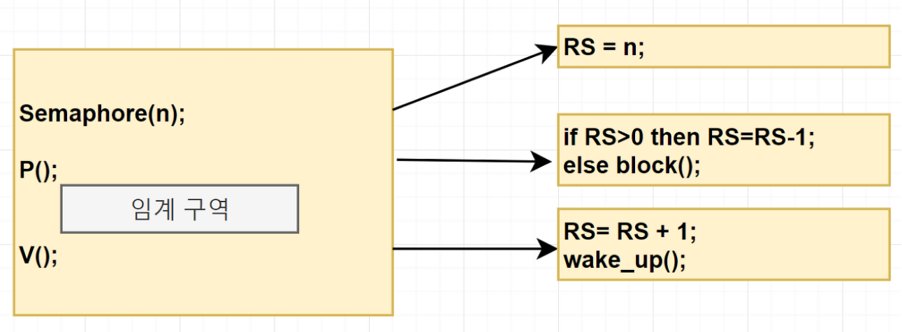
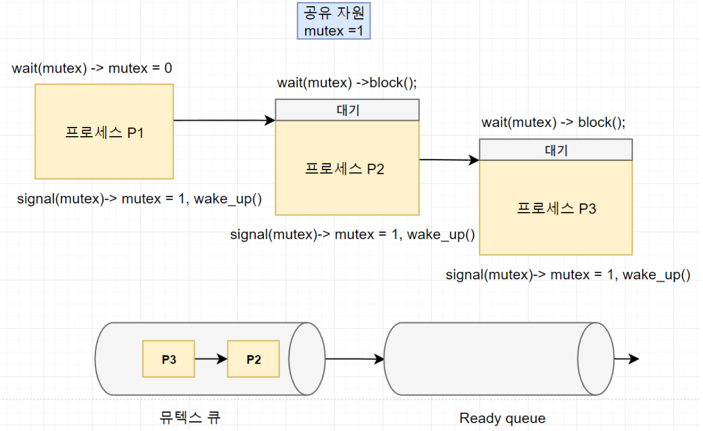
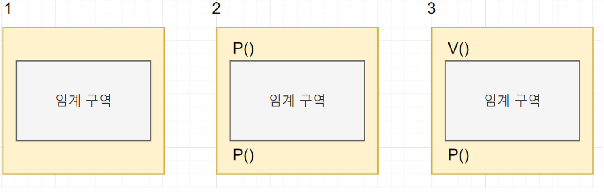
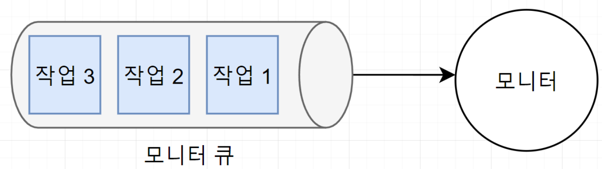

# Thread Safe
> - 멀티 스레드 환경에서 `여러 스레드가 동시에` 하나의 자원에 접근할 때, `데이터의 일관성`을 유지하기 위한 방법

---
## Thread Safe를 보장하기 위해 어떤 방법을 사용할 수 있나요?
- Mutual Exclusion (상호 배제)
- Atomic Operation (원자 연산)
- Thread-Local Storage (쓰레드 지역 저장소)
- Re-Entrancy(재진입성)

### Mutual Exclusion (상호 배제)
> - 공유 자원에 하나의 Thread만 접근할 수 있도록 세마포어/뮤텍스로 `락`을 통제하는 방법
>   - 뮤텍스
>     - 공유 자원 접근을 한 시점에 단 하나의 쓰레드만 하도록 허용
>     - `Lock`과 `Unlock`으로 구성
>     - `Lock`을 획득한 스레드만 `Unlock`을 할 수 있다.
>   - 세마포어
>     - 제한된 수의 쓰레드가 동시에 공유 자원에 접근할 수 있도록 허용
>     - 세마포어의 값은 동시에 자원에 접근할 수 있는 쓰레드의 최대 개수
> - 일반적으로 많이 사용

#### 세마포어
> - 동시에 공유자원에 접근할 수 있는 쓰레드 수를 제한
> - 내부적으로 정수 카운터를 가지고 있으며, 이 카운터를 통해 동시에 접근할 수 있는 쓰레드 최대 수를 제한
> - critical section에 진입하기 전에 세마포어를 획득하고, critical section을 빠져나올 때 세마포어를 해제
> - Binary Semaphore
>   - 뮤텍스와 유사하게 작동
>   - 0 또는 1의 값을 가지며, 0일 때는 Lock, 1일 때는 Unlock
> - Counting Semaphore
>   - 동시 접근 가능 쓰레드 수 제한
>   - 카운터는 세마포어가 초기화될 때 설정
>   - 쓰레드가 자원을 사용할 때마다 감소하고, 자원을 해제할 때마다 증가
> - 
> - Semaphore(n) : n개의 자원을 가진 세마포어
>   - RS를 n으로 초기화
>   - Semaphore(1) : Binary Semaphore
> - P() : 세마포어를 획득하는 연산
>   - 잠금을 수행하는 코드로 0보다 크면(사용 가능한 자원이 있다면) 1만큼 감소시키고 임계구역 진입
>   - 0이면 대기
> - V() : 세마포어를 해제하는 연산
>   - 잠금 해제와 동기화를 같이 수행
>   - RS를 1 증가 시키고 세마포어에서 기다리는 프로세스에 임계구역에 진입해도 좋다는 wake_up 신호를 보냄
> - 하지만, 세마포어의 P(), V() 코드가 실행되는 도중에 context switching이 발생하면 mutual exclution과 bounded waiting 조건을 보장하지 못한다.
>   - P(), V()의 코드는 분리 실행되지 않고 완전히 실행되어야 한다.
>     - atomicity가 보장되어야 한다.

#### 뮤텍스
> - 
> - wait(mutex), signal(mutex)로 구성
> - wait(mutex) : 임계구역 진입 전에 호출
>   - wait을 하면 공유자원 mutex를 감소시키고, signal하면 mutex를 증가시키고 block 상태에 있는 프로세스를 뮤텍스 큐에서 깨워 ready queue로 보낸다.
> - 뮤텍스와 세마포어 모두 3가지 임계구역 조건인 mutual exclusion, bounded waiting, progress를 지키며, busy waiting을 하지 않은 효율적인 알고리즘

#### 모니터
> - 세마포어의 가장 큰 문제는 잘못된 사용으로 인해 임계구역이 보호받지 못하는 것
> - 
> - 구성을 잘못한 경우
> - 공유자원을 사용할 때 모든 프로세스가 세마포어 알고리즘을 따른다면 굳이 wait나 signal할 필요가 없다.
>   - 모니터
> - 공유 자원을 내부적으로 숨기고 공유 자원에 접근하기 위해 인터페이스만 제공함으로써 자원을 보호하고 프로세스 간에 동기화를 시킨다.
> - 
> - synchronized


### Atomic Operation (원자 연산)
> - 공유 자원에 접근할 때는 Atomic Operation을 이용하거나 원자적으로 정의된 접근 방법을 사용함으로써 상호 배제 구현 가능
> - 분할할 수 없는 연산 다른 쓰레드에 의해 중단되거나 간섭받지 않은 연산
>   - 하드웨어에서 지원되는 경우가 많음
> - Atomic
>   - 공유 자원 변경에 필요한 연산을 원자적으로 분리한 뒤에 실제로 데이터의 변경이 이루어지는 시점에 Lock을 걸고, 데이터를 변경하는 시간동안 다른 쓰레드의 접근이 불가능하도록 하는 방법
>   - java.util.concurrent.atomic 패키지

### Thread-Local Storage (쓰레드 지역 저장소)
> - 공유 자원의 사용을 최대한 줄이고 각각의 쓰레드에서만 접근 가능한 저장소들을 사용함으로써 동시 접근을 막는 방법
> - 일반적으로 공유 상태를 피할 수 없을 때 사용하는 방식
>   - 전역 변수 사용을 자제하자

### Re-Entrancy(재진입성)
> - 쓰레드 호출과 상관없이 프로그램에 문제가 없도록 작성하는 방법
> - 어떤 함수가 한 쓰레드에 호출되어 실행 중이라면 다른 쓰레드가 그 함수를 호출하더라도 결과가 각각에게 올바르게 주어져야 한다.
> - 쓰레드끼리 독립적으로 동작할 수 있도록 코드를 작성하는 방법

## Java에 Thread-Safe하게 설계하기
- java.util.concurrent 패키지 하위 클래스를 사용한다.
  - Lock 인터페이스, ConcurrentHashMap 등
- 인스턴스 변수를 두지 않는다.
- Singleton 패턴을 사용한다.
- synchronized 블럭에서 연산을 수행한다.

### 일반적으로 구현되는 Singleton은 Thread-Safe하지 않다.
> - 싱글톤 패턴
>   - 어플리케이션이 시작되고 하나의 클래스 인스턴스를 보장해서 전역적인 접근점을 제공하는 패턴
>   - 장점
>     - 전역 변수를 사용하지 않고, 메모리를 절약할 수 있다.
>     - 유일하게 존재하는 인스턴스로의 접근으로 통제가 가능하며, 데이터 공유가 쉬워진다.
>   - 단점
>     - 싱글톤 인스턴스가 너무 많은 일을 하거나 너무 많은 데이터를 가질 경우 결합도가 높아진다.
>     - 멀티쓰레드 환경에서 동기화 처리를 하지 않으면 여러 개가 생성될 수 있다.
```java
public class SharedStateSingleton {
    private static SharedStateSingleton instance = new SharedStateSingleton();
    private int sharedCounter = 0;

    private SharedStateSingleton() {
    }

    public static SharedStateSingleton getInstance() {
        if (instance == null) {
            instance = new SingletonExample();
        }
        return instance;
    }

    public void incrementCounter() {
        sharedCounter++;
    }

    public int getCounter() {
        return sharedCounter;
    }
}
```

### 멀티쓰레드 환경에서 안전한 싱글톤 인스턴스 만들기
> - lazy initialization(synchronized)
>   - 인스턴스가 필요할 때 생성하는 방법
> ```java
> public static synchronized MultithreadedSingleton getInstance() {
>   if (instance == null) {
>       instance = new MultithreadedSingleton();
>   }
>   return instance;
> }
> ```
> synchronized는 성능에 부담을 준다. 각 쓰레드가 getInstance()를 호출할 때마다 동기화를 해야해서 필요 이상의 성능 저하

> - Double-Checked Locking
> ```java
> public class DclSingleton {
>   private static volatile DclSingleton instance;
>   public static DclSingleton getInstance() {
>       if( instance == null ) {                    // --- 1
>           synchronized (DclSingleton.class) {
>               if (instance == null) {             // --- 2
>                   instance = new DclSingleton();
>               }
>           }
>       }
>       return instance;
>   }
> }
> ```
> 필드를 volatile 키워드를 이용해서 캐시 불일치 이슈를 방지할 수 있다.
> 아까보단 낫지만 완벽하진 않다

> - Holder에 의한 초기화
> - 클래스 안에 클래스(Holder)를 두어 JVM Class Loader 매커니즘을 이용한 방법
> - 개발자가 직접 동기화 문제를 해결하기 보다는 JVM의 원자적인 특성을 이용해서 초기화의 책임을 JVM으로 이동
> ```java
> public class Something {
>     private Something() {}
> 
>     public static Something getInstance() {
>         return LazyHolder.INSTANCE;
>     }
>  
>     private static class LazyHolder {
>         public static final Something INSTANCE = new Something();
>     }
> }
> ```
> - Class Loader의 초기화 시점
>   - 외부 클래스 로드되고 초기화될 때, 내부 정적 클래스는 초기화되지 않는다.
>   - getInstance()메서드가 호출될 때까지 로드되거나 초기화되지 않는다.
>   - 또한, 내부 클래스는 외부 클래스가 로드되고 초기화될 때 자동으로 로드되거나 초기화되지 않는다.

## Race Condition이 무엇인가요?
> - 두 개 이상의 쓰레드나 프로세스가 공통 자원을 병행적으로 읽거나 쓰는 동작을 할 때, 공용 데이터에 대한 접근이 어떤 순서에 따라 이루어졌는지에 따라 그 실행 결과가 같지 않고 달라지는 상황
> - Race Condition을 발생시킬 수 있는 코드 블록을 임계 구역이라고 한다.