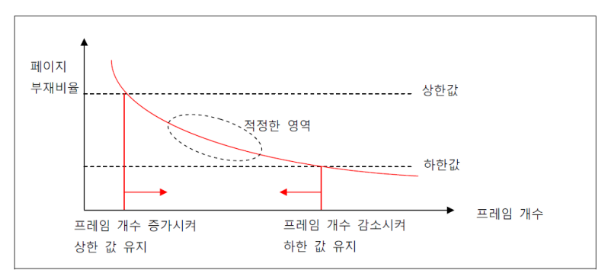

# Thrashing

### Thrashing

> 사용 하는 프로세스가 많아질 때 CPU 이용율이 증가하다 한계점에서 떨어지게 되는데 CPU 이용율이 떨어지게 되는데 문제점으로 `Thrashing`이 있다

> `Thrashing`은 `Page Fault`(페이지 부재율)이 증가하면서 CPU 이용율이 급겨하게 떨어지는 현상이다

> 프로세스를 처리하는 시간보다 메모리에 적재되지 못한 페이지로 인해 페이지 교체에 드는 시간이 증가하게 되어 CPU 이용율이 떨어진다

---

### Page Fault

> 프로세스의 모든 페이지를 물리 메모리에 로드 하지 않는데 이때 프로그램의 Page가 물리 메모리에 올라가있지 않는 것을 `Page Fault`라고 한다

---

### Thrashing 발생 시, 어떻게 완화할 수 있을까요?

#### Working Set

> 프로세스는 일정 시간 동안 특정 주소를 집중적으로 참조하는 경향이 있다 
> 이러한 집중 참조 페이지들을 동시에 메모리에 올려야 하는 페이지들의 집합이다

> 과거를 통해 추정하여 과거 델타 시간(Window)동안 참조된 페이지들을 메로리에 유지를 한다

#### Page Fault Frequency

> Page Fault Rate가 일정 수준 이상으로 발생하면 메모리를 더 할당하고 일정 이하가되면 메모리를 회수한다

