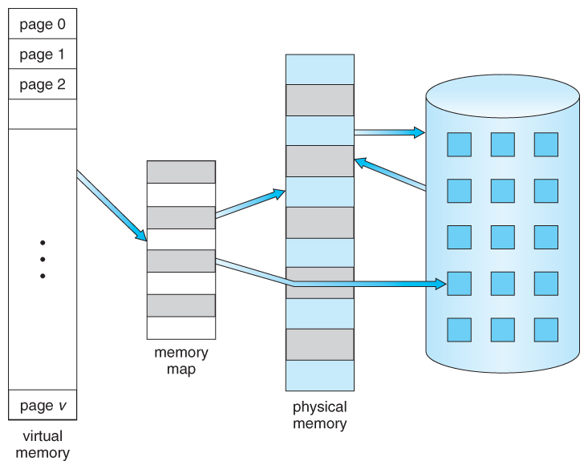
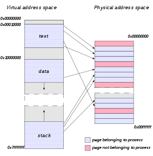
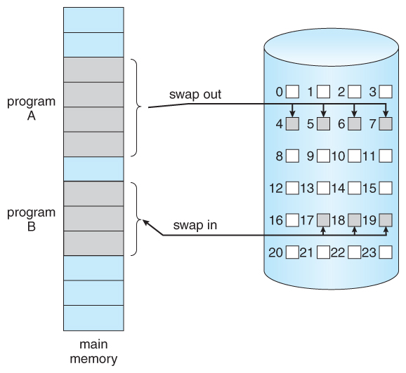
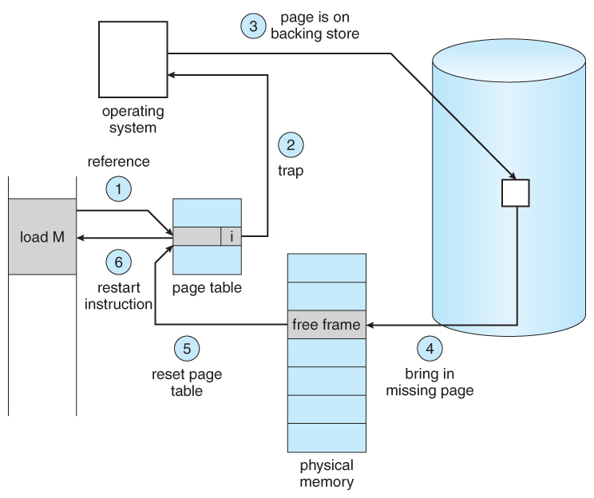
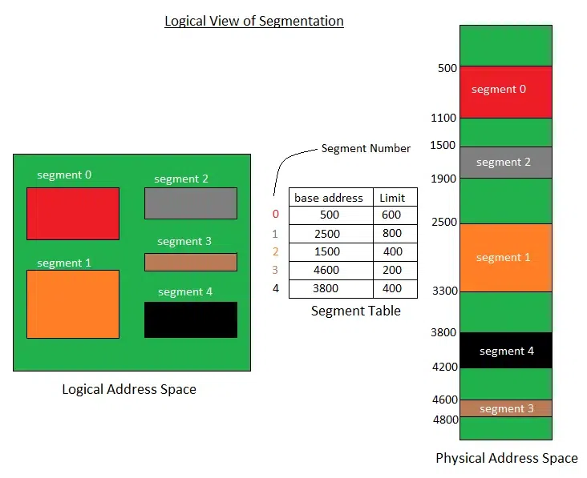

## 가상 메모리란 무엇인가요?

`가상 메모리`는 보조 기억장치를 마치 주 기억장치의 일부처럼 주소를 지정하고, 사용할 수 있는 스토리지 할당 방식을 의미합니다. 따라서 각 프로그램에 실제 메모리 주소가 아닌, 가상의 메모리 주소를 할당합니다.  
이를 통해 물리적 메모리 공간 보다 더 큰 프로그램을 실행할 수 있게 됩니다.  
가상 주소 공간은 `메모리 관리 장치(MMU)`에 의해 물리 주소로 변환되어, 개발자들이 주 기억장치 상의 프로세스나 데이터가 어떻게 배치되어있는지 신경쓰지 않아도 됩니다.  
### 배경

과거 프로세스가 필요로 하는 양보다 많은 메모리 공간을 할당하거나, 적은 공간들만 존재해 할당하지 못하는 `메모리 단편화(Memory Fragmentation)` 문제가 발생하게 되었습니다. 이를 해결하고자 물리적 공간을 고정된 크기의 `페이지`들로 분할하고, 논리적 공간 역시 동일한 크기의 `페이지`들로 분할해, 연속적이지 않은 물리 메모리 공간을 가상 공간에서는 연속적인 것처럼 활용할 수 있게 되었습니다.  
하지만 모든 주 기억장치 공간을 활용해도, 그보다 프로세스 크기가 크다면 해당 프로세스를 물리 공간에 적재할 수 없어 실행할 수 없었습니다. 이를 보완하고자 보조기억장치를 활용해, 가상 주소 공간을 실제 주 기억장치 공간보다 확장해 더 많은 메모리를 참조할 수 있게 했습니다.  

## 가상 메모리가 가능한 이유가 무엇일까요?
실제로는 프로세스의 모든 페이지가 메모리 상에 존재하지 않아도 되기 때문인데, 상세한 이유는 다음과 같습니다.  
### 웬만한 경우 프로세스의 모든 페이지가 필요하진 않음
드물게 발생하는 에러에 대한 오류 처리 코드, 실제 사용되는 것 보다 더 큰 크기로 선언한 배열, 드물게 사용되는 기능의 코드 와 같이 메모리를 과대사용하거나 거의 쓰이지 않는 기능들이 프로세스 내에 존재하는 경우가 대부분입니다.  
따라서 해당 코드들은 보조기억장치에 저장해두다가, 필요할때만 불러와 사용해도 프로세스 동작에 크게 문제가 발생하지 않습니다.  
이러한 방식의 동작을 위해, 가상 메모리는 `요구 페이징(Demand Paging)` 이라는 기법이 사용됩니다.  
#### `요구 페이징(Demand Paging)`

`요구 페이징`이란, 프로세스가 교체(swap) 될 때, 일반적으로 프로세스 전체 공간을 메모리에 적재하고 비우는 것과 달리, 필요로 할때만 교체되는 방식을 말합니다.  
즉, 프로세스가 교체될 때, 프로세스에서 필요할 것으로 예상되는 페이지만 메모리에 로드하는 방식입니다.  
메모리에 로드되지 않은 페이지는 page table entry에 포함된  `valid bit`라는 비트를 활용해 표시합니다. 만약 메모리에 로드 되었다면 `1`, 그렇지 않다면 `0`으로 표시합니다.  
이러한 `요구 페이징`을 수행하는 프로그램을 `lazy swapper` 또는 `pager`라고 부릅니다.  
##### 장점
- 필요한 페이지만 swap하기 때문에 I/O 시간이 줄고 swap하는데 드는 시간이 감소합니다.
- 필요한 메모리만 로드하므로 적은 메모리 공간을 사용해 메모리를 절약합니다.
- 메모리 공간을 절약하므로 더 많은 프로세스를 위한 공간이 생깁니다.

## Page Fault가 발생했을 때, 어떻게 처리하는지 설명해 주세요.  
`Page fault`란, 프로세스에서 메모리에 로드되지 않은 페이지(즉, `valid bit`가 `0`인)를 참조하려 할 때 `MMU`에서 발생시키는 예외입니다.  
`Page fault`가 발생했을 때, 다음과 같은 단계를 거쳐 예외를 처리합니다.  

1. 요청된 메모리 주소가 유효한 요청인지 확인합니다.
2. 만약 해당 참조가 유효하지 않은 경우, 프로세스가 종료됩니다. 그렇지 않다면 디스크로 부터 페이지를 불러와야 합니다.
3. `빈 프레임(free frame)`을 `빈 프레임 목록(free-frame list)`에서 찾습니다.
4. 디스크에서 필요한 페이지를 찾기 위한 디스크 작업을 예약합니다. 따라서 I/O 대기동안 해당 프로세스는 block되고, CPU는 다른 프로세스를 처리합니다.
5. I/O 작업이 완료되면, 프로세스의 페이지 테이블이 새 프레임 번호로 갱신되고, 유효하지 않은 비트는 유효한 페이지 참조임을 나타내도록 변경됩니다.
6. `page fault`를 일으킨 명령어를 처음부터 다시 실행합니다.
위 과정에서, `빈 프레임(free frame)`이 없을 경우, 메모리에서 사용 중이 아닌 page frame(`victim frame`)을 선택해 swap out 하고, 새 page를 swap in 하는 `페이지 교체(Page Replacement)` 과정을 거치게 됩니다.  

## 페이지 크기에 대한 Trade-Off를 설명해 주세요.
최적의 페이지 크기를 선택하기 위해, 다음과 같은 사항을 고려할 수 있습니다.

| 페이지 크기 큼                                                                             | 고려 사항      | 페이지 크기 작음                                                                          |
| ------------------------------------------------------------------------------------ | ---------- | ---------------------------------------------------------------------------------- |
| **더 적은 페이지**를 사용해 페이지 테이블이 더 적은 메모리 공간을 차지합니다.                                 | 페이지 테이블 크기 | **더 많은 페이지**를 사용해 페이지 테이블이 더 많은 메모리 공간을 차지합니다.                               |
| 같은 크기의 TLB 캐시가 더 많은 양의 메모리를 추적해 `TLB Miss`를 방지할 수 있습니다.                        | `TLB`      | 같은 크기의 TLB 캐시가  더 적은 양의 메모리를 추적해 `TLB Miss` 발생 빈도가 높아집니다.                    |
| 프로세스의 마지막 페이지에서 낭비되는 메모리 양이 더 많아집니다.                                           | 내부 파편화     | 페이지 크기가 작을 수록 실제 할당에 필요한 메모리와  가깝게 일치하므로 낭비되는 메모리 공간이 더 적습니다.          |
| 큰 페이지에서는 디스크로부터 큰 규모의 순차 전송이 발생하므로 디스크 헤드 이동 시간이 더 적게들어 더 적은 시간이 소요됩니다.  | 디스크 접근     | 작은 페이지에서는 디스크로부터 작은 규모의 전송이 여러번 발생하므로 디스크 헤드 이동이 빈번하게 발생해 더 많은 시간이 소요됩니다. |

- `TLB(Translation Lookaside Buffer)` : 매 번 페이지 테이블을 읽어 가상 주소 - 실제 주소를 매핑하는 대신, 가상 주소- 실제 주소로 변환한 내용을 캐싱하여 사용하는 캐시의 일종입니다. 만약 TLB 에서 찾을 수 없는 경우(`TLB Miss`) 페이지 테이블을 읽어야 합니다.

## 페이지 크기가 커지면, 페이지 폴트가 더 많이 발생한다고 할 수 있나요?
페이지 크기가 커지면, 더 많은 `Page Fault`가 발생하게 됩니다.  
페이지 크기가 커지면, 프레임 크기도 함께 커지고 따라서 더 적은 수의 프레임을 사용하게 됩니다.  
`Page Fault` 를 줄이기 위해서는, 앞으로 자주 사용 될 페이지를 메모리 상에 적재해두어야 하고 필요하다면 메모리에 적재된 기존 page를 디스크의 page와 교체하는 `페이지 교체(Page Replacement)`를 수행하게 됩니다.  
만약, 프레임 수가 적으면 이러한 `페이지 교체` 과정에서 선택의 자유도가 낮아져 `Page fault` 발생 횟수가 증가하는 경향을 보입니다.  

## 세그멘테이션 방식을 사용하고 있다면, 가상 메모리를 사용할 수 없을까요?
세그멘테이션 방식 역시 `요구 페이징` 기법과 유사한 형태로 가상 메모리를 사용할 수 있습니다.  
`세그멘테이션`이란, 프로세스를 가변 크기를 갖는 `세그먼트`로 나누는 방식입니다.
가변 크기이므로 내부 단편화가 발생하지 않고, 한 프로세스가 다른 프로세스의 세그먼트에 접근/수정할 수 없도록 제한하는 세그먼트 간 보안 수준을 제공합니다.  
하지만 외부 단편화는 여전히 발생 가능하며, 세그먼트 테이블과 주 기억장치에 대한 두 개의 메모리 엑세스가 존재해 명령문에 접근하기 위한 접근 시간이 증가합니다.

`세그먼테이션` 방식은 `요구 페이징`과 유사하게, 각 세그먼트 별로 주 기억장치 상에 위치하는지 여부를 나타내는 플래그를 기록하고 만약 주 기억장치에 없는 세그먼트에 접근하는 경우 `Segmentation fault`를 발생시키고 이를 디스크로부터 불러옵니다.

# 참고 문서
- [Memory segmentation - Wikipedia](https://en.wikipedia.org/wiki/Memory_segmentation)
- [Page replacement algorithm - Wikipedia](https://en.wikipedia.org/wiki/Page_replacement_algorithm)
- [Page fault - Wikipedia](https://en.wikipedia.org/wiki/Page_fault)
- [Virtual memory - Wikipedia](https://en.wikipedia.org/wiki/Virtual_memory)
- [Virtual address space - Wikipedia](https://en.wikipedia.org/wiki/Virtual_address_space)
- [Operating Systems: Virtual Memory (uic.edu)](https://www.cs.uic.edu/~jbell/CourseNotes/OperatingSystems/9_VirtualMemory.html)
- [Virtual Memory in Operating System - GeeksforGeeks](https://www.geeksforgeeks.org/virtual-memory-in-operating-system/)
- [Page (computer memory) - Wikipedia](https://en.wikipedia.org/wiki/Page_(computer_memory))
- [8장. 가상 메모리.pptx (yonsei.ac.kr)](http://csys.yonsei.ac.kr/lect/os/o8-19.pdf)