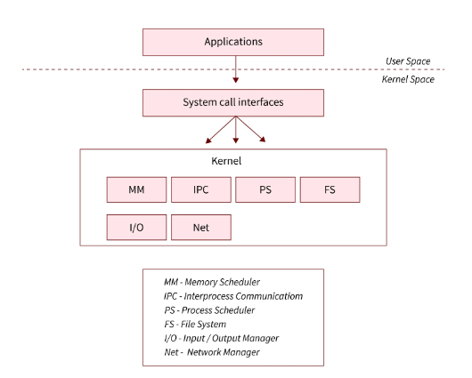
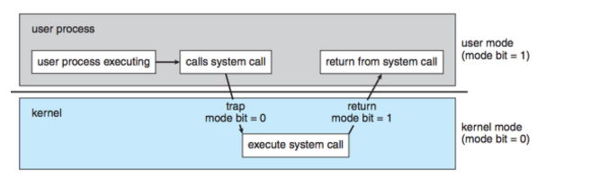

# System Call

### System Call이란?

> `OS`에서 `kernel`이 제공하는 서비스에 응용프로그램의 요청에 따라 접근하기 위한 `interface`이다.

1. `Applications`이 `Softeware interupt`명령을 사용하여 `OS`에 `System Call` 호출
2. `user mode`에서 `kernel mode`로 전환
3. `System call` 번호를 `System call` table에서 확인을 하여 서비스 처리를 위한 함수 포인터를 찾음
4. 필요한 인자를 `kernel`에 전달 후 처리
5. 처리된 결과를 `user mode`의 프로그렘에 전달

---

### System Call의 유형

1. Process Control / 프로세스 제어

> - create process / 생성
> - terminate process /삭제
> - load, execute / 적재, 실행
> - get/set process attributes / 프로세스 속성 획득,설정
> - wait for time, wait event, signal event / 시간 대기, 사건 대기, 사건 알림
> - allocate and free memory / 메모리 할당 해제

2. File Manipulation /파일 조작

> - create file, delete file / 파일 생성 삭제
> - open, close, read, write, reposition / 열기, 닫기, 읽기, 쓰기, 위치 변경
> - get/set file attributes / 파일 속성 획득, 설정

3. Device Manipulation / 장치 관리

> - request device, release device / 장치 요청, 장치 해제
> - read, write, reposition / 읽기, 쓰기, 위치 변경
> - get/set device attributes / 장치 속성 획득, 쓰기
> - logically attach or detach devices / 논리적 부착, 장치 분리

4. Information Maintenace / 정보 유지

> - get/set total system information / 시스템 정보 획득, 쓰기(날짜, 컴퓨터 이름 등)
> - get/set process, file, or device metadata / 프로세스, 파일, 장치 속성의 획득, 쓰기

5. Communication / 통신

> - create, delete communication connection / 통신 연결 생성, 삭제
> - send, receive messages / 메세지 보내기, 받기
> - transfer status information / 상태 정보 전달
> - attach or detach remote devices / 원격 장비 부착,분리

6. Protection / 보호

> - get/set file permissions / 파일 권한 획득, 설정

---

### Dual mode operation

user과 OS는 시스템 자원을 공유한다, 따라서 user에 제한을 두지 않으면 중요 자원을 망가뜨릴 위험이 생긴다. 이에 접글을 제한하는
보호장치로 `Dual Mode Operation`을 사용한다. 모드는 mode bit 으로 구분된다

장점

user와 kernel를 분리함으로써 안정성, 보안성, 유연성, 효율성, 호환성, 신뢰성을 얻을 수 있다.

https://www.geeksforgeeks.org/dual-mode-operations-os/
