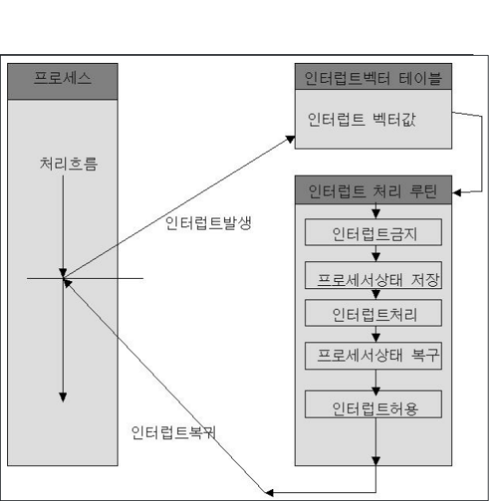

# Interrupt

### 인터럽트는 어떻게 처리하나요?

interrupt 발생시

1. 현재 수행중인 기계어 코드를 멈춤
2. high/low interrupt mask bit를 보고 마스크가 되어있을 시 무시
3. interrupt vector를 읽고 ISR 주소값을 획득
4. ISR(interrupt service routine)로 건너뜀, 이때 PC 값은 자동으로 저장
5. 현재 진행중인 프로그램 레지스터 저장
6. ISR 내부 코드 실행
7. 저장된 레지스터 복원
8. ISR의 끝의 IRET 명령어로 가로막기를 해제 후 저장된 PC값을 불러와 이전 실행위치에서 다시 실행된다

interrupt vector : interrupt를 처리할 수 있는 ISR의 주소를 가지고 있는 공간

ISR에 진입시 interrupt mask bit을 자동으로 설정함

---

### polling

> 하드웨어 장치의 상태를 수시로 체크하여 명령을 받을 수 있는지 확인하는 방법
> CPU가 주기적으로 servicing이 필요한지 길다리고 체크해야하기 때문에 CPU 사이클을 낭비한다

### HW / SW Interrupt

#### Hardware interrupt(external interrupt)

- 주변기기나 하드웨어에서 발생한 이벤트에 의해 발생하는 interrupt

  > External interrupt
  >
  > 1.  전원이상
  > 2.  I/O interrupt
  > 3.  timmer interrupt

  > Internal interrupt
  >
  > 1.  program check interrupt
  >       &emsp; - Division by zero
  >       &emsp; - Overflow, Underflow
  >       &emsp; - 부당한 기억장소 참조

#### Software interrupt(internal interrupt)

- OS에서 제공하는 서비스를 어플리케이션에서 호출할 떄 발생
  > 1. SVC(SuperVisor Call)
  >     &emsp; - System call

### 동시에 두 개 이상의 인터럽트가 발생하면, 어떻게 처리해야 하나요?

우선순위에 따라 처리가능

1. 전원이상/power fail
2. 기계 착오/Machine Check
3. 외부 신호/External
4. 입출력/I/O
5. 명령어 문제
6. 프로그램 검사/Program Check
7. SVC(SuperVisor Call)

내부 interrpt > 외부 interrupt > Software interrupt

Daisy Chain

> - 인터럽트가 발생하는 모든 장치를 하나의 직렬 회선으로 연결
> - 우선순위가 높은 장치를 상위에 두고 우선순위 차례대로 배치

Parallel 우선순위 부여 방식

> - 인터럽트가 발생하는 모든 장치를 하나의 직렬 회선으로 연결한다.
> - 각 장치별 우선순위를 판별하기 위한 Mask register에 bit를 설정한다. 
> - Mask register상 우선순위가 높은 서비스 루틴 수행중 우선순위가 낮은 bit들을 비활성화 시킬 수 있다. 
> - 반대로 우선순위가 높은 인터럽트는 낮은 인터럽트 수행 중에도 우선 처리된다.

https://justzino.tistory.com/4
http://www.jidum.com/jidums/view.do?jidumId=445

https://www.devx.com/terms/internal-interrupt/
https://www.devx.com/terms/external-interrupt/
