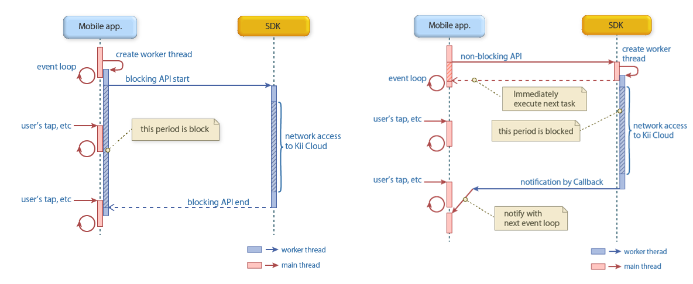
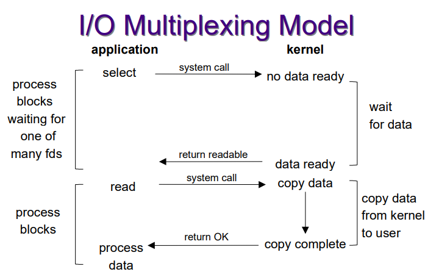
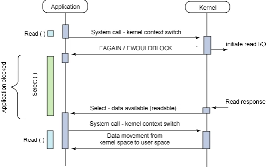
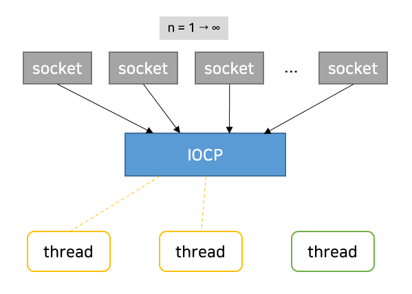
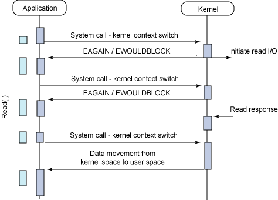

## 동기와 비동기, 블로킹과 논블로킹의 차이에 대해 설명해 주세요.
- 두 가지 모두 "연관 되어있는 프로세스/함수간의 작업 순서"에 대해 설명하는 유사한 개념으로 볼 수 있음.
	- 하지만 어떠한 것을 중점으로 두는 개념인가는 다름.
		- `동기 - 비동기`
			- **`작업 순서`**, **`호출 시점`** 에 중점
				- `A 함수`가 `B 함수`를 호출하고, 그 `결과를 기다린 뒤` 이를 `활용`해 다음 로직을 수행하는 함수라면, `동기적`
		- `블로킹 - 논블로킹`
			- **`실행 제어권`** 에 중점
				- `A 함수`가 `B 함수`를 호출하고, 제어권을 넘겨준다면 `블로킹` 
### 동기 - 비동기

> 출처: Operating System Concepts, 9th Edition
#### 동기
- 앞의 작업이 완료되어야 이후의 작업이 시작되는 순차적인 처리방식
	- 즉, `작업의 순서`가 `보장`됨
#### 비동기
- 앞의 작업이 완료되길 기다리지 않고 다음 작업을 실행할 수 있는 방식
	- 즉, `작업의 순서`가 `보장되지 않으며`, `병렬`로 작업이 실행 가능함
		- 이는 각 작업이 `독립적`이거나, 작업 별 `지연시간이 긴 경우` 효율적
- 프로세스 실행 뿐만 아니라, `I/O 작업` 역시 `비동기적`으로 처리 가능
	- 주로 미리 애플리케이션의 `일부 주소 공간에 변수를 설정`하거나, *애플리케이션 제어 흐름 외부에서 동작*하는 `신호(signal)`, `콜백의 트리거` 등을 통해 미래에 I/O 작업이 완료되면 애플리케이션 값을 전달
	- 즉, 결과 값을 기다리지 않고 일단 바로 반환함
### 블로킹 - 논블로킹 (I/O 작업을 예시로)

> 출처: [Blocking vs. Non-Blocking API (kii.com)](https://docs.kii.com/en/guides/cloudsdk/android/guidelines/api/)

#### 블로킹
- 파일 읽기, 네트워크 요청 등의 `I/O 작업`을 수행하는 경우, *해당 작업이 `완료될 때까지`* 프로그램 `실행 멈춤`
	- 블로킹 I/O 작업이 호출되면 `작업(프로세스)`는 `실행 대기열(run queue)`에서 `대기 대기열(wait queue)`로 이동하며, `I/O 작업`이 완료되면 `작업`은 다시 `실행 대기열`로 이동함.
		- 이때 실행이 재개되면서 `I/O 작업`으로 부터 `반환된 값`을 받음.
	- 즉, `프로그램 실행 제어`를 `I/O 작업`에게 넘긴다고 볼 수 있음
- 대부분의 `애플리케이션 인터페이스`에서는 `블로킹 시스템 콜` 사용
	- `블로킹` 방식이 `논블로킹` 방식보다 코드 이해가 쉽기 때문
#### 논블로킹
- `I/O 작업`을 수행하는 동안에도 프로그램 실행 `멈춤 없이` 계속 프로그램 작업 수행
	- 주로 `이벤트 기반`이거나, `콜백 함수`를 사용하는 비동기 방식에서 사용됨.
	- 이외에도 `키보드-마우스 입력`을 받아 데이터 처리 및 표시하는 `UI`, `디스크 파일 읽어서` 디스플레이에 출력하는 `비디오 프로그램` 등이 대표적인 `논블로킹 I/O` 예시
## 그렇다면, 동기이면서 논블로킹이고, 비동기이면서 블로킹인 경우는 의미가 있다고 할 수 있나요?
두 경우 모두 결과적으로 동기적으로 동작하는, 각각의 특성을 살리지 못하는 방식이라고 볼 수 있음
### 동기 - 논블로킹
- `논블로킹` 방식이므로 `I/O 작업`을 수행하는 도중에도 원래 작업(프로세스)을 계속 실행할 수 있음
	- `실행 제어권`을 넘기지 않기 때문
- 하지만 `동기` 방식이므로 `I/O 작업` 결과가 반환될 때 까지 다음 작업을 수행할 수 없음
	- 계속 `Polling(프로세스가 실행 가능한 상태를 유지하며 이벤트를 기다리는 것)`하며 결과 값을 기다림
- 결과가 반환될 때까지, 결과가 필요한 이후 작업들을 수행하지 못하므로 `사실상 블로킹` 형태로 동작
  - 다만, 결과가 필요하지 않은 작업들을 수행할 수 있는 경우 유의미
### 비동기 - 블로킹
- `비동기` 방식이므로 현재 프로세스가 끝나지 않았어도 다른 작업을 수행할 수 있음
- 하지만 `블로킹` 방식이므로, `I/O 작업`을 수행하는 경 현재 프로세스의 실행 제어권을 `I/O 작업`에게 넘기므로 해당 작업이 끝나기를 기다려야 함
	- `I/O 작업이 잦은` 경우 `사실상 동기` 형태로 동작
## I/O 멀티플렉싱에 대해 설명해 주세요.

> 출처: [Week11-Select.pdf](https://www.cs.toronto.edu/~krueger/csc209h/f05/lectures/Week11-Select.pdf)


> 출처 : [developer.ibm.com](developer.ibm.com)

- `멀티플렉싱`
	- `통신`에서 여러 `시그널` 또는 `정보 스트림`을 하나의 복잡한 신호로 동시에 전송하는 것
- `I/O 멀티 플렉싱?`
	- `비동기 블로킹 I/O`를 부르는 또 다른 말로, `하나의 프로세스`가 `여러 파일을 관리`할 수 있도록 해주는 기법
		- 프로세스에서 파일에 접근할 때 `파일 디스크립터(File Descripter, FD)`라는 추상적인 값을 사용
			- 이 `파일`이라는 것엔 클라이언트와의 연결에 사용되는 `소켓` 같은 것도 포함됨
				- `소켓` 역시 `IP/Port를 가진 파일`이기 때문
			- 이러한 점에서 `다중 클라이언트 연결`을 지원하기 위한 `대안적인 접근 방식`이라고도 불림
	- FD를 어떻게 감시하는지, 어떤 상태로 대기하느냐에 따라 `select`, `poll`, `epoll(linux)`, `kqueue(bsd)`, `iocp(windows)`와 같은 기법들이 존재
		- 메인 서버 루프는 `select`, `poll` 시스템 콜을 통해 `어떤 FD가 준비되었는지` 확인
			- 즉, `read` 또는 `write` 작업은 `block 없이 바로 수행` 됨
	- `동시성`을 위해 `프로세스/스레드를 사용하는 것에 비해` 다음과 같은 장/단점이 존재
		- 장점: 프로세스/스레드 보다 클라이언트 연결 당 `오버헤드(CPU, 메모리)가 적음`
		- 단점: `코드 복잡성이 증가`함
- `I/O 멀티 플렉싱`의 일반적인 흐름
	 1. `애플리케이션`에서 `read` 요청
	 2. `커널`은 `read I/O`처리를 시작함과 동시에, `애플리케이션`에게 `미완료상태`(`EAGAIN`, 리소스를 일시적으로 사용할 수 없음)임을 반환
	 3. `애플리케이션`은 데이터가 준비되었다는 알람이 올 때 까지 기다림(`select()`)
	 4. `커널`에서 결과 값이 준비되었다는 callback 신호를 보냄
	 5. `애플리케이션`은 데이터를 `커널 공간`에서 `사용자 공간(buffer)`으로 복사해옴
		 - 실제 구현에서는 `select` 호출의 유의미한 값이 나올때 까지 애플리케이션은 loop를 돌며 대기
### I/O 멀티플렉싱의 여러 구현 방식
#### select()
```c
#include <sys/select.h>

int select(int nfds, fd_set *readfds, fd_set *writefds, fd_set *exceptfds, struct timeval *timeout);
```
- 대상 `FD`를 `배열`에 집어넣고 `하나하나 순차 검색`하는 방식
	- `O(n)`의 시간복잡도를 가짐(대상 FD가 늘어날수록 오래 걸림)
- 이 `배열형태의 구조체`를 `fd_set`이라고 부르며, 각 `n번째 비트`는 `n-1 FD`에 대응됨
	- 해당 비트가 `1`이면, `대응되는 파일에 변경이 감지되었음`을 의미
	- 변경을 감지하려면, 매 번 `최대 FD 개수`만큼 loop를 돌며 비트 값 하나하나를 검사해야 함
- `고정된 단일 bit table`을 사용하므로 관리할 수 있는 최대 FD 수가 1024개로 제한됨
#### pselect()
```c
int pselect(int nfds, fd_set * readfds, fd_set * writefds, fd_set * exceptfds, const struct timespec * timeout, const sigset_t * sigmask);
```
- `select`에서 `timeout`과 `signal 처리 로직을 개선`한 함수
	- `timespec` 구조체를 사용해 나노초까지 정밀한 컨트롤 가능
	- `sigmask` 인자를 활용해 `signal에 의한 인터럽트` 발생시 block 시킬 수 있음
#### poll()
```c
#include <poll.h>
int poll(struct pollfd * fds, nfds_t nfds, int timeout);
```
 - `하나 이상의 FD`에서 이벤트 발생시, `Blocking 해제`한 뒤 `해당 FD`로 들어온 데이터에 대한 `I/O 작업`을 수행하는 방식
	 - `관리 가능 FD 수`에 제한이 있던 `select`와 달리 `무한 개의 FD`를 검사할 수 있는 함수
 - `실제 FD 개수(nfds)` 만큼만 loop를 돌아, FD 갯수가 `적은 경우` `select`대비 효율적일 수 있음
	 - 다만 `이벤트 전달`에 사용되는 `메모리가 커`(64bit, `select`는 3bit) `FD 수에 따라` 성능이 안좋아 질 수 있음
#### epoll (linux)
```c
#include <sys/epoll.h>


// create
int epoll_create(int size);
// wait
int epoll_wait(int epfd, struct epoll_event * events,
  int maxevents, int timeout);
// control
int epoll_ctl(int epfd, int op, int fd, struct epoll_event * event);
```
- `poll()`과 유사하지만, `FD의 상태`를 `커널`에서 관리해 상태가 바뀐 것을 직접 통지해 주는 방식
	- 애플리케이션에서 `루프를 돌 필요도 없고`, `변화가 감지된 FD의 목록을 반환`받으므로, `대상 파일을 추가 탐색할 필요도 없음`
- `Edge Trigger`, `Level Trigger` 두 가지 방식이 존재
	- `Level Trigger`
		- 특정 상태가 `유지되는 동안` 감지
		- `입력 buffer`에 `데이터 남아있는 동안` 계속 이벤트 등록
	- `Edge Trigger`
		- 특정 상태가 `변화하는 시점`에만 감지
		- `입력 buffer`로 데이터 `수신된 그 상황`에 한 번만 이벤트 등록
#### kqueue (bsd)
```c
#include <sys/event.h>

// event를 저장할 새 Queue 커널에 요청
int kqueue(void);

// kqueue에 특정한 이벤트를 등록하고, 보류중인 이벤트를 등록하거나 사용자한테 반환
int kevent(int kq,
  const struct kevent * changelist, int nchanges,
    struct kevent * eventlist, int nevents,
    const struct timespec * timeout);
```
- 커널에 이벤트를 저장할 `queue`를 생성하면, `I/O 이벤트`가 `queue에 쌓이고` 사용자가 직접 `polling`하는 방식
	- `select`, `poll` 처럼 발생한 `FD를 찾는 추가 작업 필요 X`
#### iocp (windows)

- 윈도우에서 지원하는 I/O 다중화 모델
	- `여러 소켓`을 하나의 `IOCP 객체`로 처리
		- 해당 객체 하위에서 동작하는 `thread 여러 개`가 `동시 대기`
		 - *커널로부터 받는 결과에 따라* `thread를 깨우거나 대기`
  - `완료 루틴(Completion Routine)`으로 I/O 작업 완료 통지를 받는 형태로 설계됨
	  - `완료 루틴`은 `콜백 함수`와 비슷한 역할로, `WSASend`/`WSARecv` 함수를 호출해 `I/O 작업이 완료된 시점`에 호출됨
## 논블로킹 I/O를 수행한다고 하면, 그 결과를 어떻게 수신할 수 있나요?


대부분의 `논블로킹 프레임워크`에서는 논블로킹 I/O의 결과를 수신하기 위해 지속적으로 `polling`하는 무한 루프, 흔히 `이벤트 루프`라고 부르는 것을 사용합니다.  
`애플리케이션`에서는 지속적으로 커널에게 `read` 요청을 보내고, 커널에서는 아직 데이터가 준비되지 않은 경우 `EAGAIN/EWOULDBLOCK` 오류 코드('리소스를 일시적으로 사용할 수 없음'을 의미)를 반환합니다.  
만약 데이터가 준비된 경우, `애플리케이션`은 커널로부터 데이터를 `사용자 공간(buffer)`으로 복사해옵니다.   
`오류 코드를 수신한 시점`에 `애플리케이션`은 `read` 요청을 *또 보낼 지* `선택`할 수 있어 `애플리케이션`은 `Block`되지 않습니다.  
이외에도 I/O 작업이 완료된 경우 수행되는 `콜백 함수를 설정`하거나, I/O 작업이 완료되었다는 `signal`이 수신되는지 감지하는 방법 등 다양한 방법이 존재합니다.
# 참고
- [Lecture 33: I/O multiplexing - David Hovemeyer](https://jhucsf.github.io/spring2023/lectures/lecture33-public.pdf)
- [[네이버클라우드 기술&경험] IO Multiplexing (IO 멀티플렉싱) 기본 개념부터 심화까지 -1부- : 네이버블로그](https://blog.naver.com/n_cloudplatform/222189669084)
- [[네이버클라우드 기술&경험] IO Multiplexing (IO 멀티플렉싱) 기본 개념부터 심화까지 -2부- : 네이버블로그](https://blog.naver.com/n_cloudplatform/222255261317)
- [How does non-blocking IO work under the hood? | by Hielke de Vries | ING Blog | Medium](https://medium.com/ing-blog/how-does-non-blocking-io-work-under-the-hood-6299d2953c74)
- [CSC 209H: Software Tools and Systems Programming - Summer 2006 - Week11-Select.pdf](https://www.cs.toronto.edu/~krueger/csc209h/f05/lectures/Week11-Select.pdf)
- [errno(3) - Linux manual page](https://man7.org/linux/man-pages/man3/errno.3.html)
- 추가로 볼만한 자료
	- [CS 519: Operating System Theory](https://www.cs.rutgers.edu/courses/416/classes/fall_2009_ganapathy/slides/io.pdf)
	- [Lecture 20: Slow System Calls and Non-Blocking I/O](https://web.stanford.edu/class/archive/cs/cs110/cs110.1202/static/lectures/20-non-blocking-io.pdf)
	- [CSE 333 Lecture 21 -- non-blocking I/O and select](https://courses.cs.washington.edu/courses/cse333/12su/lectures/lec21.pdf)