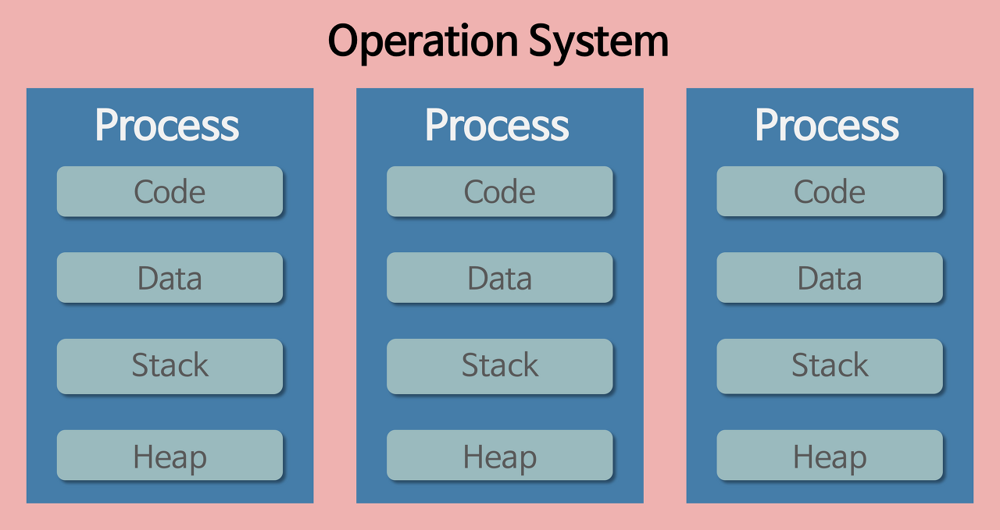
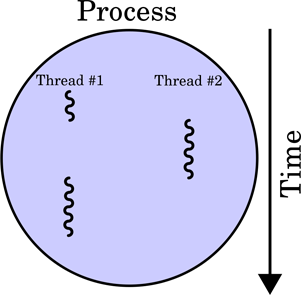
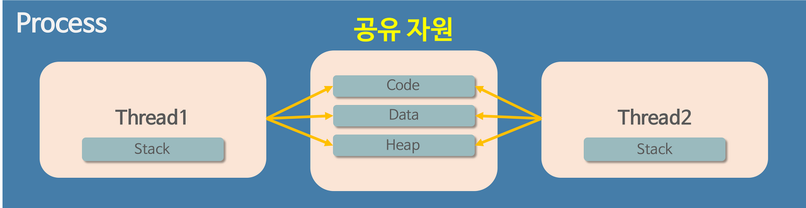
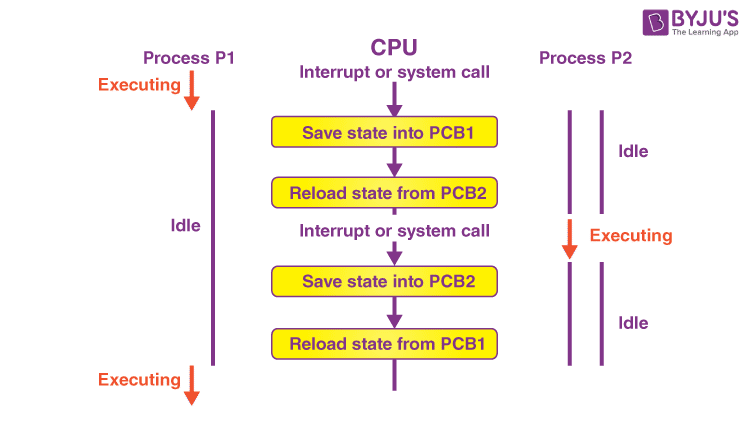
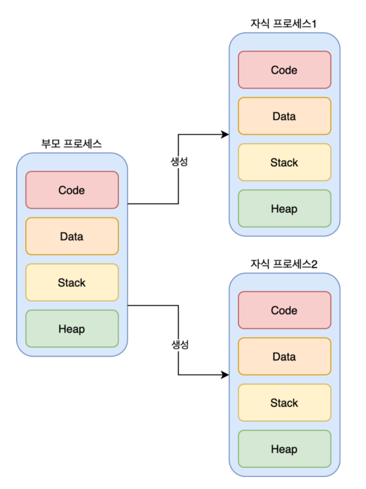
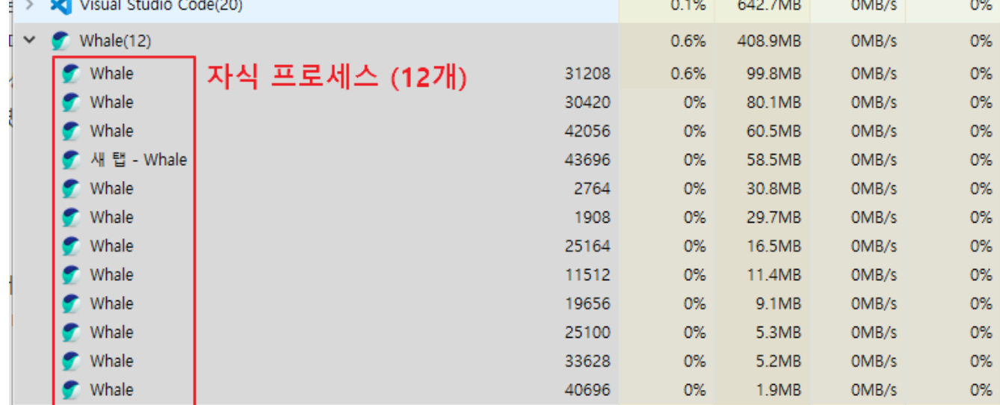
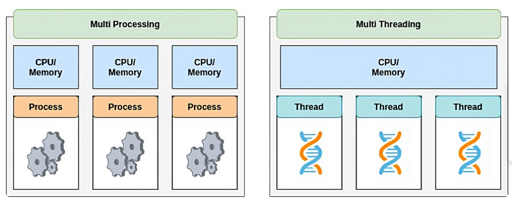
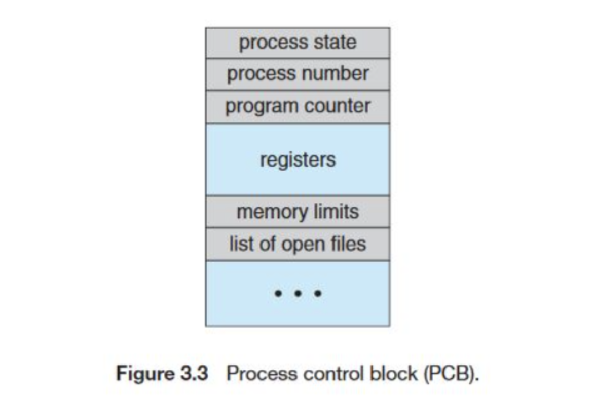
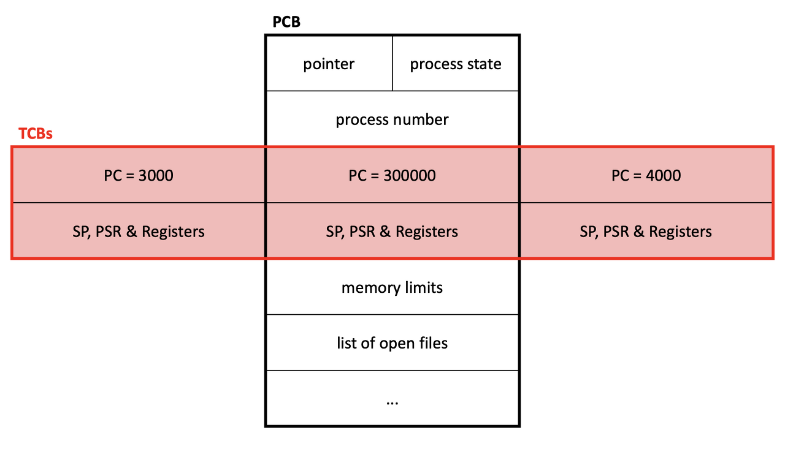

# Process and Thread

## Program
> - 파일이 저장 장치에 저장되어 있지만, 메모리에는 올라가 있지 않은 `정적`인 상태
>   - 아직 `실행되지 않은` 상태
> - 실행하는 순간, 해당 파일은 컴퓨터 메모리에 올라가게 되고 `동적`인 상태가 된다.
>   - 이 상태의 프로그램을 `프로세스`라고 한다.

## Process
> - 실행되고 있는 컴퓨터 프로그램
> - 운영체제로부터 `자원을 할당`받은 `작업`의 단위
> - 프로그램을 실행시켜 정적인 프로그램이 동적으로 변하여 프로그램이 돌아가고 있는 상태
>   - 컴퓨터에서 작업 중인 프로그램
> - 운영체제는 프로세스마다 각각 `독립된 메모리 영역`을 할당해 준다.
> - 

### code, data, stack. heap
>    1. code 영역
>    : 프로그램의 `명령어`들이 저장된 메모리 공간이다.
>        - 수정할 수 없는 `읽기 전용` 메모리 공간이다.
>    2. data 영역 : `정적` 변수, `전역` 변수 및 `정적 할당된 메모리`를 포함하는 영역이다.
>        - `읽기/쓰기`가 가능하다.
>    3. Stack 영역
>    : 각 `스레드마다 개별적`으로 할당되며, `메소드 호출`과 관련된 `지역` 변수, `매개` 변수, 메서드 호출, `리턴 값` 등을 저장한다.
>        - 메서드가 호출될 때마다 해당 메서드에 대한 스택 프레임이 생성되고, 메서드가 종료되면 해당 스택 프레임이 제거된다.
>        - 스택은 후입선출(LIFO) 구조로 동작하며, 스택 프레임은 순차적으로 쌓이고 제거된다.
>    4. Heap 영역
>    : `동적`으로 생성된 객체, 배열 등을 저장하는 곳이다.

> - 과거에는 프로그램을 실행할 때 실행 시작부터 끝까지 프로세스 하나만 사용해서 진행했었다.
> - 하지만, 시간이 지나 프로그램이 복잡해지고, 프로세스 하나로는 부족해지게 되었다.
> - 한 프로그램을 처리하기 위한 프로세스를 여러 개 만들면 되지 않을까?
>   - 운영체제는 안정성을 위해서 프로세스마다 `자신에게 할당된 메모리 내의 정보에만 접근`할 수 있도록 제약을 뒀었다.
>   - 여러 개의 프로세스가 서로 접근하면 오류가 발생했었기 때문에, `프로세스보다 더 작은 실행 단위`의 개념이 필요하게 되었다.

## Thread
> - 프로세스가 할당받은 자원을 이용하는 `실행 흐름`의 최소 단위
> - 프로세스와 다르게 `쓰레드간 메모리를 공유`하며 작동한다.
>   - Code, Data, Heap 영역은 공유하지만, Stack 영역은 독립적으로 가진다.
> - 

## Multi Process vs Multi Thread
> 컴퓨터에서 `여러 작업을 동시에` 처리하기 위한 두 가지 접근 방식

### Context Switching
> - 사실 동시가 아니고 `동시처럼 보이는 것`
> - CPU는 한번에 하나의 프로세스 or 쓰레드만 실행 가능하다.
> - 여러 프로세스(스레드)가 `돌아가면서` 작업을 처리하는 데 이 과정을 Context Switching이라고 한다.
> - 
> - 동작 중인 프로세스가 대기를 하면서 해당 `프로세스의 상태를 보관`하고,
> - 대기하고 있던 다음 순서의 프로세스가 동작하면서 이전에 보관했던 `프로세스의 상태를 복구`하는 작업
> - 다른 프로세스가 실행되면, 지금까지 실행 중이던 프로세스의 작업 내용을 `pcb`에 저장
>   - 작업 끝나고 원래 프로세스로 돌아오면 해당 프로세스 pcb에 저장되어있던 것을 가져와 이어서 실행

### Multi Process
> - 각 프로세스는 독립적인 메모리 공간을 가진다.
>   - 하나의 프로세스에 문제가 발생해도 다른 프로세스에 영향을 주지 않는다.
>   - 안정성과 보안 측면에서 장점
>   - `병렬`적으로 여러 작업을 처리하거나 독립성과 안정성을 유지하는 데 효과적이다.
>   - 동시성 문제도 발생하지 않는다.
> - 프로세스 간 통신(IPC)을 위해 별도의 메커니즘이 필요하다.
>   - 단순한 CPU 레지스터 교체뿐만 아니라, RAM과 CPU 사이의 `캐시 메모리까지 초기화`되어야 한다.
>     - 캐시 메모리에는 `프로세스 정보`가 들어간다.
>     - 프로세스가 실행되면서 데이터를 `캐시에 저장`하게 되는데,
>     - 사용한 캐시 메모리를 다른 프로세스가 `사용할 수 없게 하기` 위함
>     - 캐시 메모리를 다 비우고 새로운 프로세스 정보를 CPU 캐시에 적재해야 한다.
>   - 자원 부담이 크다.
> - 
>   - 하나의 부모 프로세스가 여러 개의 `자식 프로세스`를 만드는 방식
>     - 서로간의 Process ID(PID)를 알고 있어서 통신이 가능하다.
>     - 통신이 가능할 뿐이지, 독립적으로 실행되고 독립적인 메모리 공간을 가진다.
>     - EX) 웹 브라우저의 여러 개의 상단 탭
>     - 

### Multi Thread
> - 하나의 프로세스에 `여러 스레드`로 자원을 공유하며 작업을 나누어 수행하는 것
> - 시스템 자원소모 감소(자원의 효율성 증대)
>   - 프로세스를 `생성하여` 자원을 할당하는 시스템 콜이 줄어 효율적으로 관리할 수 있다.
> - 시스템 처리율 향상(처리비용 감소)
>   - 캐시 메모리를 `비울 필요가 없으니까` Context Switching 비용이 적다.
>   - 그냥 쓰레드 간에 공유하는 자원을 제외한 쓰레드 정보(Stack, Register)만 교체하면 된다.
> - 간단한 통신 방법
>   - 쓰레드는 스택 영역을 제외한 메모리 영역을 공유하기에 통신 비용이 적다.
> - 자원을 `공유`하기 때문에 `동기화 문제`가 발생할 수 있다. (병목현상, 데드락 등)
>   - 불필요한 부분까지 동기화하면 대기시간으로 인하 성능저하 발생
> - 하나의 쓰레드가 문제가 생기면 해당 프로세스가 영향을 받아서 `다른 쓰레드에도 영향`을 줄 수 있다.
> - 단일 프로세스라면 효과를 기대하긴 어렵다.

## PCB가 무엇인가요?
> - Process Control Block
>   - 운영체제의 커널 내에 저장
> - Context Switching에서 프로세스들이 교체되어 수행되고 나면 다시 돌아올 수 있도록 프로세스의 `상태를 저장`하고 있는 자료구조
> - 운영체제가 프로세스를 제어하기 위해 정보(CPU 레지스터 값들)를 저장해 놓는 곳
> - 프로세스의 상태 정보를 저장하는 구조체
> - 프로세스 생성 시 PCB 생성
>   - 주기억장치에 저장되다가 프로세스가 완료되면 PCB도 삭제된다.
> - 
> - 여기에 적혀있는 PID를 기반으로 통신

## 그렇다면, 스레드는 PCB를 갖고 있을까요?
> - TCB(Thread Control Block)라고 부른다.
> - PCB내에 TCB를 수용하는 것으로 커널이 쓰레드를 실행
> - 쓰레드가 하나 생성될 때마다 PCB내에 TCB가 확장
> - 

## 리눅스에서, 프로세스와 스레드는 각각 어떻게 생성될까요?
> - 프로세스는 fork() 시스템 콜을 통해 생성
>   - 호출한 프로세스(부모 프로세스)의 복사본인 자식 프로세스가 생성
>   - PID만 서로 다르게 생성
> 
> - 쓰레드는 pthread_create() 함수를 통해 생성
> - POSIX 쓰레드 라이브러리의 일부
> - 쓰레드는 프로세스 내에서 생성되기 때문에 프로세스 내의 자원을 공유
> - 최신 리눅스에서는 clone() 시스템 콜을 통해 쓰레드를 생성

## 자식 프로세스가 상태를 알리지 않고 죽거나, 부모 프로세스가 먼저 죽게 되면 어떻게 처리하나요?
### 자식 프로세스가 상태를 알리지 않고 종료
> - 좀비 프로세스
>   - 자식 프로세스가 종료되었지만, 부모 프로세스가 자식의 종료 상태를 회수하지 않은 경우
>   - 프로세스의 메타 정보는 남아있지만, 프로세스는 종료된 상태
>     - 공간을 차지하고 있음
>   - wait() || waitpid() 시스템 콜을 통해 부모 프로세스가 자식 프로세스의 종료 상태를 회수

### 부모 프로세스가 먼저 종료
> - 고아 프로세스
>   - 부모 프로세스가 종료되면, 자식 프로세스는 init 프로세스(프로세스 ID가 1인 특수 프로세스)의 자식 프로세스가 된다.
>     - 재할당이 된다
>     - init 프로세스는 모든 프로세스의 부모 프로세스이기 때문에
>     - init 프로세스는 주기적으로 wait() 호출을 통해 자식 프로세스의 종료 상태 회수

## 리눅스에서, 데몬프로세스에 대해 설명해 주세요.
> - 사용자와 직접 상호작용하지 않고 백그라운드에서 실행되는 프로세스
> - 시스템 부팅 시 자동으로 실행되어 시스템 서비스를 제공
> - 사용자가 로그아웃하거나 시스템 종료 시까지 계속 실행
> - 로그 파일 기록, 사용자 요청에 대한 응답, 특정 이벤트에 대한 대기 및 처리 작업
>   - 웹 서버, 파일 서버, 프린트 서버 데몬

## 리눅스는 프로세스가 일종의 트리를 형성하고 있습니다. 이 트리의 루트 노드에 위치하는 프로세스에 대해 설명해 주세요.
### init 프로세스
> - 리눅스 시스템의 부팅 과정에서 가장 먼저 실행되는 프로세스
> - 모든 프로세스의 조상
> - PID가 1
> - 시스템의 부팅 및 종료 시에 다른 프로세스들을 관리
> - 시스템 종료, 재부팅 등 요청 관리
> - 고아 프로세스를 자동으로 회수