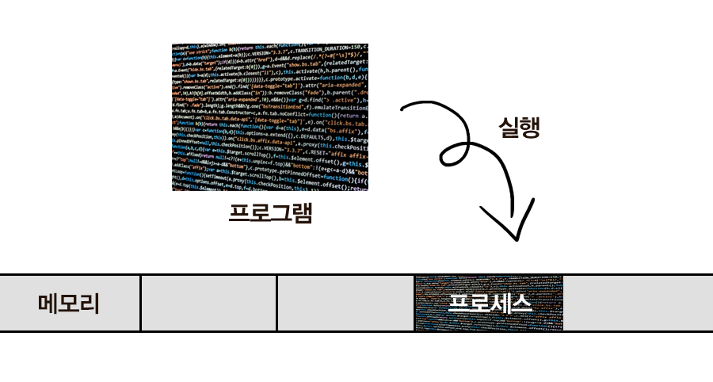

# Process and Thread

## Program
> - 파일이 저장 장치에 저장되어 있지만, 메모리에는 올라가 있지 않은 정적인 상태
>   - 아직 실행되지 않은 상태
> - 실행하는 순간, 해당 파일은 컴퓨터 메모리에 올라가게 되고 동적인 상태가 된다.
>   - 이 상태의 프로그램을 프로세스라고 한다.

## Process
> - 실행되고 있는 컴퓨터 프로그램
> - 운영체제로부터 자원을 할당받은 `작업`의 단위
> - 프로그램을 실행시켜 정적인 프로그램이 동적으로 변하여 프로그램이 돌아가고 있는 상태
>   - 컴퓨터에서 작업 중인 프로그램
> - 운영체제는 프로세스마다 각각 독립된 메모리 영역을 할당해 준다.
> - 

### code, data, stack. heap
>    1. code 영역
>    : 프로그램의 명령어들이 저장된 메모리 공간이다.
>        - 수정할 수 없는 읽기 전용 메모리 공간이다.
>    2. data 영역
>        
>        : 정적 변수, 전역 변수 및 정적 할당된 메모리를 포함하는 영역이다.
>        
>        - 읽기/쓰기가 가능하다.
>    3. Stack 영역
>    : 각 스레드마다 개별적으로 할당되며, 메소드 호출과 관련된 지역 변수, 매개 변수, 메서드 호출, 리턴 값 등을 저장한다.
>        - 메서드가 호출될 때마다 해당 메서드에 대한 스택 프레임이 생성되고, 메서드가 종료되면 해당 스택 프레임이 제거된다.
>        - 스택은 후입선출(LIFO) 구조로 동작하며, 스택 프레임은 순차적으로 쌓이고 제거된다.
>    4. Heap 영역
>    : 동적으로 생성된 객체, 배열 등을 저장하는 곳이다.

> - 과거에는 프로그램을 실행할 때 실행 시작부터 끝까지 프로세스하나만 사용해서 진행했었다.
> - 하지만, 시간이 지나 프로그램이 복잡해지고, 프로세스하나로는 부족해지게 되었다.
> - 한 프로그램을 처리하기 위한 프로세스를 여러 개 만들면 되지 않을까?
>   - 운영체제는 안정성을 위해서 프로세스마다 자신에게 할당된 메모리 내의 정보에만 접근할 수 있도록 제약을 뒀었다.
>   - 여러 개의 프로세스가 서로 접근하면 오류가 발생했었기 때문에, 프로세스보다 더 작은 실행 단위의 개념이 필요하게 되었다.

## Thread
> - 프로세스가 할당받은 자원을 이용하는 `실행 흐름`의 최소 단위
> - 프로세스와 다르게 쓰레드간 메모리를 공유하며 작동한다.
> - 

## Multi Process vs Multi Thread

### Context Switching
> - CPU는 한번에 하나의 프로세스만 실행 가능하다.
> - 여러 프로세스(스레드)가 돌아가면서 작업을 처리하는 데 이 과정을 Context Switching이라고 한다.
> - 동작 중인 프로세스가 대기를 하면서 해당 프로세스의 상태를 보관하고,
> - 대기하고 있던 다음 순서의 프로세스가 동작하면서 이전에 보관했던 프로세스의 상태를 복구하는 작업
> - 사실 Multi Process와 Multi Thread는 동시에 여러 작업을 처리하는 것이 아니라, `시분할`로 작업을 처리하는 것이다.

### Multi Process
> - 각 프로세스는 독립적인 메모리 공간을 가진다.
>   - 하나의 프로세스에 문제가 발생해도 다른 프로세스에 영향을 주지 않는다.
>   - 안정성과 보안 측면에서 장점
>   - `병렬`적으로 여러 작업을 처리하거나 독립성과 안정성을 유지하는 데 효과적이다.
>   - 동시성 문제도 발생하지 않는다.
> - 프로세스 간 통신(IPC)을 위해 별도의 메커니즘이 필요하다.
>   - 단순한 CPU 레지스터 교체뿐만 아니라, RAM과 CPU 사이의 `캐시 메모리까지 초기화`되어야 한다.
>     - 캐시 메모리를 다 비우고 새로운 프로세스 정보를 CPU 캐시에 적재해야 한다.
>   - 자원 부담이 크다.
> - 를 알고 있어서 통신이 가능하다.
>     - 통신이 가능할 뿐이지, 독립적으로 실행되고 독립적인 메모리 공간을 가진다.
>     - EX) 웹 브라우저의 여러 개의 상단 탭
>     - 

### Multi Thread
> - 하나의 프로세스에 여러 스레드로 자원을 공유하며 작업을 나누어 수행하는 것
> - 시스템 자원소모 감소(자원의 효율성 증대)
>   - 프로세스를 생성하여 자원을 할당하는 시스템 콜이 줄어 효율적으로 관리할 수 있다.
> - 시스템 처리율 향상(처리비용 감소)
>   - 캐시 메모리를 비울 필요가 없으니까 Context Switching 비용이 적다.
>   - 그냥 쓰레드 간에 공유하는 자원을 제외한 쓰레드 정보(Stack, Register)만 교체하면 된다.
> - 간단한 통신 방법
>   - 쓰레드는 스택 영역을 제외한 메모리 영역을 공유하기에 통신 비용이 적다.
> - 자원을 공유하기 때문에 동기화 문제가 발생할 수 있다. (병목현상, 데드락 등)
> - 불필요한 부분까지 동기화하면 대기시간으로 인하 성능저하 발생
> - 하나의 쓰레드가 문제가 생기면 해당 프로세스가 영향을 받아서 다른 쓰레드에도 영향을 줄 수 있다.
> - 단일 프로세스라면 효과를 기대하긴 어렵다.

PCB가 무엇인가요?
그렇다면, 스레드는 PCB를 갖고 있을까요?
리눅스에서, 프로세스와 스레드는 각각 어떻게 생성될까요?
자식 프로세스가 상태를 알리지 않고 죽거나, 부모 프로세스가 먼저 죽게 되면 어떻게 처리하나요?
리눅스에서, 데몬프로세스에 대해 설명해 주세요.
리눅스는 프로세스가 일종의 트리를 형성하고 있습니다. 이 트리의 루트 노드에 위치하는 프로세스에 대해 설명해 주세요.