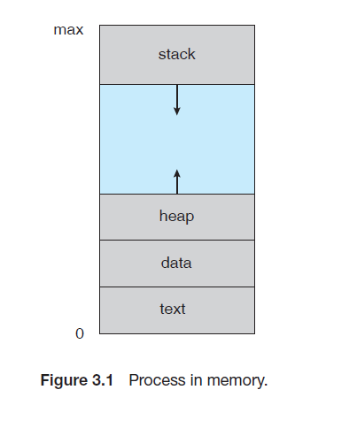
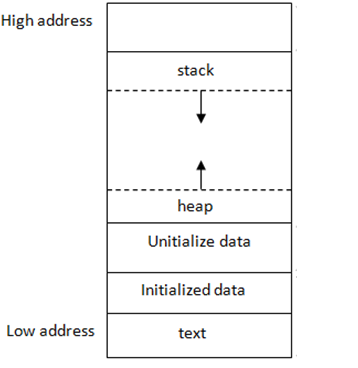
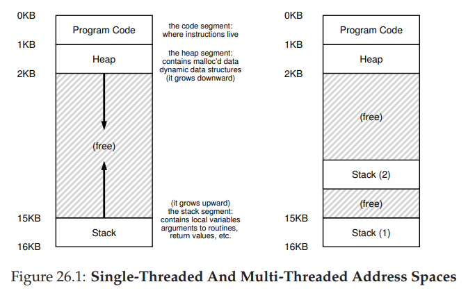
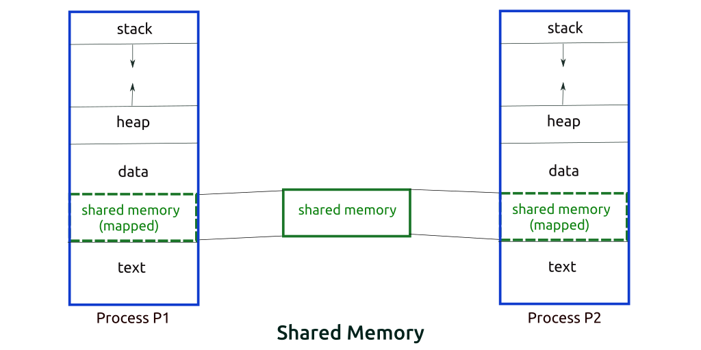
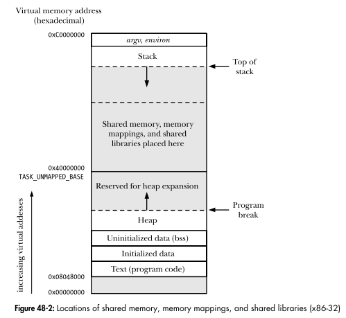

## 프로세스 주소공간에 대해 설명해 주세요.
프로세스 주소공간은 보통 `스택`, `힙`, `데이터`, `텍스트` 네 개의 세그먼트로 이뤄진 형태로 일컬어집니다.  
즉, 아래와 같은 형태로 묘사됩니다.  
  
> 출처: Operating System Concepts 9th

  
> 출처: [CS 225 | Stack and Heap Memory (illinois.edu)](https://courses.engr.illinois.edu/cs225/fa2022/resources/stack-heap/)  

- **`스택(Stack)`** : `지역 변수`들을 저장합니다.
	- *함수 호출과 같은 프로그램 활동*에 의해 **런타임**에 **가변 위치**에 저장되는 `자동 저장 기한`을 갖는 객체
		- [`저장 기한(Store Duration)`](https://en.cppreference.com/w/c/language/storage_duration) : c언어에서 객체의 수명을 결정하는 개념으로, `정적(static)`/`자동(auto)`/`할당(allocated)` 3개의 저장 기한이 존재합니다.
- **`힙(heap)`** : 프로그래머가 할당할 수 있는 동적 메모리 영역입니다.
	- 프로그래밍 언어에서 제공되는 *`메모리 할당자(memory allocator)`에 의해* **런타임**에 **가변 위치**에 저장되는 `동적 저장 기한`을 갖는 객체
- **`데이터(data)`** : 초기화된, 초기화되지 않은 `전역 변수`들을 저장합니다.
	- `정적 저장 기한`을 갖는 객체
- **`텍스트(text)`** : 실행중인 코드들을 저장합니다.
	- `컴파일 된 프로그램`
	- `데이터`, `텍스트` 모두 `컴파일러, 링커, 로더`에 의해 결정된 **고정된 위치**에 저장됩니다.

메모리의 각 바이트는 "주소"에 할당되며, 그림에 나온 것처럼 `텍스트`에서 `스택`으로 올라갈수록 높은 주소번호를 갖게 됩니다.
### `스택`
함수 인자, 저장된 레지스터, 반환 주소, 지역 변수 및 함수가 실행될 때 할당된 임시 값들을 저장합니다.  
함수가 호출될 때 마다 컴퓨터는 함수를 위해 스택 메모리를 할당하며, 새로운 지역 변수가 선언되면 함수에 해당 변수를 저장하기 위해 더 많은 스택 메모리를 할당합니다. 이는 스택을 위에서 아래로 증가시킵니다.  
C에서 함수 매개변수들은 함수 인자로부터 초기화된 지역 변수로 취급됩니다.  
처음 몇 개의 함수들의 인자나 함수 반환 값은 가능한 레지스터에 저장하고, 그렇지 않다면 스택에 저장하게 됩니다.  
스택은 `main()`을 호출하는 시스템 제공 시작 함수에 의해 초기화됩니다.  
스택 세그먼트의 크기는 다른 세그먼트와 충돌하거나 시스템이 정한 제한을 초과할 때까지 늘어날 수 있습니다.  
#### 주의점
함수의 스택 메모리는 함수가 반환된 뒤 할당 해제되므로, 해당 영역에 저장된 값이 계속 유지된다는 보장이 없습니다.  
따라서 만약 헬퍼 함수에서 스택 변수에 대한 포인터를 반환할 경우, 헬퍼 함수를 호출한 호출자가 이 포인터를 가져온 뒤 언제든 잘못된 스택 메모리를 덮어 쓸 수 있게 됩니다. 또한 해당 포인터가 객체를 가리키는 경우, 해당 객체의 변수값에 접근하거나 함수를 호출할 경우 프로그램의 충돌을 유발할 수 있습니다.  

### `힙`
C에서 `malloc()`을 통해 생성하거나, C++에서 `new` 키워드를 통해 생성한 객체와 같이, 동적으로 할당된 객체들을 저장합니다.  
스택과 달리, 힙 메모리는 개발자가 명시적으로 할당하며, 명시적으로 해제할 때 까지 할당 해제되지 않습니다.  
- 즉, 앞서 스택 메모리의 주의점인 포인터 반환 문제를 해결할 수 있습니다.
- 다만, 명시적으로 해제하지 않으면 프로그램이 종료된 후에도 힙 메모리가 해제되지 않기 때문에 `메모리 누수`를 일으킬 수 있습니다.

힙 메모리를 할당 해제하기 위해서는 `delete` 키워드를 힙 메모리의 포인터와 함께 사용하면 됩니다.  
- 만약 할당 해제한 메모리의 포인터를 사용하려고 하면 정의되지 않은 동작이 발생할 수 있으므로 할당 해제 이후 포인터 값을 `nullptr`로 설정하는 것이 좋습니다. 
 
힙 세그먼트의 크기는 다른 세그먼트와 충돌할 때 까지 커질 수 있습니다.  
- 여기서 설명하는 `힙`은 정렬된 형태를 갖는 자료 구조인 `힙`과는 다른 개념입니다.
  
힙 메모리는 유효하지 않은 메모리가 항상 맨 아래에 있는 스택과 달리, 사용자가 유효한 메모리 사이사이에 있는 힙 메모리를 해제해 힙의 단편화를 유발할 수 있습니다.
- 따라서 메모리를 효율적으로 재사용하기 위해, 최적의 위치를 찾는 여러 힙 할당 방식이 존재합니다.
### `데이터`
`전역 변수`, `정적 지역 변수` 및 다양한 `상수`들을 저장합니다.  
객체의 위치는 변경되지 않으며, 프로그램 명령과 관련된 데이터는 *컴파일 시* **`데이터 세그먼트`에 할당**되거나, *런타임에* **`스택 또는 힙` 세그먼트에 할당**될 수 있습니다.  
로더는 `실행 가능한 객체 파일`을 읽고, 메인 메모리에서의 데이터 시작 위치를 결정합니다.  
일반적으로 별도의 읽기-쓰기 및 읽기-전용 데이터 섹션이 제공됩니다.  
명시적 초기화(ex. 전역변수 `int n = 17`)의 경우, 객체 파일에 명시적 정보(적어도 주소, 크기, 값)가 필요합니다.  
암시적 초기화(ex. 전역변수 `int n;`)의 경우, 객체 파일에 주소, 크기 외의 명시적 정보가 필요하지 않습니다. 로더는 [`bss(block started by symbol) 섹션`](https://en.wikipedia.org/wiki/.bss)이라고도 부르는 이 섹션에 대해 알고 있어야 합니다.  
### `텍스트`
기계어로 된 프로그램 명령어를 저장합니다.  
프로그램 명령어들은 `실행 가능한 객체 파일`로부터 읽어와, 컴파일러/링커/로더에 의해 결정된 고정 주소에 배치됩니다.  
컴파일러는 **상대 주소를 사용**하는 `명령어 모음`을 포함하는 `재배치 가능한 객체 파일(relocatable object file, .o 파일)`을 생성합니다.  
- 여기서 상대 주소는 각 함수 또는 데이터 객체의 시작 위치를 기준으로 합니다.  
-  `재배치 가능한 객체 파일`은 `실행 가능한 객체 파일`보다 적은 정보를 갖습니다.  

링커는 여러 개의 상대 주소 모음을 수정해 하나의 상대 주소 모음(전체 프로그램의 시작 위치를 기준으로 하는)으로 만든 뒤 이를 `라이브러리 객체 파일` 또는 `실행 가능한 객체 파일`의 형태로 저장합니다.  
- `라이브러리 객체 파일` 역시 `실행 가능한 객체 파일`보다 적은 정보를 갖고 있습니다. (예를 들어, `main()`이 없다던지)

운영체제의 로더는 `실행 가능한 객체 파일`을 읽고 프로그램의 시작 지점이 메인 메모리 어디에 위치할 지 결정합니다.  
로드 후에는 텍스트 세그먼트를 읽기-전용으로 마킹해 프로그램 스스로의 명령어들을 수정할 수 없도록 해야합니다.  
## 초기화 하지 않은 변수들은 어디에 저장될까요?
초기화되지 않은 변수들은 `전역(global)` 또는 `정적(static)` 변수인지 `지역 변수`인지에 따라 다른 위치에 저장됩니다.  
만약 `전역/정적 변수`인 경우, `bss 섹션`에 저장됩니다.  
`지역 변수`인 경우, 해당 변수를 사용하는 함수의 `스택 메모리`에 저장됩니다.  
## 일반적인 주소공간 그림처럼, Stack과 Heap의 크기는 매우 크다고 할 수 있을까요? 그렇지 않다면, 그 크기는 언제 결정될까요?
스택과 힙 모두 디폴트 크기 값이 존재하며, 이는 운영체제와 컴파일러에 따라 다를 수 있습니다.  
스택의 경우, 윈도우에서는 1MB, 리눅스에서는 8MB가 기본 크기입니다.  
이 크기는 리눅스/유닉스에서는 `ulimit` 커맨드로, 윈도우에서는 링커 옵션을 수정하거나 `alloca` 함수를 사용해 늘릴 수 있고, 부족하다면 운영체제가 자동으로 확장할 수 있습니다. [#](https://www.geeksforgeeks.org/maximum-stack-size-for-c-c-program/)  
힙의 경우, [1MB](https://learn.microsoft.com/en-us/cpp/build/reference/heap-set-heap-size?view=msvc-170) 또는 더 작은 크기를 기본 크기값부터 시작해, 동적 메모리 할당시 크기가 점점 증가한다고 알려져있습니다.  
그리고 힙의 크기는 물리적 리소스 또는 가용한 가상 메모리 주소 공간에 의해 제한됩니다.
즉, 이론적으로 32비트의 경우 2~3GB까지 제한되며, 64비트의 경우 거의 제한이 없다(16엑사바이트까지)고 할 수 있습니다.  
하지만 실제 프로그램이 실행되는 OS환경, 컴파일러 등에 의해 이러한 제한은 달라질 수 있습니다.  

## Stack과 Heap 공간에 대해, 접근 속도가 더 빠른 공간은 어디일까요?
스택이 더 빠르다고 할 수 있습니다.  
스택의 경우 그 액세스 패턴으로 인해 메모리 할당 및 해제가 간단합니다.  
하지만 힙의 경우 할당 및 해제에 있어 복잡한 과정이 필요하기 때문에 느립니다.  
또한 컴파일러가 코드를 컴파일 할 때, 어디에 스택 변수가 있는지 알 수 있으며 다른 스레드에서 접근할 수 없기 때문에 변하지 않을 것임을 가정할 수 있습니다.  
반면 힙은 프로그램 실행 흐름에 따라 동적으로 할당되므로 어디에 변수가 존재하는지 알 수 없어 최적화를 하기 힘듭니다.  
또한 스택의 각 바이트들은 재사용되는 경향을 띄어, 프로세서의 캐시에 매핑되는편이기 때문에 이 경우 스택의 접근 속도가 더 빨라집니다.  
- [Why stack is faster than heap and what exactly is stack? - Fortran Discourse (fortran-lang.discourse.group)](https://fortran-lang.discourse.group/t/why-stack-is-faster-than-heap-and-what-exactly-is-stack/2130/5)
- \+ 이를 뒷받침 하는 벤치마크 [Stack allocation vs heap allocation – performance benchmark | publicwork (wordpress.com)](https://publicwork.wordpress.com/2019/06/27/stack-allocation-vs-heap-allocation-performance-benchmark/)
- 
## 다음과 같이 공간을 분할하는 이유가 있을까요?
위처럼 4개의 세그먼트로 공간이 분할된 이유는 **메모리의 활용도를 극대화**하기 위해서입니다.  
스택은 밑으로, 힙은 위로 충돌하지 않을때까지 공간을 늘려나가기 때문에 할당받은 프로세스의 메모리 공간을 최대한 활용할 수 있게 됩니다.  
따라서 위와 같은 구조를 갖게 되었습니다.  
## 스레드의 주소공간은 어떻게 구성되어 있을까요?
  
스레드 역시 프로세스처럼 본인만의 주소공간을 갖고 있지만, 위 그림처럼 각 스레드 별로 독립되는 공간은 `Stack` 영역밖에 없으며 나머지 공간은 다른 스레드와 함께 공유하는 형태로 구성되어 있습니다.  
따라서 Stack 이외의 공간의 자원은 여러 스레드에서 접근할 수 있게 되고, 이로인한 동시성 문제가 발생할 수 있습니다.  

## "스택"영역과 "힙"영역은 정말 자료구조의 스택/힙과 연관이 있는 걸까요? 만약 그렇다면, 각 주소공간의 동작과정과 연계해서 설명해 주세요.
힙의 경우 앞서 얘기한 것 처럼, 자료구조의 "힙"과 상관이 없습니다.  
하지만 스택의 경우, 자료구조의 "스택"과 유사하게 함수 호출 순서에 따라 아래로 스택 프레임을 추가해나가며 각 함수별로 인수 및 지역 변수들을 저장해나가게 됩니다.  
- [메모리 관리: 프레임 할당 | Microsoft Learn](https://learn.microsoft.com/ko-kr/cpp/mfc/memory-management-frame-allocation?view=msvc-170)

## IPC의 Shared Memory 기법은 프로세스 주소공간의 어디에 들어가나요? 그런 이유가 있을까요?
IPC에서 사용하는 Shared Memory는 이를 공유하는 각 프로세스의 data 세그먼트에 attach 되어 접근하게 됩니다.  

UNIX/Linux 환경에서는 커널이 할당해놓은, 프로세스들과 독립적인 공간에 대한 포인터를 각 프로세스에게 할당한다고 알려져있습니다.  
즉, 한 프로세스가 공유 메모리 공간을 생성하게 되면, 독립적인 공간에서 공유 메모리 세그먼트를 생성하고 얻은 포인터를 다른 프로세스와 공유하게 되는 것입니다.  

- [shmop(2) - Linux manual page (man7.org)](https://man7.org/linux/man-pages/man2/shmop.2.html)
- [Shared Memory (kent.edu)](https://www.cs.kent.edu/~ruttan/sysprog/lectures/shmem/shmem.html)

## 스택과 힙영역의 크기는 언제 결정되나요? 프로그램 개발자가 아닌, 사용자가 이 공간의 크기를 수정할 수 있나요?
리눅스 환경의 경우 사용자는 `ulimit -s 값` 명령어를 통해 실행 환경에서 스택 크기의 제한치를 변경할 수 있고, `ulimit -v 값` 명령어를 통해 힙의 최대 크기를 결정하는 가상 메모리 크기 제한을 변경할 수 있습니다.  

# 참고
- [CMPSC 311, Process Address Space (psu.edu)](https://www.cse.psu.edu/~deh25/cmpsc311/Lectures/Process-Address-Space/index.html)
- [CS 225 | Stack and Heap Memory (illinois.edu)](https://courses.engr.illinois.edu/cs225/fa2022/resources/stack-heap/)
- [Operating Systems: Processes (uic.edu)](https://www.cs.uic.edu/~jbell/CourseNotes/OperatingSystems/3_Processes.html)