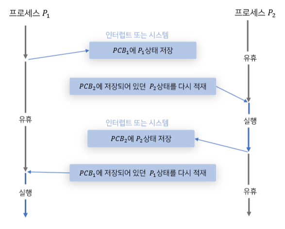
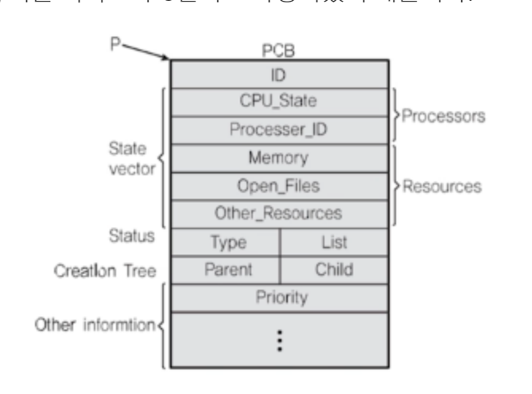

# 컨텍스트 스위칭 시에는 어떤 일들이 일어나나요?
## 컨텍스트 스위칭

> CPU/코어에서 실행중이던 프로세스/스레드가 다른 프로세스/스레드로 교체되는 것
### 컨텍스트?
> - 프로세스/스레드의 상태
>   - CPU, 메모리 등

## 컨텍스트 스위칭이 필요한 이유
> - 여러 프로세스와 스레드들을 동시에 실행시키기 위해
>   - `그렇게 보이기 위해`
> - 여러 프로세스와 스레드들이 공정하게 CPU 시간을 나눠 갖기 위해
> - `높은 우선순위의 작업`이 빠르게 처리될 수 있게 하기 위해(스케줄링)

## PCB
> - 프로세스가 실행중인 상태를 스냅샷찍어 저장하는 공간

> - 컨텍스트 스위칭은 PCB(Prcess Context/Control Block)이라고 하는 메모리의 별도 공간에 process 상태값들을 저장하고,
>   - 해당 값들을 찾는 방법으로 구현된다.
> - Process ID(PID)
> - 레지스터 값(PC, SP 등)
> - Scheduling Info(프로세스 상태)
> - Memory Info(메모리 사이즈)
> - 기타
> - 

## 컨텍스트 스위칭 작동 순서

> A라는 프로세스가 running 상태이고 B라는 프로세스가 ready 상태라고 할 때,
> 1. 스케줄러가 A 프로세스의 실행을 중단하고 B 프로세스를 실행할 것을 요청함
> 2. A프로세스에서 Stack의 데이터 위치를 가리키고 있는 SP(Stack Pointer)의 값과 다음 실행해야하는 코드의 주소값을 가지고 있는 PC(Program Counter)의 값을 PCB에 저장
> 3. A프로세스는 ready 혹은 block 상태로 바뀌고, CPU에서 B 프로세스를 실행함
>    - B 프로세스의 상태가 ready에서 running으로 바뀌는데, 이 작업을 dispatch 라고 한다.
> 4. 반대로 다시 B프로세스에서 A프로세스로 컨텍스트 스위칭을 할 경우, B프로세스의 SP값과 PC값을 PCB에 저장하고
>    - A프로세스의 PCB에서 SP값과 CP값을 찾아 덮어씌움.

---
## 프로세스와 스레드는 컨텍스트 스위칭이 발생했을 때 어떤 차이가 있을까요?
### 프로세스간 컨텍스트 스위칭
> - 각 프로세스는 독립적인 주소 공간을 가지고 있다.
> - CPU 레지스터, PC, 메모리 매핑 정보 등 프로세스의 전체 상태를 저장하고 복원해야 한다.
> - 프로세스 간 전환은 운영 체제의 커널 모드를 통해 이루어지며, 시스템 호출의 오버헤드 발생
> - CPU 캐시를 모두 비워줘야한다.
> - 상대적으로 오버헤드가 크다.

### 스레드간 컨텍스트 스위칭
> - 같은 프로세스 내의 스레드는 동일한 주소 공간을 공유한다.
> - CPU 레지스터, PC 등의 스레드 상태만 저장하고 복원하면 된다.
>   - 주소 공간 정보는 동일한 프로세스 내에서 공유
> - 공유된 메모리 공간 덕분에 저장하고 복원할 정보가 적다.
> - CPU 캐시를 비울 필요가 없다.
> - 사용자 수준의 스레드 라이브러리를 사용하여 커널 모드를 거치지 않고 스레드 전환이 가능하다.
> - 비용이 상대적으로 가볍다.

컨텍스트 스위칭은 언제 일어날까요?