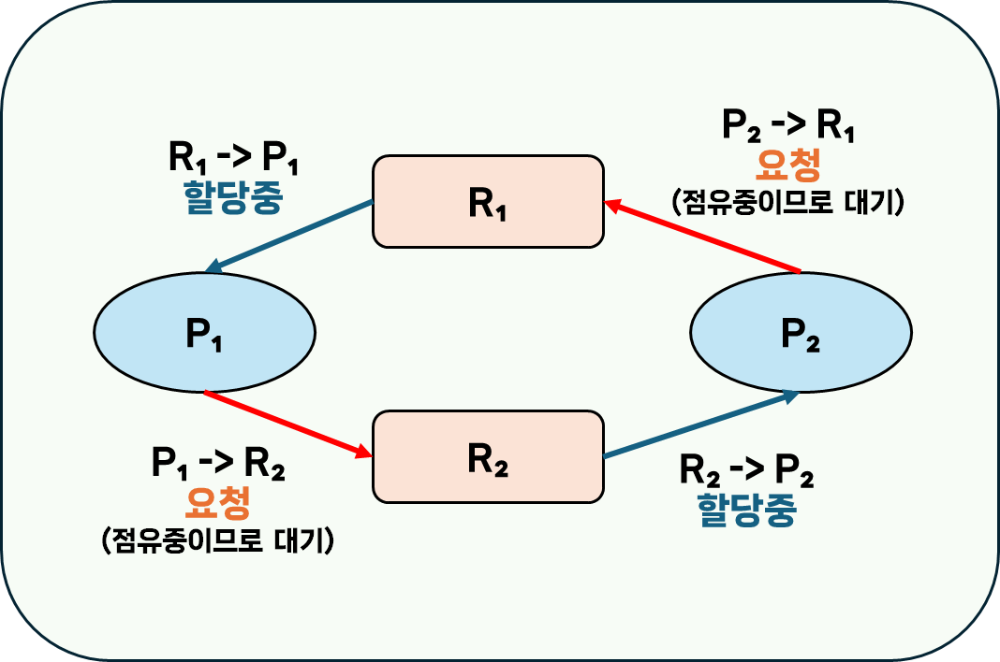
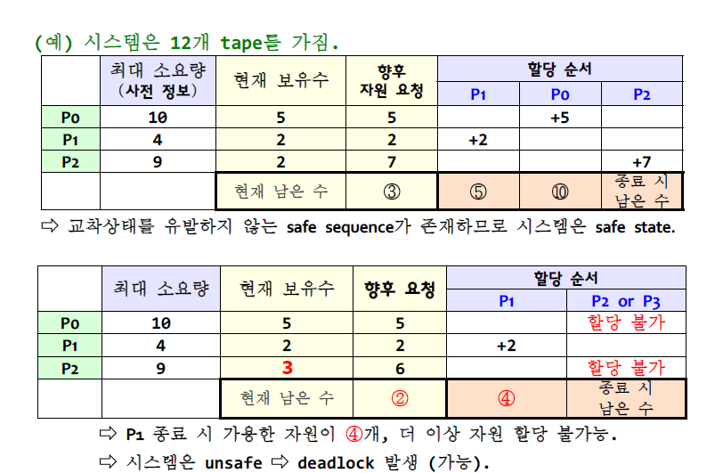
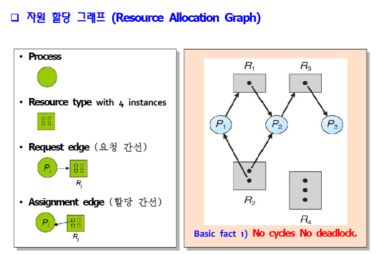
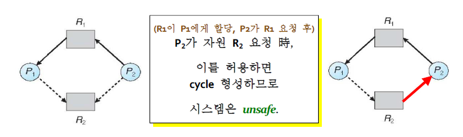
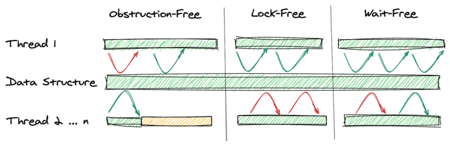

## Deadlock 에 대해 설명해 주세요.
`교착상태(Deadlock)`이란, 둘 이상의 프로세스들이 서로의 작업 진행을 가로막는 상태를 말합니다.  
주로 각 프로세스들이 자원을 보유하고 있는 상태에서, 서로의 자원을 획득하기 위해 무한정 기다리며 프로세스가 block되는 상황을 말합니다.  
> 예시) 자원 R₁, R₂과 프로세스 P₁, P₂이 존재하는 상황  
> 이렇게 된다면 P₁,은 R₂를 획득할 때 까지 작업을 진행하지 않고 무한정 대기하게 되고, P₂는 R₁을 획득할 때 까지 무한정 대기하게 됩니다.


### 시스템 모델
OS에서 프로세스는 자원을 사용하기 위해 다음과 같은 규약을 거칩니다.
1. **`Request(요청)`**
	- 요청이 즉시 허용되지 않으면, 자원을 사용할 수 있을 때 까지 **대기**합니다.
2. **`Use(사용)`**
3. **`Release(방출)`**
### 자원
교착상태에서 `자원(Resource)`은 다음과 같은 조건을 갖습니다.
- 한 번에 한 프로세스만 사용할 수 있습니다.
- 소프트웨어나 하드웨어일 수 있습니다.
	- 예시) CPU 사이클, 메모리 공간,  프린터, 시스템 테이블, DB 엔트리 등..
	- 위처럼 각 자원들은 `타입`($R_i$)을 가지며,  각 타입의 자원은 다수의 동등한 인스턴스 $W_{i}$로 구성됩니다.
		- 따라서 한 타입에 대한 요청은 해당 카테고리의 자원 중 어느 자원에서든 동일하게 충족될 수 있습니다.
- 요청 -> 할당 -> 사용 -> 방출 의 과정을 거칩니다.
#### 선점 가능한 자원 (Preemptable Resources)
`공유 가능한 자원(Sharable Resources)`을 말하며, 프로세스로부터 부작용 없이 회수할 수 있습니다.
#### 선점 불가능한 자원 (Nonpreemptable Resources)
`공유 불가능한 자원(Non-Sharable Resources)`을 말하며, 이를 회수할 경우 프로세스는 실패하게 됩니다.
일반적으로 교착상태에서는 `선점 불가능한 자원`이 포함되어 문제를 일으키게 됩니다.
## Deadlock 이 동작하기 위한 4가지 조건에 대해 설명해 주세요.
교착상태가 발생하려면, 다음 **4가지 필요조건**들이 **동시**에 성립해야 합니다.
만약 이 조건 중 하나라도 성립하지 않는다면, 데드락은 발생하지 않습니다.
### `Mutual Exclusion(상호 배제)`
하나의 자원은 **오직 한 프로세스**만 사용할 수 있습니다.
### `Hold and Wait(점유한 채 대기)`
프로세스는 *하나 이상의 자원을 보유한 채*로 다른 프로세스가 보유하고 있는 자원을 획득하기 위해 **기다립니다**.
### `No Preemption of Resources(선점 불가능한 자원)`
자원은 *일시적*으로 **방출될 수 없습니다**.
- 자원은 해당 자원을 **소유한 프로세스**가 **작업을 완료**한 뒤, **자발적으로 방출**할 때만 방출될 수 있습니다.
### `Circular Wait(순환 대기)`
대기 프로세스의 집합인 $\{P_0, P_1, ..., P_n, P_0\}$ 이 있을 때 $P_0$은 $P_1$이 보유한 자원을 요청한 뒤 대기하고, $P_1$은 $P_2$가 보유한 자원을 요청한 뒤 대기하고, ..., $P_n$은 $P_0$이 보유한 자원을 요청한 뒤 대기하고 있어야 합니다.
## 그렇다면 3가지만 충족하면 왜 Deadlock 이 발생하지 않을까요?
**`4가지 조건이 모두 충족`** 되어야 **교착상태가 성립**할 수 있기 때문입니다.  
만약 후술할 **예방 방법**을 통해, 각각의 조건들을 성립하지 않도록 했을 때도 교착상태가 성립하는지를 살펴본다면 그 이유를 알 수 있습니다.
## 어떤 방식으로 예방할 수 있을까요?
하기할 4가지 조건에 대한 예방 방법들은, 모두 **`자원 사용을 제한`** 하기 때문에 `자원 사용률(Resource Utilization)`, `시스템 처리량(System throughput)`이 떨어진다는 단점이 있습니다.
### `Mutual Exclusion(상호 배제)`
#### 자원의 `동시 접근` 허용
하나의 자원을 여러 프로세스가 **동시 접근**할 수 있게 된다면, 다른 프로세스가 *해당 자원의 방출을 기다리지 않아도 되므로* 교착상태가 발생하지 않습니다.
- 다만, 특정 자원은 근본적으로 공유가 불가능할 수 있어 예방책이 될 수 없습니다.
	- ex) 프린터와 같은 자원은 공유가 불가능합니다. (한 번에 한 프로세스의 출력만 처리)
	- 따라서, 자원을 실제로 요청하는 프로세스를 가능한 적게 만들어야 합니다.
### `Hold and Wait(점유한 채 대기)`
하기한 두 방식 모두 `낮은 자원 활용율`을 보이며, `기아(Starvation`가 발생할 수 있습니다.
- `기아(Starvation)`: 프로세스가 작업을 처리하는데 필요한 자원을 지속적으로 거부당하는 문제
#### 방법 1) 자원을 `보유하지 않을때만 자원을 요청`할 수 있도록 제한
#### 방법 2) 프로세스 `시작 전 모든 자원을 일괄 요청`하고 할당하도록 제한
#### 예시
ex) `DVD drive`의 파일을 디스크로 복사한 뒤, `disk file`들을 정렬하고, `printer`로 출력할 경우, 
- 방법 1) 먼저 `{DVD Drive, disk file}`을 요청해 작업을 수행합니다. 이후 두 자원을 방출하고, `{disk file, printer}`를 요청해 작업을 수행합니다.
- 방법 2) 실행 전 `{DVD Drive, disk file, printer}`를 일괄 요청합니다.
### `No Preemption of Resources(선점 불가능한 자원)`
#### 요청한 자원 획득 불가시 보유중인 자원을 일시적으로 방출
1. *자원을 보유하고 있는* 프로세스가, 요청한 자원을 ***즉시 할당**받을 수 없는 경우* 현재 **보유중인 모든 자원을 방출**합니다.
2. 선점된 자원(방금 요청한 자원)은 (요청한) 프로세스의 대기 자원 리스트에 추가됩니다.
3. 프로세스는 이전에 보유하고 있던 자원과 새로 요청한 자원 모두 획득할 수 있을때만 재개됩니다.
#### 주의사항
위 방식은 `CPU`, `memory space` 등 `상태의 보존/환원`이 가능한 자원에만 적용할 수 있습니다.
- 따라서 `printer`와 같은 자원에는 적용할 수 없습니다.
### `Circular Wait(순환 대기)`
#### 모든 자원 타입에 `total ordering(총 순서)` 부여하고, 오름차순으로만 요청
각 자원에 매겨진 순서가 $F(R_n)$ 라고 한다면, 프로세스가 $R_j$를 요청할 경우 해당 프로세스는 $F(R_i) \ge F(R_j)$를 만족하는 모든 자원 $R_i$를 방출해야 합니다.
#### 주의사항
*순서를 정하는 자체로는 예방할 수 없으므로*, 프로그램이 **순서를 지켜 요청하도록 강제**해야 합니다.
## + Deadlock을 회피하는 방법
자원을 요청할 때 마다, `자원 할당 상태`를 검사해 **교착상태가 없는** **`안전한 상태`가 보장**되면 자원을 할당하고, 그렇지 않으면 `대기`합니다.
### 자원 할당 상태
- 가용 자원 개수
- 할당된 자원개수
- 사전 정보
	- 각 프로세스가 요청할 *자원 유형별* **최대 개수**
### 안전한 상태(safe state)
모든 프로세스에 대해, `교착상태를 유발하지 않는 자원 할당 순서`가 존재하는 상태.
- `안전한 순서(safe sequence)`가 존재하면, 시스템은 safe state에 있다.
### 안전한 순서(safe sequence)
현재 자원 할당 상태에서, 다음 조건이 성립하면 $\{P_1, P_2, ..., P_{i-1}, P_i, ..., P_n\}$은 safe sequence 입니다.
- 프로세스 $P_i$의 향후 자원 요청은 (현재 가용 자원 개수 + $P_i$ 앞에 있는(즉, $P_j(j < i)$인) 모든 프로세스가 보유한 자원 총수) 를 만족할 수 있다.
	- 만약 요청 자원이 가용하지 않으면, $P_i$는 $P_{j(j<i)}$가 종료할때 까지 대기
	- $P_j$가 완료되면, $P_i$는 필요한 자원을 획득/실행/반환/종료
	- $P_i$가 완료되면, $P_{i+1}$은 필요한 자원 얻을 수 있고, ...
#### 예시

#### 기본 사실
1. 만약 시스템이 `안전한 상태`면, 교착상태는 일어나지 않음.
2. 만약 시스템이 `안전한 상태`가 **아니라면**(`unsafe state`), 교착상태가 일어날 수 있음.
3. 교착상태를 회피한다면, 시스템이 `unsafe state`가 되지 **않음을 보장**함.
### 교착상태 회피 알고리즘
교착상태를 회피하는 알고리즘으로는 `자원 할당 그래프 알고리즘`과 `은행원 알고리즘`이 있습니다.  
둘의 차이점으로는 `자원 할당 그래프 알고리즘`은 각 자원 타입이 **오직 하나**의 `instance`를 가지는 경우 사용되고, `은행원 알고리즘`은 각 자원 타입이 **여러 개**의 `instance`를 가지는 경우 사용된다는 점이 있습니다.
#### `자원 할당 그래프 알고리즘 (RAG Algorithm)`
자원 요청 및 할당 관계를 나타내는 `자원 할당 그래프`를 활용해 교착상태를 회피하고자 하는 알고리즘입니다.
##### `자원 할당 그래프(Resource Allocation Graph)`

위처럼 각 프로세스와 자원 타입 별 요청/할당 관계를 나타내는 그래프를 말합니다.  
그래프에서 **`사이클`** 이 발생한 경우, 만약 자원 타입별로 **인스턴스가 하나**라면 **교착상태**가 **발생**하고, 여러 인스턴스가 존재하면 **교착상태가 발생할 가능성**이 있습니다.  
##### 회피 방법
자원 할당 그래프 알고리즘은, 자원 할당 그래프에 프로세스가 요청할 것으로 예상되는 자원을 잇는 **`예약 간선`** 을 추가로 사용하는 알고리즘입니다 `예약 간선`은 점선으로 표시됩니다.  
간선 간의 변화는 다음과 같이 진행됩니다.
- 프로세스 실행 시, 모든 예약 간선을 표시
- 자원 요청시, 예약 간선 -> 요청 간선으로 변환
- 자원 방출시, 할당 간선 -> 예약 간선으로 변환


프로세스 $P_i$가 자원 $R_j$를 요청했을 때, 요청 간선 -> `할당 간선`으로 변환해도 **cycle이 형성되지 않는다면** 요청을 허용합니다.
#### `은행원 알고리즘 (Banker's Algorithm)`
##### 은행원 알고리즘을 위한 `자료구조`
은행원 알고리즘을 설명하기 위해서는, 먼저 자원 할당 상태를 나타내는 자료구조에 대한 이해가 필요합니다.
- 아래서 나오는 ${R, m}$은 자원 타입과 그 개수를 의미하며, ${P, n}$은 프로세스와 그 개수를 의미합니다.

|                  |                      |                    |                            |
| ---------------- | -------------------- | ------------------ | -------------------------- |
| Available[m]     | 현재 가용 개수             | Available[i] = k   | 현재 $R_i$ 자원 k개 가용          |
| Max[n, m]        | 최대 요청 개수<br/>(사전 정보) | Max\[i,j] = k      | $P_i$가 최대 k개의 $R_j$를 요청 가능 |
| Allocation[n, m] | 현재 할당 개수             | Allocation[i, j]=k | 현재 $P_i$가 k개의 $R_j$를 사용 중  |
| Need[n, m]       | 미래 요청 개수             | Need[i, j]=k       | 향후 $P_i$가 k개의 $R_j$를 요청 가능 |
- Need[i, j] = Max[i,j] - Allocation[i,j]

##### 자원 요청 방식
> $Request_i$ : 프로세스 $P_i$의 요청 벡터
1. $Request_i > Need_i$ 이면 `Error`
2. $Request_i > Available$ 이면, `waiting`
3. $P_i$에게 자원 할당을 가정하고, 새로운 자원할당상태를 계산합니다.
	- Available = Available + $Request_i$
	- $Allocation_i$ = $Allocation_i$ + $Request_i$
	- $Need_i$ = $Need_i$ + $Request_i$
4. 계산한 새로운 자원할당상태가 safe state인지 검사합니다. (`Safety Algorithm` 사용)
	- `safe state`인 경우, 해당 자원을 $P_i$에게 할당
	- `unsafe state`인 경우, $P_i$는 **대기**하고 **이전 자원 할당 상태**를 **복구**(환원)함
##### `안정성 알고리즘(Safety Algorithm)`
`안전한 순서(safe sequence)`를 찾기위한 알고리즘으로, 다음과 같은 순서로 진행됩니다.
1. 길이 m짜리 벡터 `Work[m]`과 길이 n짜리 벡터 `Finish[n]`을 가정. 다음과 같이 초기화
	- Work = Available
	- Finish[i] = false (for all i)
2.  아래 명령을 반복합니다.
	1. `Finish[i] = false` 이면서, $Need_i \le Work$를 만족하는 i를 찾습니다.
		- 찾은 경우, 아래 연산을 수행하고 2.1로 돌아갑니다.
			- Finish[i] = true;
			- Work = Work + $Allocation_i$;
		- 찾지 못한 경우, 3으로 갑니다.
	 - 이를 코드로 나타내면 아래와 같습니다.
	```
	while (true) {
		// 현재 가용한 자원으로 할당 가능한 프로세스 검색
		find i that satisfies (Finish[i] = false) && (Need_i <= Work)

    // 발견 시, P_i 종료(로 가정) 및 자원 방출
		if (found) {
			Finish[i] = true;
			Work = Work + Allocation_i;
		} else {
			break; // 더 이상 할당할 수 없는 경우
		}
	}
	```
3. 모든 i에 대해 `Finish[i] = true`를 만족하면, 시스템은 `safe state` 입니다.
	- 하나라도 `Finish[i] = false`라면, 시스템은 **교착상태** 입니다.
##### 참고 사항
- `안정성 알고리즘`은 $O(mn^2)$의 시간 복잡도를 갖습니다.
- 프로세스는 최대 자원 요구량을 사전에 거의 알지 못합니다.
- 프로세스 수는 새로운 사용자가 로그인/아웃함에 따라 동적으로 변합니다.
- 가용하리라 생각된 자원이 갑자기 사라질 수 있습니다.
- 실제로 은행원 알고리즘을 사용해 교착상태를 회피하는 시스템은 거의 없습니다.
## 교착상태 회복
교착상태로부터 회복하는 방법은 교착상태의 프로세스를 `강제 종료`, `자원 회수` 두 가지 방법이 존재합니다.
### `강제 종료(Aborting)`
강제 종료하는 방법은 2가지 방법이 있습니다.
- 모든 교착상태의 프로세스를 종료 -> 재실행 비용 발생
- 교착상태가 제거될 때 까지 하나씩 종료 -> 종료시 마다 교착상태 탐지 알고리즘 실행
#### 희생자(Victim) 프로세스 선정 기준
- 프로세스 우선순위
- 사용한 자원 유형 및 수
- 종료되어야 할 프로세스 수
- 실행한 총 시간, 완료까지 필요한 시간
- 완료까지 추가로 필요한 자원 수
- 프로세스 유형(대화형 or 일괄처리)
### `자원 강제 회수(Preemption)`
교착상태 사이클이 무너질 때 까지, 교착상태의 프로세스로 부터 자원을 회수한 뒤 다른 프로세스에 할당하는 방식입니다.
#### 고려 사항
- 희생자 프로세스 선택
	- 비용 최소화(보유 자원 수, 총 실행 시간 등)
- 프로세스 롤백 위치
	- `safe state`로 롤백한 뒤, 해당 상태로 재시작
- `기아(Starvation)`에 대한 고려
	- 같은 프로세스가 계속 희생자로 선택될 수 있으므로, 롤백 횟수를 비용에 포함해 고려
## 왜 현대 OS는 Deadlock을 처리하지 않을까요?
Windows, UNIX와 같은 현대 운영체제에서는 의도적으로 `교착상태를 무시(Deadlock Ignorance)`하기 때문입니다.  
이처럼 특정한 문제를 문제 없는 것처럼 무시하는 방식을 `타조 알고리즘(Ostrich algorithm)` 이라고 합니다.  
OS에서 교착상태를 무시하는 이유는 보통 다음과 같은 경우가 일반적이기 때문입니다.  
첫째, 교착상태가 발생하는 경우가 **매우 드문 경우**  
둘째, 교착상태를 **감지 또는 방지**하기 위해 발생하는 **지속적인 오버헤드** > 교착상태가 발생하도록 방치한 뒤 **필요한 경우 재부팅하는 비용** 인 경우  
다만, 교착상태를 무시할 경우 문제를 파악하기 어렵고, 특정한 경우 시스템이 불안정해질 수 있습니다.   
또한, 데이터 손실 또는 다른 심각한 문제를 일으킬 수 있기 때문에 복잡한 시스템의 경우, 신중한 구현이 필요합니다.  
## Wait Free와 Lock Free를 비교해 주세요.
### `Wait free`와 `Lock free`?
`wait free`와 `lock free`란 논-블로킹 자료 구조 레벨을 말합니다.
##### 논블로킹?
다중 스레드 환경에서 한 스레드의 실패/중단이 다른 스레드의 실패/중단을 유발하지 않는 알고리즘을 `논-블로킹`이라고 합니다.  
논-블로킹 알고리즘은 시스템 전체 진행률이 보장되는 경우 `lock free`이며, 스레드 별 진행률 역시 보장되는 경우 `wait free`하다고 할 수 있습니다.  
##### 논블로킹 등장 배경
이러한 논-블로킹 방식이 등장하게 된 이유는, 기존의 락 기반 동시성 처리 방식이 스레드 차단을 유발하기 때문입니다.  
기존의 경우, 공유 자원에 대해 락을 획득했어야 했고, 다른 스레드가 보유한 락을 획득하기 위해서는 락이 해제될 때까지 차단되어야 했습니다.  
만약 스레드가 실시간 작업을 수행하거나, 우선순위가 높은 작업을 수행하고 있었다면 이러한 차단은 바람직하지 않은 방식입니다. 또한 교착상태와 같은 오류가 발생할 수 있습니다.  
### 논블로킹 레벨

#### Obstruction-Free
가장 약한 수준의 논블로킹 레벨로, 항상 다른 모든 스레드가 `일시중단(Suspended)`된 경우에만 스레드의 진행이 보장되어야 합니다.  
이는 다른 모든 스레드들이 일시중단되어도, 현재 스레드가 기아상태에 빠지지 않음을 의미합니다.
- 만약 스레드가 락을 기다리고 있는데, 해당 락을 보유한 스레드가 일시중단된다면 현재 스레드는 이를 영원히 기다리게 됩니다.  
#### Lock-Free
항상 적어도 하나 이상의 쓰레드가 실행중임을 보장받는 레벨을 말합니다.  
아무 스레드도 중단되지 않아도 기아 상태가 아닌 스레드가 하나 이상 있음이 보장됩니다.  
언제든지 적어도 하나 이상의 스레드가 작업을 진행할 수 있는 경우를 의미합니다. 이때 다른 스레드들은 기아 상태에 빠질 수 있습니다.  
개별 스레드가 중단될 수 있지만, 시스템 전체의 처리량을 보장합니다.  
프로그램이 충분히 오래 실행될 때, 스레드 중 하나 이상이 진행중이라면 해당 알고리즘은 `lock free` 알고리즘입니다.  
#### Wait-Free
시스템 전체에 기아 상태인 스레드 없이 모든 스레드가 작업중인 경우를 말합니다.  
모든 스레드가 유한한 수의 단계 후에 진행되도록 보장되는 경우, 즉 '비합리적으로 많은' 수의 단계 동안 스레드가 기아 상태에 빠지지 않는 경우를 의미합니다.  
모든 `Wait-Free`는 `Lock-Free`입니다. (반대는 성립 X)  

# 참고
- 학부 전공 강의 '운영체제' 강의 자료
- [Introduction of Deadlock in Operating System - GeeksforGeeks](https://www.geeksforgeeks.org/introduction-of-deadlock-in-operating-system/)
- [Deadlock: What It Is, How to Detect, Handle and Prevent? | Baeldung on Computer Science](https://www.baeldung.com/cs/os-deadlock)
- [os-ch08_deadlocks.pdf (khu.ac.kr)](http://uclab.khu.ac.kr/lectures/2006_1_os/os-ch08_deadlocks.pdf) <<< 많이 참고함
- [Operating Systems: Deadlocks (uic.edu)](https://www.cs.uic.edu/~jbell/CourseNotes/OperatingSystems/7_Deadlocks.html)

- [The Ostrich Algorithm | Baeldung on Computer Science](https://www.baeldung.com/cs/ostrich-algorithm)
- [Ostrich algorithm - Wikipedia](https://en.wikipedia.org/wiki/Ostrich_algorithm)

- [Introduction to Lock-Free Data Structures with Java Examples | Baeldung](https://www.baeldung.com/lock-free-programming)
- [Non-blocking algorithm - Wikipedia](https://en.wikipedia.org/wiki/Non-blocking_algorithm)
- [[C++ Thread] Lock-Free Programming - (1) Lock Free ? / Lock Free Stack (tistory.com)](https://narakit.tistory.com/194)
- [프로세스 동기화의 블로킹 방식 (hexoul.github.io)](https://hexoul.github.io/process-sync)