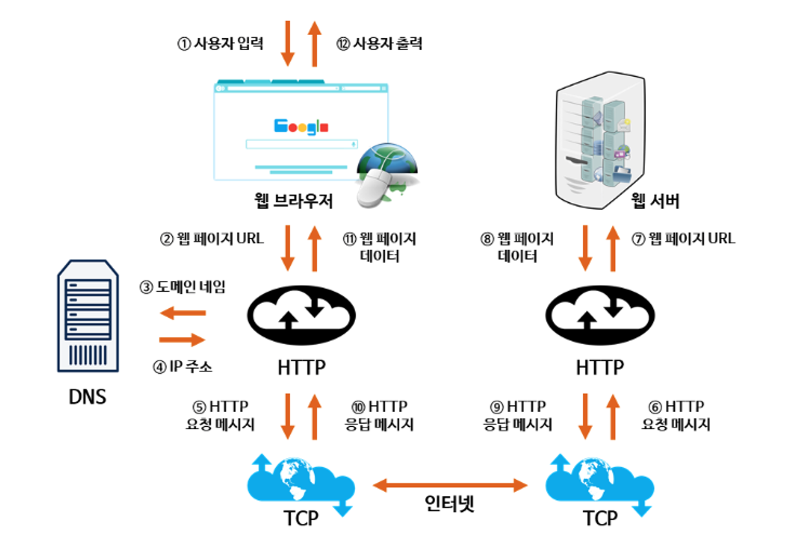
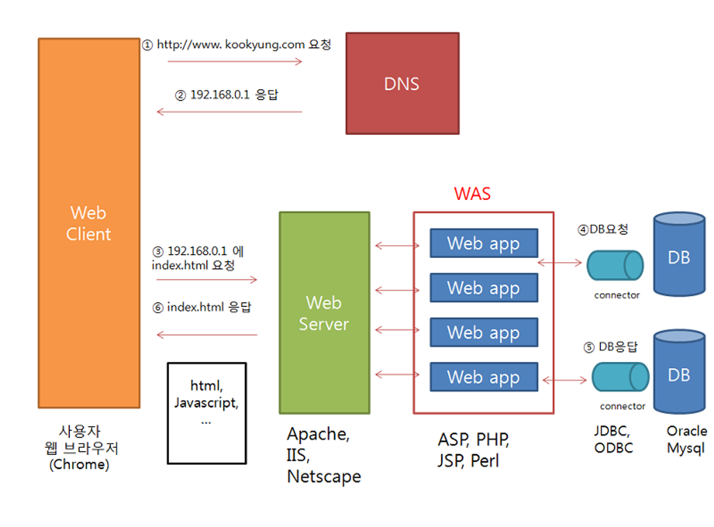
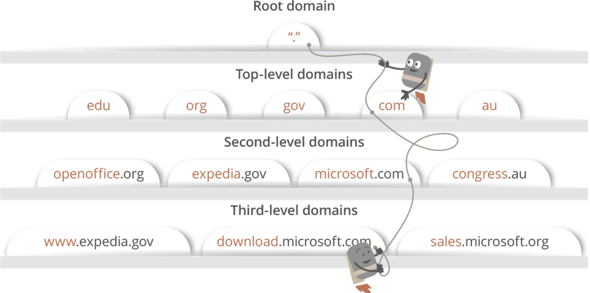
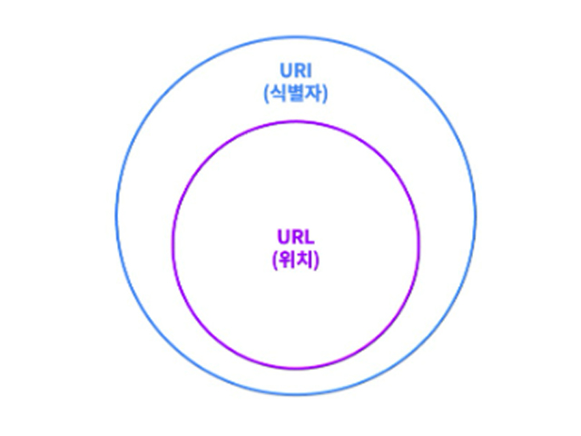
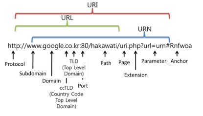

### www.github.com을 브라우저에 입력하고 엔터를 쳤을 때, 네트워크 상 어떤 일이 일어나는지 최대한 자세하게 설명해 주세요.





### 1. 사용자가 웹브라우저 검색창에 [www.google.com](http://www.google.com) 입력

### 2. 웹브라우저는 캐싱된 DNS기록들을 통해 해당 도메인 주소와 대응하는 IP주소를 확인

이 단계에서 캐싱된 기록에 없을 경우, 다음 단계로 넘어간다.

### 3. 웹브라우저가 HTTP를 사용하여 DNS에게 도메인 주소를 제공하고 대응하는 IP주소 요청

### 4. DNS가 웹브라우저에게 찾는 사이트의 IP주소를 응답

ISP(Internet Service Provider)의 DNS서버가 호스팅하고 있는 서버의 IP주소를 찾기 위해 DNS query를 날린다.

- DNS query의 목적

  DNS 서버들을검색해서 해당 사이트의 IP주소를 찾는데에 있다.

  IP주소를 찾을 때까지 DNS서버에서 다른 DNS서버를 오가며 에러가 날 때까지 반복적으로 검색한다. = `recursive search`


`DNS recursor` (ISP의 DNS서버)는 `name server` 들에게 물어물어 올바른 IP주소를 찾는 데에 책임이 있다. `name server` 는 도메인 이름 구조에 기반해서 주소를 검색하게 되는데, 예를 들어 설명해보자면,



```
'www.google.com' 주소에 대해 검색할 때,
1. DNS recursor가 root domain name server에 연락
2. 루트 DNS 서버가 TLD(Top-Level Domain)서버에 리다이렉트 / .com 도메인 name server로 리다이렉트
3. google.com name server로 리다이렉트
4. 최종적으로 DNS기록에서 'www.google.com' 에 매칭되는 IP주소 찾기
5. 찾은 주소를 DNS recursor로 보내기
```

이 모든 요청들과 `DNS recursor`, IP주소는 작은 데이터 패킷을 통해 보내진다.

원하는 DNS기록을 가진 DNS서버에 도달할 때까지
클라이언트 ↔️ 서버를 여러번 오가는 과정을 거친다.

### 5. 웹브라우저가 웹 서버에게 IP주소를 이용하여 html문서를 요청

TCP로 연결이 되면, 브라우저는 GET요청을 통해 서버에게 www.google.com의 웹페이지를 요청한다.

### 6. 웹어플리케이션서버(WAS)와 데이터베이스에서 우선 웹페이지 작업을 처리

### 7. 위의 작업 처리 결과를 웹서버로 전송

### 8. 웹서버는 웹브라우저에게 html 문서결과를 응답

### 9. 웹브라우저는 화면에 웹페이지 내용물 출력

---
### DNS 쿼리를 통해 얻어진 IP는 어디를 가리키고 있나요?
> 요청된 도메인 이름에 해당하는 `웹 서버`의 위치를 가리키고 있다.
> </br>해당 웹사이트의 콘텐츠를 호스팅하고 있는 서버의 실제 인터넷 위치


### Web Server와 Web Application Server의 차이에 대해 설명해 주세요.
[Tomcat](../../07-JAVA_SPRING/18_Tomcat/Readme.md) 참고

### URL, URI, URN은 어떤 차이가 있나요?

> URL은 URI지만, 모든 URI가 URL은 아니다.


#### URI(Uniform Resource Identifier)
- 식별자가 있는 위치뿐만 아니라 자원에 대한 `고유 식별자`
- 인터넷에 있는 자원이 어디에 있는지 자원 자체를 식별하는 방법
- http://torang.co.kr/user/107
  - user까지는 실제 위치인데 107이라는 id값을 가지고 자원을 식별하고 있다.

#### URL(Uniform Resource Locator)
- 식별자가 있는 `위치`
- 네트워크 상에서 리소스를 위치한 정보를 나타내는 규약
- 이름과 더불어 어떻게 도달할 수 있는지 위치까지 https와 같은 프로토콜 포함
- http://torang.co.kr/index

#### URN(Uniform Resource Name)
- 아직은 그렇게 널리 알려지고 사용되지 않는 개념
- URI의 표준 포맷 중 하나로 리소스를 특정하는 URI
- 리소스를 영구적이고 유일하게 식별할 수 있는 URI