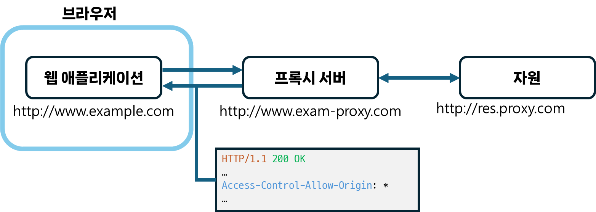

## SOP 정책에 대해 설명해 주세요.
**`동일 출처 정책(SOP, Same Origin Policy)`** 은 *한 출처에서 불러온 문서 또는 스크립트*가 **다른 출처의 자원**과 **상호 작용하는 방식**을 <u>제한</u>하는 보안 메커니즘입니다.  
다른 출처의 자원과의 상호 작용을 제한하므로써, <b>잠재적으로 악의적인 문서들로 부터 <u>격리</u></b>시켜 가능한 공격 경로를 줄일 수 있습니다. 이러한 격리를 통해 악성 웹사이트가 사용자가 로그인한 타 서비스의 데이터를 읽고 공격자에게 전달하는 것을 막을 수 있습니다.  
### `출처(Origin)`?
웹에서 같은 `출처`인지 판단하는 기준은 **URL의 `프로토콜`, `포트`(지정된 경우), `호스트 이름(hostname)`이 모두 동일한 지** 입니다. 이를 `튜플`이라고 부르기도 합니다.  
- `호스트 이름(hostname)` : 네트워크에 연결된 컴퓨터 또는 기타 **장치에 할당되는 이름**으로, `로컬 호스트 이름(local hostname)`과 `도메인 이름(domain name)`의 조합으로 구성됩니다.
	- 예시) `en.wikipedia.org`
		- `en`(로컬 호스트 이름)과 `wikipedia.org`(도메인 이름)으로 구성되어 있습니다.
#### 예시
`http://store.company.com/dir/page.html` 라는 URL을 기준으로 예시를 들어보겠습니다.
##### 동일한 출처
아래 링크들은 **경로**만 다른 케이스 입니다.
- `http://store.company.com/dir2/other.html`
- `http://store.company.com/dir/inner/another.html`
##### 다른 출처
프로토콜이 다른 경우  
- `https://store.company.com/page.html`
  
포트가 다른 경우  
- `http://store.company.com:81/dir/page.html`
  
호스트 이름이 다른 경우  
- `http://news.company.com/dir/page.html`
#### 출처 변경 공격
이전에는 DOM 객체인 document의 [`document.domain`](https://developer.mozilla.org/en-US/docs/Web/API/Document/domain)을 조작해 도메인을 현재 도메인 또는 상위 도메인으로 변경할 수 있었으나, 보안 문제 때문에`document.domain` 설정자가 사장되어(deprecated) 해당 방식 공격은 불가능하게 되었습니다.
### 교차출처 접근의 종류
#### 교차출처 쓰기
`링크`, `리다이렉션`, `form 제출` 등의 작업으로, **일반적으로 허용**되는 작업입니다. 일부 HTTP 요청은 `preflight`가 필요합니다.
#### 교차출처 임베딩
**일반적으로 허용**됩니다.  
`<script>`(javascript),  `<link>`(css), ``, `<video>`, `<audio>`, `<object>`, `<embed>`, `<iframe>`, `@font-face`(일부 브라우저 한정) 등이 있습니다.
#### 교차출처 읽기
<u>일반적으로 허용되지 않으나</u>, *`임베딩`을 통해* **읽기 접근이 유출**되는 경우가 있습니다.
- ex) 임베딩된 이미지의 크기, 임베딩된 스크립트의 동작
## CORS 정책이 무엇인가요?
`교차 출처 리소스 공유(CORS, Cross-Origin Resource Sharing)`는 **다른 출처의 자원을 접근**할 수 있도록 <u>허용</u>하는 정책을 말합니다.  
이는 서버에서 웹 브라우저가 해당 자원을 읽을 수 있는 출처를 설명할 수 있는 **새로운 `HTTP 헤더`** (`Access-Control-Allow-Origin`)를 추가하는 방식으로 동작합니다.  
클라이언트에서는 교차출처 자원을 호스팅하는 서버에  '*서버가 실제 요청을 허용할 것인지*'를 확인하기 위해 브라우저가 `preflight` 요청을 전송하는 메커니즘을 사용합니다.  
### CORS를 사용하는 요청
- `fetch()`, `XMLHttpRequest` 호출
- 웹 폰트(`@font-face`)
- WebGL 텍스처
- 이미지/비디오 프레임
  - `<canvas>`상에서 `drawImage()`를 이용해 그려진
-  이미지상의 CSS 도형
### CORS 관련 헤더
#### `Access-Control-Allow-Origin`
응답 헤더 중 하나로, 서버의 자원 소유자가 특정 도메인에서의 요청만 허용해 자원에 대한 접근을 제어하는데 쓸 수 있는 헤더입니다.
```
// https://foo.example에서의 접근만 허용하는 경우
Access-Control-Allow-Origin: https://foo.example
// 모든 도메인으로부터 접근을 허용하는 경우 (자격증명이 필요 없는 요청인 경우)
Access-Control-Allow-Origin: *
```
- **자격 증명**: *쿠키, TLS 클라이언트 인증서, 인증 헤더*와 같은 **인증 정보를 담은 것**을 말하며, `Access-Control-Allow-Credentials`(응답 헤더)가 `true`인 경우 사용자는 교차 출처 요청에 자격 증명을 포함할 수 있습니다.
### 완화 방법
#### `Access-Control-Allow-Origin` 응답 헤더 설정
서버 측에서 요청을 <u>허용할 출처</u>를 **명시적으로 설정**해줍니다.  
만약 자격증명이 필요한 경우, `*`는 사용할 수 없습니다.  
```
Access-Control-Allow-Origin: <origin> | *
```
#### 프록시 서버 사용하기



웹 애플리케이션에서 직접 자원에 접근하지 않고, 프록시 서버를 사용해 요청을 전달하는 방식입니다. 이는 SOP 정책이 브라우저-서버 간 통신에서만 구현된다는 점을 이용합니다.  
웹 애플리케이션과 프록시 서버간에는 `Access-Control-Allow-Origin: *` 응답 헤더를 추가해 자유롭게 요청을 주고 받습니다.  
그리고 서버-서버 간 통신에서는 SOP 정책을 만족할 필요가 없으므로 프록시 서버에서는 자유롭게 교차출처 자원에 접근할 수 있습니다.  

## Preflight에 대해 설명해 주세요.


다른 출처의 자원에 대해 `OPTIONS` 메서드 요청을 먼저 전송해, 실제 요청을 전송해도 안전한지 확인하는 방식을 말합니다.  
브라우저에서는 CORS를 사용하는 요청에 대해 `OPTIONS` 메서드를 자동으로 보내는데, 이때 원본 요청의 메서드, 헤더와 같은 값을 `Access-Control-Request-...` 과 같은 헤더에 담아서 해당 메서드, 헤더로 요청을 전송할 수 있는지 확인합니다.  
그리고 서버는 이에 대한 응답에 `Access-Control-Allow-...` 와 같은 헤더를 담아 허용되는 메서드, 헤더 등에 대한 정보를 알려줍니다.  
### Preflight 관련 헤더
#### 요청 헤더
##### `Origin`
요청을 발생시킨 출처(스키마, 호스트 이름, 포트)를 나타냅니다.  
`user agent`가 *페이지에 포함되거나*, *페이지 내 스크립트가 접근하는 자원에 대해* 요청해야 하는 경우 페이지의 출처가 요청에 포함될 수 있습니다.  
- 일반적으로 `user agent`는 모든 교차출처 요청, 또는 동일 출처에 대해 `GET`, `HEAD`를 제외한 요청에 대해 `Origin` 헤더를 추가합니다.
```
// 특정 케이스의 경우 Origin은 null일 수 있습니다.
Origin: null
// 스키마(사용되는 프로토콜)와 호스트 이름(+ 포트)의 조합으로 Origin이 표시됩니다.
Origin: <scheme>://<hostname>
Origin: <scheme>://<hostname>:<port>
```
##### `Access-Control-Request-Method`
원본 요청의 메서드가 어떤 것인지를 나타냅니다.
```
// ex) post 요청인 경우
Access-Control-Request-Method: POST
```
##### `Access-Control-Request-Headers`
원본 요청의 헤더로 어떤 것이 있는지를 나타냅니다.
```
// ex) 헤더에 X-PINGOTHER, Content-Type를 담은 경우
Access-Control-Request-Headers: X-PINGOTHER, Content-Type
```
#### 응답 헤더
##### `Access-Control-Allow-Origin`
##### `Access-Control-Allow-Methods`
요청한 자원에 대해 쿼리할 수 있는 유효한 메서드들을 알려줍니다. (쉼표로 구분)
모든 메서드를 허용하기 위해 `*(와일드카드)`를 쓸 수 있지만, 자격 증명이 없는 요청(*HTTP 쿠키 또는 authentication이 없는*)에 한해서만 사용할 수 있습니다.
```
// ex) POST, GET, OPTIONS 메서드만 허용되는 경우
Access-Control-Allow-Methods: POST, GET, OPTIONS
```
##### `Access-Control-Allow-Headers`
원본 요청의 헤더 중 허용되는 헤더를 알려줍니다. (쉼표로 구분)
모든 헤더를 허용하기 위해 `*`를 쓸 수 있지만, 자격 증명이 없는 요청(*HTTP 쿠키 또는 authentication이 없는*)에 한해서만 사용할 수 있습니다.
또한, `*`를 사용해도, `Authorization` 헤더의 경우 명시적으로 나열해야 합니다.
```
// ex) X-PINGOTHER, Content-Type 헤더가 허용되는 경우
Access-Control-Allow-Headers: X-PINGOTHER, Content-Type
// ex) 'X-Custom-Header' 라는 사용자 지정 헤더가 허용되는 경우
Access-Control-Allow-Headers: X-Custom-Header
```
##### `Access-Control-Max-Age`
preflight의 결과(즉 `Access-Control-Allow-Methods`, `Access-Control-Allow-Headers`에 포함된 정보)가 캐시될 수 있는 기간을 알려줍니다.
결과를 캐시할 수 있는 최대 시간(초)를 나타내며, 브라우저마다 최대치(`파이어폭스`:24시간, `크로미움(v76이전)`: 10분, `크로미움(v76이후)`: 2시간)가 다릅니다.
```
// ex) preflight의 결과가 캐시로 10분동안 저장됩니다.
Access-Control-Max-Age: 600
```


# 참고 문서
---
- [Cross-Origin Resource Sharing (CORS) - HTTP | MDN (mozilla.org)](https://developer.mozilla.org/en-US/docs/Web/HTTP/CORS#preflighted_requests)
- [Same-origin policy - Security on the web | MDN (mozilla.org)](https://developer.mozilla.org/en-US/docs/Web/Security/Same-origin_policy#cross-origin_script_api_access)
- [hostname(호스트명), domain name(도메인), same origin VS same site (velog.io)](https://velog.io/@minjae-mj/%ED%98%B8%EC%8A%A4%ED%8A%B8-%EB%84%A4%EC%9E%84%EA%B3%BC-%EB%8F%84%EB%A9%94%EC%9D%B8-%EB%84%A4%EC%9E%84)
- [3 Ways to Fix the CORS Error — and How the Access-Control-Allow-Origin Header Works | by David Katz | Medium](https://medium.com/@dtkatz/3-ways-to-fix-the-cors-error-and-how-access-control-allow-origin-works-d97d55946d9)
- [CORS(교차 출처 리소스 공유) | 토스페이먼츠 개발자센터 (tosspayments.com)](https://docs.tosspayments.com/resources/glossary/cors#cors-%EC%97%90%EB%9F%AC-%EB%8C%80%EC%9D%91%ED%95%98%EA%B8%B0)