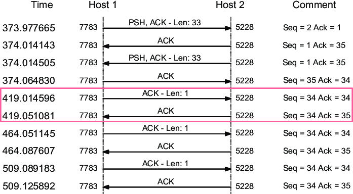
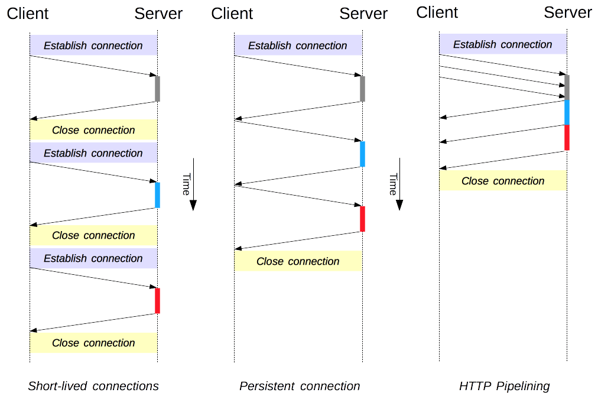

## Stateless와 Connectionless에 대해 설명해 주세요.
### Stateless
`무상태(Stateless)`란, 이전 통신 내용에 의존하지 않는 통신 방식을 의미하며, 따라서 전송되는 패킷에 대한 어떠한 정보도 추적하지 않는 방식을 말합니다.  
`무상태 프로토콜`에서는 두 컴퓨터간의 연결이 중단되더라도, 다시 연결되었을 때 중단된 시점부터 다시 시작할 수 있습니다.  
`Stateless`한 서비스는 `가시성(visibility)`, `안정성(reliability)`, `확장성(Scalability)`과 같은 속성에서 개선된 모습을 보입니다.  
전체 요청의 성격을 파악하고자 단일 요청 이상을 살펴볼 필요가 없어 `가시성`이, 부분적인 장애를 복구하는게 쉽고 서버의 손실이 사용자 세션에 영향을 미치지 않아 `안정성`이, 요청 사이사이의 세션 상태를 저장할 필요가 없어 구현이 간소화되므로 `확장성`이 개선됩니다.  
다만, `Stateless`하다는 것이 상태가 존재하지 않음을 의미하지는 않는 경우가 많으며 대부분 다른 어딘가에 상태가 저장되어 있는 경우가 많습니다.  
또한 서버에 데이터를 두고 재사용하지 않기 때문에, 매 요청마다 반복되는 데이터 전송이 증가해 네트워크 성능이 떨어질 수 있습니다.  
#### Stateless한 프로토콜
##### HTTP
클라이언트와 서버가 현재 요청에 대해서만 통신하기 때문에 `Stateless`한 프로토콜입니다.
##### UDP (User Datagram Protocol)
각 UDP 패킷은 이전/후속 패킷에 대한 정보없이 전송되므로 `Stateless`한 프로토콜입니다.
##### DNS (Domain Name Service)
일반적으로 DNS 조회 쿼리는 UDP를 통해 이뤄지므로, 각 쿼리가 독립적인 트랜잭션으로 처리되어 서버는 클라이언트의 이전 요청에 대한 정보를 유지하지 않으므로 `Stateless`한 프로토콜이라 할 수 있습니다.  
- 다만 DNSSEC 응답, IPv6 응답 등 UDP의 최대 응답 크기보다 큰 값을 받아야 하는 경우 TCP를 사용할 수 있습니다. [#](https://serverfault.com/questions/404840/when-do-dns-queries-use-tcp-instead-of-udp)
### Connectionless
`무연결(Connectionless)`이란, 발신자와 수신자 간에 세션 연결등의 설정을 하지않고, 데이터를 전송하는 방식을 의미합니다. 따라서 목적지가 아직 그곳에 존재하는지, 수신자/목적지가 메시지를 받을 준비가 되어있는지 확인하지 않고 전송합니다.  
OSI 7계층 중 4단계, 즉 전송 계층에서 데이터 또는 메세지를 전송하는데 사용되는 기법입니다.  
이러한 서비스는 각 데이터 패킷을 다른 패킷들과 독립적으로, 한 번에 하나씩 송/수신합니다. 따라서 패킷에 해당 패킷이 다른 패킷 스트림의 일부인지 여부를 판단할 수 있는 정보를 갖고 있지 않습니다. 그저 각 패킷은 출처/목적지 주소를 가지며 독립적으로 라우팅됩니다.  
`Connectionless`한 서비스는 빠른 속도는 보장하고, 구현이 간단하며, 오류 정정도 가능하다는 장점이 있습니다.  
하지만, 연결-중심 서비스에 비해 안정성이 떨어지고, 패킷 손실/오류 발생 등이 일어나지 않음을 보장할 수 없습니다. 또한, 도착 여부나 순서는 보장하지 않습니다.  
#### Connectionless한 프로토콜
이렇게 Connectionless한 프로토콜로는 `IP`, `UDP`, `ICMP`, `IPX`가 있습니다.
##### IP (Internet Protocol)
IP 네트워크 상의 모든 패킷들은 독립적으로 라우팅 되며, 동일한 경로를 거치지 않을 수도 있습니다.
##### UDP (User Datagram Protocol)
UDP 통신은 별도의 핸드셰이킹 과정 없이 통신을 진행할 수 있습니다.
##### ICMP (Internet Control Message Protocol)
연결 설정 전 핸드셰이크할 호스트를 필요로 하지 않습니다.
- `인터넷 제어 메시지 프로토콜(ICMP)`이란? 네트워크 장치에서 네트워크 통신 문제를 진단하는 데 사용하는 네트워크 계층 프로토콜
##### IPX (Internetwork Packet Exchange)
한 시스템에서 다른 시스템으로 데이터 패킷을 전송하는 동안 유지해야 할 일관된 연결이 필요하지 않습니다.
- `IPX`란? Novell사에서 개발한 서버용 운영체제 NetWare용으로 개발된 IPX/SPX 프로토콜 스택 안에 있는 OSI 모델 네트워크 계층 프로토콜
## 왜 HTTP는 Stateless 구조를 채택하고 있을까요?
HTTP가 `Statelesss` 구조를 채택한 이유는 크게 두 가지로 추론할 수 있습니다.  
첫 번째로, HTTP 개발 초기에는 정적 웹 페이지처럼 `Stateless`한 프로토콜로도 충분히 서비스할 수 있을 정도로 **유즈케이스가 간단**했기 때문입니다.  
`HTTP/0.9`(1991)의 경우 HTML 파일만 전송될 수 있었고 요청 역시 `GET` 메서드만 사용할 수 있었으며, `HTTP/1.0`(1996)에 접어들어서야 응답의 상태 코드는 물론 `Content-type`을 통해 HTML 이외의 파일도 보낼 수 있게 되었습니다.  
두 번째로, **`Stateless` 구조의 장점** 때문입니다.  
만약 `Stateful`한 방식으로 설계되었다면, 서버가 통신중인 모든 클라이언트들과의 상호작용을 유지해야하기 때문에 성능 및 안정성에 있어 영향을 받을 수 있습니다.   하지만 `Stateless`한 구조를 채택하므로써 성능 및 안정성은 물론, 시스템 상태에 대한 걱정을 덜고, 기능 구현에 집중할 수 있게 해줍니다.  
## Connectionless의 논리대로면 성능이 되게 좋지 않을 것으로 보이는데, 해결 방법이 있을까요?
?
## TCP의 keep-alive와 HTTP의 keep-alive의 차이는 무엇인가요?
### TCP Keepalive

> 출처: [(PDF) Online Internet Traffic Monitoring System Using Spark Streaming (researchgate.net)](https://www.researchgate.net/publication/323491808_Online_Internet_traffic_monitoring_system_using_spark_streaming)

연결된 **TCP 소켓을 확인**하고, 연결이 계속 유지되고 있는지 체크하는 **선택 기능**을 말합니다.  
TCP 연결이 설정되면, 한 쪽이 연결을 끊을 때까지 해당 연결은 무기한으로 유지되게 됩니다. 그러나, 현실에서는 방화벽 또는 NAT 시스템이 일정 기간 활동이 없으면 해당 연결을 닫아버리게 됩니다.  
그래서 길이가 0인 `keep-alive` 신호를 보내 연결이 닫히지 않도록 이들을 속입니다.
대부분의 TCP 연결을 지원하는 호스트는 `TCP keep-alive` 역시 지원하며, 일정 수의 `keep-alive` 신호가 전송되었음에도 `ACK`이 수신되지 않으면 보내는 호스트 측에서 해당 연결을 끊게 됩니다.  
이를 통해 여러가지 이유로 연결이 죽은 피어를 확인할 수 있고, `NAT 프록시` 또는 `방화벽`에 의해 연결이 종료되는 것을 방지할 수 있습니다.  
일반적으로 `TCP keep-alive`는 45 또는 60초 마다 전송되며, 연속된 3번의 전송 동안 `ACK`를 받지 못하면 연결이 종료됩니다.  
### HTTP keep-alive
HTTP의 `keep-alive` 옵션은 HTTP/1.0+에 처음 등장했지만, 표준으로 채택받지 못한 헤더를 의미합니다.  
HTTP/1.0의 경우, 한 번에 하나의 request-response 쌍을 주고 받은 뒤 HTTP 연결을 종료하는 형태였는데, TCP 연결을 연다는 것은 많은 자원을 소모하는 작업이기 때문에 현대 웹 페이지와 같이 필요한 정보를 제공받기 위해 수십 개 이상의 요청-응답을 주고받는 상황에서 이러한 모델은 **비효율적**입니다. (또한, TCP 연결은 지속될수록 그 효율성이 높아집니다.)  
따라서 이를 보완하고자 HTTP/1.0+에서 이러한 옵션이 등장하게 되었습니다.  
하지만 해당 옵션을 이해하지 못하는 HTTP/1.0 프록시 서버에 전달할 경우, 다음 인바운드 서버로 전달하기 때문에 해당 HTTP/1.0 프록시 서버는 중단된 상태로 종료 응답을 계속 기다리게 됩니다. [RFC 문서](https://www.rfc-editor.org/rfc/rfc2068#section-19.7.1)  
이후 HTTP/1.1 에서 두가지 모델이 등장하게 되었는데, `지속적 연결 모델(Persistent Connection)`과 `HTTP 파이프라이닝 모델(HTTP Pipelining)`이 바로 그것입니다. (이후 HTTP 2에서도 몇 가지 모델이 더 추가되었습니다.)  
또한, HTTP/1.1 부터 `지속적 연결(Persistent Connection)`이 기본 값으로 자리잡게 되었습니다. [HTTP/1.1 RFC 문서](https://www.rfc-editor.org/rfc/rfc2616#section-8.1.2)  
  
해당 헤더는 HTTP 2 이후에는 대부분 무시되며, Safari의 경우 해당 필드가 포함된 응답을 처리하지 않고 있습니다.
# 참조
- [Connection-less Service - GeeksforGeeks](https://www.geeksforgeeks.org/connection-less-service/)
- [Connectionless protocol definition – Glossary | NordVPN](https://nordvpn.com/ko/cybersecurity/glossary/connectionless-protocol/)
- [Connectionless communication - Wikipedia](https://en.wikipedia.org/wiki/Connectionless_communication)
- [How does UDP Work Without Connection? - GeeksforGeeks](https://www.geeksforgeeks.org/how-does-udp-work-without-connection/)
- [Stateless protocol - Wikipedia](https://en.wikipedia.org/wiki/Stateless_protocol)
- [Stateful vs stateless (redhat.com)](https://www.redhat.com/en/topics/cloud-native-apps/stateful-vs-stateless)
- [Networking: Stateless and Stateful Protocols | Baeldung on Computer Science](https://www.baeldung.com/cs/networking-stateless-stateful-protocols)
- [RFC 2068: Hypertext Transfer Protocol -- HTTP/1.1 (rfc-editor.org)](https://www.rfc-editor.org/rfc/rfc2068#section-19.7.1)
- [Connection management in HTTP/1.x - HTTP | MDN (mozilla.org)](https://developer.mozilla.org/en-US/docs/Web/HTTP/Connection_management_in_HTTP_1.x)
- [TCP keepalive overview (tldp.org)](https://tldp.org/HOWTO/TCP-Keepalive-HOWTO/overview.html)
- [[Network 04] Persistent C.. : 네이버블로그 (naver.com)](https://blog.naver.com/whdgml1996/222153047879)