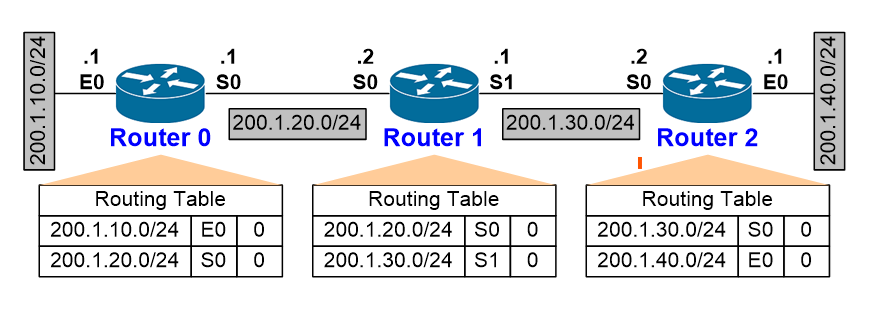
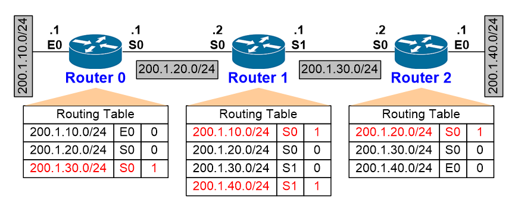
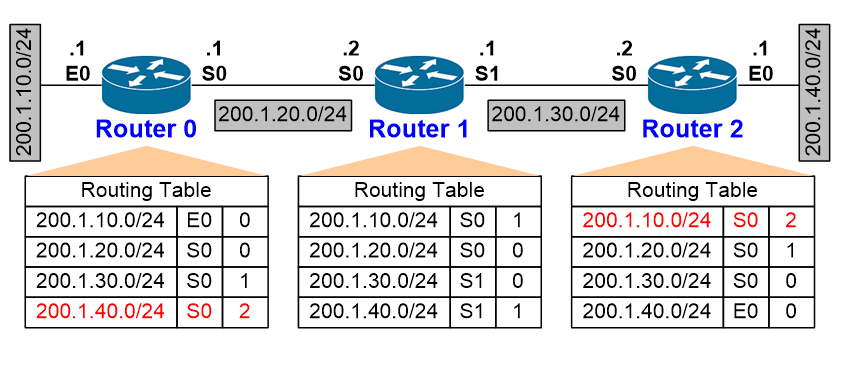
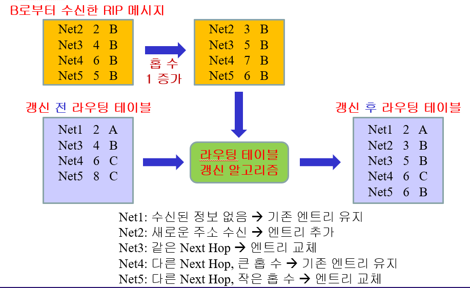
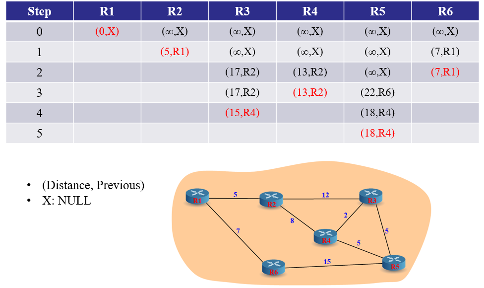

# Forwarding

## 라우팅과 포워딩의 차이는 무엇인가요?

### 라우팅

- 여러 네트워크 간에 트래픽 경로를 선택하는 프로세스

### 포워딩

- 컴퓨터 네트워크의 노드를 통해 한 네트워크 세그먼트에서 다른 네트워크 세그먼트로 패킷을 중계하는 것

> 라우팅은 '어디로 가야 하는가'를 결정한다면 포워딩은 '실제로 어떻게 가는가'를 처리하는것으로 패킷을 실제로 전달하는 과정을 의미한다

---

## 라우팅 알고리즘에 대해 설명해 주세요.

1. Distance Vector Routing(거리 벡터 라우팅)

   각 라우터가 인접한 라우터로부터 정보를 주기적으로 받아 라우팅 테이블을 갱신하는 방식

- RIP(Routing Information Protocol)

  cost는 홉수로만 해서 모든 링크를 동일하게 취급 최대 홉수는 15

    
    
    

  홉수가 가장 적은 경로를 선택

  갱신

  1. 주기적인 업데이트 : 기본적으로 30초마다 갱신
  2. 트리거 업데이트 : 변화 감지

    

> ### IGPR(Interior Gateway Routing Protocol)과 차이점<br>
>
> - IGPR는 지연 시간, 대역폭, 신뢰성, 로드 등 여러 요소로 코스트를 정한다<br>
> - 더 큰 네트워크를 지원해준다<br>
> - 불규칙적인 업데이트 발송한다

2. Link State Routing(링크 상태 라우팅)

   모든 라우터의 경로 정보를 서로 교환하여 자신의 라우팅 테이블을 유지하는 방식 (Dijkstra 알고리즘 사용)

   - OSPF (Open Shortest Path First)

   ```
   1. 링크 상대 정보 교환
   2. 토폴로지 데이터베이스 구성
   3. 최적경로 계산
   4. 라우팅 테이블 설정
   ```

   

3. Path Vector Routing(경로 벡터 라우팅)

   AS(Autonomous System)끼리의 연결시켜 routing을 하는 방식

- BGP(Border Gateway Protocol)

  `Border Gateway : AS의 경계에 위치한 라우터`

  1. iBGP<br>
     서로 같은 AS 상의 Border Gateway들 끼리의 연결을 담당하는 BGP
  2. eBGP<br>
     서로 다른 AS 상의 Border Gateway들 끼리의 연결을 담당하는 BGP

---

## 포워딩 테이블의 구조에 대해 설명해 주세요.
