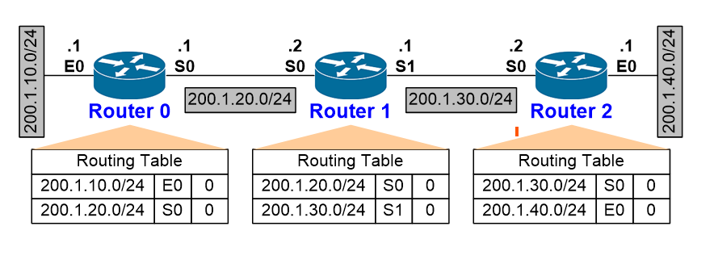
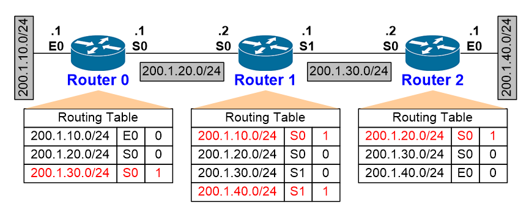
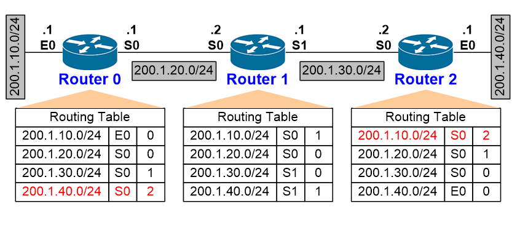
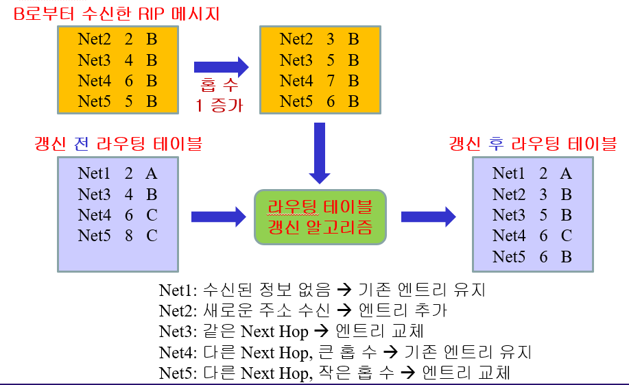
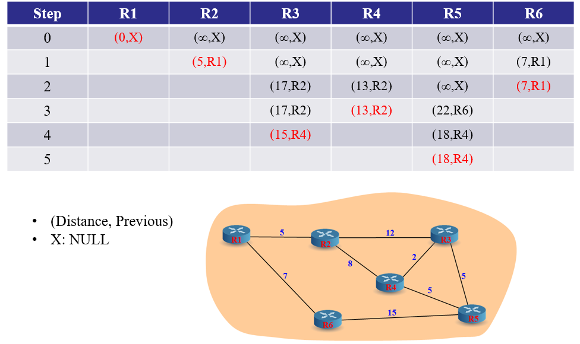

# Forwarding

## 라우팅과 포워딩의 차이는 무엇인가요?

### 라우팅

- 여러 네트워크 간에 트래픽 경로를 선택하는 프로세스

### 포워딩

- 컴퓨터 네트워크의 노드를 통해 한 네트워크 세그먼트에서 다른 네트워크 세그먼트로 패킷을 중계하는 것

> 라우팅은 '어디로 가야 하는가'를 결정한다면 포워딩은 '실제로 어떻게 가는가'를 처리하는것으로 패킷을 실제로 전달하는 과정을 의미한다

---

## 라우팅 알고리즘에 대해 설명해 주세요.

1. Distance Vector Routing(거리 벡터 라우팅)

   각 라우터가 인접한 라우터로부터 정보를 주기적으로 받아 라우팅 테이블을 갱신하는 방식

- RIP(Routing Information Protocol)

  cost는 홉수로만 해서 모든 링크를 동일하게 취급 최대 홉수는 15

    
    
    

  홉수가 가장 적은 경로를 선택

  갱신

  1. 주기적인 업데이트 : 기본적으로 30초마다 갱신
  2. 트리거 업데이트 : 변화 감지

    

> ### IGPR(Interior Gateway Routing Protocol)과 차이점<br>
>
> - IGPR는 지연 시간, 대역폭, 신뢰성, 로드 등 여러 요소로 코스트를 정한다<br>
> - 더 큰 네트워크를 지원해준다<br>
> - 불규칙적인 업데이트 발송한다

2. Link State Routing(링크 상태 라우팅)

   모든 라우터의 경로 정보를 서로 교환하여 자신의 라우팅 테이블을 유지하는 방식 (Dijkstra 알고리즘 사용)

   - OSPF (Open Shortest Path First)

   ```
   1. 링크 상대 정보 교환
   2. 토폴로지 데이터베이스 구성
   3. 최적경로 계산
   4. 라우팅 테이블 설정
   ```

   

3. Path Vector Routing(경로 벡터 라우팅)

   AS(Autonomous System)끼리의 연결시켜 routing을 하는 방식

- `BGP`(Border Gateway Protocol)

  `Border Gateway : AS의 경계에 위치한 라우터`

  1. iBGP<br>
     외부에서
  2. eBGP<br>
     서로 다른 AS 상의 Border Gateway들 끼리의 연결을 담당하는 BGP
  3. IGP<br>
     내부 라우팅 프로토콜, 같은 AS 내부에서 사용(RIP, OSPF 등)

- `BGP Path Attribute`

      어떤 도착 가능한 목적지 AS까지의 route 경로에 관련된 정보들을 나타내는 일종의 속성들을 말함

1. AS-Path<br>
   해당 목적지 까지 갈 때 경유하는 AS 번호들<br>
   작을수록 짧은 경로로 판단, 본인이 있으면 해당 정보 무시
2. Next-Hop<br>
   BGP 정보를 전송하는 라우터의 IP주소<br>
   목적지까지 가는 경로에서 반드시 거쳐야한다고 알리는 Next Hop 주소
3. Local Preference<br>
   목적지까지 여러 경로가 있을 경우 나가는 통로의 선호도를 줌<br>
   수치가 큰것이 높은 선호도 iBGP에서만 영향을 받음
4. Multi-Exit-Discriminator<br>
   입구 경로가 여러개 있을 떄 각 경로에 대한 선호도
5. Origin<br>
   BGP 정보가 내부 라우팅 프로토콜(IGP) 또는 외부 라우팅 프로토콜(EGP) 중, 어디로부터 생성되었는지를 알려줌

등등...몇가지 더있음

- `우선순위`

  1.  Next-Hop

  2.  가장 높은 Local Preference를 선택

  3.  같은 AS 내의 라우터에서 생성된 Route를 선택

  4.  AS-Path 들 중 가장 짧은 경로를 선택

  5.  Origin type 중 가장 작은 값 (IGP < EGP < Incomplete)

  6.  가장 낮은 값은 MED

---

## 포워딩 테이블의 구조에 대해 설명해 주세요.

포워딩 테이블 : 입력 포트의 수신 패킷을 어느 출력 포트로 보낼 것인가를 나타낸 표

라우팅 테이블 : 포워딩 테이블 및 최적 라우팅 정보를 모두 나타낸 표

- `포워딩 테이블`

1. Destination IP Address<br>
   패킷의 최종 목적지 IP주소
2. Outgoing Port<br>
   패킷이 라우터에서 나가는 물리적 또는 논리적 포트
3. Next Hop<br>  
   목적지 IP주소로 패킷을 전달할 때, 다음으로 이동해야할 IP 주소
4. Interface<br>
   패킷이 전송되어야하는 네트워크 인터페이스, 물리적 또는 논리적 포트 번호(다음 목적지로 전송될 때 실제 경로)

`라우터의 인터페이스`( 다른 네트워크 기기와 통신하기 위한 연결 점)

1. 물리적 인터페이스
   라우터의 실제 하드웨어 포트<br>
   이더넷 케이플이나 광섬유 케이블과 같이 물리적인 연결매체를 통해 다른 네트워크 기기와 라우터 연결
2. 논리적 인터페이스<br>
   물리적 인터페이스 위에 구현되며, 특정 네트워트 프로토콜(Ip,IPv6)를 사용하여 다른 네트워크 기기간의 통신을 관리
   논리적 인터페이스는 물리적 인터페이스와 독립적

   각 인터페이스는 고유한 IP 주소를 가짐, 이 주소는 네트워크 내에서 라우터를 식별하는데 사용
