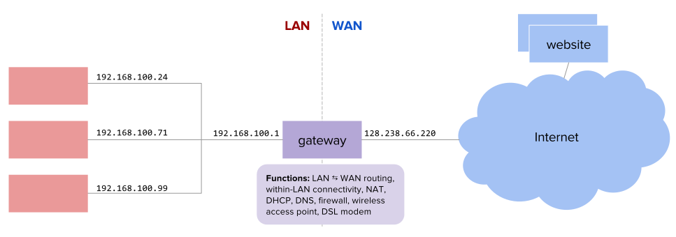
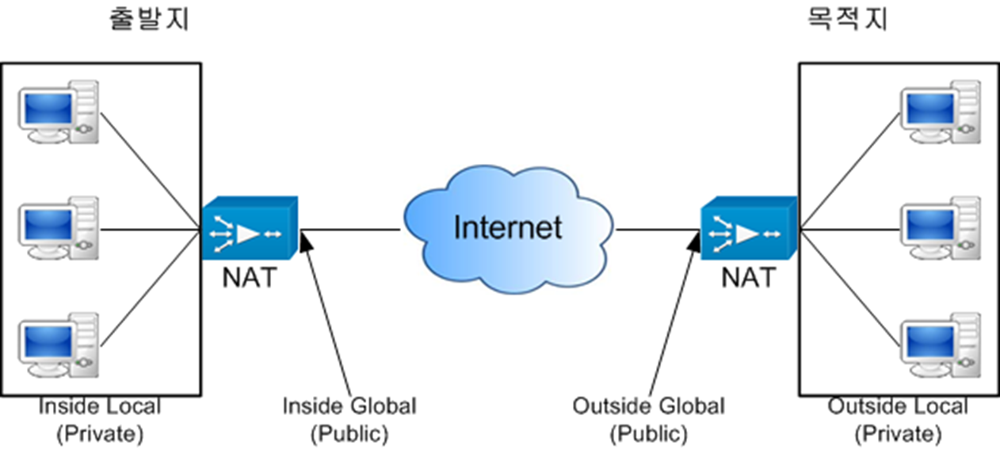
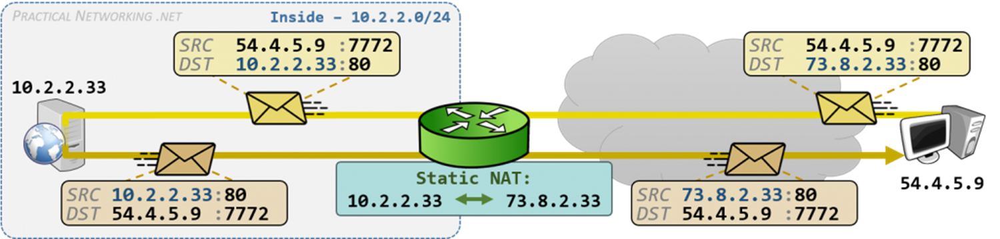
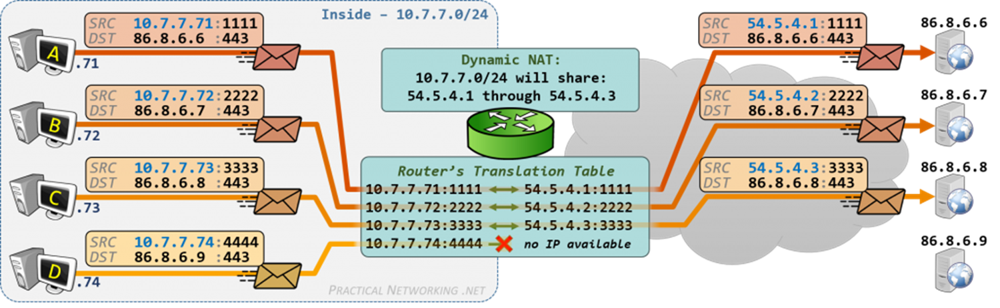
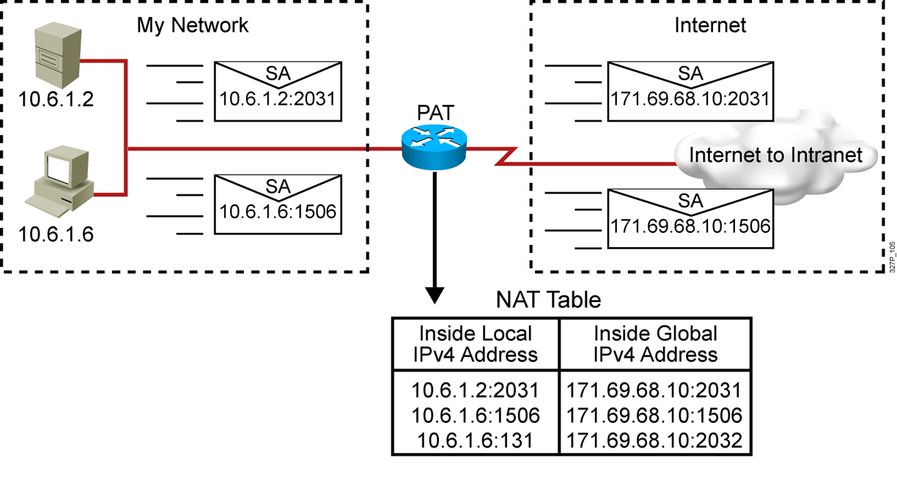

## 서브넷 마스크와, 게이트웨이에 대해 설명해 주세요.
### 서브넷 마스크
`서브넷 주소`(또는 `네트워크 주소`)를 `판별`하기 위해 `AND 연산`에 사용하는 `마스크`
- `네트워크 ID`의 모든 비트는 `1`, `호스트 ID`의 모든 비트는 `0`을 할당
	- ex) `11111111 11111111 00000000 00000000` (2진수) => `255.255.0.0` (10진수)
- `IP 주소`와 `서브넷 마스크`를 `AND 연산`하여 `네트워크 ID`를 계산
	- `AND 연산`시 주어진 IP에서 `네트워크 ID`의 모든 비트는 그대로 유지, 호스트 ID의 모든 비트는 0으로 설정
	- ex) IP 주소가 `202.31.150.75`, 서브넷 마스크가 `255.255.255.0`라고 하면, AND 연산시 `202.31.150.0`가 나옴. 이것이 `네트워크 ID`
#### CIDR 방식에서의 표기법(prefix)
서브넷 마스크에 포함된 비트 '1'의 수를 `/N`과 같은 형태로 표현
- `CIDR`에서, `서브넷 마스크`는 `왼쪽에서부터 연속적인 1비트`로 구성되는 것이 **`표준`** 이기 때문
```code
255.0.0.0
=> 11111111.00000000.00000000.00000000 
=> /8

255.255.0.0
=> 11111111.11111111.00000000.00000000 
=> /16
```
#### IP 주소
`IP 주소`는 `인터넷 상의 장치를 구분`하기 위한 `고유 식별 번호`
- *PC, 스마트폰과 같은 장치*에 할당되는게 아닌, `랜카드`와 같은 *각 장치의* `인터페이스`에 `할당`
	- 따라서 하나의 장치가 여러 인터페이스를 갖는 경우, 해당 수만큼 IP 주소 할당
		- ex) `라우터`는 여러 개의 인터페이스(`IP 여러개`), `PC`는 일반적으로 한 개의 인터페이스(`IP 1개`)
##### IP 주소 구성
`IPv4`의 경우 4Byte(32bit)의 길이를 갖는 주소
- 각 Byte 값을 10진수로 표기(0~255)
- IP는 `네트워크 부분`과 `호스트 부분`으로 나뉨
```code
IP 주소 = [ 네트워크 ID | 호스트 ID ]
```
- `네트워크 ID`
	- 각 `호스트가 속한 네트워크` 구분
- `호스트 ID`
		- *네트워크에서* 각 `호스트` 구분
##### IP 클래스
`IP 주소`를 `효율적으로 배정`하기 위해 도입된 개념으로, `5개의 클래스`로 IP를 나눔  
`첫 번째 바이트 값`을 `기준`으로 `클래스를 구분`하며, 뒤로 갈수록 각 클래스가 전체 IP 주소에서 차지하는 비율이 적어짐
- **`클래스 A`**
	- 첫 번째 바이트가 `0XXX XXXX`인 IP 주소
		- 즉, `0.0.0.0` ~ `127.255.255.255`까지의 IP 주소가 속함.
	- 서브넷 마스크는 `255.0.0.0`
		- `네트워크 ID | 호스트 ID | 호스트 ID | 호스트 ID`
- **`클래스 B`**
	- 첫 번째 바이트가 `10XX XXXX`인 IP 주소
		- 즉, `128.0.0.0` ~ `191.255.255.255`까지의 IP 주소가 속함.
	- 서브넷 마스크는 `255.255.0.0`
		- `네트워크 ID | 네트워크 ID | 호스트 ID | 호스트 ID`
- **`클래스 C`**
	- 첫 번째 바이트가 `110X XXXX`인 IP 주소
		- 즉, `192.0.0.0` ~ `223.255.255.255`까지의 IP 주소가 속함.
	- 서브넷 마스크는 `255.255.255.0`
		- `네트워크 ID | 네트워크 ID | 네트워크 ID | 호스트 ID`
- **`클래스 D`**
	- 첫 번째 바이트가 `1110 XXXX`인 IP 주소
		- 즉, `224.0.0.0` ~ `239.255.255.255`까지의 IP 주소가 속함.
	- `멀티캐스트`용으로 사용됨
- **`클래스 E`**
	- 첫 번째 바이트가 `1111 XXXX`인 IP 주소
		- 즉, `240.0.0.0` ~ `255.255.255.255`까지의 IP 주소가 속함.
	- 예비용/실험용으로 분류됨
#### 서브넷
`Subnetwork`의 준말로, IP 주소의 `같은 네트워크 ID`를 갖는 `인터페이스들의 집합`
- 하나의 서브넷은 하나의 `브로드캐스트 도메인`에 해당
- 하나의 서브넷은 `3계층 장치(Router)`를 `거치지 않고 통신` 가능
	- 즉, `브로드캐스트 메시지`를 보내면 `Router`에서는 바깥으로 더 전달되지 않지만, `같은 서브넷`에는 `메시지 전달`됨
	- 이러한 점을 통해, *`라우터를 제거`했을 때* `여전히 서로 연결된 인터페이스들`은 `같은 서브넷`임을 알 수 있음
### 게이트웨이

> 출처: [Basic home gateway services: DHCP, DNS, NAT (poly.edu)](https://witestlab.poly.edu/blog/basic-home-gateway-services-dhcp-dns-nat/)

서로 다른 통신망, 프로토콜 간에도 통신 할 수 있도록 연결해주는 기기.  
이름 그대로 네트워크 안팎으로 들어가는 관문 역할을 함.  
주로 `라우터`나, `멀티레이어 스위치` 같은 `3-계층(네트워크 계층)` 장비를 일컬으며, 라우터는 서브넷 간 통신을 위해 거치는 `기본 게이트(default gateway)`라고도 불림.  

## NAT에 대해 설명해 주세요.
`NAT(Network Address Translation)`이란 `IPv4 주소부족 문제`에 대한 대책 중 하나로, `사설 IP 주소`를 사용할 수 있도록 해 `공인 IP 주소 사용`을 `줄임`  
정확히는, `사설 주소`를 사용하는 장치가 `인터넷과 통신`할 때, `사설 IP 주소`를 `공인 IP 주소`로 `변환`해주는 기술
### 공인 주소 - 사설 주소
#### 공인 주소
인터넷과 같은 공중 네트워크에서 사용되는 IP.  
주소가 중복되면 안되며, 허가 받은 주소를 사용함.  
비용 발생  
#### 사설 주소
사설 네트워크 내에서만 사용됨.  
따라서 사설 네트워크가 다른 경우, 같은 주소를 사용해도 됨.  
비용이 발생하지 않음.  
### NAT의 장점
- 공인 IP주소 사용을 줄여, `주소비용 절감 가능`
- *사설 네트워크의 내부 IP주소를 `외부로부터 숨겨`*, 네트워크의 `보안성 향상`
	- 실제 IP를 알기 힘듦
### NAT의 단점
- `패킷 처리`에 `지연` 발생
- `패킷 추적`이 `어려움`
- 외부에서 `내부 사설망`으로 `접근이 어려움`
### NAT에 사용되는 주소

##### Inside Local
출발지 장치의 NAT 변환 전 주소로, `내부 컴퓨터들`이 실제 `사용하는 주소`(`사설 IP`)
##### Inside Global
출발지 장치의 NAT 변환 후 주소로, `내부 컴퓨터들`이 외부로 나갈 때 `변환할 주소`(`공인 IP`)
##### Outside Global
목적지 장치의 NAT 외부 주소로, `목적지 컴퓨터가 사용`하는 `공인 IP`
##### Outside Local
목적지 장치의 NAT 내부 주소로, `목적지 컴퓨터의 실제 주소` (`사설 IP`)
### NAT의 유형
#### 정적 NAT

- 사설 IP주소와 공인 IP주소가 1:1로 매칭됨. 즉, 내부 컴퓨터 수 만큼 공인 IP가 필요(1:1 할당)
	- 즉, `Inside Local`과 `Inside Global`간 1:1 매칭
- 호스트가 고정된 Global 주소를 가져야 할 때, 외부에서 내부 사설망을 접속하고자 할 때 사용
#### 동적 NAT

- 사용 가능한 공인 IP 풀이 있으며, 인터넷과 통신하고자 할 때 내부 컴퓨터에게 동적으로 할당함.
- 공인 IP 수 만큼의 내부 컴퓨터한테만 동시 할당 가능(1:1 할당)
#### NAT 오버로딩(Overloading) = PAT (Port Address Translation)

- `IP 주소`와 `TCP/UDP의 포트 번호`를 이용해 주소 변환.
	- 따라서 하나의 공인 IP를 여러 컴퓨터가 공유하여 사용(1:N 할당)
	- **이론적으로** `64000개`의 `사설 IP`를 `하나`의 `공인 IP`로 사용 가능
- 공인 IP 수가 내부 컴퓨터가 적어도 사용 가능
## 서브넷 마스크의 표현 방식에 대해 설명해 주세요.
### 비트 형태
`11111111 11111111 00000000 00000`와 같이 32bit 비트값을 표기하는 방식
### 10진수 형태
`255.255.0.0`와 같이 10진수 형태로 비트값을 표기하는 방식
### CIDR 형태(prefix)
`/16`과 같이 왼쪽에서부터 몇개의 1비트가 연속되는지 표기하는 방식
## 그렇다면, 255.0.255.0 같은 꼴의 서브넷 마스크도 가능한가요?
- 이전엔 `가능`했지만, **현재**에는 **`불가능`** 함.
	- IP 주소가 `Classful` 할 당시에는 이론적으로 가능은 했음
		- [RFC 950: Internet Standard Subnetting Procedure](https://www.rfc-editor.org/rfc/rfc950)
			- Since the bits that identify the subnet are specified by a bitmask, they need not be adjacent in the address.  However, we recommend that the subnet bits be contiguous and located as the most significant bits of the local address.
			- => `서브넷`을 식별하는 `비트마스크`는 꼭 *주소에 인접할 필요는 없지만*, `로컬 주소(호스트 ID)`의 `가장 중요한 비트(MSB, 가장 왼쪽의 비트)`와 인접해 위치하는 것이 좋습니다.
		- 즉, 꼭 `왼쪽에서부터 연속된 1`로 구성된 마스크를 `사용하지 않아도 됨`
	- 하지만 이는 **`서브넷 연산`을 `복잡`** 하게 만들며, **통용되는 방식도 아니므로** 네트워크 기기들이 이들을 지원하지 않아 현실적으로 사용은 어려움.
	- 이후 1993년 `CIDR`가 등장해 `Classful`한 형태를 대체하면서, `비연속적인 서브넷`은 공식적으로 `비표준이` 됨
		- [RFC 4632 - Classless Inter-domain Routing (CIDR): The Internet Address Assignment and Aggregation Plan (ietf.org)](https://datatracker.ietf.org/doc/html/rfc4632)
			- ...The only outstanding constraint is that the mask must be left contiguous
			- => ...유일한 제약조건은 마스크가 `왼쪽에서부터 연속적인 형태`여야 한다는 것입니다.
	 - 따라서 공식적으로 이처럼 `non-contiguous`한 형태는 허용되지 않음.
# 참고
-  [Basic home gateway services: DHCP, DNS, NAT (poly.edu)](https://witestlab.poly.edu/blog/basic-home-gateway-services-dhcp-dns-nat/)
- [RFC 950: Internet Standard Subnetting Procedure](https://www.rfc-editor.org/rfc/rfc950)
- [RFC 1519 - Classless Inter-Domain Routing (CIDR): an Address Assignment and Aggregation Strategy (ietf.org)](https://datatracker.ietf.org/doc/html/rfc1519)
- [RFC 4632 - Classless Inter-domain Routing (CIDR): The Internet Address Assignment and Aggregation Plan (ietf.org)](https://datatracker.ietf.org/doc/html/rfc4632)
- 전공과목 강의자료