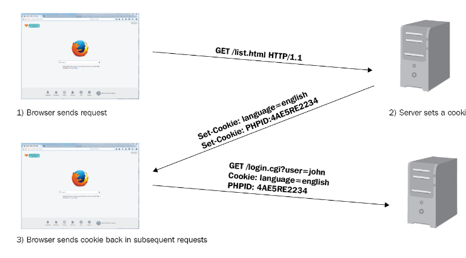
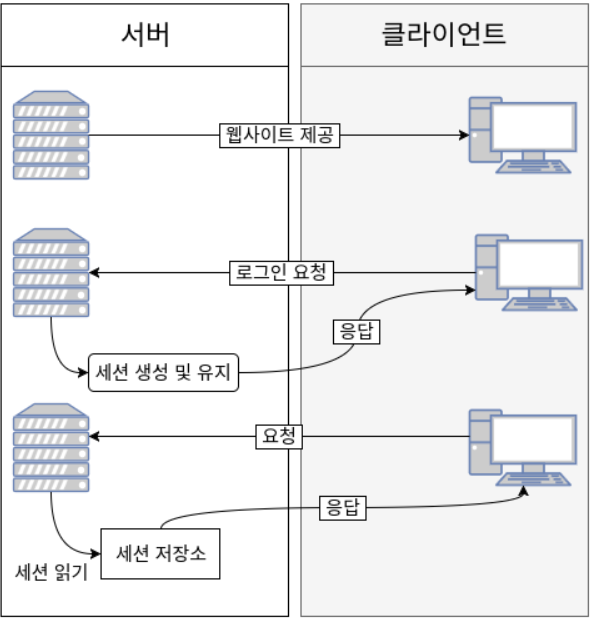
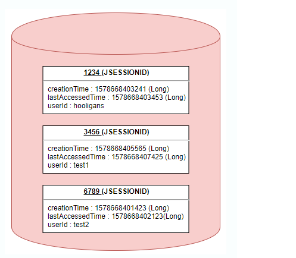
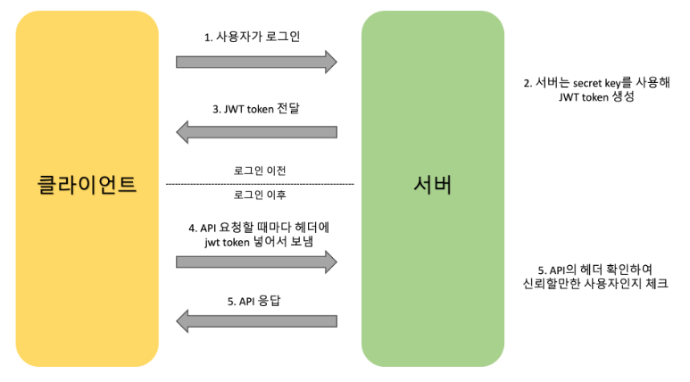

# Cookie & Session

## http 특징 

### connetionless

- 클라이언트가 서버에 요청을 하고 응답을 받으면 연결을 바로 끊어 서버의 자원을 효율적으로 관리한다
- 연결할 때 마다 TCP/IP 연결을 새로하여 3-way handshake에 따른 시간을 소요한다

### stateless

- 서버가 클라이언트의 이전 상태를 기억하지 않는다
- 로그인 같은 기능들은 stateless로 구현하지 못해 cookie나 session을 사용한다

---

## Cookie 

### cookie란?

- key-value 형식으로 클라이언트의 브라우저에 저장되는 데이터이다

### cookie 인증 방식

1.  클라이언트가 서버에 접속 요청
2.  서버에서 클라이언트 응답, 필요한 데이터 브라우저 `cookie`에 저장
3.  클라이언트에서 요청을 보낼때 저장된 `cookie`를 헤더에 담아 보냄
4.  서버는 헤더에 있는 `cookie` 데이터로 클라이언트 식별

### cookie의 단점

- 데이터를 있는 그대로 보내기 때문에 보안에 취약하다
- 하나의 쿠키는 4Kb까지 저장가능하기 때문에 큰 데이터는 저장할 수 없다
- 웹 브라우저마다 지원 방식이 달라 브라우저간 공유를 할 수 없다

---

## Session 

### session이란?

- 쿠키의 보안 문제로 서버에서 데이터를 저장하는 방식이다

### sesssion 인증 방식(ex)로그인)

 

1.  클라이언트에서 서버에 로그인 요청을 하면 session object를 만들고 `session id`를 보내줌
2.  브라우저 쿠키에 `session id`를 저장함
3.  클라이언트에서 서버에 보내는 모든 요청에 `session id`를 담아 보냄
4.  서버는 클라이언트에서 보낸 `session id`와 서버 메모리에 있는 `session id`를 비교하여 인증함

<code> ※session object</code> 

> - session 세션 객체는 Key에 해당하는 SESSION ID와 이에 대응하는 Value로 구성되어 있다 
> - Value에는 세션 생성 시간, 마지막 접근 시간 및 User가 저장한 속성 등 이 Map 형태로 저장된다

### session의 단점

- `session id`에는 유의미한 데이터는 없지만 `session id` 자체를 탈취당하면 클라이언트로 위장이 가능하다
- 서버에 저장소가 있으므로 요청이 많으면 서버의 부하가 심해진다

---

## 번외

## Token

### JWT(json web token)이란 ?

- 객체 인증에 필요한 정보를 비밀키로 서명한 토큰이다
- 인증(Authentication) & 권한허가(Authorization) 방식이다
- 서버에서는 키를 클라이언트에서 정보를 저장한다
- cookie/session보다 데이터 자체가 길어 인증 요청에 부하가 더 많다

### jWT 인증 방식

1. 클라이언트에서 로그인
2. 서버의 `secret key`로 `jwt token` 생성, 전달
3. 서버에 요청할 때 헤더에 `jwt token`을 함께 전달
4. 서버에서 인증
