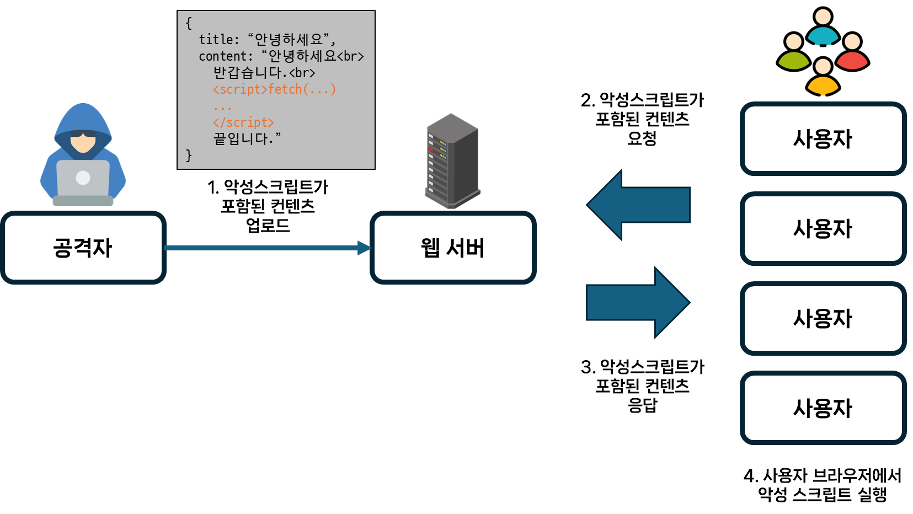
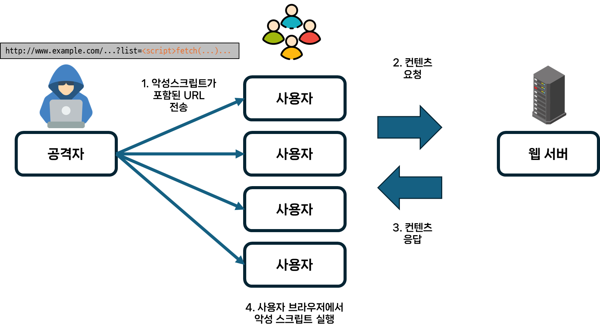

## XSS에 대해서 설명해 주세요.
신뢰할 수 있는 웹 사이트에 **악성코드를 삽입하는 공격**을 말합니다.  
공격자가 표적 웹사이트의 콘텐츠에 악성 스크립트를 삽입하고, 피해자의 브라우저에 전달되는 동적 콘텐츠에 이를 포함시키므로써 피해를 입게 됩니다.  
이때, 피해자의 브라우저는 해당 스크립트가 **'신뢰할 수 없는 스크립트'라는 점**을 *알 수 없어* **해당 스크립트를 실행**하게 됩니다.  
악성 스크립트는 *피해자의 브라우저가 보유한* 해당 사이트에서 사용되는 **모든 쿠키, 저장소에 저장된 민감 정보에 액세스**할 수 있습니다.  
뿐만 아니라 **멀웨어**를 퍼뜨리거나, 웹사이트의 콘**텐츠를 변조**하거나,**피싱 사이트로 이동**시키거나 하는 등의 공격도 가능합니다.  
다른 웹 공격들과 달리, *애플리케이션 자체가 아닌* **웹 애플리케이션 사용자를 표적**으로 삼는다는 특징이 있습니다.  
### XSS 공격의 종류
#### `저장형 크로스사이트 스크립팅(Stored Cross-site Scripting)`



`지속적(Persistent) XSS`라고도 하는 공격 방식입니다.  
사용자가 입력한 값이 저장(주로 게시판)된 후 이를 웹 페이지에서 출력할때 피해가 발생하는 공격입니다.  
공격자의 악성스크립트가 서버에 저장되어 불특정 다수를 대상으로 공격에 이용될 수 있어 Reflected XSS보다 공격 대상의 범위가 훨씬 크다는 특징이 있습니다.  
##### 공격 방식
공격자가 스크립트가 포함된 **콘텐츠**(**게시글, 댓글, 사용자 이름 등**)를 작성한 뒤, 이를 피해자가 요청하게 되면 해당 스크립트가 **피해자 측에서 동작**하게 됩니다.
#### `반사 크로스사이트 스크립팅(Reflected cross-site scripting)`



`비지속적(Non-Persistent) XSS`라고도 하는 공격 방식입니다.  
이름에 포함된 '반사' 라는 단어처럼, **사용자가 요청**한 스크립트가 사용자 측에서 반사되어 동작합니다. 즉, 공격자의 스크립트가 별도의 저장소에 저장되지 않고 **사용자 측에서 즉시 동작**합니다.  
*지속적 XSS와 달리*, **공격자가** 각 피해자들에게 페이로드(악성스크립트)를 **전달**해주어야 합니다. 따라서 악성 링크, 피싱 이메일, SNS 등을 이용해 해당 페이로드가 포함된 URL을 **클릭하도록 유도**해야 합니다.  
##### 공격 방식
공격자가 **악성스크립트가 웹서버로 전송되는 요청(URL)의 일부**가 되도록 합니다. 요청과 함께 포함되어있던 악성 스크립트가 **사용자의 브라우저에서 동작**하게 됩니다.  
#### `DOM 기반 크로스사이트 스크립팅(DOM-based cross-site scripting)`


공격자의 스크립트가 HTML 내부가 아닌, **`DOM`에 나타나는 공격 방식**입니다.  
반사/저장형 XSS에서는 응답 페이지에서 스크립트를 확인할 수 있는것과 다르게 HTML 소스 코드와 응답 페이지의 코드가 동일하기 때문에 페이로드를 찾을 수 없습니다.  
따라서 **런타임일때**, 또는 **페이지의 DOM을 조사**해야만 스크립트를 찾을 수 있습니다.  
DOM 기반 XSS는 주로 **Client-side 공격**으로, 악성 스크립트는 서버로 전송되지 않습니다. 따라서 **서버 로그를 분석해도 공격을 확인할 수 없습니다.**  
##### 공격 방식
공격자가 악성스크립트가 포함된 URL을 요청하면, 해당 **스크립트를 실행해 DOM 영역을 변경**합니다. 브라우저 자체에서 스크립트가 실행되어 DOM 영역을 변화시키므로 서로 패킷을 보내지 않고 공격이 수행됩니다.  
주로 `document`, `location`와 같은 **DOM 객체를 조작**해 공격을 수행합니다.  
## CSRF랑 XSS는 어떤 차이가 있나요?
`크로스-사이트 요청 위조(Cross-site Request Forgery)`와 `크로스-사이트 스크립팅(Cross-site Scripting)` 모두 **웹 애플리케이션**에서 발견되는 보안 취약점입니다.  
두 공격 방식의 가장 큰 차이는 **`인증된 세션(쿠키 등)`을 활용하느냐** 여부 입니다.  
 `CSRF 공격`은 사용자의 **인증된 세션을 악용**하는 공격 방식이고, `XSS 공격`은 사용자가 **특정 사이트를 신뢰한다는 사실을 이용**해 인증된 세션 없이도 공격할 수 있는 공격 방식입니다.  

| CSRF                               | XSS                                        |
| ---------------------------------- | ------------------------------------------ |
| 사용자가 공격 사실을 모르는채 대상 웹사이트에 **악성 요청**을 보내도록 합니다.    | 웹 사이트에 클라이언트 측 **스크립트를 삽입**해 공격합니다. |
| 공격을 수행하기 위해 Javascript가 필요하지 않습니다. | 공격을 수행하기 위해 **Javascript가 필요**합니다.             |
| 악성 스크립트가 **다른 사이트에 저장**되어 있습니다.        | 웹 사이트가 **악성 스크립트를 허용**합니다.                     |
| 취약한 **URL에서 수행하는 작업만 수행**할 수 있습니다.     | 공격자가 취약점을 이용해 **원하는 모든 행동**을 할 수 있습니다.         |

## XSS는 프론트엔드에서만 막을 수 있나요?
XSS 공격은 *프론트엔드 뿐만 아니라*, **백엔드단에서도 방어**할 수 있습니다.  
프로그래밍 언어와 웹 프레임워크 별로 방어 할 수 있는 방법들이 다양하지만, 해당 방법들의 **주요 전략**은 `'사용자 입력 값을 전처리한다'`입니다.  
스크립트에서 자주 사용되는` <, >, (, )` 와 같은괄호를 HTML로 바꾼다거나, [Lucy-XSS-Filter](https://github.com/naver/lucy-xss-filter), [OWASP ESAPI](https://github.com/ESAPI/esapi-java-legacy)와 같은 라이브러리를 사용해 방어할 수 있습니다.  
또한, Spring에서는 `Spring Security`에서 제공하는 `X-XSS-Protection` 헤더를 사용할 수도 있습니다.  
### `X-XSS-Protection`
브라우저에게 **XSS 공격처럼 생긴 스크립트를 차단**하도록 지시합니다.  
해당 기능을 사용하면 브라우저는 XSS 공격을 감지했을때 이를 렌더링하지 않지만, 일부 웹 브라우저는 이에 필요한 `XSS 감사기(Auditor)`를 구현하지 않아 해당 헤더를 사용할 수 없습니다. 이를 보완하기 위해 `콘텐츠 보안 정책(CSP)` 기능을 사용할 수도 있습니다.  
- 다만, 구글에서는 [2019년 8월 XSS 감사기를 삭제](https://www.chromium.org/developers/design-documents/xss-auditor/)했습니다.
	- 지난 수 년 동안 XSS 감사기에 대한 **수많은 우회 방법**들이 제시되었고, 합**법적인 사이트에 대한 액세스를 차단**하는 경우도 존재했기 때문에 구글에서는 이를 삭제했습니다.
	- 이후 DOM 기반 XSS 공격에 대한 방어책인 [Trusted Types API](https://developer.mozilla.org/en-US/docs/Web/API/Trusted_Types_API) 를 도입했습니다.
#### `콘텐츠 보안 정책(CSP)`
CSP는 XSS와 데이터 인젝션 공격을 완화하는데 도움을 주는 **추가 보안 계층**입니다. 이를 사용하려면 Content-Security-Policy 헤더를 반환하도록 애플리케이션을 구성해야 합니다.
```java
@Configuration
public class SecurityConf {

    @Bean
    public SecurityFilterChain filterChain(HttpSecurity http) throws Exception {
        http.headers(headers ->
                headers.xssProtection(
                        xss -> xss.headerValue(XXssProtectionHeaderWriter.HeaderValue.ENABLED_MODE_BLOCK)
                ).contentSecurityPolicy(
                        cps -> cps.policyDirectives("script-src 'self'")
                ));
        return http.build();
    }
}
```

## 참고 문서
- [What is a Cross-Site Scripting attack? Definition & Examples (kaspersky.com)](https://usa.kaspersky.com/resource-center/definitions/what-is-a-cross-site-scripting-attack)
- [보안뉴스 - 웹 취약점과 해킹 매커니즘#7 XSS(Cross-Site Scripting) 상세화면 | 한국재정정보원 > 주요사업 > 사이버안전센터 운영 > 사이버위협 정보 및 통계 > 보안뉴스 (fis.kr)](https://www.fis.kr/ko/major_biz/cyber_safety_oper/attack_info/security_news?articleSeq=3408)
- [What is DOM-based XSS (cross-site scripting)? Tutorial & Examples | Web Security Academy (portswigger.net)](https://portswigger.net/web-security/cross-site-scripting/dom-based)
- [Difference between XSS and CSRF - GeeksforGeeks](https://www.geeksforgeeks.org/difference-between-xss-and-csrf/)
- [X-XSS-Protection - HTTP | MDN (mozilla.org)](https://developer.mozilla.org/en-US/docs/Web/HTTP/Headers/X-XSS-Protection)
- [Prevent Cross-Site Scripting (XSS) in a Spring Application | Baeldung](https://www.baeldung.com/spring-prevent-xss)
- [구글, 크롬의 XSS 오디터 삭제할 계획 - 데일리시큐 (dailysecu.com)](https://www.dailysecu.com/news/articleView.html?idxno=55207)
- [Trusted Types API - Web APIs | MDN (mozilla.org)](https://developer.mozilla.org/en-US/docs/Web/API/Trusted_Types_API)
- [21. Security HTTP Response Headers (spring.io)](https://docs.spring.io/spring-security/site/docs/5.0.x/reference/html/headers.html#headers-xss-protection)