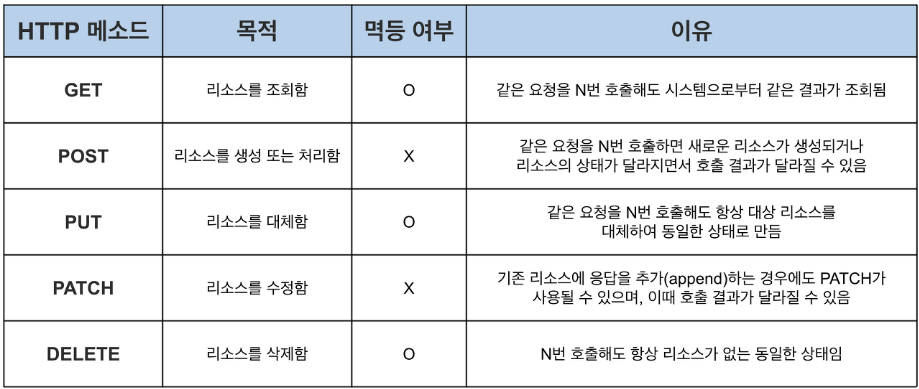

## HTTP Method 종류

- `GET` : 특정 리소스의 표시를 요청한다(주로 조회하는데 사용 됨)
- `HEAD` : GET method 와 같은 요청과 동일한 응답을 요구하지만, 응답에 body를 포함하지 않는다
- `POST` : 서버에 엔티티를 생성하거나 데이터를 제출한다
- `PUT` : 요청한 리소스를 전송된 엔티로 교체하거나 새로 생성한다
- `PATCH` : 리소스의 부분만을 수정하는데 사용한다
- `DELETE` : 특정 리소스를 삭제한다
- `CONNECT` : 클라이언트와 서버간의 터널을 설정하기 위해 사용한다
- `OPTIONS` 목적 리소스의 통신을 설정하는데 사용한다
- `TRACE` : 목적 리소스의 경로를 따라 loop-back 테스트를 한다(요청을 그대로 반환)

## HTTP Method의 멱등성에 대해 설명해 주세요.

HTTP의 멱등성의 필요성은 요청의 재시도 때문이다 
처리 중간에 연결이 끊어졌을 경우에 요청을 다시한다면 멱등성이 있는 요청이 아니라면 무지성으로 재시도 요청을 할 경우 오류가 발생할 수 있다

멱등성 : 연산을 여러 번 하더라도 결과가 달라지지 않는 성질

---

## GET과 POST의 차이는 무엇인가요?

1. 데이터 전송 방식

- `GET` : URL에 쿼리 매개변수를 통해 전송한다
- `POST` : body에 데이터를 포함시켜서 전송한다

2. 데이터 보안

- `GET` : URL에 데이터를 노출함으로 보안에 취약하다
- `POST` : body에 포함시켜 전송함으로 상대적으로 안전하다

3. 데이터 길이 제한한다

- `GET` : 일반적으로 2KB 제한한다
- `POST` : 길이 제한 없다

4. 캐싱

- `GET` : 캐싱이 가능하여 동일한 GET요청을 보내면 서버에서 캐시하여 처리 속도를 높일 수 있다
- `POST` : 캐싱을 할 수 없다(매번 새로운 데이터를 전송)

## POST와 PUT, PATCH의 차이는 무엇인가요?

- `POST` : 새로운 리소스를 생성할 때 사용한다
- `PUT` : 특정 리소스를 생성하거나 수정할 때 사용한다(리소스 대체)
- `PATCH` : 리소스의 일부를 수정하거나 업데이트 할 떄 사용한다

> [POST와 PUT을 비교했을 때 POST를 사용하는 이유]
>
> 새로운 리소스를 생성할때 서버에서 자동으로 리소스 식별자 생성가능 
> POST는 멱등성이 없기 때문에 항상 새로운 리소스를 생성한다

## HTTP 1.1 이후로, GET에도 Body에 데이터를 실을 수 있게 되었습니다. 그럼에도 불구하고 왜 아직도 이런 방식을 지양하는 것일까요?

- GET의 body에 데이터를 싣는다면 캐싱을 효과적으로 사용할 수 없다
- URL에 파라미터를 포함해서 전송하기 때문에 로그파일이나 히스토리에 기록될 수 있다 따라서 보안상 취약할 수 있다
