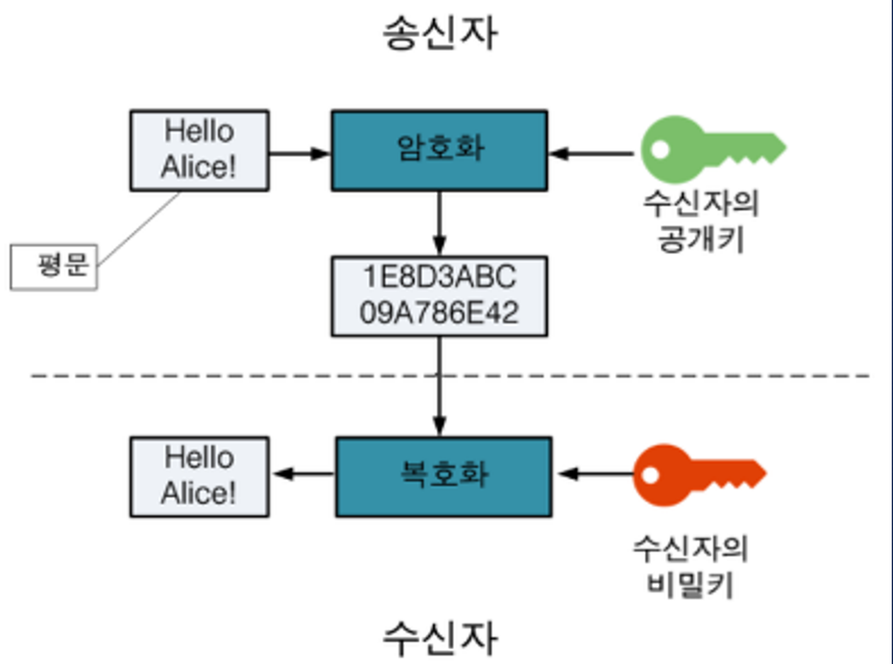
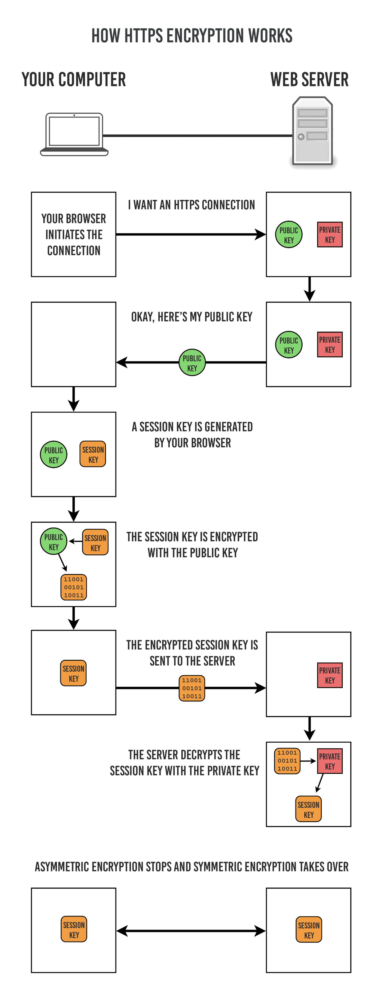
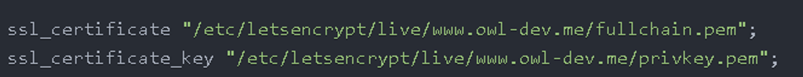

# HTTP
> - HyperText Transfer Protocol
> - 웹 상에서 클라이언트와 서버간에 요청/응답(request/respoonse)으로 정보를 주고 받을 수 있는 프로토콜

> - 주로 HTML 문서를 주고받는 데에 쓰인다.
> - TCP와 UDP를 사용하여 `80번 포트`를 사용한다.
> - 비연결(Connectionless)
>   - 클라이언트가 요청을 서버에 보내고 서버가 적절한 응답을 클라이언트에 보내면 바로 연결이 끊긴다.
> - 무상태(Stateless)
>   - 연결을 끊는 순간 클라이언트와 서버의 통신은 끝나며 상태 정보를 유지하지 않는다.

```text
하지만 HTTP는 암호화가 되지 않은 평문 데이터를 전송하는 프로토콜이기 때문에, HTTP로 비밀번호나 주민등록번호 등을 주고 받으면 제 3자가 정보를 조회할 수 있다.
이러한 문제를 해결하기 위해 HTTPS가 등장하게 되었다.
```

# HTTPS
> - HyperText Transfer Protocol over Secure Socket Layer
> - 웹 통신 프로토콜인 HTTP의 보안이 강화된 버전의 프로토콜

> - HTTPS의 기본 TCP/IP 포트로 `443번 포트`를 사용한다.
> - HTTPS는 소켓 통신에서 일반 텍스트를 이용하는 대신에, 웹 상에서 정보를 암호화하는 SSL이나 TLS 프로토콜을 통해 세션 데이터를 암호화한다.

## HTTPS 전환의 중요성
### 보안
> - HTTPS는 HTTP와 달리 모든 데이터를 암호화된 형태로 전송한다.

### SEO(검색 엔진 최적화)
> - 구글은 HTTPS를 순위 결정 신호로 사용하고 있다.
> - HTTPS를 사용하지 않으면 검색 결과에서 하단으로 밀려나게 된다.
> - 또한, HTTPS를 사용하지 않을 경우 URL 창에 `안전하지 않음` 경고가 뜬다.
>   - http://speller.cs.pusan.ac.kr/

## HTTPS의 원리
### 대칭키 암호화와 비대칭키(공개키) 암호화
> - HTTPS는 대칭키 암호화 방식과 비대칭키 암호화 방식을 모두 사용하고 있다.
> - 대칭키 암호화
>   - 클라이언트와 서버가 동일한 키를 사용해 암호화/복호화를 진행한다.
>   - 키가 노출되면 매우 위험하지만 연산(암호화/복호화) 속도가 빠르다.
> - 비대칭키 암호화
>   - 1개의 쌍으로 구성된 공개키와 개인키를 암호화/복호화하는데 사용한다.
>   - 키가 노출되어도 비교적 안전하지만 연산 속도가 느림
>   - 공개키 암호화 : 공개키로 암호화를 하면 개인키로만 복호화할 수 있다.
>   - 개인키 암호화 : 개인키로 암호화를 하면 공개키로만 복호화할 수 있다.
>   - 

### HTTPS의 동작 과정
> - HTTPS는 대칭키 암호화와 비대칭키 암호화를 모두 사용하여 빠른 연산 속도와 안정성을 모두 얻고 있다.
> - HTTPS 연결 과정(HandShake)에서는 먼저 서버와 클라이언트 간에 `세션키`를 교환한다.
>   - 세션키는 주고 받는 데이터를 암호화하기 위해 사용되는 `대칭키`이며, 데이터간의 교환에는 빠른 연산 속도가 필요하므로 세션키는 대칭키로 만들어진다.
> - 세션키를 클라이언트와 서버가 교환할 때, 비대칭키가 사용된다.
>   - 처음 연결을 성립하여 안전하게 세션키를 공유하는 과정에서 비대칭키가 사용되고, 이후에 데이터를 교환하는 과정에서 빠른 연산 속도를 위해 대칭키가 사용된다.
> - 
> - 1. 클라이언트(브라우저)가 서버로 최초 연결 시도
> - 2. 서버는 공개키(인증서)를 브라우저에게 넘겨줌
> - 3. 브라우저는 인증서의 유효성을 검사하고 세션키를 발급함
> - 4. 브라우저는 세션키를 보관하며 추가로 서버의 공개키로 세션키를 암호화하여 서버를 전송함
> - 5. 서버는 개인키로 암호화된 세션키를 복호화하여 세션키를 얻음
> - 6. 클라이언트와 서버는 동일한 세션키를 공유하므로 데이터를 전달할 때 세션키로 암호화/복호화를 진행함

### 비대칭키 발급 과정
> - 추가로 서버가 비대칭키를 발급받는 과정을 살펴봐야 한다.
> - 서버는 클라이언트와 세션키를 공유하기 위한 공개키를 생성해야 하는데, 일반적으로 인증된 기관(Certificate Authority)(Lets Encrypt)에 공개키를 전송하여 인증서를 발급받는다.
> - 
> - fullchain.pem
>   - 서버의 공개키를 포함하고 있으며, SSL/TLS 인증서의 전체 체인을 포함한다.
>   - 일반적으로 이 파일에는 도메인을 위한 인증서와 중간 인증기관의 인증서가 포함되어 있다.
>   - 인터넷을 통해 안전하게 공유될 수 있으며, SSL/TLS 암호화 프로세스에서 서버의 신원을 확인하는 데 사용된다.
> - privkey.pem
>   - 서버의 개인키를 포함한다.
>   - 개인키는 SSL/TLS 통신에서 서버가 클라이언트로부터 받은 암호화된 데이터를 해독하는 데 사용된다.
1. A기업은 HTTP 기반의 어플리케이션에 HTTPS를 적용하기 위해 공개키/개인키를 발급한다.
2. CA기업에게 돈을 지불하고, 공개키를 저장하는 인증서의 발급을 요청한다.
3. CA기업은 CA기업의 이름, 서버의 공개키, 서버의 정보 등을 기반으로 인증서를 생성하고, CA기업의 개인키로 암호화하여 A기업에게 이를 제공한다.
4. A기업은 클라이언트에게 암호화된 인증서를 제공한다.
5. 클라이언트는 CA기업의 공개키를 미리 다운받아 가지고 있어, 암호화된 인증서를 복호화한다.
6. 암호화된 인증서를 복호화하여 얻은 A기업의 공개키로 세션키를 공유한다.

---
## 왜 HTTPS Handshake 과정에서는 인증서를 사용하는 것 일까요?
### 서버 신원 확인
> - 클라이언트가 접속하려는 서버가 신뢰할 수 있는 서버인지 확인하기 위해 인증서를 사용
> - 인증서에는 서버의 신원 정보와 공개키가 포함되어 있으며, CA(인증기관)가 이를 서명하여 서버의 신뢰성을 보증

### 데이터 암호화
> - 클라이언트와 서버 간에 주고받는 데이터를 암호화하여 중간에서 누군가가 데이터를 도청하거나 변조하지 못하도록 함
> - 인증서에 포함된 서버의 공개키는 클라이언트가 세션키를 암호화하여 서버로 안전하게 전달하는 데 사용
> - 서버는 자신의 개인키로 세션키를 복호화하고, 이후 통신은 이 세션키를 사용하여 암호화된 상태로 이루어진다.

### 무결성 보장
> - 클라이언트가 인증서를 검증할 때, 인증서가 CA의 서명으로 보호되어 있는지 확인
>   - 인증서가 위조되지 않았음을 보장

## SSL과 TLS의 차이는 무엇인가요?
> - SSL은 초기의 인터넷 보안 프로토콜로, 현재는 보안 취약점으로 인해 더 이상 사용이 권장되지 않음
> - TLS는 SSL을 대체하는 프로토콜로, 현재 인터넷 보안의 표준으로 SSL의 업데이트 버전
> - SSL이 너무 암호화된 통신을 의미하는 일반적인 용어로 자리잡았기 때문에 편의상 SSL이라고 부름