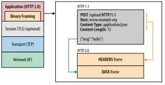

## HTTP/1.1과 HTTP/2의 차이점은 무엇인가요?
### HTTP/1.1
`HTTP/1.1`은 1997년 `HTTP/1.0`의 모호한 부분을 개선하고 표준을 명확히 하고자 등장했습니다.
`HTTP/1.1`은 다음과 같은 특징을 갖고있습니다.
- `커넥션을 재사용` 할 수 있게 되었습니다.
	- 따라서 동일한 문서에 포함된 자원을 표시하고자 여러번 커넥션을 열 필요가 없게 되었습니다.
- `파이프라이닝`이 추가되었습니다.이미지 출처: [HTTP/1.x의 커넥션 관리 - HTTP | MDN](https://developer.mozilla.org/ko/docs/Web/HTTP/Connection_management_in_HTTP_1.x)
	- 따라서 첫 번째 요청에 대한 응답이 완전히 전송되기 전, 두 번째 요청을 보낼 수 있게 되어 통신 지연 시간이 단축되었습니다.
- [`청크 응답`](https://en.wikipedia.org/wiki/Chunked_transfer_encoding)이 지원됩니다.
	- 응답으로 보낼 데이터가 클 때, 이를 작은 `청크`들로 분할해 순차적으로 전송하는 방법을 말합니다.
- 추가 `캐시 제어 메커니즘`이 도입되었습니다. [#](https://developer.mozilla.org/en-US/docs/Web/HTTP/Caching)
	- 경과한 시간을 기록해 캐시의 수명을 지정하는 `max-age` 프로퍼티가 `Cache-Control` 헤더에 추가됨
- 언어, 인코딩, 타입 등을 포함하는 `콘텐츠 협상`이 도입 되었습니다.이미지 출처: [Content negotiation - HTTP | MDN](https://developer.mozilla.org/en-US/docs/Web/HTTP/Content_negotiation)
	- 이는 동일한 URI에 대해 다양한 리소스 표현을 제공하는 경우, 서버에서 최적의 콘텐츠를 고르는데 반영할 수 있는 `표준 헤더 목록`을 포함합니다.
		- 헤더로는 `Accept`, `Accept-Encoding`, `Accept-Language` 등이 있습니다.
	- 따라서 클라이언트와 서버가 교환할 콘텐츠에 대해 합의가 가능해졌습니다.
- `호스트 헤더`를 통해 동일한 IP 주소에서 다른 도메인을 호스팅할 수 있게 되었습니다.

HTTP/1.1는 이후에도 [RFC 2616](https://datatracker.ietf.org/doc/html/rfc2616)(1999), [RFC 7230](https://datatracker.ietf.org/doc/html/rfc7230)-[RFC 7235](https://datatracker.ietf.org/doc/html/rfc7235)(2014) 와 같은 개선을 겪으며 유지 되었습니다.

### HTTP/2
현대 웹 애플리케이션들이 복잡해지고 크기가 커짐에 따라 더 많은 HTTP 요청이 필요해졌고, 이들을 해결하고자 Google이 2010년`SPDY`라는 프로토콜을 구현했습니다.
`HTTP/2`는 `SPDY`를 기반으로 2015년 등장했으며, `HTTP/1.1`과 다음과 같은 차이가 존재합니다.
- 텍스트 기반이 아닌, `이진(Binary)` 프로토콜입니다. 이미지 출처: [HTTP/2 소개  |  Articles  |  web.dev](https://web.dev/articles/performance-http2?hl=ko)
	- `HTTP/1.1`은 텍스트 기반이기 때문에 `ASCII 코드`로 작성되어 사람이 읽고 쓸 순 있었지만, 데이터가 커지는 문제가 존재했습니다.
	- 반면 `HTTP/2.0`은 이진 데이터를 전송하기 때문에 데이터를 수동으로 읽고 생성할 순 없지만, 단순 텍스트를 전송하는 것 보다 훨씬 효율적으로 데이터를 전송할 수 있습니다.
- `요청/연결 다중화`를 지원하는 `멀티플렉싱` 프로토콜입니다.
	- `HTTP/1.1`에선 `한 번에 하나`의 요청만 `처리`하며, `요청 순서를 지켜야` 했습니다.
	- 반면 `HTTP/2`에서는 `동일한 TCP 연결`을 통해 `병렬로 요청`할 수 있습니다.이미지 출처: [HTTP/2 소개  |  Articles  |  web.dev](https://web.dev/articles/performance-http2?hl=ko)
		- 이는 `TCP 연결`을 `스트림`, `메시지`, `프레임`이라는 단위로 세분화했기 때문입니다.이미지 출처: [HTTP/2 소개  |  Articles  |  web.dev](https://web.dev/articles/performance-http2?hl=ko)
		- 이를 통해 `HTTP/1.1`에서 발생하던 `HOL Blocking` 문제를 해결할 수 있었습니다.
- `헤더 필드 압축`을 지원합니다.이미지 출처: [HTTP/2 소개  |  Articles  |  web.dev](https://web.dev/articles/performance-http2?hl=ko)
	- [`HPACK(RFC-7541)`](https://httpwg.org/specs/rfc7541.html)이라고도 부르며, 헤더들이 딕셔너리 또는 허프만 코딩을 사용해 달라진 부분만 다시 전송합니다.
	- 일련의 요청에서 헤더들이 유사한 경우가 많기 때문에, 이를통해 전송되는 데이터의 중복과 오버헤드를 방지합니다.
- `서버 푸시` 메커니즘을 통해, 서버가 클라이언트 캐시에 데이터를 미리 보낼 수 있습니다.
	- 클라이언트가 리소스가 필요함을 인지하기 전에 선제적으로 리소스를 전송하여 지연 시간을 줄이기 위한 기법이지만, 클라이언트가 이미 로드한 리소스를 서버가 거의 알지 못하고 동일한 리소스를 여러 번 전송하는 경우가 많아 성능저하를 일으킵니다.
	- 따라서 `Chrome`에서는 `서버 푸시` 기능의 지원을 중단했습니다.
## HOL Blocking 에 대해 설명해 주세요.

> 이미지 출처: [Head-of-line blocking - Wikipedia](https://en.wikipedia.org/wiki/Head-of-line_blocking)

`HOL Blocking(Head-of-line Blocking)`이란, 패킷 대기열이 대기열의 첫 번째 패킷에 의해 지연되므로써 발생하는 성능 제한 현상을 말합니다.
이는 네트워크에서, `입력 버퍼 스위치`의 입력 버퍼 중 하나의 대기열 맨 앞의 패킷이 패킷이 사용중인 output에 전달되어야 하는 경우 이를 기다리는 동안 대기열 뒤의 패킷들(idle 상태의 output에 전달될 패킷 포함)이 전달되지 못하는, 블락되는 상황을 말합니다.
`HTTP`에서는 `HTTP/1.1`의 `파이프라이닝`을 통해 여러 요청을 보냈을 때, 이전 요청이 완료될 때까지 후속 요청이 이들을 기다려야 하는 현상을 말합니다.
`HTTP/2`에서 등장한 `요청 다중화`를 통해, 응용 계층의 `HOL Blocking`은 제거되었지만, `전송 계층(TCP)`에는 여전히 `HOL Blocking` 현상이 존재합니다.

## HTTP/3.0의 주요 특징에 대해 설명해 주세요.
`HTTP/3.0`에서는 `통신 프로토콜이 바뀌었다`는 가장 큰 특징이 존재합니다.
### 통신 프로토콜의 변화
`전송 계층`에서 `TCP`를 사용하던 `HTTP/2`와 달리, `HTTP/3`은 `QUIC`을 사용합니다.
이는 `TCP`를 사용하므로써 발생하는 `HOL Blocking`을 포함한 `근본적인 여러 문제`를 해결하기 위해서는 `프로토콜의 변화가 필요`하다 판단했기 때문입니다.

> 이미지 출처: [What is QUIC? How Does It Boost HTTP/3? - CDNetworks](https://www.cdnetworks.com/blog/media-delivery/what-is-quic/)

`TCP`는 신뢰성을 지향해 데이터 손실이 발생할 경우 재전송을 수행하는데, 이 때문에 한 스트림의 데이터가 손실되면, 그 이후의 다른 스트림 데이터들은 손실된 데이터가 재전송될 때 까지 차단됩니다. 
즉, `TCP`라는 프로토콜은 근본적으로 `HOL Blocking`을 해결할 수 없는 것입니다.
### 빠른 연결 설정

> 이미지 출처: [What is QUIC? How Does It Boost HTTP/3? - CDNetworks](https://www.cdnetworks.com/blog/media-delivery/what-is-quic/)

`TCP`는 연결을 설정할 때 `3-way Handshake` 과정이 필요하므로 한 번, 그리고 보안 전송을 위해 `TLS Handshake` 과정이 필요하므로 총 두 번의 지연이 발생합니다.
반면 `QUIC`은 최초 연결 설정시 `연결에 필요한 정보` + `데이터`를 함께 전송해 1-RTT로 지연을 줄였으며, 연결 성공 이후 클라리언트는 캐시된 정보를 사용해 0-1 RTT만으로 TLS 연결을 복원할 수 있습니다.
### 인증 및 암호화 된 패킷

> 이미지 출처: [Passage de TCP à QUIC. Signatures Stingray SG — VAS Experts Blog](https://vasexperts.com/blog/functionality/from-tcp-to-quic/)

기존의 `TCP 프로토콜 헤더`는 암호화 및 인증되지 않아, 중개자에 의한 변조/인젝션/도청에 취약합니다.
반면 `QUIC`은 일부 메시지를 제외하고는 모든 `패킷 헤더`가 인증되고, 모든 `메시지 본문`이 `암호화`됩니다.
이를 통해 수신 측에서 `QUIC` 패킷의 변화를 즉시 감지하므로 보안 위협을 줄일 수 있습니다.
### 연결 다중화 개선을 통한 `HOL Blocking` 방지

> 이미지 출처: [What is QUIC? How Does It Boost HTTP/3? - CDNetworks](https://www.cdnetworks.com/blog/media-delivery/what-is-quic/)

`QUIC`은 여러 `스트림`을 `멀티플렉싱`하여, 각 `스트림`에 대해 별도의 흐름 제어를 설계 및 구현했습니다.
따라서 각 `스트림` 간 `순차적 의존성`이 존재하지 않으며(즉, 독립적임), 스트림 2에서 `UDP 패킷`이 `손실`되었다 해도 스트림 1, 3의 데이터 전송은 차단되지 않습니다.
### 연결 마이그레이션
`TCP` 연결은 `출발지 IP`, `출발지 포트`, `도착지 IP`, `도착지 포트` 4가지의 요소를 기반으로 하므로, 이 중 하나라도 변경된다면 연결을 다시 설정해야 합니다.
반면 `QUIC` 연결은 64비트의 `연결 ID`를 기반으로 하므로, `연결 ID`가 변경되지 않는 한 연결이 계속 유지될 수 있습니다.
이는 근본적으로 `QUIC`의 근간이 되는 `UDP 프로토콜`이 `연결`을 필요로 하지 않기 때문입니다.
# 참고
- [HPACK: the silent killer (feature) of HTTP/2](https://blog.cloudflare.com/hpack-the-silent-killer-feature-of-http-2/)
- [HTTP/2 소개  |  Articles  |  web.dev](https://web.dev/articles/performance-http2?hl=ko)
- [웹 개발자라면 알고 있어야 할 HTTP의 진화 과정 | 요즘IT](https://yozm.wishket.com/magazine/detail/1686/)