## TCP와 UDP의 차이에 대해 설명해 주세요.
- `TCP`와 `UDP`는 네트워크 계층 중 `전송 계층(transport-layer)`에서 사용되는 프로토콜
	- `전송 계층`
		- 프로세스 간 `논리적 통신(logical communication)`이 이뤄지는 계층
		- `네트워크 계층`의 서비스들에 의존하고, 이들을 강화시키는 계층
		- 보내려는 메시지를 `전송 계층`의 규격에 맞게 분할 후, 해야할 일을 헤더로 부착해 보내는 과정을 거침
### TCP
#### 요약
- `신뢰성`(`reliable`)
- `순서`에 맞게 전송하고자 함(`in-order`)
- `혼잡 제어`, `흐름 제어`, `연결 설정`과 같은 기능 제공
#### 주요 특징
- **`1대1 통신`**(`unicast`)
- **`신뢰할 수 있고, 순차적인 바이트스트림`**
	- `메시지 바운더리` 없음 (전송되는 두 **`메시지 사이의 구분`** 이 **없음**)
		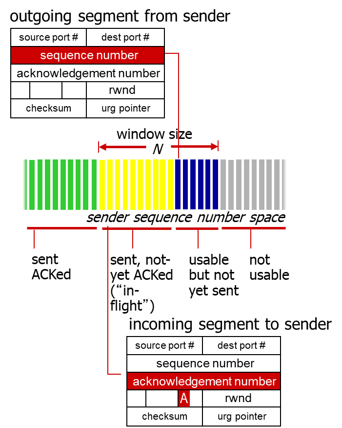
	- `송신 번호`, `ACK 번호`를 사용
- **`파이프라인` 사용**
	- TCP `혼잡, 흐름 제어`를 위한 `window size`를 설정
- **`전이중 데이터`**
	- 동일한 연결 상에서 양방향 통신
	- 최대 세그먼트 크기(`MSS`)
- **`연결지향적 통신`**
	- 데이터 교환 전, `핸드셰이킹(제어 메시지 교환)`으로 송신자-수신자 `상태 초기화`
- **`흐름 제어`**
	- 송신자가 수신자를 `압도(overwhelm)`하지 않음
##### RTT(Round Trip Time, 왕복 시간)
*TCP의 효율적인 통신을 위해*, 지정된 시간 내에 `ACK 신호`나 `세그먼트`를 수신하지 못한 경우, `연결 시간 초과(timeout)`로 처리하고 연결을 종료해야 함.
- 이때, `TCP timeout 시간`은 RTT보다 길어야 함
	- 하지만, RTT는 편차가 있을 수 있음
	- 너무 짧게 잡는다면, 재전송이 자주 발생함
	- 너무 길게 잡는다면, `세그먼트 손실`에 대해 느리게 반응하게 됨
- 이때, `RTT의 편차` 등을 어떻게 측정해야 할까?
	- `SampleRTT`
		- 세그먼트 전송 후, `ACK 수신`까지 측정된 시간 (재전송 무시)
		- 다만 `SampleRTT` 역시 다양할 수 있으므로, 이들의 여러 최근 측정값을 평균내어 사용
- RTT의 기준?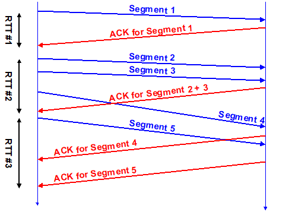
	- 만약 ACK 수신 이전, `여러 번의 세그먼트 전송`이 발생한 경우 `가장 처음 보낸 세그먼트를 기준`으로 함
	- 만약 `동일한 세그먼트가 재전송` 된 경우, `RTT 측정에 포함하지 않음`
		- 처음 보낸 세그먼트에 대한 ACK 인지, 재전송된 세그먼트에 대한 ACK인지 `구분할 수 없기 때문`
##### 신뢰할 수 있는 데이터 전송
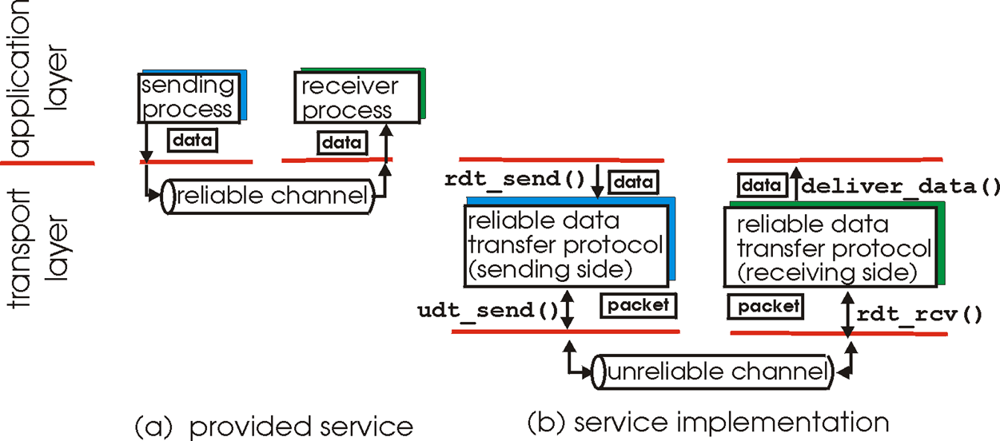
- 응용, 전송, 링크 계층에서 `신뢰성`은 매우 중요한 개념으로, 각 계층마다 신뢰성 유지를 위해 데이터를 체크
	- **`신뢰성`**: `비트 에러`, `패킷 손실` 없이 한 번만 전송하는 것
###### TCP에서의 RDT
- TCP는 `RDT(Reliable Data Transfer, 신뢰성 있는 데이터 전송) 서비스`를 IP의 신뢰성 없는 서비스 위에 구축함
	- `파이프라인화된 세그먼트` (연속으로 전송할 수 있음)
	- `누적 ACK` (GoBackN과 유사)
	- `단일 재전송 타이머` (데이터 보낸 시간 != timeout 시간 일 수 있음)
- `재전송`은 다음 두 경우 발생
	- `timeout 이벤트`
		- timeout이 발생한 경우, 이를 일으킨 세그먼트를 재전송
		- 타이머 재시작
	- `중복된 ACK`
		- 이전에 ACK되지 않은 세그먼트를 ACK하는 경우
		- 어떤 패킷이 ACK되었다고 알려져있는지 갱신
		- ACK되지 않은 세그먼트 아직 있으면 타이머 시작
##### 흐름 제어
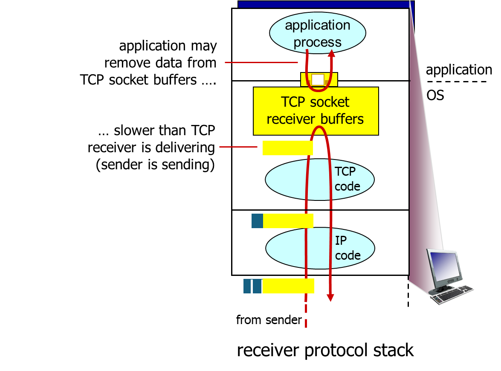
- `흐름 제어`: 빠른 발신자가 너무 많이, 너무 빨리 전송해 느린 수신자 버퍼가 넘치지 않도록(압도하지 않도록) 함
- 수신자는 TCP 헤더에 `윈도우 크기(rwnd)`를 포함시켜, 사용 가능한 버퍼 공간을 명시함 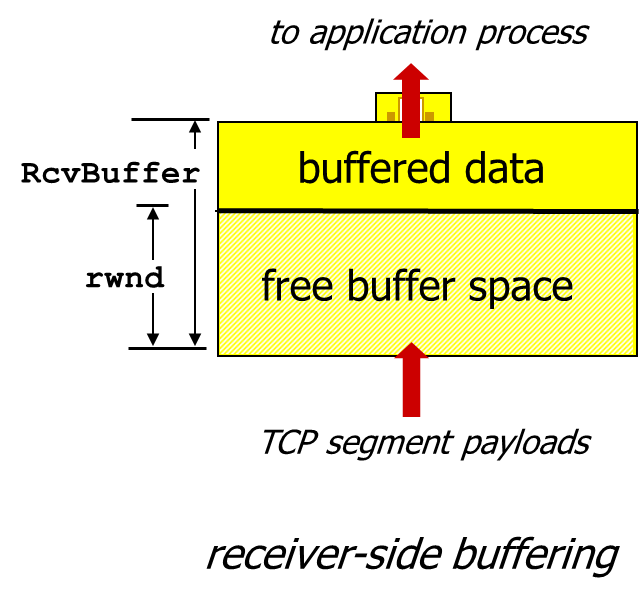
	- 소켓 옵션을 통해 설정된 `수신자 버퍼(RcvBuffer)`크기 값으로, 보통 4096 byte가 디폴트
	- 대부분의 운영체제에서 이 크기를 `자동 조정`함
- 발신자는 `수신자의 윈도우 크기` 만큼만 `ACK되지 않은(in-flight) 데이터`를 보낼 수 있음
	- 이는 수신자 버퍼가 넘치지 않도록 보장
###### Stop-and-wait
- 가장 간단한 형태의 흐름 제어 기법
- 발신자가 하나의 패킷을 보낸 뒤, 수신자의 응답이 올 때까지 기다림
	- `ACK` 를 수신하거나, 타임아웃이 발생하면 다시 패킷 전송
###### Go-back-N
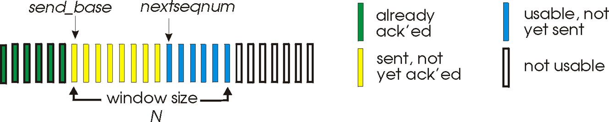
> send_base: 보낸 패킷
> nextseqnum: 보낼 예정인 패킷
- N개의 `ACK되지 않은 패킷`을 파이프라인을 통해 전송
- 수신자는 `누적 ACK(cumulative ACK)`만 전송
- 발신자는 가장 **오래된** `ACK되지 않은 패킷`에 대한 타이머 갖고 있음
	- 타임아웃 발생시, `모든 ACK되지 않은 패킷들`을 재전송
		- 즉, `가장 마지막으로 ACK 받은` 시퀀스 번호로 돌아가 재전송
###### Selective Repeat
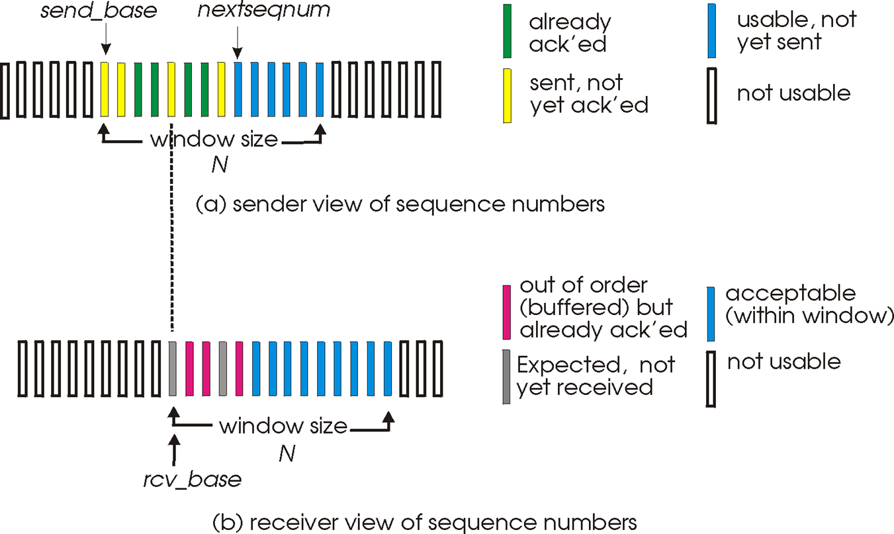
- N개의 `ACK되지 않은 패킷`을 파이프라인을 통해 전송
- 수신자는 `각각의 패킷에 대한 ACK`를 전송
- 발신자는 각 패킷에 대한 타이머를 갖고있음
	- 타임아웃 발생시, `해당 패킷만` 재전송
- 수신자는 `순서를 지켜(in-order)` 상위 계층에 패킷들을 전달하기 위해, `버퍼` 사용
	- *문제 생긴 패킷* `다음의 패킷들`을 버퍼에 저장, 또는 `순서에 맞지않는 패킷들` 저장
	- 이후, 문제 생긴 패킷을 재전송받고, `일정 갯수의 패킷`이 모이면 `상위 계층으로 전달`
- **참고**
	- [Selective Repeat Protocol](https://computerscience.unicam.it/marcantoni/reti/applet/SelectiveRepeatProtocol/selRepProt.html) : Selective Repeat 흐름을 테스트해볼 수 있는 사이트
##### 혼잡 제어
- 발신자가 혼잡함을 인식하는 기준
	- `손실 이벤트(loss event)`: `타임아웃` 또는 `3번`의 `중복된 ACK`
- TCP 발신자는 `손실 이벤트` 발생시, 혼잡에 대응하기 위해 `혼잡 윈도우(Congestion Window, CongWin)`의 크기를 조절해 대응
- `혼잡 제어`를 위해 `AIMD`, `slow start`, `conservative after timeout events` 3가지 메커니즘 존재
###### AIMD
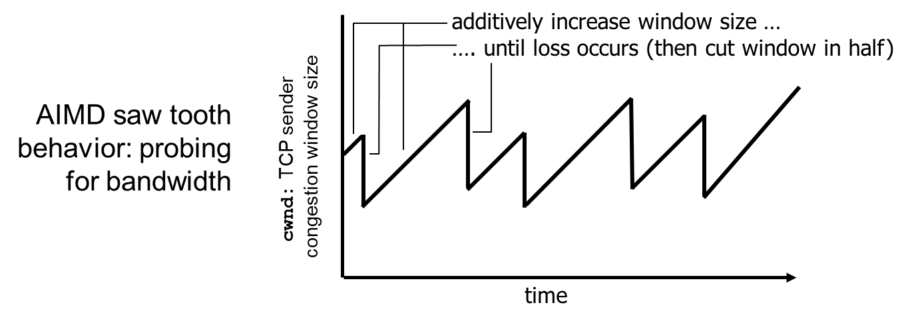
- `Additive Increase Multiplicative Decrease`의 약어
- `혼잡 윈도우`를 *혼잡이 감지되지 않을때*는 `선형적으로 증가`시키다, *혼잡이 감지되면* `기하급수적으로 감소`시키는 방식
	- *손실이 감지될 때까지*, 매 `RTT`마다 `cwnd`를 1 MSS씩 증가
	- *손실이 발생하면*, `cwnd`를 절반으로 줄임
- 즉, `cwnd`는 인식된 네트워크 혼잡 정도를 나타내는 함수라고 할 수 있음
- TCP 전송 속도 $rate \approx {cwnd \over RTT} bytes/sec$
###### Slow Start
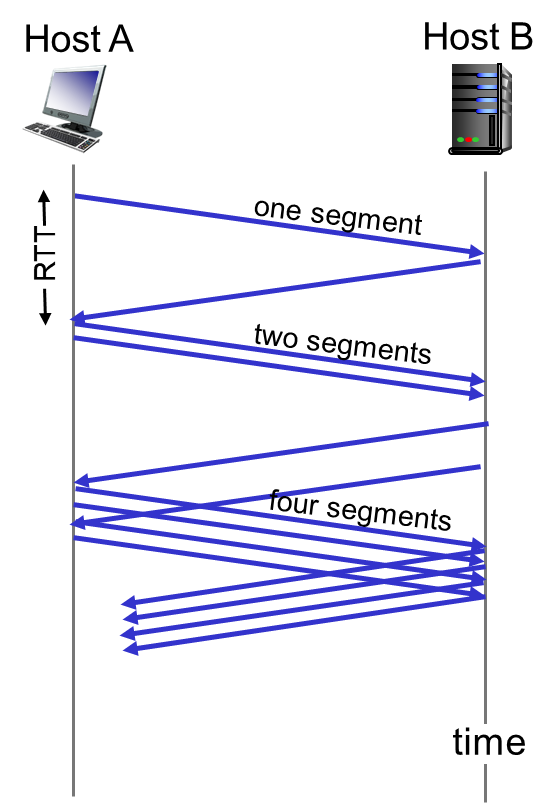
- 연결 시작 이후, `손실 이벤트` 발생 전까지 속도를 기하급수적으로 증가시키는 방식
	- 초기 `cwnd` = 1 MSS
	- 매 RTT마다 `cwnd`는 2배씩 증가
		- 정확히는 모든 `ACK 수신`마다 `cwnd`를 2배로 증가시킴
	- 시작 값이 1이라 `Slow Start`라는 이름이 붙었으며, 증가 속도는 빠름
###### Conservative after timeout events(타임아웃 발생 후 보수적으로)
- `타임아웃`으로 손실을 인식
	- `cwnd`는 1로 세팅됨
	- 이후 `cwnd`가 기하급수적으로 `임계값(threshold)`까지 증가한 뒤, `선형적`으로 증가
- `3개의 중복 ACK`로 손실을 인식 : `TCP RENO`
	- `중복 ACK`는 네트워크가 아직 `세그먼트들을 전달할 수 있음`을 나타냄
	- `cwnd`를 `절반`으로 줄인 뒤, `선형적`으로 증가
- `타임아웃` 또는 `3개의 중복 ACK` 발생시 손실 인식 : `TCP Tahoe`
	- 인식시 `cwnd`를 1로 설정
###### 요약
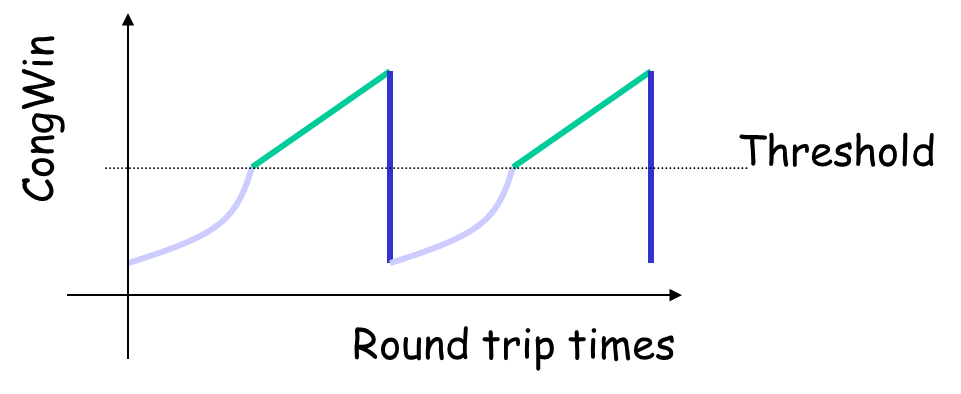
- `cwnd`가 임계값보다 낮을때, 발신자는 `Slow Start 단계`로, 윈도우가 기하급수적으로 증가
- `cwnd`가 임계값 이상이면, 발신자는 `혼잡 회피 단계`로, 윈도우는 선형적으로 증가
- `3개의 중복 ACK` 발생시, 임계값은 `cwnd/2`로 설정되고, `cwnd`는 임계값으로 설정됨
- `타임아웃` 발생시, 임계값은 `cwnd/2`로 설정되고, `cwnd`는 `1 MSS`로 설정됨
#### TCP 세그먼트 구조
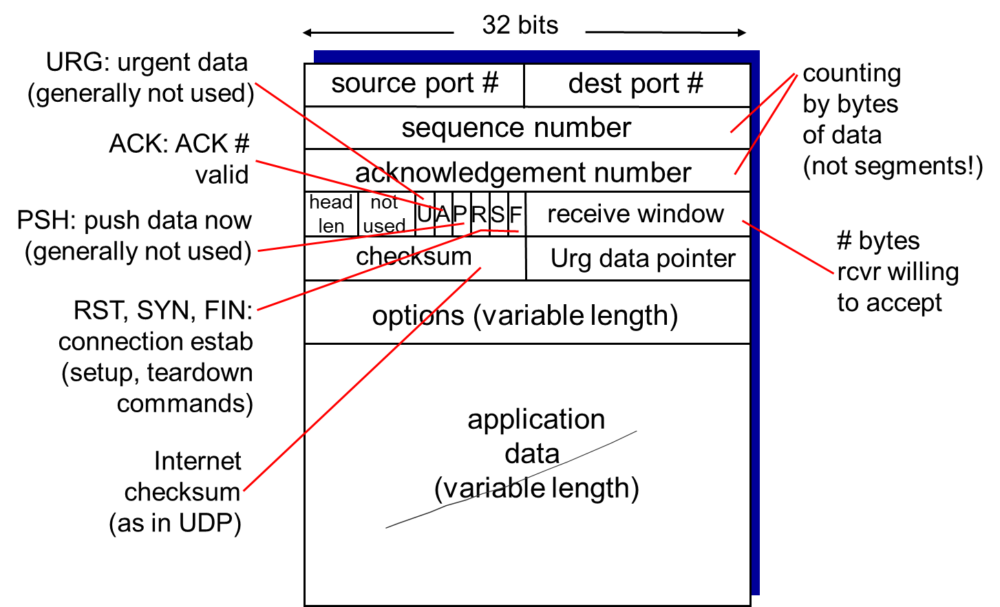
- `TCP 세그먼트`는 다음으로 이뤄져있음
	- `송신 포트`
	- `수신 포트`
	- `순서 번호` (Sequence Number, 현재 세그먼트의 가장 앞 바이트 번호)
	- `ACK 번호` (마지막으로 수신한 데이터 바이트 다음의 번호)
	- `헤더 길이`(4 bits)
	- `예약된 공간`(6 bits)
	- `TCP 제어 플래그` [참고 - TCP 제어 플래그](http://www.ktword.co.kr/test/view/view.php?no=2437)
		- `URG` : `Urgent Pointer`필드에 값이 채워져있음을 알림
		- `ACK`: `ACK 번호` 필드에 값이 세팅되어있음을 알림
			- `SYN 세그먼트` 전송 이후 모든 세그먼트에 항상 이 비트가 1로 설정됨
		- `PSH`: `Push the Data`, `버퍼링된 데이터`를 가능한 `빨리` 상위 계층 `응용프로그램에 전달할 것`
			- 수신 측은 버퍼가 차기를 기다리지 않고 버퍼링된 데이터들 응용프로그램에전달
		- `PST`: `연결확립(ESTABLISHED)`된 회선에 `강제 리셋 요청`
			- `LISTEN`,`SYN_RCVD` 상태라면 `LISTEN` 상태로, 그외의 경우 연결 끊고 `CLOSED` 상태로
		- `SYN`: 연결설정을 위해 `순서 번호`를 동기화
			- `SYN=1, ACK=0` -> SYN 세그먼트(`연결 요청`)
			- `SYN=1, ACK=1` -> SYN+ACK 세그먼트(`연결 허락`)
			- `ACK=1` -> ACK 세그먼트(`연결 설정`)
		- `FIN`: 연결 종료
			- `FIN=1` -> FIN 세그먼트 (`종결 요청`)
			- `FIN=1, ACK=1` -> FIN+ACK 세그먼트 (`종결 응답`)
	- `윈도우` (수신자가 수락할 의향이 있는 바이트 수)
	- `체크섬` (헤더+텍스트를 16비트 word들로 분할해, 이를 16비트 1의 보수합으로 누계한 다음, 최종 결과 값의 1의 보수를 구한 것)
	 - `긴급 포인터(Urgent Pointer)`(긴급 포인터의 현재 값을 `순서 번호`의 `오프셋`으로 전달하는 값. 긴급 포인터는 긴급 데이터 `다음 바이트의 순서 번호`를 가리킴)
	 - `옵션` (MSS 옵션 협상, 윈도우 크기 확장, 선택확인응답(SACK) 등의 옵션 데이터를 포함할 수 있음)
### UDP
#### 요약
- **신뢰할 수 없음**(`unreliable`)
- **순서 지키지 않음**(`unordered`)
- **어떤것도 보장하지 않는(`best-effort`) IP의 기본적인(`bare bones`) 확장**
	- 즉, 어떠한 기능도 지원하지 않음
- **`지연 보장`, `대역폭 보장`과 같은 서비스 `지원되지 않음`**
	- `모든 데이터들이 동급`이라는 전제가 있어, '어떤 파일을 빨리 보내야 한다' 이런 개념이 존재하지 않음
#### 주요 특징
##### "best effort"한 서비스 제공
따라서 `UDP Segment`는
- `손실 가능`(송신자는 전송 이후 신경쓰지 않음)
- `비순차적`으로 전달됨
##### `connectionless`
- UDP 송신자-수신자 간 `핸드셰이킹` 없음
- 각 `UDP Segment`는 다른 `Segmeent`들과는 독립적으로 처리됨
##### 신뢰성 없음
- 따라서 UDP 상에서 신뢰성 있는 전송이 필요하다면, `응용 계층`에서 이를 `구현`해야 함
#### 장점
- **`연결 조율 과정이 없음`**
	- 따라서 이로인한 `딜레이 X`
- **`단순함`**
	- 송-수신자 간 연결 상태가 존재하지 않음
- **`작은 헤더 사이즈`**
- **`혼잡 제어 없음`**
	- 원하는 만큼 빠르게 전송할 수 있음
#### UDP 세그먼트 구조
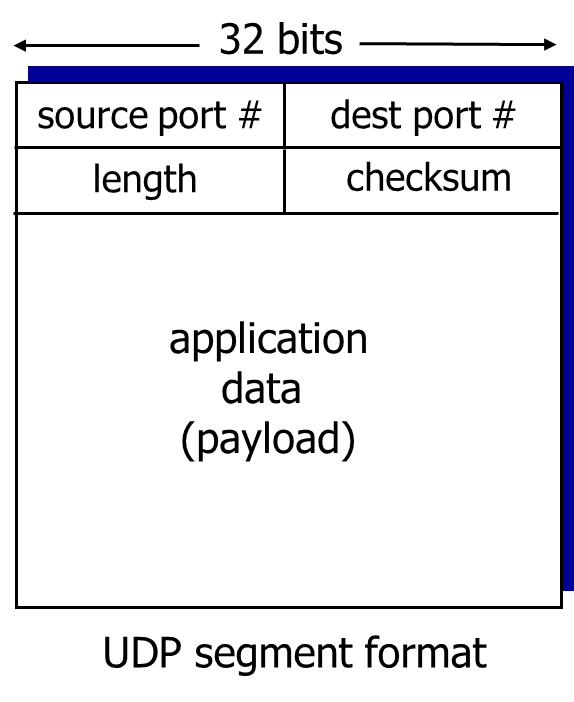
- `UDP 헤더`는 `출발 포트`, `도착 포트`, `길이`(헤더와 세그먼트를 포함한), `체크섬`으로 이뤄짐
###### UDP 체크섬
- 전송된 세그먼트에서 `에러`(ex. `반전된 비트(flipped bits)`)를 감지하기 위해 사용되는 데이터 블록
- `송신자`
	- *헤더 필드를 포함한* `세그먼트 내용`을 `16 bit 정수 시퀀스`로 처리  
	- `체크섬`: `세그먼트 내용`의 `1의 보수(모든 비트를 반전시킨 값)`
	- 송신자는 체크섬 값을 `UDP 체크섬 필드`로 전달
- `수신자`
	- 수신한 세그먼트의 `체크섬을 계산`
	- 만약 `계산한 값`이 `체크섬 필드의 값`과
		- 같다면, 에러가 검출되지 않은 것
		- 다르면, 에러가 검출된 것
#### 사용처
`UDP`는 위와 같은 특징 때문에 주로 다음의 용도로 사용됨
- `멀티미디어 스트리밍 애플리케이션`
	- 손실을 허용하고, 속도에 민감함
- `DNS`
- `SNMP`
## Checksum이 무엇인가요?
- `체크섬`? 
	- 전송된 세그먼트에서 `에러`(ex. `반전된 비트(flipped bits)`)를 **`감지`** 하기 위해 사용되는 데이터 블록
		- *헤더 필드를 포함한* `세그먼트 내용`을 `16 bit 정수 시퀀스`로 분해한 뒤, 1의 보수로 합을 누적하여 구함
## TCP와 UDP 중 어느 프로토콜이 Checksum을 수행할까요?
- `TCP`, `UDP` 모두 Checksum을 수행할 수 있다
	- 다만, `UDP`의 경우 *IPv4에서는 선택적*이고 `IPv6`에서는 `필수`
## 그렇다면, Checksum을 통해 오류를 정정할 수 있나요?
- checksum을 이용한 `오류 정정`은 **불가능**
	- 단순히 `각 16비트 word들의 1의 보수 합`이기 때문에 원래 값이 무엇이었는지 유추하기 힘듦
	- 따라서 `자동반복요청(ARQ)` 기법을 사용하거나, `Hamming Code`, `Reed–Solomon code`등 `오류 정정 코드`를 사용하는 `전진오류수정(FEC)` 기법을 사용해 오류를 정정해야 함
		- 이러한 기법들은 `데이터링크 계층`에서 수행됨
## TCP가 신뢰성을 보장하는 방법에 대해 설명해 주세요.
- `TCP`에서는 신뢰성을 보장하기 위해 다음과 같은 서비스 제공
	- `파이프라인화된 세그먼트` (연속으로 전송할 수 있음)
	- `누적 ACK` (Go-Back-N과 유사)
	- `단일 재전송 타이머` (데이터 보낸 시간 != timeout 시간 일 수 있어 타이머 사용)
- 위 서비스를 통해 `비트 에러`, `패킷 손실`이 일어난 데이터를 감지하고 재전송을 요청함.
- 이때, `재전송`은 다음 두 경우 발생
	- `timeout 이벤트`
		- timeout이 발생한 경우, 이를 일으킨 세그먼트를 재전송
		- 타이머 재시작
	- `중복된 ACK`
		- 이전에 ACK되지 않은 세그먼트를 ACK하는 경우
		- 무엇이 ACK되었다고 알려져있는지 갱신
		- ACK되지 않은 세그먼트 아직 있으면 타이머 시작
## TCP의 혼잡 제어 처리 방법에 대해 설명해 주세요.
- TCP에서는 `혼잡 제어`를 위해 
`AIMD`, `slow start`, `conservative after timeout events` 3가지 메커니즘 존재
	- 발신자가 혼잡함을 인식하는 기준
		- `손실 이벤트(loss event)`: `타임아웃` 또는 `3번`의 `중복된 ACK`
	- TCP 발신자는 `손실 이벤트` 발생시, 혼잡에 대응하기 위해 `혼잡 윈도우(Congestion Window, CongWin)`의 크기를 조절해 대응
###### AIMD

- `Additive Increase Multiplicative Decrease`의 약어
- `혼잡 윈도우`를 *혼잡이 감지되지 않을때*는 `선형적으로 증가`시키다, *혼잡이 감지되면* `기하급수적으로 감소`시키는 방식
	- *손실이 감지될 때까지*, 매 `RTT`마다 `cwnd`를 1 MSS씩 증가
	- *손실이 발생하면*, `cwnd`를 절반으로 줄임
- 즉, `cwnd`는 인식된 네트워크 혼잡 정도를 나타내는 함수라고 할 수 있음
- TCP 전송 속도 $rate \approx {cwnd \over RTT} bytes/sec$
###### Slow Start

- 연결 시작 이후, `손실 이벤트` 발생 전까지 속도를 기하급수적으로 증가시키는 방식
	- 초기 `cwnd` = 1 MSS
	- 매 RTT마다 `cwnd`는 2배씩 증가
		- 정확히는 모든 `ACK 수신`마다 `cwnd`를 2배로 증가시킴
	- 시작 값이 1이라 `Slow Start`라는 이름이 붙었으며, 증가 속도는 빠름
###### Conservative after timeout events(타임아웃 발생 후 보수적으로)
- `타임아웃`으로 손실을 인식
	- `cwnd`는 1로 세팅됨
	- 이후 `cwnd`가 기하급수적으로 `임계값(threshold)`까지 증가한 뒤, `선형적`으로 증가
- `3개의 중복 ACK`로 손실을 인식 : `TCP RENO`
	- `중복 ACK`는 네트워크가 아직 `세그먼트들을 전달할 수 있음`을 나타냄
	- `cwnd`를 `절반`으로 줄인 뒤, `선형적`으로 증가
- `타임아웃` 또는 `3개의 중복 ACK` 발생시 손실 인식 : `TCP Tahoe`
	- 인식시 `cwnd`를 1로 설정
## 왜 HTTP는 TCP를 사용하나요?
- `TCP`가 **`신뢰성`** 을 제공하기 때문
	- `HTTP`는 `신뢰할 수 있는 전송(reliable transport)`을 전제로하는 프로토콜임
	- 따라서 이를 기본적으로 제공하는 `TCP`를 선택
		- 만약 `신뢰성`이 제공되지 않아 패킷들의 순서가 뒤죽박죽이 되거나, 누락될 경우 웹사이트를 이루는 요소들이 올바르게 배치되지 않거나 텍스트, 이미지 등의 정보가 누락될 수 있음
## 그렇다면, 왜 HTTP/3 에서는 UDP를 사용하나요? 위에서 언급한 UDP의 문제가 해결되었나요?
- `HTTP/3`는 *UDP의 문제를 해결하기보다*, `TCP의 고질적인 문제점`을 해결하고자 `UDP`를 채용한 것
	- `TCP`로 인해 발생하는 문제
		- `HOL Blocking`
			- TCP의 신뢰성때문에, 한 스트림에서 데이터 손실 발생시, 다른 데이터 스트림들은 손실된 데이터 재전송될 때까지 차단됨
		- `연결 설정`으로 인한 `지연`
			- TCP가 연결 설정할 때 거치는 `3-way handshake` 과정과 보안을 위한 `TLS Handshake` 때문에 두 번의 지연 발생
				- 반면 UDP(정확히는 `QUIC`)는 최초 연결 설정시 `연결에 필요한 정보` + `데이터`를 함께 전송해 1-RTT로 지연을 줄임
		- 패킷 `암호화 불가능`
			- `TCP 프로토콜 헤더`는 암호화 및 인증되지 않아, 중개자에 의한 변조/인젝션/도청에 취약
				- 반면 `QUIC`은 *일부 메시지를 제외한* `모든 패킷 헤더`와 `메시지 본문`이 암호화 됨
		- 연결 요소 변경시 연결 재설정
			- `TCP` 연결은 `출발지 IP`, `출발지 포트`, `도착지 IP`, `도착지 포트` 4가지를 기반
				- 하나라도 변경될 경우 연결 다시 설정해야 함
			- 반면 `QUIC`은 `연결 ID`를 기반으로해, 이 값이 변경되지 않는 이상 연결 계속 유지
## 그런데, 브라우저는 어떤 서버가 TCP를 쓰는지 UDP를 쓰는지 어떻게 알 수 있나요?
- `연결 시도 과정`에서 알 수 있음
	- 먼저 브라우저는 `TCP`로 `443`번(`HTTPS`), 또는 `80`번(`HTTP`) 포트로 연결 시도
		- `HTTP/1.1` 또는 `HTTP/2`로 연결을 설정하기 위함
	- 만약 서버가 `HTTP/3`를 지원하는 경우, `h3` ALPN 토큰을 사용해 [`Alt-Svc` HTTP 응답 헤더 필드](https://developer.mozilla.org/en-US/docs/Web/HTTP/Headers/Alt-Svc#example)를 사용하거나, `HTTP/2 ALTSVC 프레임`을 통해 동등한 `HTTP/3` 엔드포인트를 지원함을 알림
		- `Alt-Svc` : 향후 요청에 대해 `다른 네트워크 위치(대체 서비스)`역시 현재 요청의 오리진처럼 정당한 응답을 받을 수 있음을 알림.
	- `Alt-Svc` 필드의 값을 활용해 `h3` 키에 해당하는 값의 UDP 포트로 연결 시도
		- 만약 `h3=":443"`인 경우, UDP 443 포트로 `QUIC` 연결 시도

## 본인이 새로운 통신 프로토콜을 TCP나 UDP를 사용해서 구현한다고 하면, 어떤 기준으로 프로토콜을 선택하시겠어요?

# 참고
- 전공 강의 자료
	- Computer Networking: A Top Down Approach - 7th Edition, Global Edition  Jim Kurose, Keith RossPearson  April 2016
- [W6.Transport_Layer.pdf - SNU](https://ocw.snu.ac.kr/sites/default/files/NOTE/W6.Transport_Layer.pdf)
- [TRANSMISSION CONTROL PROTOCOL - ietf.org/rfc/rfc793.txt](https://www.ietf.org/rfc/rfc793.txt)
- [RFC 9293 - Transmission Control Protocol (TCP)](https://datatracker.ietf.org/doc/html/rfc9293#name-header-format)
- [Reliable Data Transfer over UDP - Simon Fraser University](https://coursys.sfu.ca/2022fa-cmpt-471-d1/pages/Prj2/view)
- [RFC 7838 - HTTP Alternative Services](https://datatracker.ietf.org/doc/html/rfc7838)
- [TCP 제어 플래그 - ktworld](http://www.ktword.co.kr/test/view/view.php?no=2437)
- [TCP Header- ktworld](http://www.ktword.co.kr/test/view/view.php?no=1889)
- [TCP 혼잡제어 - ktworld](http://www.ktword.co.kr/test/view/view.php?no=5536)
- [Fall ’20 COSE322-00  System Programming  TCP in Linux - korea univ](https://os.korea.ac.kr/wp-content/uploads/2020/11/10_TCP-in-Linux.pdf)
- [How is TCP & UDP Checksum Calculated?](https://www.slashroot.in/how-is-tcp-and-udp-checksum-calculated)
- [The TCP/IP Guide - TCP Checksum Calculation and the TCP "Pseudo Header"](http://www.tcpipguide.com/free/t_TCPChecksumCalculationandtheTCPPseudoHeader-2.htm)