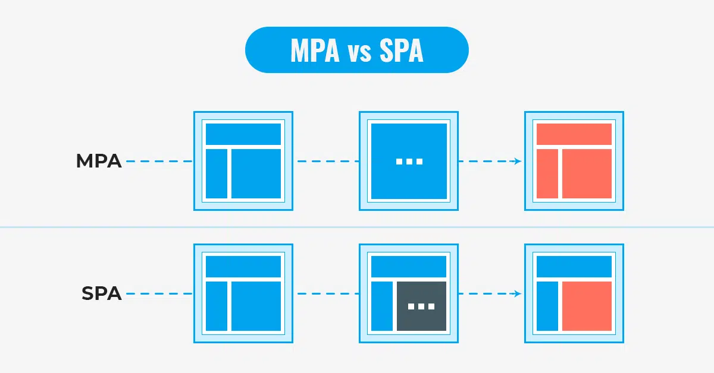
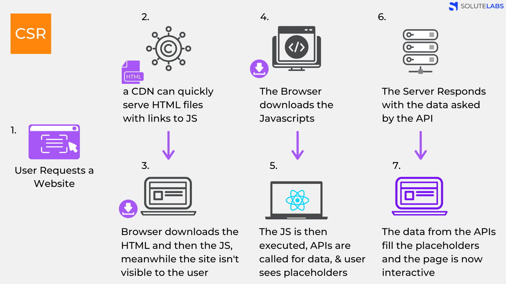
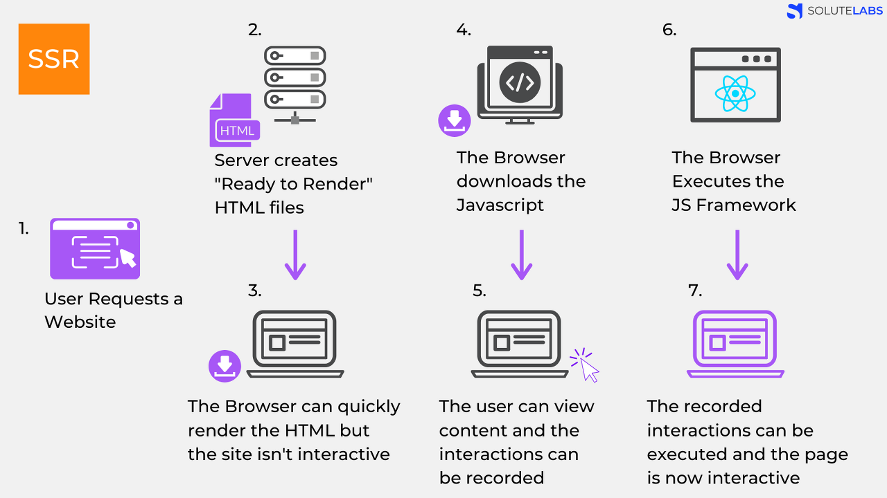

# CSR vs SSR

---
# SPA vs MPA
> 오늘날은 대부분 React, Vue와 같은 자바스크립트 기반 프레임워크를 사용해 SPA를 개발한다.
> 
## SPA
> Single Page Application

> - 하나의 페이지로 구성된 웹 어플리케이션
> - SPA로 개발된 웹사이트에서 카테고리에 있는 각 메뉴를 선택하면 보통 헤더는 고정되어 있고 아래 화면만 바뀐다.
> - 보통 CSR로 렌더링한다.
> - React, Vue,...

## MPA
> Multi Page Application

> - 탭을 이동할 때마다 새로운 HTML을 새로 받아온다.
> - 페이지 전체를 렌더링하는 전통적인 웹페이지 구성 방식
> - 보통 SSR로 렌더링한다.
> - JSP

# CSR
> Client Side Rendering

>- 렌더링이 클라이언트 쪽에서 일어난다.
>- 서버는 요청을 받으면 클라이언트에 HTML과 JS를 보내준다.
>- 클라이언트는 그것을 받아 렌더링을 시작한다.
> - 
> 1. User가 Website 요청을 보낸다.
> 2. CDN이 HTML 파일과 JS로 접근할 수 있는 링크를 클라이언트로 보낸다.
> 3. 클라이언트는 HTML을 다운로드 한 다음, JS를 다운로드 한다.
>    - SSR과 달리 유저는 아무것도 볼 수 없다.
> 4. JS 다운로드
> 5. 다운이 완료된 JS가 실행된다. 데이터를 위한 API가 호출된다.
>    - 유저들은 placeholder를 보게 된다.
> 6. 서버가 API로부터 요청에 응답한다.
> 7. API로부터 받아온 data를 placeholder 자리에 넣어준다. 이제 페이지는 상호작용이 가능해진다.
> 
> - 서버에서 처리 없이 클라이언트로 보내주기 때문에 자바스크립트가 모두 다운로드되고 실행이 끝나기 전까지 사용자는 볼 수 없다.

# SSR
> Server Side Rendering

> - 서버 쪽에서 렌더링 준비를 마친채로 클라이언트에 전달하는 방식
> - 
> 1. User가 Website 요청을 보낸다.
> 2. Server는 'Ready to Render'. 즉, 렌더링 가능한 html파일을 만든다.
> 3. 클라이언트에게 전달되는 순간, 이미 렌더링 준비가 되어있기 떄문에 HTML은 즉시 렌더링된다.
>   - 그러나 사이트 자체는 조작 불가능하다. JavaScript가 읽혀지기 전이다.
> 4. 클라이언트가 JavaScript를 다운받는다.
> 5. 다운받아지고 있는 사이에 유저는 컨텐츠를 볼 수는 있고, 사이트를 조작할 수 없지만, 사용자 조작을 기억하고 있는다.
> 6. 브라우저가 JavaScript를 실행한다.
> 7. JS가 성공적으로 컴파일되면, 기억하고 있던 사용자 조작을 실행하고, 웹 페이지는 상호작용이 가능해진다.
> 
> - 서버에서 이미 '렌더 가능한' 상태로 클라이언트에게 전달
> - JS가 다운로드되는 동안 사용자는 무언가를 볼 수 있다.

# CSR vs SSR 차이
## 웹페이지를 로딩하는 시간
### 웹 사이트의 가장 첫 페이지 로딩
> - CSR의 경우 HTML, CSS와 모든 스크립트를 한번에 불러온다.
> - SSR은 필요한 부분의 HTML과 스크립트만 불러온다.
> - 평균적으로 SSR이 더 빠르다.

### 나머지 로딩
> - 사이트의 다른 곳으로 이동하는 식의 동작
> - CSR은 이미 첫 페이지 로딩할 때 나머지 부분을 구성하는 코드를 받아왔기 때문에 빠르다.
> - SSR은 첫 페이지를 로딩한 과정을 다시 실행하기 때문에 느리다.

---
## SEO 대응
> - 검색엔진은 크롤러로 웹 사이트를 읽는다.
> - 전통적인 크롤러의 한계로, 자바스크립트를 실행하지 않고 페이지의 정적 HTML 콘텐츠만을 수집한다.
> - CSR은 자바스크립트를 실행시켜 컨텐츠가 생성되기 때문에, 크롤러 입장에서는 HTML이 비어있는 것처럼 보인다.
>   - SEO에 불리하다.

---

## 서버 자원 사용
> SSR이 매번 서버에 요청을 하기 때문에 서버 자원을 더 많이 사용한다.