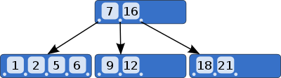
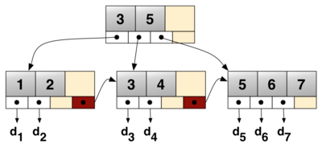
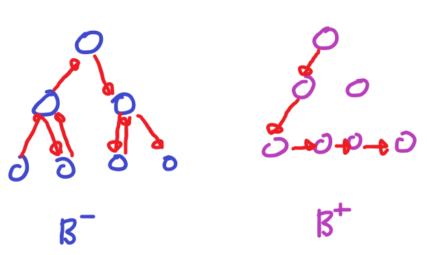

# B-Tree와 B+Tree에 대해 설명해 주세요
## B 트리 (B-Tree)

이진 트리를 확장해 한 노드가 가질 수 있는 자식 노드의 갯수가 2개 이상인 `자가 균형 이진 검색 트리(Self Balancing Binary Search Tree)`의 일종이며, 각 노드가 갖고있는 키 들은 정렬되어 있습니다.  
다른 자체 균형 이진 검색 트리와 달리, B 트리는 DB, File System과 같이 큰 데이터 블록을 읽고 써야하는 스토리지 시스템에 적합합니다.  
### B 트리의 성질
차수 m을 갖는 B 트리는 아래와 같은 성질을 만족합니다.
- 모든 노드는 최대 m개의 자식이 존재합니다.
- 모든 내부 노드는 최소 ⌈m/2⌉ 개의 자식이 존재합니다.
- 루트 노드는 (*리프가 아닌 한*) 최소 2개의 자식이 존재합니다.
- k개의 자식이 있는 *리프가 아닌* 노드는 k-1 개의 키를 갖고 있습니다.
### B 트리의 노드들
B 트리를 이루는 노드는 내부 노드, 루트 노드, 리프 노드로 구성됩니다.
#### 내부 노드 (Internal Node)
*적어도 하나의 자식*을 갖는 노드로, *리프 노드와 루트 노드를 제외*한 **모든 노드**입니다.  
이들은 일반적으로 하위 포인터, 데이터 포인터, 검색 키의 순서 집합으로 표현됩니다.  
모든 `내부 노드`는 최대 U개에서 최소 L개의 자식을 포함합니다. 따라서 `내부 노드` 내 요소 수는 '하위 포인터 수 - 1' 입니다. (요소 수는 L-1 보다 높고, U-1 보다 낮습니다.)
- 따라서 U는 2L 또는 2L - 1 이고, 각 `내부 노드`들은 **최소 절반** 이상 채워져 있습니다.
	- 이는 두 *절반이 가득 찬* 내부 노드를 하나의 노드로 **병합하거나**, 하나의 완전한 노드를 두 개의 정상적인 노드로 **나눌 수 있음**을 의미합니다.
	- 이러한 점을 통해, B 트리는 새 값을 삽입하거나 삭제하고 *B 트리 속성을 유지하도록* 트리를 조절할 수 있습니다.
##### 내부 노드의 구조
|$pt_0$ |$k_0$ |$pt_1$ |$pr_0$ |$k_1$ |$pt_2$ |$pr_1$ |...|$k_{K-1}$ |$pt_K$ |prK-1|
|---|---|---|---|---|---|---|---|---|---|---|
- $pt_i$ : 하위 서브 트리의 루트 노드를 가리키는 포인터
- $pr_i$ : 데이터를 갖고 있는 레코드를 가리키는 포인터
- $k_i$: zero-based 노드 인덱스 $i$의 검색 키

또한, 각 내부 노드의 키는 해당 노드의 서브 트리를 나누는 기준 값으로 사용됩니다.
- 만약 내부 노드에 3가지 자식 노드(*또는 트리*)가 있는 경우, 내부 노드에는 최소 2개의 키(예시로 $a_1$, $a_2$)가 있어야 합니다.
	- 가장 왼쪽 서브 트리의 모든 값은 $a_1$보다 작고, 중간의 서브 트리의 모든 값은 $a_1$ 보다 크고 $a_2$보다 작으며, 가장 오른쪽 서브 트리의 모든 값은 $a_2$보다 큽니다.
#### 루트 노드 (Root Node)
루트 노드의 자식 수는 내부 노드와 동일한 상한이 존재하지만, 하한은 존재하지 않습니다.
- 전체 트리에 L-1 보다 적은 요소가 존재한다면, 루트 노드는 트리에서 자식이 전혀 없는 유일한 노드가 됩니다.
#### 리프 노드 (Leaf Node)
실질적인 데이터 객체/청크를 갖는 노드입니다. 모든 리프 노드들은 **같은 레벨에 존재**해야 합니다.
### B 트리의 장점
#### 정렬되어있는 키
저장된 키들이 정렬되어 있어, 순차적인 순회에 유용합니다. 
#### 동일한 삽입/삭제/검색 시간 복잡도
기존의 이진 탐색 트리와 달리, 한 노드에 저장할 수 있는 키의 수가 많아 트리는 더 얕은 높이를 가질 수 있게 되었습니다.  
이러한 계층형 인덱스를 사용하므로써 디스크 I/O가 줄어들어 더 낮은 삽입/삭제/검색 시간 복잡도를 가집니다. 
이러한 점 때문에 B 트리는 대용량 데이터 셋, 실시간 애플리케이션에 적합합니다.  
특히 DB에서 B 트리 인덱스를 사용하면 검색 성능을 크게 향상 시킬 수 있습니다.  
- DBMS에서는 인덱스 키 - PK가 매칭이 되어있는 B 트리를 만들어두고 이를 사용합니다.  
	- 인덱스를 통해 PK를 찾고, 찾은 PK를 통해 레코드를 찾습니다.
	- DBMS가 PK를 통해 레코드를 찾으려면, 테이블 전체를 뒤져 검색 해야하지만, B 트리 인덱스를 활용하면 트리를 몇 단계 탐색하므로써 PK를 찾을 수 있고 그 PK를 통해 레코드를 찾아올 수 있으므로 속도가 더 빠릅니다.
#### 자체 균형
B 트리는 `자체 균형 이진 검색 트리(Self Balancing Binary Search Tree)`의 일종이므로 항상 최적의 높이를 유지하고자 지속적으로 스스로 균형을 맞추려고 합니다.  
따라서 기존의 이진 검색 트리의 경우 작업이 최악의 경우(*트리가 한쪽으로 쏠린 경우*) O(N)의 시간 복잡도를 가졌지만, B 트리는 작업이 최악의 경우에도 O(logN)의 시간복잡도를 유지하도록 보장합니다.
- `자체 균형 이진 검색 트리(Self Balancing Binary Search Tree)` : 임의의 아이템 삽입/삭제 이후 자동으로 높이를 낮게 유지하는 노드 기반의 이진 검색 트리를 의미합니다. 대표적인 예시로 AVL 트리, B 트리, RBT 등이 있습니다.
### B 트리의 단점
#### 더많은 디스크 공간 사용
균형 유지를 위해 추가적인 포인터 및 헤더 정보를 유지해야 하므로 더 많은 공간을 사용합니다.
#### 다른 자료 구조에 비해 느린 속도
삽입/삭제 연산 이후 균형 유지를 위해 회전, 병합과 같은 재배치 작업을 수행할 수 있으며, 이 과정에서 오버헤드가 발생할 수 있습니다.

## B+ 트리 (B+ Tree)

> 위는 분기 인자 b=4이며, 1~7 범위의 키와 $d_1$ ~$d_7$의 데이터 값들을 연결하는 b+ 트리 예시 입니다.

B 트리의 변종 중 하나로, 각 노드가 키-값 쌍이 아닌 **키만 포함**하며(인덱스 인트리) 하단에 **링크드 리프 노드**들로 이뤄진 **추가적인 레벨**(데이터 엔트리)이 붙어있는 B 트리로 볼 수 있습니다.  
노드 당 m개 이하의 자식이 있는 `다항 트리(m-ary tree)` 라고도 일컬어지며, `분기 인자(branching factor, 각 노드 당 자식의 수)` $b$ 를 기준으로 삽입/삭제/검색 작업이 $O(log_b{N})$ 의 시간 복잡도를 가집니다.  
B+ 트리의 핵심 가치는 `블록 지향 스토리지(block-oriented storage)`(*특히 파일 시스템*)에서 **효율적인 검색**이 가능하도록 데이터를 저장하는 것입니다.  
- 이진 검색 트리와 달리, B+ 트리는 팬아웃이 매우 높아 트리 내 요소를 찾는데 필요한 I/O 작업 횟수를 줄일 수 있기 때문입니다.  
B+ 트리는 MS SQL, Oracle, SQLite 등의 RDBMS에서 **테이블 인덱스**를 구현하는데 활용됩니다.
### B+ 트리의 성질
분기 인자가 $b$ 이며, 높이 h인 b+ 트리는 다음과 같은 성질을 갖습니다.
- 저장된 레코드는 최대 $n_{max} = b^h - b^{h-1}$ 개여야 합니다.
- 저장된 레코드는 최소 $n_{min} = 2\lceil {b\over2} \rceil^{h-1} - 2\lceil {b\over2}\rceil^{h-2}$ 개여야 합니다.
- 트리를 저장하기 위한 공간 복잡도는 O(n) 입니다.
- 레코드를 삽입/제거/삭제하는데 $O(log_b n)$의 시간 복잡도를 갖습니다.
- B+ 트리 구조는 레코드 수가 증가/감소 함에 따라 확장/수축 할 수 있으며, 크기에 제한이 없습니다.
- 리프 노드들이 링크드 리스트 형태로 이어져 있어 빠른 `중위 순회(in-order traversal)`가 가능합니다.
- 리프 노드에서 부모 노드가 갖고 있는 키를 **중복적**으로 가질 수 있습니다(`Key Duplication`).
### B+ 트리의 장점
#### 순서대로 탐색이 가능
B 트리의 경우 모든 데이터 포인터가 리프 노드에 있지 않기 때문에 순서대로 연결된 리스트를 만들 수 없지만, B+ 트리의 경우 모든 데이터 포인터가 리프 노드에 존재하므로 순서대로 연결된 리스트를 만들 수 있습니다. 이를 통해 범위 쿼리나 정렬된 데이터가 필요한 작업들을 쉽게 수행할 수 있습니다.  
이러한 점 때문에, B+ 트리는 DB 시스템 인덱스를 구축하는데 유용합니다.
#### 정렬되어있는 키
#### 자체 균형
#### 동일한 삽입/삭제/검색 시간 복잡도
### B+ 트리의 단점
#### B 트리 대비 더 높은 메모리 사용
*키, 값(데이터 포인터)을 각 노드에 저장*하는 B 트리와 달리, B+ 트리는 내부 노드에는 키만 저장하고 리프 노드 층에 데이터를 저장하기 때문에 *키의 개수에 비례해* **추가적인 메모리가 필요**합니다.  

# B+ Tree가 B Tree에 비해 반드시 좋다고 할 수 있을까? 그렇지 않다면 어떤 단점이?
  
*웬만한 경우* **B+ 트리**가 B 트리 보다 **더 빠르게 검색**할 수 있기 때문에 좋다고 할 수 있습니다.    
B+ 트리는 *B 트리와 달리* 내부 노드에 값(데이터)을 저장하지 않으므로써 내부 노드에 저장되는 키의 수, 즉 **`팬아웃`을 최대화** 했고, 이를 통해 **트리의 높이를 최소화** 하기 때문입니다.  
또한 **`범위 검색 작업`** 을 **효율적**으로 진행할 수 있습니다. **리프 노드가 서로 연결**되어 있기 때문입니다.  
그리고 삽입/삭제 작업이 **리프 노드에서 수행**되어 **더 쉽고 시간 소모가 적습니다**.  
하지만, B 트리의 경우 *특정 노드를 자주 사용하는 경우* **더 빠를 수** 있습니다. 자주 사용되는 **노드를 `상승`** 시킬 수 있기 때문에, 원하는 데이터에 도달하는데 필요한 비교 작업이 적어지기 때문입니다.  
# DB에서 굳이 RBT와 같은 트리를 사용하지 않고, B-Tree/B+Tree를 사용하는 이유는?
**더 빠르기 때문**입니다.  
이를 설명하려면 먼저 RBT, 즉 `레드-블랙 트리(Red-Black Tree)`의 구조에 대해 알아야 합니다.  
RBT는 B 트리/B+ 트리와 마찬가지로 `자가 균형 이진 검색 트리(Self Balancing Binary Search Tree)` 의 일종으로, 각각의 노드가 **레드** 또는 **블랙**의 색상 속성을 갖습니다.  
루트 노드와 모든 리프 노드들은 블랙이며, 레드 노드의 양 자식 노드들은 모두 블랙이라는 특징 때문에, RBT는 블랙과 레드가 번갈아 나오는 형태를 띄게 됩니다(물론 *블랙 다음에 블랙이 나올 수도* 있습니다).  
이러한 특징 때문에 *루트 노드로 부터* <mark style="background: orange;">가장 먼 리프 노드까지의 거리</mark>가 <mark style="background: skyblue;">가장 가까운 리프 노드까지의 거리</mark>의 **2배 보다 항상 짧다**는 특성을 지니고, 이 때문에 삽입/삭제/탐색에 있어 B 트리와 마찬가지로 $O(logN)$의 시간 복잡도를 갖게 됩니다.  
하지만, **RBT**는 일반적인 BST와 같이 **자식을 둘 밖에** 가질 수 없으나 **B 트리**는 **둘 이상** 가질 수 있기 때문에 훨씬 **트리 높이가 짧아지고** **더 적은 디스크 I/O 작업을 수행**해 결과적으로 더 빠른 속도로 탐색을 진행할 수 있습니다.  
또한 *B 트리의 경우* 내부 노드의 두 개 이상의 키들을 **`배열`** 로 다루므로 RBT가 하위 노드들을 참조해 탐색하는 것 보다 **더 빠른 접근 속도**를 갖게 됩니다.  
이러한 차이 때문에 DB에서 B 트리/B+ 트리를 사용하게 됩니다.  

# 오름차순으로 정렬된 인덱스가 있다고 할 때, 내림차순 정렬을 시도할 경우 성능이 어떻게 될까? (B-Tree/B+Tree의 구조를 기반으로)
## B 트리의 경우
B 트리의 경우 내림차순 정렬을 시도할 경우, 모든 노드들을 역순으로 하나 하나 탐색해야 합니다. 따라서 B+ 트리 대비 낮은 성능을 보입니다.  
## B+ 트리의 경우
B+ 트리의 경우 내림차순 정렬을 시도할 경우, 리프 노드만 역순으로 탐색하면 되고, 리프 노드들이 링크드 리스트 형태를 띄고 있으므로 순차 접근에 최적화 되어있어 더 높은 성능을 보입니다.  

# 참고 문서
- [Self-balancing binary search tree - Wikipedia](https://en.wikipedia.org/wiki/Self-balancing_binary_search_tree)
- [Self-Balancing Binary Search Trees | Baeldung on Computer Science](https://www.baeldung.com/cs/self-balancing-bts)
- [B-tree - Wikipedia](https://en.wikipedia.org/wiki/B-tree)
- [Introduction of B-Tree - GeeksforGeeks](https://www.geeksforgeeks.org/introduction-of-b-tree-2/)
- [B+ tree - Wikipedia](https://en.wikipedia.org/wiki/B%2B_tree)
- [Introduction of B+ Tree - GeeksforGeeks](https://www.geeksforgeeks.org/introduction-of-b-tree/)
- [Difference between B tree and B+ tree - GeeksforGeeks](https://www.geeksforgeeks.org/difference-between-b-tree-and-b-tree/)
- [The Difference Between B-trees and B+trees | Baeldung on Computer Science](https://www.baeldung.com/cs/b-trees-vs-btrees)
- [MySQL Ascending index vs Descending index - tech.kakao.com](https://tech.kakao.com/2018/06/19/mysql-ascending-index-vs-descending-index/)
- [Red–black tree - Wikipedia](https://en.wikipedia.org/wiki/Red%E2%80%93black_tree)
- [How does B-tree make your queries fast? - allegro.tech](https://blog.allegro.tech/2023/11/how-does-btree-make-your-queries-fast.html)