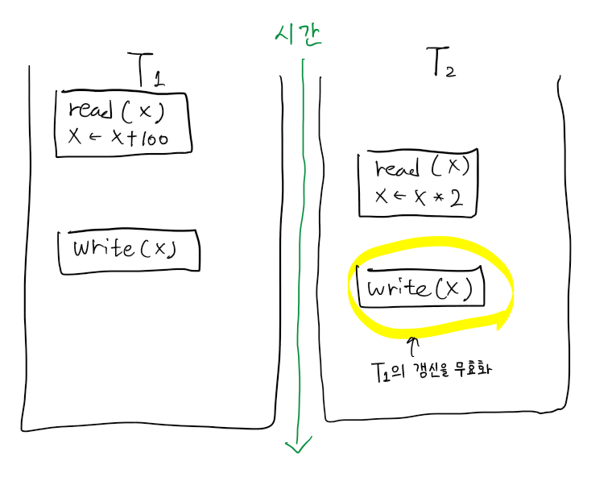
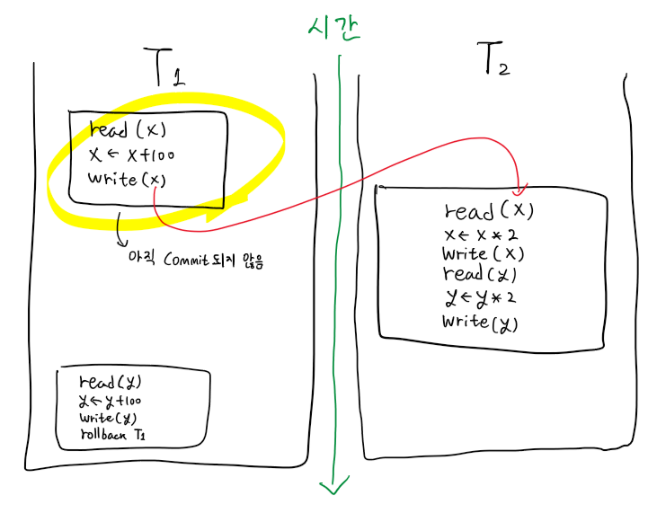
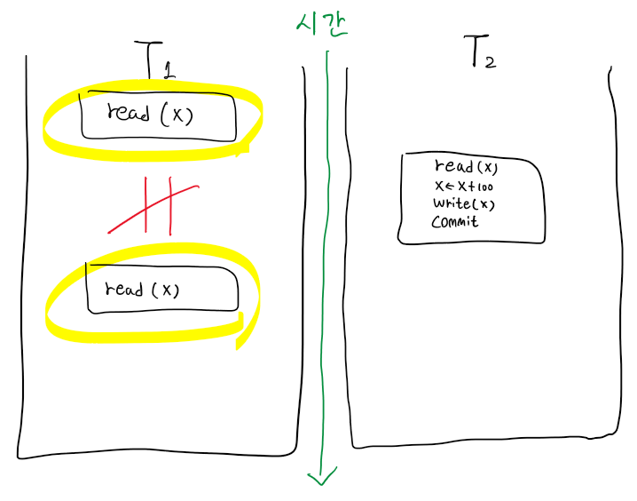
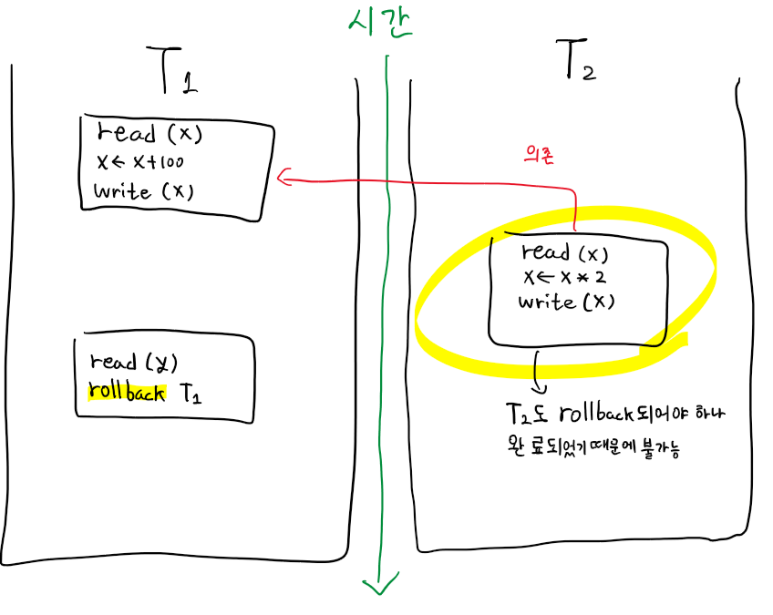
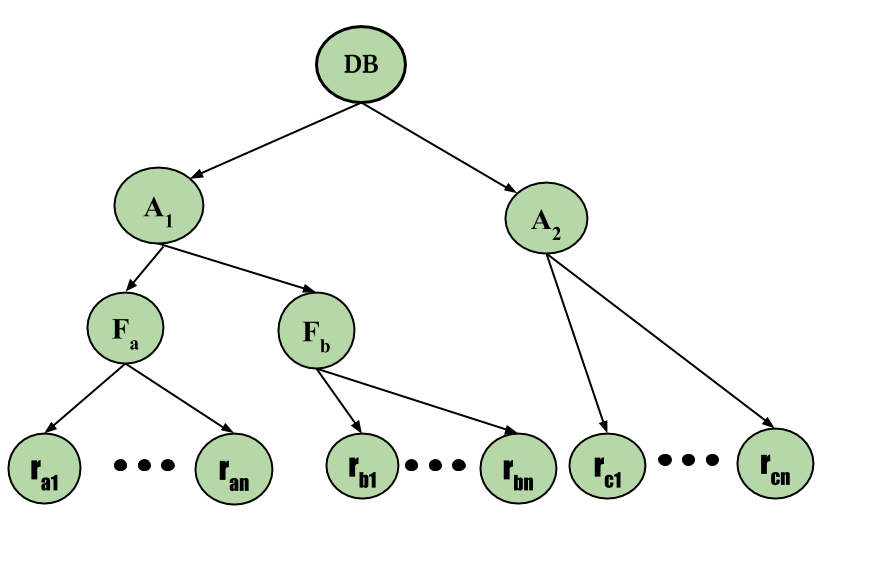

# DB Locking에 대해 설명해 주세요.
*병행 트랜잭션이 가능한 환경에서*, 변경중인 record를 다른 transaction들이 접근하지 못하도록 막음으로써, 병행 수행 문제를 해결하려는 접근 방법입니다.  
이러한 Locking을 위한 규약(Protocol)으로는 `Shared Locking Protocol`, `2PLP(2-Phase Locking Protocol)`, `Multiple Granularity Locking Protocol` 이 있습니다.  
## 병행 트랜잭션(Concurrent Transaction) 이란?
동시에 실행되고 있는 둘 이상의 트랜잭션을 의미합니다.
### 병행 트랜잭션의 장점
#### DB의 공용도(Sharability) 제고
#### 응답시간(Response Time) 단축
#### 시스템 활용도(System Utilization) 증대
### 병행 트랜잭션의 동시성 문제
병행 트랜잭션의 병행 수행률이 상승할수록, 아래와 같은 병행 문제들의 발생률도 상승합니다.    
설명의 편의를 위해 병행 실행되는 트랜잭션 두 가지를 아래에서 T1, T2라고 부르도록 하겠습니다.
#### 갱신 분실(Lost Update)

두 트랜잭션이 병렬로 같은 데이터를 읽고 갱신하는 과정에서, 한 트랜잭션이 다른 트랜잭션의 갱신 값을 덮어쓰는 문제입니다.
예시) T1이 연산 후 갱신 작업을 수행한 뒤, 이후에 T2가 갱신된 값이 아닌 이전의 값을 기준으로 연산 후 갱신 작업을 수행해 T1의 갱신이 무효화 됩니다.
#### 모순적 읽기(Inconsistent Read) 
두 트랜잭션이 병렬로 같은 데이터를 읽고 갱신하는 과정에서, 데이터 불일치가 발생하는 문제입니다.
##### Dirty Read

격리성 수준이 `Read Uncommitted` 이하인 환경에서 발생가능한 문제로, 한 트랜잭션이 다른 트랜잭션으로부터 **커밋되지 않은 값을 읽어 발생**하는 문제입니다.  
예시) T1이 커밋되기 전, 중간에 T2가 T1에서 작업하던 데이터(*T1의 **수정**이 **반영되지 않은***)을 읽고 작업을 수행해 T1 연산 이전의 값으로 T2가 수행되게 됩니다. 이는 정확하지 않거나 일관되지 않은 결과를 야기할 수 있습니다.  
##### Non-repeatable Read

같은 데이터를 한 트랜잭션 내에서 읽었음에도, 둘의 값이 다른 문제입니다.  
예시) T1이 한 데이터를 두 번 읽을 때, 중간에 T2가 해당 데이터의 값을 변경한 뒤 커밋하게 되면 두 번째로 읽었을 때의 값은 처음 읽었던 값과 다르게 됩니다.  
##### Phantom Read

같은 조건에 대한 검색을 한 트랜잭션 내에서 수행했음에도, 다시 읽으려 할 때 이전에 존재하던 값이 없어지거나, 새로운 값이 추가로 검색되는 문제입니다.  
예시) T1이 한 데이터를 두 번 읽을 때, 중간에 T2가 해당 데이터를 삭제한 뒤 커밋하게 되면 두 번째로 읽었을 때 해당 데이터는 존재하지 않게 됩니다.  
#### 연쇄적 롤백(Cascading Rollback)

한 트랜잭션이 갱신한 데이터를 다른 트랜잭션이 또 다시 갱신한 뒤, 앞선 트랜잭션을 롤백하려할 때 이후 실행했던 트랜잭션도 롤백해야 하나 이미 해당 트랜잭션은 완료되어 롤백이 불가능한 문제입니다.  
예시) T1이 한 데이터를 갱신한 뒤, T2이 해당 데이터를 또 갱신한 뒤 완료처리한 상태에서 T1을 롤백하려 하면 T2이 처리한 부분에 대해서는 롤백이 불가능하게 됩니다.  
## Transaction Schedule이란?
트랜잭션들이 연산을 실행하는 순서를 의미합니다.  
스케줄의 개수는 `Interleaving(트랜잭션을 쪼개서 수행하는 것)`이 가능한 경우 거의 무한대이고, 허용되지 않으면 $n!$ 개 입니다.  
병행 수행상 문제가 야기되느냐 그렇지 않느냐에 따라 직렬/비직렬 스케줄로 나뉩니다.  
### 직렬 스케줄(serial Schedule)
스케줄에 포함된 모든 트랜잭션이 하나씩 실행되는 스케줄을 의미합니다.  
병행 수행의 문제가 발생하지 않으나, 병행 트랜잭션으로 실행되지 않게 됩니다.  
### 비직렬 스케줄(non-serial Schedule)
스케줄에 포함된 모든 트랜잭션이 서로 interleaved되는 스케줄을 의미합니다.  
#### 직렬 가능 스케줄(serializable Schedule)
어떤 직렬 스케줄과 **동등**한 비직렬 스케줄을 의미합니다.  
**모든 충돌 직렬 가능 스케줄**은 **뷰 직렬 가능 스케줄**이지만, ***역은 성립하지 않습니다***.  
##### 충돌 직렬 가능 스케줄
비직렬 스케줄 S에 대해 **충돌 동등**한 직렬 스케줄 S'가 존재하면, S를 `충돌 직렬 가능 스케줄` 이라고 합니다.  
##### 뷰 직렬 가능 스케줄
비직렬 스케줄 S에 대해 **뷰 동등**한 직렬 스케줄 S'가 존재하면, S를 `뷰 직렬 가능 스케줄` 이라고 합니다.  
#### 스케줄 동등
##### 결과(result) 동등
결과가 동일한 스케줄을 의미합니다.
##### 충돌(conflict) 동등
충돌 연산의 순서가 동일한 스케줄을 의미합니다.
##### 뷰(view) 동등
스케줄 S1, S2에 포함된 트랜잭션이 같고 아래 조건을 만족하는 경우를 의미합니다.  
1. S1에서 $T_i$가 $x$의 초기 값을 읽는다면, S2에서도 그러해야 합니다.
2. S1에서 $T_i$의 모든 read(x)가 $T_j$가 write한 x값을 읽는다면, S2에서도 그러해야 합니다.
3. S1에서 $T_i$가 write(x)를 마지막으로 수행하면, S2에서도 그러해야 합니다.
## Lock 이란?
DB상의 데이터 항목에 대한 잠금장치입니다.  
Lock이 걸린 데이터 항목은 Lock을 건 트랜잭션만 접근할 수 있습니다.  
Lcok은 Lock을 건 트랜잭션에 의해서만 Unlock할 수 있습니다.  
### Lock의 종류
#### 공용 로크(Shared Lock, S-Lock)
다른 트랜잭션이 해당 데이터를 Read 할 수 있습니다.
#### 전용 로크(Exclusive Lock, X-Lock)
다른 트랜잭션이 해당 데이터를 Read/Write 할 수 없습니다.
### 로크 단위(Lock granularity)
row, table, database 등 Locking할 자원의 크기를 말합니다.  
단위의 크기가 커질수록 병행성 수준은 낮아지고, 병행 제어 기법은 간단해집니다.  
### 로크 호환성 (Lock Compatibility)
이미 자원에 특정 Lock이 설정되어 있는 경우, 다른 트랜잭션도 해당 자원에 대해 Lock을 설정할 수 있는지 여부를 말합니다.  

|  |  |  |
| ---- | ---- | ---- |
| 구 분 | Request S-lock | Request X-lock |
| S-locked data item | ok | not ok |
| X-locked data item | not ok | not ok |
|  |  |  |
## Locking Protocol
아래 설명된 Protocol들 이외에도 기본적인 Locking Protocol은 다음과 같습니다.
- 트랜잭션 T가 x에 대해 read(x)/write(x) 연산을 하려면 먼저 lock(x) 연산을 실행해야 한다.
- 트랜잭션 T가 실행한 lock(x)에 대해서는 T가 모든 실행(Task)을 종료하기 전에 unlock(x) 연산을 수행해야 한다.
- 트랜잭션 T는 *다른 트랜잭션에 의해 lock이 걸려있는* x에 대해 **lock(x)** 를 **실행할 수 없다**.
- 트랜잭션 T는 *자신이 lock을 걸지않은 x*에 대해 **unlock(x)** 을 **실행할 수 없다**.
### `Shared Locking Protocol(공용 로킹 규약)`
- 트랜잭션 T는 **read(x)** 전 반드시 <mark style="background: #ADCCFFA6;">lock-S(x)</mark> 또는 <mark style="background: #FFB86CA6;">lock-X(x)</mark>를 실행해야 함.
- 트랜잭션 T는 **write(x)** 전 반드시 <mark style="background: #FFB86CA6;">lock-X(x)</mark>를 실행해야 함.
이러한 규약 때문에 공용 로킹 규약은 **`직렬가능성(serializability)`** 을 보장하지 못합니다.
- **`직렬가능성(serializability)`** : 비직렬 스케줄을 직렬 스케줄로 변환할 수 있는지를 의미합니다.
### `2PLP(2-Phase Locking Protocol, 2단계 로킹 규약)`
lock만 가능한 Phase와 unlock만 가능한 phase를 나누어 로킹을 수행하는 규약입니다.  
`직렬가능성`을 **보장**하지만, **`Deadlock`** 문제가 존재하는 규약입니다.  
변형으로는 `Strict 2PLP`, `Rigorous 2PLP`가 존재하며, 상용 DBMS에서는 이 둘 중 하나를 사용합니다.  
#### 1 단계(Growing Phase)
- 트랜잭션은 계속해 lock을 획득할 수 있으나, unlock 연산은 실행할 수 없습니다.
#### 2 단계(Shrink Phase)
- unlock 연산만 실행할 수 있으며, 일단 Lock을 해제하면 더 이상 lock을 획득할 수 없습니다.
##### Strict 2PLP(엄밀 2단계 로킹 규약)
- 2PLP에 '모든 **X-lock**은 *트랜잭션 완료시까지* **unlock 할 수 없다**'는 규칙이 추가된 형태입니다.
- **구현이 어려우나 성능이 높고**, **`연쇄 복귀 문제(Cascading Rollback)`** 가 발생하지 않습니다.
##### Rigorous 2PLP(엄격 2단계 로킹 규약)
- 2PLP에 '모든 **lock**은 *트랜잭션 완료시까지* **unlock 할 수 없다**'는 규칙이 추가된 형태입니다.
- **구현은 쉬우나 성능이 낮다**는 단점이 있습니다.
### `Multiple Granularity Locking Protocol(다중 단위 로킹 규약)`
병행성 수준을 감소시키지 않기 위해, 필요 이상의 크기로 locking 하지 않는 방법입니다.
- 로킹 계층 트리 : DB -> 구역(Area) -> 파일(File) -> 레코드(Record)

# Optimistic Lock/Pessimistic Lock에 대해 설명해 주세요.
## 낙관적 로크(Optimistic Lock)
다른 트랜잭션과 충돌하지 않는다고 가정하고, 별도의 Locking 없이 자원에 접근하는 것을 말합니다.  
병행 제어를 위해 아래 세 과정을 수행하며, 각 과정마다 Start(T), Validation(T), Finish(T) 세 가지의 **`타임스탬프`** 를 사용합니다.
- **`타임스탬프`** : 시스템에서 **트랜잭션**을 **유일하게 식별**하기 위해 부여한 **식별자(identifier)** 로, 트랜잭션이 **시스템에 들어온 순서대로** 부여합니다.
### 과정
1. 자원에 대해 Lock을 겁니다.
2. 트랜잭션을 실행합니다.
3. 자원에 대해 Unlock을 수행합니다.
## 비관적 로크(Pessimistic Lock)
다른 트랜잭션과 충돌한다고 가정하고, 트랜잭션을 처리하기 전에 자원에 대해 Locking을 시도하는것을 말합니다.
### 과정
1. `판독 단계(Read Step)` : 트랜잭션에 필요한 자료를 DB로 부터 읽어 **Local Working Area에 복사**합니다. 이후 **모든 갱신은 사본을 대상**으로 수행합니다.
2. `확인 단계(Validation Step)`: **직렬(Serialization) 가능성 위반 여부**를 **검사**합니다.
3. `기록 단계(Write Step)`: 확인 단계를 통과하면 **DB에 반영**하고, *통과하지 못했다면 실행 결과는 취소*하고 트랜잭션은 복귀합니다.
# 물리적인 Lock을 건 상황에서 트랜잭션이 비정상 종료된 경우 Lock을 해제할 해결책이 있는가? 없다면 직접 해결 가능한가?
잘 설계된 DBMS에서는 Lock이 오랫동안 유지되어 Deadlock과 같은 상황을 발생시키지 않도록 여러 대비책을 갖고 있으며, 대부분의 DBMS에서는 Lock 관리를 위한 기능을 제공합니다.
## Lock Timeout
Lock을 걸 때, 타임아웃을 설정해 일정시간이 지나면 자동으로 Lock을 해제하도록 합니다.
## Deadlock Detection
교착상태가 발생하면 사후에 트랜잭션들 중 하나를 강제종료(`rollback`) 시키는 조치를 취하는 방식입니다.
## 일반적인 회복 방법
이외에도 Redo, Undo와 같은 회복 방법을 통해 트랜잭션으로 손상된 부분을 회복시킬 수 있습니다.
### Redo (Media Recovery)
비소멸장치(디스크, 테이프 등)의 내용 손상에 대한 회복 기법입니다.  
가장 최근의 복제본(dump)을 적재시키고, 해당 복제본 이후의 변경을 log를 이용해 재실행하여 DB를 복원합니다.
### Undo
log를 이용해 모든 변경을 취소시키므로써 DB를 복원합니다.
### 소멸 장치의 정보 회복
#### Log 이용 회복
트랜잭션이 Write 연산을 실행하거나, 트랜잭션의 시작/완료/철회와 같은 특별 활동시 기록되는 Log를 활용해 회복하는 방법입니다.  
Log는 `On-line log(실행중인 트랜잭션에 대한 로그)`, `Archival log(누적되는 로그를 안정 저장장치에 저장한 것)`로 나뉩니다.  
##### 지연 갱신(Deferred Update)의 회복
트랜잭션이 부분 완료될 때 까지 DB 변경내역을 log에 전부 기록한 뒤, 부분 완료되면 보류시킨 Output 연산을 log를 사용해 처리합니다.  
트랜잭션 **실행 중 장애가 발생**했다면 **처음부터 다시 실행**하고, **완료 후 장애가 발생**했다면 **Log을 사용해 트랜잭션을 Redo** 합니다.  
##### 즉시 갱신(Immediate Update)의 회복
트랜잭션이 실행되는 동안 발생한 변경 내용을 DB에 그대로 반영해 처리합니다.  
트랜잭션 **실행 중 장애가 발생**했다면 해당 **트랜잭션에 대한 Undo**를 실행하고, **완료 후 장애가 발생**했다면 **트랜잭션을 Redo** 합니다.  
#### 검사시점(Check Point) 회복
*Log를 이용할 경우* Redo/Undo 대상 트랜잭션을 찾기위해 **log 전체를 조사**하거나,**불필요한 Redo를 반복**한다는 **문제를 해결**하기 위해 일정 간격으로 **CheckPoint를 설치**해 이를 사용하는 기법입니다.  
Log를 차례로 검사하며 트랜잭션의 start를 만났다면 해당 트랜잭션을 Undo-list에, 트랜잭션의 commit을 만났다면 Undo-list에서 삭제하고 Redo-list에 추가합니다. 이후 Undo-list의 트랜잭션을 log에 기록된 역순으로 Undo를, Redo-list의 트랜잭션을 log에 기록된 순서로 Redo를 수행합니다.
#### 그림자 페이징(Shadow Paging) 기법
트랜잭션을 실행하는 동안 2개의 page table을 유지하는 방법입니다.  
current page table은 write 연산을 실행할 때 변경하며, shadow page table은 트랜잭션 실행 직전의 상태를 유지합니다.  
트랜잭션 완료 전 장애가 발생한 경우 shadow page table을 복사해 실행 직전으로 복귀시킵니다.

# 참고 자료
- 전공과목 자료
- [Isolation (database systems) - Wikipedia](https://en.wikipedia.org/wiki/Isolation_(database_systems))
- [Dirty Read in SQL - GeeksforGeeks](https://www.geeksforgeeks.org/dbms-dirty-read-in-sql/)
- [Concurrency problems in DBMS Transactions - GeeksforGeeks](https://www.geeksforgeeks.org/concurrency-problems-in-dbms-transactions/)
- [동시성제어개요 - 지식덤프](http://www.jidum.com/jidums/view.do?jidumId=282)
- [Serializability in DBMS - GeeksforGeeks](https://www.geeksforgeeks.org/serializability-in-dbms/)
- [Chapter 5. Locking - Hibernate Community Documentation](https://docs.jboss.org/hibernate/orm/4.1/devguide/en-US/html/ch05.html)
- [Lock Based Concurrency Control Protocol in DBMS - GeeksforGeeks](https://www.geeksforgeeks.org/lock-based-concurrency-control-protocol-in-dbms/)
- [Optimistic locking - IBM Documentation](https://www.ibm.com/docs/en/db2/11.5?topic=overview-optimistic-locking)
- [How Optimistic Locks Work - SAP Documentation](https://help.sap.com/doc/saphelp_nw73ehp1/7.31.19/en-us/47/dc35af5bc33b8be10000000a421937/content.htm?no_cache=true)
- [Reference: Physical Locks (Magic xpa 3.x) - Salesforce](https://magicsoftware.my.salesforce-sites.com/PublicKnowledge/articles/bl_Reference/Physical-Locks-xpa-3x)
- [Multiple Granularity Locking in DBMS - GeeksforGeeks](https://www.geeksforgeeks.org/multiple-granularity-locking-in-dbms/)
- [MySQL :: MySQL 8.0 Reference Manual :: 17.7.1 InnoDB Locking](https://dev.mysql.com/doc/refman/8.0/en/innodb-locking.html)
