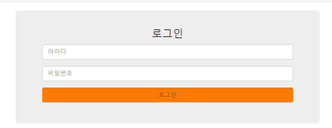
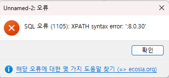
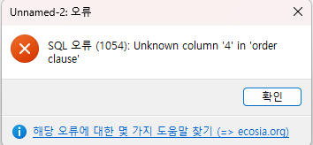

## SQL Injection에 대해 설명해 주세요.
`SQL Injection`이란, *데이터베이스를 사용하는* 웹 애플리케이션을 공격하는데 사용되는 `코드 인젝션 공격 기법`을 말합니다.  
주로 공격자가 `입력 필드`에 `악성 SQL 문`을 삽입해 실행시키는 방식으로 공격하며, `데이터베이스의 정보`를 불법적으로 `열람` 또는 `조작`할 수 있는 취약점입니다.  
`Injection` 공격은 오픈소스 웹 애플리케이션 보안 프로젝트인 [OWASP](https://owasp.org/)에서 매년 [상위 10대 취약점](https://owasp.org/www-project-top-ten/)에서 근 20년간 상위권을 차지하고 있으며, 단순히 신원 위조, 기존 데이터 변조와 같은 공격 뿐만 아니라 관리자 탈취, 데이터 삭제, 시스템 데이터 공개와 같이 `시스템에 치명적인 공격`을 불러올 수 있습니다.  

### 공격 유형
`SQL Injection`은 기본적으로 `데이터 입력` 란에 `메타 문자`(`''`, `OR` 등 SQL문을 이루는 문자들)를 삽입해 기존에 존재하지 않던 SQL 명령을 `제어 영역(control plane, SQL 명령어 및 관련 구조가 위치하는 영역. ~= user input)`에 배치하는 방식으로 이뤄집니다.  
이러한 구조적 결함은 SQL이 `제어 영역`과 `데이터 영역(data plane, 실제 데이터 값이 위치하는 영역. ~= SQL Query)`을 구분하지 않고, 단순히 문자열로 된 명령을 실행한다는 점에서 기인합니다.  
`SQL Injection`은 크게 아래 3가지 유형으로 구분됩니다.  

#### 에러 기반 SQL 인젝션(Error-based SQL Injection)
`에러 기반 SQL 인젝션`은 데이터베이스 서버에서 발생한 `오류 메세지`를 바탕으로 현재 API가 `어떤 SQL 명령`을 호출하는지, `데이터베이스 구조`는 어떤지 등의 `정보`를 얻어내 공격하는 기법입니다.  
이는 공격당하는 `웹 애플리케이션` 서버가 *SQL 쿼리 수행시 발생한* `오류`를 `HTTP 응답`으로 `반환`하도록 동작하는 경우 가능한 공격입니다.  

##### 예시


위와 같은 입력 폼으로 아이디, 비밀번호를 입력받아 로그인을 수행하는 웹 애플리케이션이 있다고 가정하겠습니다.  
위 애플리케이션이 구동되는 Spring 서버에서는 DB에서 일치하는 유저를 불러오기 위해 다음과 같은 코드가 동작하게 됩니다.  

```java
{
	...
	Statement st = conn.createStatement();
	ResultSet rs = st.executeQuery(
	"SELECT * FROM member WHERE userid = '" + ID + "' AND userpw ='" + PW + "'");
}

```

즉, DB에서는 다음과 같은 SQL문이 동작하게 될 것입니다.

```sql
SELECT * FROM member WHERE userid ='$ID' AND userpw ='$PW'
```

이때, pw에 `'OR 1=1 --`를 입력하거나 `extractvalue()` 함수 등을 사용해 DB 정보를 탈취할 수 있습니다.  
`OR 1=1 --`는 `WHERE` 절의 조건을 항상 참이 되도록 하고, 이어지는 조건들을 `--`를 통해 `주석 처리`하게 됩니다. 따라서 id에 (실제 서비스에 가입된) id중 어떤 것을 입력해도 로그인할 수 있게 됩니다.  
`extractvalue(xml_frag, xpath_expr)` 함수의 경우 `XML`과 `XPath 표현식`을 인자로 받아, `XML`에서 `XPath 표현식`에 일치하는 데이터를 추출 및 반환하는 함수입니다.  
이때, `두 번째 인수`에 유효하지 않은 XPath 표현식이 사용될 경우 `XPATH syntax error`를 통해 해당 인수 값을 `출력`하게 되는데, 이것이 `SQL 쿼리`일 경우 `실행 결과를 에러 메시지에 포함`한다는 점을 활용해 공격에 사용됩니다.  
따라서 두 번째 인수에 콜론(`':'` 또는 `0x3a`(16진수 표현)을 사용)을 맨 앞에 추가하므로써 항상 유효하지 않은 `XPath 표현식`을 만들고, `concat()`으로 뒤에 실제 실행할 `SQL 쿼리`를 넘겨 정보 탈취를 시도합니다.  
가령 PW에 `' AND extractvalue(rand(),concat(0x3a,version()))--` 라는 구문을 넣게 된다면 실제 SQL 쿼리 문은 다음과 같게 될것입니다. (`version()`은 현재 MySQL 버전을 반환하는 함수입니다.)  

```sql
SELECT * FROM member WHERE userid ='' AND userpw ='' AND extractvalue(rand(),concat(0x3a,version()))--'
```

이를 실행하면 아래 그림처럼 서버의 MySQL 버전을 `에러와 함께 반환`하게 됩니다.  


이를 통해 공격자는 `DB 버전`, `DB 명`, `테이블 명`, `컬럼 명` 등 다양한 데이터들을 추출할 수 있게 됩니다.  

#### UNION 기반 SQL 인젝션(Union-based SQL Injection)
`UNION 기반 SQL 인젝션`은 웹 애플리케이션이 `DB 질의한 결과`를 `HTTP 응답`에 포함해 반환하는 경우, `SQL`문을 조작하여 `DB 구조 및 데이터`를 `탈취`하는 공격 기법입니다.  
이때, *원래 애플리케이션이 반환할 데이터는 필요하지 않으므로* `음수 값`과 같이 DB에 존재하지 않을만한 값을 `입력 값으로 전달`하고, 이후 `UNION` 또는 `UNION ALL`을 이용해 DB의 다른 데이터 값을 추출하는 `SQL 쿼리를 덧붙여` 서버에 전달하게 됩니다.  

##### `UNION`과 `UNION ALL`
`UNION`과 `UNION ALL`은 **두 개 이상**의 `SELECT 쿼리 결과`를 하나로 합쳐주는 집합 연산자로, 이때 합쳐질 쿼리들은 다음 조건을 만족해야 합니다.  
1. 각 쿼리들은 `SELECT`절에서 `동일한 갯수`의 `열`을 사용해야 한다.  
2. 각 쿼리에서 `동일한 순서의 컬럼들`은 서로 호환되는 자료형을 가져야 한다.  

또한, `UNION`은 쿼리 결과값 통합시 중`복된 레코드를 제거`하는 반면, `UNION ALL`은 *중복 제거 절차 없이* `모든 레코드들을 반환`한다는 차이가 있습니다.  

##### 예시
쇼핑몰 웹 애플리케이션에서 물품의 ID를 사용자로 부터 입력받으면, 해당 물품의 `ID`, `이름`, `가격`을 조회하는 API가 있다고 가정하겠습니다.  
해당 API가 DB에 요청할 SQL 쿼리는 다음과 같을 것입니다.  

```sql
SELECT item_id, item_name, item_price 
FROM item 
WHERE item_id = '$item_id';
```

또한, 해당 API는 HTTP 응답으로 이름과 가격, 즉 `item_name`, `item_price`를 반환합니다.

이러한 상황에서 ID로 `-99 UNION ALL SELECT version(), database(), 2--`를 전달한다면 SQL 쿼리는 다음과 같이 바뀌게 됩니다.

```sql
SELECT item_id, item_name, item_price 
FROM item 
WHERE item_id = -99 
UNION ALL 
SELECT version(), database(), 2--;
```

당연히 상품 ID가 음수인 상품은 존재하지 않을 것이므로 상품 데이터는 전혀 반환되지 않고 `UNION`으로 결합한 `SELECT` 쿼리에 포함된 `SQL 서버 버전`, `DB명`, `숫자(컬럼 갯수 및 타입을 맞추기 위한 임의 값)`를 반환하게 됩니다.  

##### 열 갯수 알아내기
그리고 `UNION`에서 열의 갯수를 맞춰야 하는 조건 때문에, 현재 쿼리의 컬럼 갯수를 알아야 할 수 있습니다.  
이때 `ORDER BY` 절을 활용하면, 원래의 `SQL 쿼리`의 열 갯수를 알아낼 수 있습니다.  
`ORDER BY` 절에서 정렬 기준 컬럼을 지정할 때, 열 이름을 직접 기입할 수도 있지만 `해당 컬럼의 순번`을 기입할 수도 있습니다.  
즉, 위 케이스의 경우 `ORDER BY 3`을 기입하면 `SQL 쿼리`의 세 번째 컬럼인 `item_price`를 기준으로 정렬하게 됩니다.  
이러한 순번은 `SQL 쿼리가 불러올 컬럼 갯수`만큼 배정되므로 `해당 갯수 이상의 숫자`를 기입하게 되면 다음과 같은 `오류가 발생`하게 됩니다.  



따라서 `ORDER BY` 문에 기입할 순번을 하나씩 `차례대로 증가`시키다가 `DB에서 오류가 발생`하거나 `비정상 응답을 반환`하게 되면, 바로 전의 순번이 원래의 SQL문의 `컬럼 갯수`와 같게되는 것입니다.  

#### 블라인드 SQL 인젝션(Blind SQL Injection)
`블라인드 SQL 인젝션`은 *상기한 SQL 인젝션들과 달리*, 웹 애플리케이션이 `HTTP 응답`에 `DB 오류 메시지`나 `데이터`를 포함하지 않을때 사용할 수 있는 공격 기법입니다.  
즉, *서버의 직접적인 응답 대신* `알고싶은 정보가 포함된 특정 조건`을 SQL 쿼리에 포함시켰을때 `HTTP 응답`의 `상태`가 달라지거나, `응답에 걸리는 시간`의 차이를 통해 해당 조건이 `참인지 거짓인지` 알아내므로써 데이터베이스 내 `정보를 유추`하는 공격 기법입니다.  
크게 응답의 차이를 통해 유추하는 `불린 기반` 방식과 서버의 응답 시간 차이를 통해 유추하는 `시간 기반` 방식이 있습니다.  

##### 블라인드 불린 기반 SQL 인젝션(Blind Boolean-Based SQL Injection)
`블라인드 불린 기반 SQL 인젝션`은 `SQL 쿼리`의 `참/거짓`여부에 따른  `HTTP 응답 내용`, `상태 코드` 등의 `차이가 존재`할 때 이를 통해 `정보를 유추`할 수 있는 공격 기법입니다.  

###### 예시
게시판 애플리케이션에서 게시글 id를 URL 인자로 받아 게시물을 불러오는 API를 예시로 들어보겠습니다. 해당 API는 다음과 같은 SQL 쿼리를 요청합니다.  

```sql
SELECT subject, content, author  
FROM board  
WHERE id='$id'
```

만약 올바른 게시글 id를 전달받았다면 정상적으로 해당 게시글을 가져올 것이고, 그렇지 않다면 아무것도 반환하지 않을 것입니다.  
예를 들어 id를 `1 AND 1=0--` 로 넘겼다면 SQL문은 다음과 같게 됩니다.  

```sql
SELECT subject, content, author  
FROM board  
WHERE id=1 AND 1=0--
```

우리가 넘긴 `AND 1=0` 조건 때문에 게시물 조회 `SQL 쿼리`는 거짓이 되어 아무 것도 불러올 수 없을 것입니다. 반면 `1 AND 1=1 --`을 넘겼다면 정상적으로 게시물을 조회해올 것입니다.  
이를 바탕으로 데이터베이스의 이름을 알아내고 싶다고 가정해보겠습니다.  
그렇다면 먼저 DB 이름의 길이를 알아내야 하므로, SQL의 `LENGTH()`을 활용합니다.  
id로 `1 AND LENGTH(database()) = 1 --`, `1 AND LENGTH(database()) = 2 --`, ... 처럼 점점 값을 증가시키며 응답이 정상적으로 반환될 때 까지 반복합니다.  

```sql
1 AND LENGTH(database())=1--+                (결과:거짓)
1 AND LENGTH(database())=2--+                (결과:거짓)
1 AND LENGTH(database())=3--+                (결과:참) <- 현재 DB의 이름의 길이는 3임
```

이후 한글자 한글자씩 비교하며 DB 이름의 각 자리가 무엇인지 확인합니다. 이때 `SUBSTRING()` 함수를 활용합니다.  

```sql
1 AND SUBSTRING(database(), 1, 1)='a'--+                (결과:거짓)
1 AND SUBSTRING(database(), 1, 1)='b'--+                (결과:거짓)
1 AND SUBSTRING(database(), 1, 1)='c'--+                (결과:참) <- 현재 DB의 이름의 첫 글자는 'c'임
```

이를 반복해 알아낸 각 자리의 문자들을 결합하면 DB의 이름을 알아낼 수 있습니다.  

##### 블라인드 시간 기반 SQL 인젝션(Blind Time-Based SQL Injection)
`블라인드 불린 기반 SQL 인젝션`은 `SQL 쿼리`의 `참/거짓`여부에 따른  `HTTP 응답 내용`, `상태 코드` 등의 차이가 존재를 `확인할 수 없지만`, 서버 응답 시간을 제어할 수 있을 경우 사용 가능한 공격 기법입니다.  
즉, 기존 `SQL 쿼리`에 `특정 조건`이 참일 경우 `응답을 지연시키는 함수`를 사용해 해당 조건의 참/거짓 여부를 판별하게 됩니다.  
응답 시간을 제어하는 함수는 DBMS별로 상이하며, 예시로 들 `MySQL`(및 `MariaDB`)의 경우 `sleep()` 함수를 사용합니다.  

###### 예시
위와 마찬가지로 게시판 애플리케이션에서 게시물 조회 API를 사용한다고 가정하겠습니다.  
이때 id로 `1 AND if(1=1, sleep(5), false)--` 와 같은 구문을 전달했을 때 기존 `SQL 쿼리`에 정상적으로 포함된다면, SQL문은 다음과 같게 됩니다.  

```sql
SELECT subject, content, author  
FROM board  
WHERE id=1 AND if(1=1, sleep(5), false)--
```

이때 if문이 동작하기 때문에 첫 번째 인자로 주어진 조건식인 `1=1`이 참이므로, 서버는 `5초간 대기` 상태에 있다가 응답하게 될 것입니다.  
이를 바탕으로 *불린 기반 공격 처럼*, 조건문에 `원하는 정보에 대한 조건`을 포함해 API 요청을 반복하므로써 원하는 정보를 알아낼 수 있습니다.  

```sql
1 AND if(LENGTH(database())=1, sleep(5), false)--+                (결과:거짓)
1 AND if(LENGTH(database())=2, sleep(5), false)--+                (결과:거짓)
1 AND if(LENGTH(database())=3, sleep(5), false)--+                (결과:참) <- 현재 DB의 이름의 길이는 3임
```

### 방어법 [#](https://cheatsheetseries.owasp.org/cheatsheets/SQL_Injection_Prevention_Cheat_Sheet.html)
이러한 `SQL 인젝션`을 방지하기 위해서는 ① `문자열들을 연결`해 `동적 SQL 쿼리`를 `생성하지 않거나`, ② 실행된 쿼리에 `악성 SQL 입력`이 `포함되지 않도록` 해야 합니다.  

#### Prepared Statement 사용하기
`준비된 구문(Prepared Statement)`, 또는 `파라미터화 된 쿼리(Parameterized Query)`를 사용하게 되면 `동적 쿼리`보다 쿼리를 작성 및 이해하는데 쉬우며, 개발자가 먼저 SQL 쿼리를 정의한 뒤 이후에 각 매개변수들을 쿼리에 전달하도록 합니다.  
또한 DB 쿼리가 이러한 형태를 띄는 경우 DB는 사용자 입력에 상관없이 항상 코드와 데이터를 구분합니다. 그리고 공격자가 SQL 명령을 삽입해도 쿼리의 원래 의도를 변경할 수 없도록 보장합니다.  

```java
// 코드 예시

// 매개변수로 사용될 해당 인자는 꼭 검증하는 것이 좋습니다.
String custname = request.getParameter("customerName");
String query = "SELECT account_balance FROM user_data WHERE user_name = ? ";
PreparedStatement pstmt = connection.prepareStatement( query );
pstmt.setString( 1, custname);
ResultSet results = pstmt.executeQuery( );
```

Java의 `PreparedStatement`, C# .NET의 `OleDbCommand` 등이 이를 구현하고 있으며 이외에도 Ruby, PHP, Perl 등 다양한 언어에 `Prepared Statement` 구현체가 존재합니다.  
또한 `SQL 인젝션`과 유사한 `HQL 인젝션`이 존재하는 SQL 추상화 계층인 `HQL(Hibernate Query Language)`에도 `Prepared Statement` 형태의 구현체가 존재합니다.  

#### Stored Procedures 사용하기
`저장 프로시저 (Stored procedure)`란 DBMS에 저장되어 재사용 및 공유할 수 있는 일련의 `SQL 쿼리 집합`입니다.  
`Stored Procedure`가 항상 `SQL 인젝션`으로 부터 안전하지 않지만, 특정 표준 `Stored Procedure`를 사용하면 `Parameterized Query`를 사용하는 것과 동일한 효과를 갖게 됩니다.  
다만, `Stored Procedure`를 사용할 경우 오히려 시스템이 노출될 경우의 위험을 증가시킬 수 있습니다.  
가령 `db_datareader`, `db_datawriter`, `db_owner`세 가지 기본 역할이 존재하는 `MS SQL Server`에서는 `Stored Procedure` 실행을 위해 `실행 권한(Execute right)`이 필요하며, 만약 이 세가지 역할만 사용하는 서비스라면 웹앱이 `db_owner` 역할로 실행되어야 `Stored Procedure`를 사용할 수 있게 됩니다.  
따라서 사용자에게 읽기 접근 권한만 할당하기 위해 `db_datareader` 역할을 할당하는게 불가능해지며, 공격자는 DB에 대한 모든 권한을 얻게 됩니다.  

```java
String custname = request.getParameter("customerName");
try {
  // Stored Procedure를 호출할 때, 매개변수들을 인자로 전달한다.
  CallableStatement cs = connection.prepareCall("{call sp_getAccountBalance(?)}");
  cs.setString(1, custname);
  ResultSet results = cs.executeQuery();
  // … result set handling
} catch (SQLException se) {
  // … logging and error handling
}
```

##### 입력 허용 목록을 통한 유효성 검사
만약 사용자 입력에 의해 변경될 값이 `테이블 이름`, `컬럼 명` 처럼 `바인드 변수`를 할당할 수 없는 위치라면 쿼리를 재설계 하거나, 설명할 `입력 유효성 검사`를 수행하는 것이 알맞은 방어책 입니다.  
이때, `테이블` 또는 `컬럼 명`을 사용자 매개변수 값을 통해 전달 받을 경우, 해당 값이 다른 테이블의 다른 컬럼을 이름을 가질 수도 있습니다.  
이러한 경우 근본적으로 이를 막도록 `코드를 재작성` 하는것이 좋지만, 이는 현실적으로 쉽지 않습니다.
따라서 사용자 매개변수를 `예상 가능한 테이블`에 매핑하여 `유효하지 않은 사용자 입력`이 쿼리에 `포함되는 것을 막아야` 합니다.  

```java
String tableName;
// 사용자 매개변수 값에 따라 tableName을 코드에서 지정합니다.
switch(PARAM):
  case "Value1": tableName = "fooTable";
                 break;
  case "Value2": tableName = "barTable";
                 break;
  ...
  default      : throw new InputValidationException("unexpected value provided"
                                                  + " for table name");
```

추가로, 꼭 동적 쿼리를 사용해야 한다면 동적 쿼리에 SQL 구문을 삽입할 수 없도록 `API` 또는 `StoredProcedure`의 매개변수를 가능한 문자열이 아닌 타입으로 받는것이 좋습니다.  
즉, 예를 들어 `Date`, `Number`, `boolean`, `enum` 등으로 받게 된다면 안전하게 사용자로부터 입력을 받는것이 가능합니다.  

```java
public String someMethod(boolean sortOrder) {  String SQLquery = "some SQL ... order by Salary " + (sortOrder ? "ASC" : "DESC");`  ...
```

## ~~그렇다면, 우리가 서버 개발 과정에서 사용하는 수많은 DB 라이브러리들은 이 문제를 어떻게 해결할까요?~~


# 참고
- [Types of SQL Injection (SQLi) - GeeksforGeeks](https://www.geeksforgeeks.org/types-of-sql-injection-sqli/)
- [SQL Injection Attack: How It Works, Examples and Prevention (brightsec.com)](https://brightsec.com/blog/sql-injection-attack/)
- [SQL 인젝션 (SQL Injection) - MDN Web Docs 용어 사전: 웹 용어 정의 | MDN (mozilla.org)](https://developer.mozilla.org/ko/docs/Glossary/SQL_Injection)
- [SQL Injection Prevention - OWASP Cheat Sheet Series](https://cheatsheetseries.owasp.org/cheatsheets/SQL_Injection_Prevention_Cheat_Sheet.html)
- [SQL Injection Cheat Sheet | Invicti](https://www.invicti.com/blog/web-security/sql-injection-cheat-sheet/)
- [SQL Injection | OWASP Foundation](https://owasp.org/www-community/attacks/SQL_Injection)
- [Blind SQL Injection | OWASP Foundation](https://owasp.org/www-community/attacks/Blind_SQL_Injection)
- [[카드뉴스] ‘오래된 위협, 그러나 여전히 강력한’ SQL 인젝션 (boannews.com)](https://www.boannews.com/media/view.asp?idx=128286&page=1&mkind=&kind=5&skind=J&search=title&find=)
- [Error 기반 SQL 인젝션 | Pentest Gym | 버그바운티클럽 (bugbountyclub.com)](https://www.bugbountyclub.com/pentestgym/view/53)
- [UNION 기반 SQL 인젝션 | Pentest Gym | 버그바운티클럽 (bugbountyclub.com)](https://www.bugbountyclub.com/pentestgym/view/54)
- [Blind SQL 인젝션 | Pentest Gym | 버그바운티클럽 (bugbountyclub.com)](https://www.bugbountyclub.com/pentestgym/view/55)