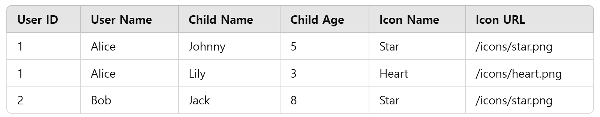
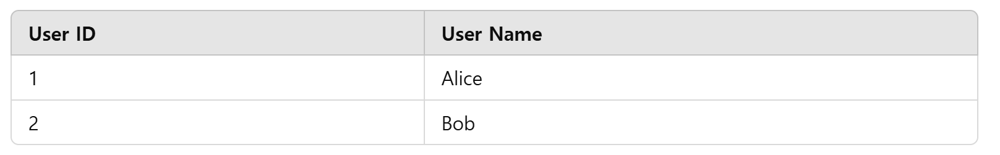
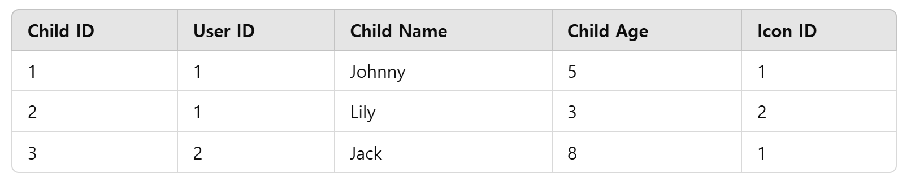
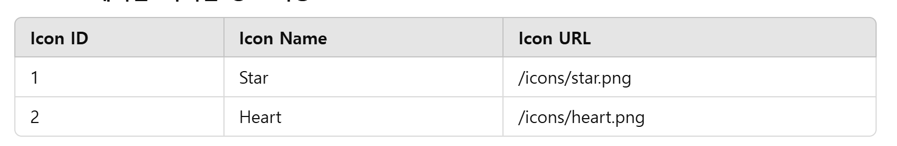

# DB 설계 원칙
## 데이터베이스 설계의 중요성
> - 데이터베이스 설계는 소프트웨어 개발 프로젝트에서 중요한 초기 단계
> - 잘 설계된 데이터베이스는 시스템의 성능을 최적화, 데이터의 일관성과 무결성 보장
> - 데이터베이스 설계의 목표는 데이터를 효율적으로 저장, 검색, 수정할 수 있는 구조를 만드는 것

## 정규화
> - 데이터 중복을 최소화하고, 데이터의 무결성을 보장하기 위한 과정
> - [정규화](..%2F7_Normalization%2FReadme.md)
> - 데이터를 통신하는데 전체 테이블을 들고 가져오는 것보단 부분만 가져오는 것이 훨씬 효율적

> - 기존의 유저 테이블 데이터를 유저(User), 자녀(Child), 자녀 아이콘(Icon)으로 정규화
> - 

### 문제점
> - 데이터 중복
>   - 동일한 사용자(Alice)에 대해 User Name이 반복 저장
>   - 동일한 아이콘(Star)의 이름과 URL이 반복 저장
> - 유지보수 어려움
>   - 특정 아이콘의 URL을 수정하려면 테이블의 모든 관련 행을 수정해야 함
> - 비효율적인 데이터 검색
>   - 자녀의 정보를 검색할 때 불필요한 유저 데이터와 아이콘 데이터를 모두 가져온다.

### 개선된 설계(정규화)
> - User 테이블 : 사용자 정보 저장
>   - 
> - Children 테이블 : 자녀 정보 저장
>   - 
> - Icons 테이블 : 아이콘 정보 저장
>   - 

### 장점
> - 데이터 중복 제거
>   - Users와 Icons 데이터 재사용 가능
>   - 동일한 아이콘을 사용하는 경우 Icons 테이블의 한 행만 참조하면 됨
> - 유지보수 용이성
>   - 아이콘 URL을 변경하려면 Icons 테이블에서 한 행만 수정하면 모든 관련 데이터가 업데이트
>   - 사용자가 변경될 경우에도 해당 행만 수정하면 됨
> - 효율적인 데이터 검색
>   - 필요한 테이블만 조인하여 검색할 수 있으므로 데이터 접근 성능이 향상

## 인덱스
> - 데이터 검색 속도를 향상
> - 기존 Full Table Scan에서 데이터 검색 범위를 줄이는 방법

## 커버링 인덱스
> - 데이터베이스에서 특정 쿼리를 실행할 때 인덱스만으로도 쿼리를 처리할 수 있는 인덱스
>   - 쿼리에 필요한 모든 컬럼이 인덱스에 포함되어 있어 테이블에 접근하지 않아도 결과 반환

### 작동 원리
> - 일반적으로 쿼리를 실행하면, 데이터베이스는 먼저 인덱스를 조회한 후 일치하는 데이터가 있는 테이블의 행을 찾아가 데이터를 가져온다.
> - [인덱스](..%2F5_Index%2FReadme.md)
> - 인덱스 테이블은 인덱스 값과 PK의 포인터로 연결되어 있는 구조로, PK의 포인터를 통해 테이블의 데이터를 가져오는 구조
> - 하지만, 커버링 인덱스를 사용하면, 필요한 데이터가 인덱스에 모두 포함되어 있으므로 테이블에 접근하지 않아도 쿼리를 처리할 수 있다.
>   - 이를 통해 디스크 I/O를 줄이고 쿼리 성능을 대폭 향상시킬 수 있다.

```sql
CREATE TABLE orders (
    order_id INT PRIMARY KEY,
    customer_id INT,
    order_date DATE,
    status VARCHAR(50)
);

SELECT order_id, order_date FROM orders WHERE customer_id = 123;
```
### 일반 인덱스 사용 시
> - customer_id 컬럼에 인덱스가 있는 경우
>   - 1. 인덱스에서 `customer_id = 123` 조건을 만족하는 레코드의 위치를 찾음
>   - 2. 해당 위치를 기반으로 테이블에서 order_id 와 order_date를 읽음
>   - 테이블 접근 단계가 필요해 추가적인 I/O 발생

### 커버링 인덱스 사용 시
> - customer_id, order_id, order_date 를 포함하는 인덱스를 생성
>   - 조건절에서 자주 사용하는 컬럼을 우선적으로 포함
```sql
CREATE INDEX idx_customer_order ON orders (customer_id, order_id, order_date);
```
> - 쿼리에 필요한 모든 컬럼이 인덱스에 포함되어 있으므로 테이블에 접근하지 않고도 결과 반환 가능

### 커버링 인덱스의 단점
> - 인덱스 크기 증가
>   - 인덱스에 더 많은 컬럼을 포함하면 크기가 커지고, 생성 및 유지 관리 비용이 늘어난다.
> - 쓰기 성능 저하
>   - 원래도 인덱스는 데이터를 삽입, 수정, 삭제할 때 성능이 안좋지만, 커버링 인덱스는 다른 컬럼이 병합되어 있기 때문에, 더 안좋다.
> - 쿼리 실행 계획(MySQL의 EXPLAIN)을 확인해서 실제로 row를 덜 접근하는지 확인
>   - `EXPLAIN SELECT order_id, order_date FROM orders WHERE customer_id = 123;`
>   - Extra 필드에 `Using Index`가 표시되면 커버링 인덱스가 성공적으로 적용된 것
>       - 


