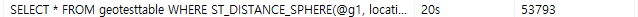
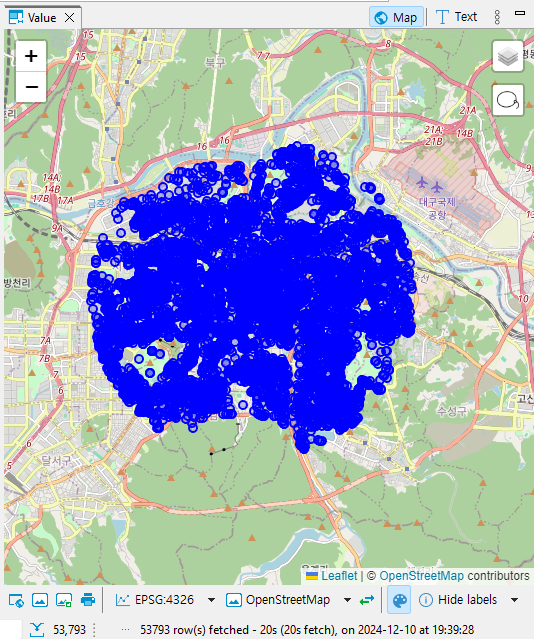
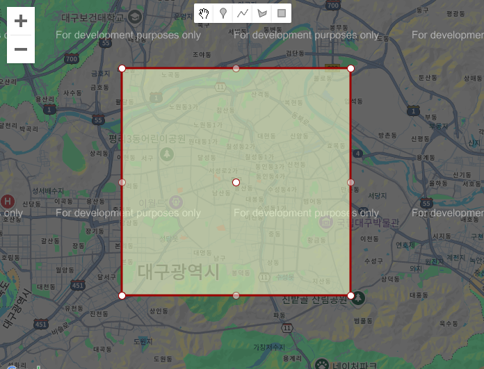
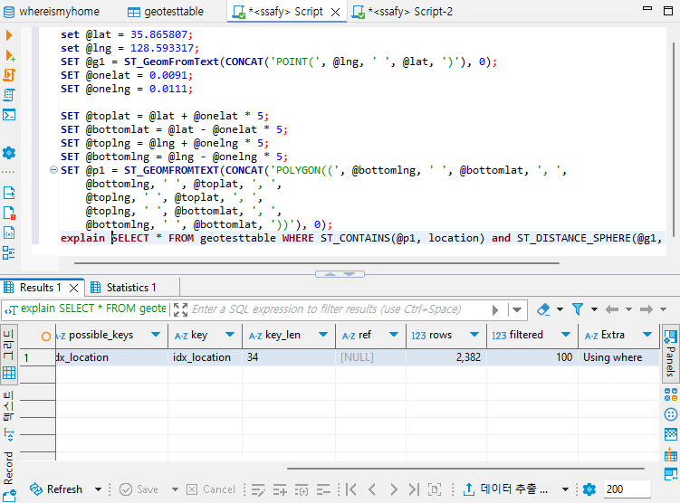
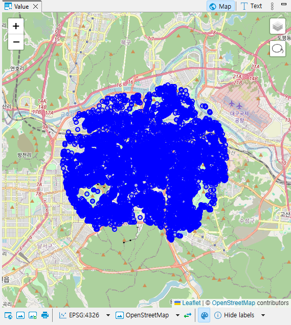

# `공간 인덱스(Spatial Index)`란?
- `공간 데이터(Spatial Data)`를 지원하는 데이터베이스에서 `공간 쿼리(Spatial Query)`를 `최적화`하기 위해 사용되는 `인덱스`
	- 기존의 `인덱스`는 데이터들을 `선형 순서`로 정렬해 조회 속도를 최적화하는 반면, `2차원/3차원 공간 상의 데이터`들을 정렬하기 위해 `R-Tree`와 같은 자료구조를 사용
## `공간 데이터(Spatial Data)`
- `2차원` 또는 `3차원 공간`에 위치할 수 있는 `공간` 또는 `지리적 참조` 형태의 데이터
- 주로 `점`, `선`, `다각형`과 같은 기하학적 객체들을 말함
- `지리 공간 데이터`, `위치 기반 서비스` 등에 대한 표준을 개발 및 유지하는 기구인 [`개방형 공간 정보 컨소시엄(OGC)`](https://www.ogc.org/)에서는 [`Simple Feature`](https://portal.ogc.org/files/?artifact_id=829)와 2020년 이를 대체하기 위해 발표된 [`Feature Model`](https://docs.ogc.org/as/17-087r13/17-087r13.html) 등을 꾸준히 개발 중
	- 여러 DBMS는 이를 기반으로 한 `공간 기능`을 제공 중
	- `MySQL`에서도 OGC의 `기하 도형 모델(OpenGIS Geometry Model)`에 대응되는 `GEOMETRY`, `POINT`, `LINESTRING` 등 다양한 타입을 제공
### 공간 참조 시스템(SRS) #조사추가필요
- `POINT`, `LINESTRING`과 같은 모든 지오메트리 객체가 존재할 수 있는 공간
- 하나의 지오메트리 객체는 오직 하나의 `공간 참조 시스템`에만 존재할 수 있음
	- 이는 각 `공간 참조 시스템`마다 좌표가 존재할 수 있는 표면이 다를 수 있기 때문
	- 예를 들어, `A` SRS는 `구형`, `B` SRS는 `평면`이라고 하면 같은 좌표라도 각 SRS마다 다른 위치에 존재하게 됨
	- 따라서 두 지오메트릭 객체가 동일하기 위해서는 좌표 뿐만 아니라 존재하는 SRS도 동일해야 함
		- 이 때문에 보통 다른 `SIRD`를 갖는 지오메트리 값 간에는 어떤 연산도 이뤄지지 않고 거부됨
- 각 `SRS`는 고유한 `공간 참조 식별자(SRID)`가 존재하며, 이를 통해 어떤 `SRS`에 속해있는지 구분함
- `SRID`와 이에 해당하는 `SRS`는 `EPSG(유럽 석유 조사 그룹)`에서 제작 및 운영하고 있는 [`EPSG의 좌표계 식별 데이터셋`](https://epsg.org/home.html)라는 사실상 표준이 정해져 있음
- 주로 사용되는 `SRS`는 `WGS 84(World Geodetic System 1984)`라고 불리는 `SRID 4326`, `WGS 84`/`슈도 메르카토르` 라고도 불리는 `SRID 3857`가 주로 사용됨
	- 둘의 가장 큰 차이는 `3차원 구체를 기반`으로 하는지(`4326`), `2차원 평면`을 기반으로 하는지(`3857`)가 차이
#### [`EPSG:4326 - WGS 84`](https://epsg.io/4326)
- `경도(longitude)`, `위도(latitude)`를 통해 `3차원 타원 표면`에서의 좌표를 표현하는 좌표계
- `GPS`, `Google Earth` 등에서 사용됨
- `각도(Degree)`를 `단위`로 함
#### [EPSG:3857 - WGS 84 / Pseudo-Mercator / Spherical Mercator](https://epsg.io/3857)
- `x`, `y` 좌표를 통해 `WGS 84` 타원체 데이텀(좌표 축의 원점이 되는 기준점)에 `메르카토르 투영`을 적용한 좌표계
	- `메르카토르 투영`의 일종이기 때문에, 고위도 지역으로 갈수록 왜곡이 심해진다는 특징이 여전히 존재
- `Google Maps`, `OpenStreeMap` 등 웹 지도 도구들에서 사용됨
- `미터(metres)`를 단위로 함
### MySQL의 공간 데이터 타입
- `MySQL`에는 크게 `단일 지오메트리 값`을 저장할 수 있는 자료형과 `지오메트리 값의 집합`을 저장할 수 있는 자료형으로 나뉨
### WKB와 WKT
- `OpenGIS`에서는 `기하학적 객체`의 표현을 위해 `WKT(Well-Known Text)` 포맷과 `WKB(Well-Known Binary)` 포맷을 사용
	- `MySQL`에서는 내부적으로 지오메트리 값을 WKT, WKB가 아닌 다른 포맷을 사용해 저장
		- `WKB`와 유사하지만 앞의 4바이트가 `SRID`를 나타냄
			- `SRID(공간 참조 식별자)`:  지오메트리 값이 어떤 `공간(공간 참조 시스템, SRS)`을 기준으로 하는지 구분하는 식별자. 다른 `SIRD`를 갖는 지오메트리 값 간에는 어떤 연산도 이뤄지지 않고 거부됨
#### WKT(Well-Known Text)
- 지오메트리 값을 `ASCII` 형태로 교환하기 위해 설계됨
- `OpenGIS` 사양에서는 `WKT`값 작성을 위한 `배커스-나우르` 문법을 제공
- 자료형에 따라 필요한 점의 갯수는 다르지만 X-Y 좌표 값을 `(X Y)` 형태로, 즉 쉼표가 아닌 공백을 통해 구분하는 문법을 공통적으로 사용함
	- 예시
		- `Point` - `POINT(15 20)`
		- `LINESTRING` - `LINESTRING(0 0, 10 10, 20 25, 50 60)`
- MySQL에는 WKT 형태의 문자열로부터 지오메트리 값을 만들어내는 `ST_타입FromText` 함수들이 존재 [#](https://dev.mysql.com/doc/refman/8.4/en/gis-wkt-functions.html)
	- 예시
		- `POINT` - `ST_PointFromText`
		- `GEOMERTY` - `ST_GeomFromText`
#### WKB(Well-Known Binary)
- `지오메트리 WKB 정보`를 담고있는 `BLOB` 형태의 `이진 스트림` 형태로 지오메트리 값을 교환하기 위해 사용됨
- `WKB`는 1바이트의 `unsigned Integer`(`byte order`), 4바이트의 `unsigned Integer`(`WKB type`), 8바이트의 `배정밀도(double precision) 숫자 값`(`X, Y 좌표`)들을 사용
	- `byte order`
		- 0일 경우 `빅 엔디안`(`작은 주소`에서 데이터의 `높은 바이트(MSB)`부터 저장하는 방법) 
			- 만약 `0x12345678`을 저장한다면, 앞에서 부터 `0x12` / `0x34` / `0x56` / `0x78`을 저장
		- 1일 경우 `리틀 엔디안`(`작은 주소`에서 데이터의 `낮은 바이트(LSB)`부터 저장하는 방법)
			- 만약 `0x12345678`을 저장한다면, 앞에서 부터 `0x78` / `0x56` / `0x34` / `0x12`를 저장
	- `WKB type`
		- 어떤 지오메트리 유형인지 나타내는 값
		- MySQL의 경우 1부터 7까지 각각 `Point`, `LineString`, `Polygon`, `MultiPoint`, `MultiLineString`, `MultiPolygon`, `GeometryCollection` 에 대응 됨
	- 예시
		- `POINT(1 -1)`에 대응되는 WKB는 다음 2개의 16진수로 표현되는 21바이트 시퀀스
			- `0101000000000000000000F03F000000000000F0BF`
			- 이는 `01` / `01000000` / `000000000000F03F` / `000000000000F0BF`로 나누어 볼 수 있음
#### 단일 지오메트리 값 자료형
- `GEOMETRY`는 어떤 유형의 지오메트리 값이든 저장할 수 있으며, 나머지 단일 값 유형은 특정 도형의 유형으로 값을 제한함
##### GEOMETRY
- 모든 지오메트리 클래스(타입)의 `루트 클래스`
- `추상 클래스`(인스턴스화 할 수 없음)
- `GEOMETRY`의 하위 클래스들은 `GEOMETRY`가 갖는 여러 속성 값들을 갖고있으며, 특정 서브클래스에는 각각 고유한 프로퍼티가 있을 수 있음
- 속성 값
	- `type`
		- 각 지오메트리 값은 지오메트리 클래스 중 `인스턴스화 가능한 클래스` 중 하나에 속해야 함
	- `SRID`
		- 해당 지오메트리 값의 `공간 참조 식별자`
		- 지오메트리 값과 연관된 `공간 참조 시스템(SRS)`을 식별
		- MySQL에서 SRID는 0부터 $2^{32} -1$ 사이이며, 지정되지 않을 경우 기본값은 0
	- `coordinates`
		- `공간 참조 시스템`상의 좌표 값으로, `배정밀도(8바이트)` 숫자로 표현됨
		- 비어있지 않은 지오메트리는 `적어도 한 쌍`의 `(X, Y) 좌표가 포함`되어야 함
	- `interior`, `boundary`, `exterior`
		- `interior`는 지오메트리가 차지하는 공간, `exterior`는 지오메트리가 차지하지 않는 모든 공간, `boundary`는 `interior`와 `exterior` 사이의 경계
	- `MBR(최소 경계 사각형, Minimum Bounding Rectangle)`
		- 최소 및 최대 (X, Y) 좌표로 구성된 경계 지오메트리
		- `((MINX MINY, MAXX MINY, MAXX MAXY, MINX MAXY, MINX MINY))`
	- `simple` / `nonsimple`
		- `LineString`, `MultiPoint`, `MultiLineString`유형은 `simple`이거나 `nonsimple`
	- `closed` / `not closed`
		- `LineString`, `MultiLineString` 유형은 `closed`이거나, `not closed`
	- `empty` / `nonempty`
		- 지오메트리에 점이 하나도 존재하지 않는 경우 `empty`, 그렇지 않은 경우 `nonempty`
	- `dimension`
		- `-1`: 비어있는 지오메트리
		- `0`: 길이도, 면적도 없는 지오메트리
		- `1`: 길이가 0이 아니지만, 면적은 0인 지오메트리
		- `2`: 면적이 0이 아닌 지오메트리
		- `Point`는 `0`, `LineString`은 `1`, `Polygon`은 2
		- `MultiXXX` 객체는 이를 이루는 요소들의 차원과 동일
##### POINT
- 좌표 공간에서 단일 지점을 나타내는 지오메트리
- `X, Y 좌표값`을 가지며 `0차원` 도형으로 정의되고 `boundary`는 비어있는 집합임
##### LINESTRING
- 점 사이 `선형 보간(Linear Interpolation)`을 사용하는 `Curve` 지오메트리
	- `선형 보간`: 양 끝점의 값이 주어졌을 때, 그 사이에 위치한 값을 추정하기 위하여 선형 다항식을 사용해 계산하는 방법
	- `Curve`
		- `1차원`이며, 시작점과 끝점이 같으면 `closed`
		- 동일한 점을 2번 지나지 않거나, 시작점과 끝점이 같은 경우 `simple`
		- `closed`인 `Curve`의 `boundary`는 비어있으며, `not closed`인 `Curve`의 `boundary`는 양 끝점
- 각 `점 쌍으로 구성`된 `세그먼트의 좌표값`을 가짐
- 정확히 두 점으로만 구성되면 `Line`, `closed` 이며 `simple`인 경우 `LinearRing`임
##### POLYGON
- `다면체`를 나타내는 평면형 `Surface`
- 하나의 `exterior boundary`와 0개 이상의 `interior boundary`로 구성되며 각 `interior boundary`는 `Polygon` 내부의 구멍의 경계를 정의함
- `Polygon`의 `Boundary`는 `내/외부 경계`를 구성하는 `LinearRing` 객체 집합으로 구성됨
- `Polygon`은 교차하는 `Ring`이 존재하지 않으며, `Boundary`의 `Ring`이 점과 교차할 수 있지만, 접선으로만 교차
- `interior`로 `연결된 Point 집합`을 가짐
#### 지오메트리 값 집합 자료형
- `GEOMETRYCOLLECTION`은 모든 유형의 객체 집합을 저장할 수 있으며, 나머지 집합 자료형은 집합 멤버를 특정 도형 유형을 가진 멤버로 제한함
##### MULTIPOINT
- `POINT`로 구성된 지오메트리 집합으로, 각 `POINT`들은 연결되거나 정렬되지 않음
- `0차원` 지오메트리이며, 이를 구성하는 각 POINT 간의 좌표가 같지 않으면 `simple`
- `boundary`는 비어있음
##### MULTILINESTRING
- `LineString`로 구성된 `MultiCurve` 컬렉션
- `MultiCurve`
	- `1차원` 지오메트리
	- 이를 이루는 모든 요소들이 `simple`할 때만 `simple`
	- `boundary`는 `mod 2 union 규칙(홀수-짝수 규칙)`으로 구할 수 있음
		- 한 `Point`가 홀수 개의 `Curve`요소의 경계에 있는 경우 `MultiCurve`의 경계에 있다고 할 수 있음
		- 모든 요소가 `closed`이면 `closed`
		- `boundary`는 비어있음
##### MULTIPOLYGON
- `Polygon`으로 구성된 `MultiSurface` 컬렉션
- 각 `Polygon` 요소는 교차하는 `interior`가 없어야 함
- 무한한 수의 점에 닿는 `Polygon` 요소를 가질 수 없음
- `2차원` 지오메트리이며, `boundary`는 요소들의 경계들에 대응되는 `LineString` 집합
- `MultiPolygon`의 경계를 이루는 각 `Curve`들은 각각 하나의 `Polygon`요소의 경계에 존재해야 함
##### GEOMETRYCOLLECTION
- 0개 이상의 `지오메트리`로 이뤄진 컬렉션
- `GEOMETRYCOLLECTION`의 모든 요소는 동일한 `좌표계(공간 참조 시스템)`에 있어야 함
## `공간 인덱스(Spatial Index)`
### 공간 인덱스와 비공간 인덱스
- `공간 인덱스`는 `R-트리 인덱스`를 생성하며, 이를 지원하지 않는 다른 엔진(즉, `비공간 인덱스`를 지원하는)의 경우, `B-트리 인덱스`를 생성
	- `B-트리 인덱스`는 `정확한 값을 조회`하는데는 `유용`하지만, `범위 스캔`에 대해서는 `그렇지 않음`
#### 공간 인덱스
- `MySQL`의 `스토리지 엔진` 중 `InnoDB`와 `MyISAM`에서만 `공간 인덱스`를 지원
- 일반 인덱스를 생성할 때 처럼 `CREATE INDEX`문을 사용하되, `SPATIAL` 키워드를 사용
	- ex) `ALTER TABLE mytable ADD SPATIAL INDEX(geomcolumn);`
- `단일 공간 열`에 대해서만 인덱스를 생성할 수 있음
- 인덱스로 지정된 열은 `NOT NULL`이어야 함
- `기본 키`나 `유니크 인덱스`에는 허용되지 않음
- `옵티마이저`는 `SRID`가 제한된 열에 정의된 `공간 인덱스`를 사용할 수 있음
#### 비공간 인덱스
- [`ARCHIVE`](https://dev.mysql.com/doc/refman/8.4/en/archive-storage-engine.html "18.5 The ARCHIVE Storage Engine")를 제외한 나머지 `공간 열`을 지원하는 `스토리지 엔진`에서 사용 가능
- 인덱스가 *기본키가 아닌 경우* `NULL`을 `허용`
	- [`InnoDB`](https://dev.mysql.com/doc/refman/8.4/en/innodb-storage-engine.html "Chapter 17 The InnoDB Storage Engine"), [`MyISAM`](https://dev.mysql.com/doc/refman/8.4/en/myisam-storage-engine.html "18.2 The MyISAM Storage Engine"), [`MEMORY`](https://dev.mysql.com/doc/refman/8.4/en/memory-storage-engine.html "18.3 The MEMORY Storage Engine")에서만
### 공간 인덱스 사용하기
- `옵티마이저`는 `WHERE`절에서 `MBRContains()`, ` MBRWithin()`와 같은 함수를 사용하는 쿼리에 대해, 가용한 `공간 인덱스`를 검색에 포함할 수 있는지 조사
- 따라서 `공간 인덱스`를 사용하는 함수를 통해 탐색할 row의 범위를 줄이면 `최적화가 가능`
- 예시
	- 한 점으로 부터 5km 떨어진 점들 검색하기
		- 약 237만개의 POINT가 기록된 테이블에서 이를 검색하고자 함
		- `ST_DISTANCE()` 또는 `ST_DISTANCE_SPHERE()`를 사용할 경우 `공간 인덱스`를 `사용하지 않고`, 한 점 한 점 모두 연산을 거치기 때문에 비효율적
			- 이 경우 쿼리는 다음과 같음
			```sql
			set @lat = 35.865807;
			set @lng = 128.593317;
			SET @g1 = ST_GeomFromText(CONCAT('POINT(', @lng, ' ', @lat, ')'), 0);
			SELECT * FROM geotesttable WHERE ST_DISTANCE_SPHERE(@g1, location) < 5000;
			```
			- 위 쿼리를 분석하면, `공간 인덱스`가 `활용되지 않고` 237만개의 row들을 `모두 불러옴`을 알 수 있음
				- 
					- 참고로 `explain query`문을 수행시, 실제 DB의 row 갯수와 다른 값이 불러와 질 수 있음
						- 이는 `explain`문이 `INFORMATION_SCHEMA` 테이블에서 제공하는 러프한 추정치를 사용하기 때문
						- 따라서 `ANALYZE TABLE table_name;` 문을 수행해 이를 업데이트 해주면 올바른 값을 불러옴
				- 해당 쿼리문을 실제로 수행하면, 데이터를 불러오는데 약 `20초`가 소요됨
					- 
					- 
		- 이를 최적화하고자, 먼저 각 변이 한 점으로 부터 각각 5km씩 떨어진 정사각형 `Polygon`을 만들고, `ST_CONTAINS(A, B)` 함수를 사용해 이에 포함되는 점들만 검색
			- 이를 위해 먼저 다음과 같은 형태의 `Polygon`을 만듦
				- 
				- 각 변이 가운데 점으로부터 5km씩 떨어진 정사각형
			- 이후 `공간 인덱스`를 사용하는 지오메트리 함수인 `ST_CONTAINS(A, B)`를 사용해 각 점이 해당 `Polygon` 내부에 존재하는지 확인
				- `ST_CONTAINS(A, B)`는 B가 A 내부에 포함되는지 여부를 반환하는 함수
		- 이후 각 점들에 대해 `ST_DISTANCE_SPHERE(A, B) < 5000` 조건을 수행해 기준점과의 거리가 5km 이내인 점들을 불러온다
		- 이를 모두 반영한 쿼리는 다음과 같다
    ```sql
		set @lat = 35.865807;
		set @lng = 128.593317;
		SET @g1 = ST_GeomFromText(CONCAT('POINT(', @lng, ' ', @lat, ')'), 0);
		# 위도(latitude) 1도는 대략 111.1km
		# 따라서 1km당 위도는 0.0090009 ~= 0.0091도
		SET @onelat = 0.0091;
		# 경도(longitude) 1도는 위도에 따라 달라지며, 적도에서 대략 111.1km
		# 계산식은 111.1 * cos(theta * pi/180)
		# 한국은 북위 33~38도 사이에 존재하며, 위에서 선언한 위도인 35.8658도를 기준으로하면
		# 경도 1도는 대략 90.0345km
		# 따라서 1km당 위도는 0.0111069 ~= 0.0111도
		SET @onelng = 0.0111;
		
		SET @toplat = @lat + @onelat * 5;
		SET @bottomlat = @lat - @onelat * 5;
		SET @toplng = @lng + @onelng * 5;
		SET @bottomlng = @lng - @onelng * 5;
		SET @p1 = ST_GEOMFROMTEXT(CONCAT('POLYGON((', @bottomlng, ' ', @bottomlat, ', ',
			@bottomlng, ' ', @toplat, ', ',
			@toplng, ' ', @toplat, ', ',
			@toplng, ' ', @bottomlat, ', ',
			@bottomlng, ' ', @bottomlat, '))'), 0);
		SELECT * FROM geotesttable WHERE ST_CONTAINS(@p1, location) and ST_DISTANCE_SPHERE(@g1, location) < 5000;
    ```
	- 위 쿼리를 `explain`문을 통해 분석하면, 설정해놓은 `공간 인덱스(idx_location)`를 활용해 범위를 줄여 불러옴을 알 수 있음
		- 
		- 쿼리 수행에 걸리는 시간도 20초에서 5초로 확 단축됨
			- 
			- 
## 주의사항
### 지오메트리 컬럼 생성시 초기 SRID를 신중히 정할 것
- 어떤 이유인지는 몰라도, 이미 존재하는 컬럼의 `SRID`를 변경하려고 하면 변경이 이뤄지지 않음
	- 시도해본 구문 목록 (예를 들기 위해 테이블 이름은 `table`, 컬럼 이름은 `geom`이라고 하겠음)
		- `UPDATE table SET geom = ST_GeomFromText(ST_AsText(geom), SRID)`
		- `UPDATE table SET geom = ST_Transform(geom, SRID)`
		- `UPDATE table SET geom = ST_SRID(geom, SRID)`
	- 공통적으로 아래와 같은 오류가 발생함
		```sql
			ERROR 3643 (HY000): The SRID of the geometry does not match the SRID of the column 
			'position'. The SRID of the geometry is 0, but the SRID of the column is 4326. 
			Consider changing the SRID of the geometry or the SRID property of the column.
		```
- 이미 존재하는 컬럼의 `SRID`는 바꾸는게 불가능하다 판단
	- 따라서 변경하고자 하는 `SRID`를 갖는 컬럼을 새로 생성한 뒤, 기존 컬럼의 값들을 복사해오고 공간 인덱스도 재설정함
	```sql
	ALTER TABLE `table` ADD geom4326 POINT SRID = 4326;
	UPDATE `table` SET geom4326 = ST_GeomFromText(ST_AsText(geom), 4326)`
	ALTER TABLE `table` DROP COLUMN geom;
	...
	```
# 참고
- [Spatial database - Wikipedia](https://en.wikipedia.org/wiki/Spatial_database)
- [Minimum bounding rectangle - Wikipedia](https://en.wikipedia.org/wiki/Minimum_bounding_rectangle)
- [Web Mercator projection - Wikipedia](https://en.wikipedia.org/wiki/Web_Mercator_projection)
- [Introduction to Spatial Databases](https://www.ismll.uni-hildesheim.de/lehre/spatial-10w/script/ch1.pdf)
- MYSQL Reference Manual
	- [MySQL :: MySQL 8.4 Reference Manual :: 10.3.3 SPATIAL Index Optimization](https://dev.mysql.com/doc/refman/8.4/en/spatial-index-optimization.html)
	- [MySQL :: MySQL 8.4 Reference Manual :: 10.8.2 EXPLAIN Output Format](https://dev.mysql.com/doc/refman/8.4/en/explain-output.html)
	- [MySQL :: MySQL 8.4 Reference Manual :: 13.4 Spatial Data Types](https://dev.mysql.com/doc/refman/8.4/en/spatial-types.html)
	- [MySQL :: MySQL 8.4 Reference Manual :: 13.4.2 The OpenGIS Geometry Model](https://dev.mysql.com/doc/refman/8.4/en/opengis-geometry-model.html)
	- [MySQL :: MySQL 8.4 Reference Manual :: 13.4.3 Supported Spatial Data Formats](https://dev.mysql.com/doc/refman/8.4/en/gis-data-formats.html)
	- [MySQL :: MySQL 8.4 Reference Manual :: 13.4.8 Fetching Spatial Data](https://dev.mysql.com/doc/refman/8.4/en/fetching-spatial-data.html)
	- [MySQL :: MySQL 8.4 Reference Manual :: 13.4.10 Creating Spatial Indexes](https://dev.mysql.com/doc/refman/8.4/en/creating-spatial-indexes.html)
	- [MySQL :: MySQL 8.4 Reference Manual :: 13.4.11 Using Spatial Indexes](https://dev.mysql.com/doc/refman/8.4/en/using-spatial-indexes.html)
	- [MySQL :: MySQL 8.4 Reference Manual :: 14.16.6 Geometry Format Conversion Functions](https://dev.mysql.com/doc/refman/8.4/en/gis-format-conversion-functions.html)
	- [MySQL :: MySQL 8.4 Reference Manual :: 14.16.9.1 Spatial Relation Functions That Use Object Shapes](https://dev.mysql.com/doc/refman/8.4/en/spatial-relation-functions-object-shapes.html)
- [MySQL :: Spatial Reference Systems in MySQL 8.0](https://dev.mysql.com/blog-archive/spatial-reference-systems-in-mysql-8-0/)
- [How Big is a Degree? – State Cartographer's Office – UW–Madison](https://www.sco.wisc.edu/2022/01/21/how-big-is-a-degree/#:~:text=Therefore%20we%20can%20easily%20compute,69.4%20miles%20(111.1%20km).)
- [DBeaver Documentation - Working with Spatial GIS data](https://dbeaver.com/docs/dbeaver/Working-with-Spatial-GIS-data/#labels-on-a-map)
- [mysql - Why the rows returns by "explain" is not equal to count()? - Stack Overflow](https://stackoverflow.com/questions/1037471/why-the-rows-returns-by-explain-is-not-equal-to-count)
- [algorithm - Calculating new longitude, latitude from old + n meters - Stack Overflow](https://stackoverflow.com/questions/7477003/calculating-new-longitude-latitude-from-old-n-meters)
- [Wicket - Lightweight Javascript for WKT [Sandbox]](https://arthur-e.github.io/Wicket/sandbox-gmaps3.html)
- [[오픈소스GIS] WKB, WKT 이해 / postGIS에서의 변환, 입출력 : 네이버 블로그](https://m.blog.naver.com/ilsan_ilsan/221497823431)
- [Features and geometry – Part 1: Feature models](https://docs.ogc.org/as/17-087r13/17-087r13.html#_the_first_part_feature_models)