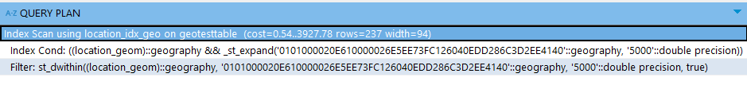
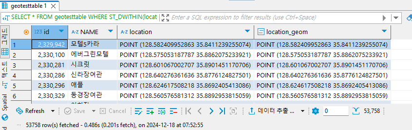

# 개요
## `PostgreSQL`?
- 복잡한 데이터 워크로드들을 안전하게 저장 및 확장할 수 있는 기능들을 제공하는 오픈 소스 `객체-관계형 데이터베이스 시스템`
	- `객체-관계형 DB(Object-relational DB, ORD)`: 일반적인 `관계형 DB`와 유사하지만, `객체지향 개념`이 추가적으로 지원되는 DB. 즉, DB단에서 `클래스`, `객체` 및 `상속`의 개념을 지원
- 2001년부터 `ACID`를 지원해왔으며, 대부분의 `주요 OS들을 지원`함
	- Linux(Debian, Ubuntu, Redhat 등..), macOS, Windows, BSD(OpenBSD, FreeBSD, ..), Solaris
- `지리공간 데이터`를 효과적으로 저장 및 인덱싱하고 관련 쿼리를 지원하는 [`PostGIS`](https://postgis.net/), DB단에서 암호화를 수행할 수 있는 기능들을 제공하는 [`pgcrypto`](https://www.postgresql.org/docs/current/pgcrypto.html)와 같은 다양한 확장 기능들을 사용할 수 있음
- (2023년 기준) [`SQL:2023(*또는 ISO/IEC 9075*)`](https://en.wikipedia.org/wiki/SQL:2023)의 필수 기능 177개 중 170 이상을 준수하는, `가장 표준을 완벽하게 준수하는 관계형 DB`
### 기원
-  `PostgreSQL`은 버클리 캘리포니아 대학교에서 작성된 `POSTGRE` 패키지로부터 파생됨
#### `POSTGRES` 프로젝트
- [마이클 스톤브레이커](https://en.wikipedia.org/wiki/Michael_Stonebraker) 교수가 주도한 프로젝트로, 1986년 구현이 시작됨
- `POSTGRES`는 `INGRES`의 후속으로 1986년 개발되기 시작한 DBMS
	- [`INGRES`](https://www.seas.upenn.edu/~zives/cis650/papers/INGRES.PDF): 1975년 개발되기 시작한 `관계형 DBMS`로, UNIX 운영체제 상에서 동작하며 쿼리 언어로 `QUEL`을 사용(이후 SQL도 지원)
		- 참고
			- [INGRES—A relational data base system* - by G. D. HELD, M. R. STONEBRAKER and E. WONG](https://dl.acm.org/doi/pdf/10.1145/1499949.1500029)
			- [The Design and Implementation of Ingres](https://www.seas.upenn.edu/~zives/cis650/papers/INGRES.PDF)
	- `INGRES`의 초기 설계로는 스톤브레이커 교수를 포함한 개발진들이 **추가 및 확장하고 싶은 기능들을 `INGRES`에 통합할 수 없어**, 새로운 데이터베이스 시스템인 `POSTGRES`를 구축하게 됨
- `POSTGRES`의 목표는 크게 다음과 같음 [#](https://dsf.berkeley.edu/papers/ERL-M85-95.pdf)
	1. `복잡한 객체`를 더 원활하게 지원할 것
		- 기존의 관계형 데이터베이스가 적합하지 않았던 `CAD 시스템`, `지리 데이터` 등의  환경에 대한 지원
		- 즉, 이러한 환경에서 사용되는 `지오메트리`(`Point`, `Polygon`, ...)와 같은 타입의 지원
	2. 데이터 타입, 연산자 및 접근 방법에 대한 `사용자 확장성` 제공
		- 이 역시, CAD용 `기하학 자료형`이나, 매핑 애플리케이션용 `위도/경도`와 같은 `자료형`과 `연산자`를 DBMS에 `추가할 수 있는 기능`을 제공하고, 일부 유형에 적합한 `액세스 방법`(ex. `Point` -> `K-D-B 트리`, `Polygon` -> `R-트리`) 방법을 추가할 수 있도록 하는 것을 의미
	3. `활성 데이터베이스`(알림 및 트리거)와 `포워드/백워드 체이닝`에 대한 추론을 위한 기능 제공
		- `활성 데이터베이스` [#](https://dl.acm.org/doi/10.1145/311531.311623): 데이터베이스 내/외부에서 발생하는 `이벤트에 대응`할 수 있는 `이벤트-기반 구조`를 포함하는 데이터베이스. 
		- `포워드/백워드 체이닝` [#](https://www.geeksforgeeks.org/difference-between-backward-and-forward-chaining/): 데이터 기반 추론에서, '알려진 사실에 규칙을 적용해 나가 목표까지 도달하는 추론 기법'(`포워드 체이닝`)과 '목표에서 시작해 역방향으로 알려진 사실에 도달하는 추론 기법'(`백워드 체이닝`)
		- 버그 리포트 시스템처럼, 특정 이벤트가 발생시 관리자에게 알림을 보내거나(`alerter`) 특정 데이터의 업데이트 발생시 일관성 유지를 위해 업데이트를 전파(`trigger`) 할 수 있도록 `활성 데이터베이스`와 `규칙(rule)`을 지원하는 것
			- `규칙`의 경우, 일정한 규칙(ex. 수업 일정 DB에서 교수는 N학점 이상 강의를 개설 및 진행하고 ... 와 같은 규칙)을 따르는 테이블이라면, 복잡한 제약 조건들로 이를 강제하는 것이 아니라, 데이터들을 기반으로 이러한 `규칙`을 추론하는 방향으로 구현해야 함
	4. `충돌 복구`를 위한 `DBMS 코드 간소화`
		- 대부분의 DBMS는 *작성하기 까다롭고, 희귀한 케이스로 가득하며, 테스트 및 디버깅이 힘든* 충돌 복구 코드들이 존재
		- 게다가 앞선 목표 중 `사용자 정의 접근 기법`을 제공하는 것이 있었으므로, `충돌 복구 모델`은 **가능한 간단하고 확장하기 쉬워야 함**
		- 따라서, `로그`를 `일반 데이터로 취급`해 `복구 코드를 단순화`하고, `기록 데이터에 대한 접근`을 `지원`
	5. 광디스크, 워크스테이션(여러개의 프로세서로 이뤄진), 커스텀 `VLSI 칩` 등의 이점을 취할 수 있는 설계
		- `VLSI(초고밀도 집적회로) 칩`: 수십억개의 MOS 트랜지스터를 결합해 단일 칩에 올리는 집적 회로 칩
		- 워크스테이션의 CPU 자원을 활용할 수 있고, 광디스크와 VLSI 칩을 효과적으로 활용할 수 있는 설계를 조사
	6. 관계형 모델을 가능한 적게 변경(가급적이면 변경 X)
		- 많은 사용자들이 관계형 모델에 익숙해질 것이고, 관계형 모델이 데이터를 단순한 테이블 수준으로 강제하고, 관계형 대수 연산을 통해 테이블을 생성할 수 있는, 이른바 [`스파르탄 단순성(Spartan Simplicity)`](https://finance.yahoo.com/news/simplifying-big-data-keyark-allows-122000982.html)이라는 이점이 있기 때문
		- 또한, *일반적인 계층 구조부터 CAD 데이터와 같은 복잡한 구조*를 **모두 다룰 수 있는** *`크고 복잡한 데이터 모델` 보단*, `확장 가능한 작고 단순한 모델`을 **기반으로 시스템**을 구축해야 한다고 생각
## 왜 `PostgreSQL`을 써야할까?
### 장점
- 함수, 데이터 유형, 언어 등을 추가할 수 있는 `확장성이 높음` 
- `구조화되지 않은 데이터 유형 지원`
	- `JSON`, `XML`, `H-Store(키-값 쌍으로 데이터를 저장하는 자료형)`와 같은 다양한 데이터 유형을 지원하며, NoSQL기능을 지원.
- 교착 상태가 거의 발생하지 않고 동시 처리가 가능하며 트랜잭션 속도가 빠른 `MVCC`
	- `MVCC(Multi-Version Concurrency Control, 다중버전 동시성 제어)`: 동시 접근이 가능한 환경에서, 원본의 스냅샷과 변경중인 데이터를 동시에 유지해 별도의 락이 필요하지 않아 더 빠르게 동작하는 동시성 제어 방식
- `고가용성` 및 `서버 오류 복구`
- 데이터 암호화, SSL 인증서, 고급 인증 방법과 같은 `고급 보안 기능`
- `활발한 오픈소스 커뮤니티`가 `지속적으로 솔루션을 개선하고 업데이트` 
- 이외의 추가적인 장점은 [PostgreSQL: About](https://www.postgresql.org/about/)의 `Why use PostgreSQL?`에 나와 있음
### 단점
- SQL Server 및 MySQL과 같은 `다른 RDBMS보다 성능이 느림`
	- 다만 이는 경우에 따라 다름
	- 일반적으로 읽기 작업만 수행할 경우, MySQL/MariaDB 대비 PostgreSQL이 느리다고 알려져 있음
- `호환성에 더 주력`, *속도 향상을 위해서는* `추가 작업`이 필요함
- `MVCC` 모델로 인해 발생하는 여러 문제점 [참고 1 - The Part of PostgreSQL We Hate the Most // Blog // Andy Pavlo - Carnegie Mellon University](https://www.cs.cmu.edu/~pavlo/blog/2023/04/the-part-of-postgresql-we-hate-the-most.html) [참고 2 - PostgreSQL Vacuum에 대한 거의 모든 것 | 우아한형제들 기술블로그](https://techblog.woowahan.com/9478/)
	- 쿼리가 한 튜플을 업데이트하면, DBMS는 모든 컬럼을 새로운 버전에 복사함
	- `Dead Tuple`(기존 원본 데이터를 저장하여, 어디에도 참조되지 않는 Tuple)을 정리하는 `Vaccum`(Java로 비유하자면 `GC`)이 워크로드의 `write` 작업 속도를 따라잡지 못할 경우 쿼리 성능 저하(`DBMS`는 `Dead Tuple`을 메모리에 로드해야 하므로), `Dead Tuple`에 의한 부실한 쿼리 플랜 최적화 등이 발생할 수 있음
## MySQL -> PostgreSQL로 마이그레이션 하기
- `PostgreSQL` 생태계에는 다른 데이터베이스에서 자료를 가져올 수 있는 컨버터 툴들이 존재
	- [Converting from other Databases to PostgreSQL - PostgreSQL wiki](https://wiki.postgresql.org/wiki/Converting_from_other_Databases_to_PostgreSQL#MySQL)
	- `MySQL`의 경우 [pgloader](https://github.com/dimitri/pgloader), [pg-chameleon](https://pypi.org/project/pg-chameleon/),  [lanyrd/mysql-postgresql-converter](https://github.com/lanyrd/mysql-postgresql-converter), [philipsoutham/py-mysql2pgsql](https://github.com/philipsoutham/py-mysql2pgsql) 등 다양한 툴들이 존재함
- 하지만 이들을 본인의 경우 사용하기 쉽지 않았음
	- 대부분의 툴들이 Linux 환경에서나 원활하게 동작하기 때문(특히, `pgloader`와 `pg-chameleon`은 Windows를 사실상 지원 X)
	- 또한, `mysqldump`를 통해 MySQL 데이터를 추출한 뒤, `pg_store`를 통해 복구하는 방법을 시도하는 사람들도 있었지만 두 DBMS의 규격이 달라 실패
- 따라서 다음과 같이 `DBeaver`를 활용해 자료를 CSV로 변환하고, 이를 PostgreSQL에서 import하는 방식으로 마이그레이션을 진행
	- 먼저, `CSV 파일`로 MySQL 테이블을 export함
		- 
	- 이후, `PostgreSQL` DB의 `Schemas>Tables`에서 데이터 가져오기를 수행
		- 
	- 이때, 사양의 차이로 `MySQL`의 `지오메트리 타입`이 온전히 옮겨지는 것이 아닌, `WKT`의 형태로 옮겨짐
		- 
		- 컬럼 값을 확인해보면, 아래와 같이 `WKT` 포맷으로 varchar 타입의 문자열들이 기록되어 있음을 알 수 있음
			- 
	- 이를 `지오메트리 타입`으로 변환하는 과정을 수행해야 함
		- 먼저, 지오메트리 타입 컬럼을 테이블에 추가하는 [`AddGeometryColumn`](https://postgis.net/docs/AddGeometryColumn.html) 함수를 호출
      ```sql
      /* 
      `AddGeometryColumn(varchar table_name, varchar column_name, integer srid, varchar type, integer dimension, boolean use_typmod=true) 함수를 호출
      */
      select addgeometrycolumn('geotesttable', 'geotesttable', 'location_geom', 4326, 'POINT', 2)
      ```
  - 이후, `update geotesttable set location_geom = ST_GeomFromText(location);` 문을 통해 기존 컬럼의 `WKT`를 기반으로 `지오메트리` 데이터를 생성해 컬럼 갱신
## PostGIS의 공간 인덱스 및 공간 연산
- `공간 연산`을 수행해보기 전, 먼저 `공간 인덱스`를 생성하여 `SELECT 쿼리`의 속도를 개선할 수 있도록 해야 함
### 공간 인덱스 생성하기 
- [참고](https://postgis.net/documentation/faq/spatial-indexes/)
- `PostGIS`에서 `공간 인덱스`를 생성하는 구문은 다음과 같음
	- `CREATE INDEX mytable_geom_x ON mytable USING GIST (geom)`
	- `CREATE SPATIAL INDEX` 구문을 사용하던 `MySQL`과 다르게, `PostGIS`에서는 `USING GIST` 구문을 사용함
		- `USING GIST`: 인덱스에서 `GiST(Generalized Search Tree)` 구조를 사용할 것을 의미
			- `GiST(Generalized Search Tree)`: 단순한, 일반적인 자료형 뿐만 아니라, *지리 정보 시스템, 멀티미디어 시스템* 등 `다양한 환경`에서 사용되는 `자료 유형`을 지원하기 위해 '**확장 가능한** `쿼리` 및 `데이터 유형 집합`'을 지원하는 `인덱스 구조`.
				- `B+ 트리`, `R-트리` 등 다양한 트리 구조를 지원함
				- [참고1](https://www.cs.cmu.edu/~15721-f24/papers/GiST.pdf), [참고2](https://dsf.berkeley.edu/papers/UW-CS-TR-1274.pdf)
		- 이 키워드를 통해 인덱스를 설정할 경우, `기본 인덱스`가 `R-트리`로 설정되며, 해당 키워드를 사용하지 않을 경우 `표준 PostgreSQL B-트리` 인덱스를 생성함
### 공간 연산 사용하기
- `PostGIS`와 `공간 인덱스`의 성능을 확인하기 위해, 다음 두 가지 케이스를 비교해보려 함
	1. `공간 인덱스`를 사용해 `사전 필터링`을 거친 쿼리
	2. `공간 인덱스`를 사용하지 않는 함수를 사용하는 쿼리
	- 참고로 `공간 인덱스를 사용하는 함수`는 다음과 같음
		- 
- 예시
	- 한 점(`POINT(128.593317 35.865807)`)으로 부터 5km 떨어진 점들 검색하기
		- 약 237만개의 POINT가 기록된 테이블에서 이를 검색하고자 함
		- 먼저, 공간 인덱스를 사용하지 않는 `ST_DistanceSphere` 함수를 사용해봄
			- 이 경우, 쿼리는 다음과 같음
				```sql
				SELECT * FROM geotesttable WHERE ST_DistanceSphere(ST_GeomFromText('POINT(128.593317 35.865807)', 4326), location_geom) < 5000;`
				```
				- 위 쿼리에 대해 `EXPLAIN`문을 사용해 실행 계획을 살펴보면 `공간 인덱스`가 `활용되지 않으며`(`Seq Scan`), 많은 양의 row들을 살펴봄을 알 수 있음
					- 
				- 또한, 쿼리문을 수행하고 데이터를 가져오는데 약 3초정도 소요됨
					- 
					- 
					
		- 반면, `ST_DWithin(g1, g2, distance)` 함수를 사용할 경우 `공간 인덱스를 사용`해 더 빠르게 탐색이 이뤄짐
			- `ST_DWithin(g1, g2, distance)`는 주어진 두 `geometry`(또는 `geography`) g1, g2 사이의 거리가 `distance`이내인지 `여부를 반환`하는 함수
				- + 추가하자면, `ST_DWithin()`에 g1, g2로 `geography` 인자가 주어질 경우, `지구타원형` 형태를 기준으로 하게 됨
					- 따라서 `ST_DistanceSphere` 와 동일한 기준 상에서 검색하려면 4번째 선택 인자인 `use_spheroid`을 false로 해주어야 함
			- 이 경우, 쿼리는 다음과 같음
				```sql
				SELECT * FROM geotesttable WHERE ST_DWITHIN(location_geom::geography, ST_GeomFromText('POINT(128.593317 35.865807)', 4326)::geography , 5000, false);
				```
				- 이때, 지오메트리 자료형인 `location_geom`과 `ST_GeomFromText`의 결과값을 [`geography`](https://postgis.net/workshops/postgis-intro/geography.html) 타입으로 캐스팅 하고 있음을 알 수 있음
				- 이는 `ST_DWITHIN` 함수가 `geometry` 값 2개를 인자로 받을 경우, `distance`의 단위가 `SRID:4326`의 단위인 `도(degree)`로 바뀌어버리기 때문에, 미터를 사용하려면 `geography` 값 2개를 인자로 주어야 하기 때문임
					- 그리고 이렇게 할 경우, `공간 인덱스` 역시 하나 더 만들어 주어야 함
					- 위에서 만들었던 `공간 인덱스`는 `geometry` 타입인 `location_geom`을 기준으로 했기 때문에, `geography`로 캐스팅하여 `DWITHIN` 함수를 호출할 경우 인덱스를 사용하지 못하기 때문
					- 따라서 아래 구문을 통해 `geography` 형태의 `인덱스`를 하나 더 만들어야 함
					```sql
					CREATE INDEX location_idx_geo  ON geotesttable  USING GIST ((location_geom::geography));
					```
			- 위 쿼리에 대해 `EXPLAIN`문을 사용해 실행 계획을 살펴보면, `공간 인덱스가 잘 활용되고 있으며`(`Index Scan`), 탐색하는 row 갯수도 훨씬 줄어들었음을 알 수 있음
				- 
			- 또한, 쿼리 수행도 총 0.4초가량으로 빠르게 이뤄짐
				- 
				- 
# 참고
- [THE DESIGN OF POSTGRES - Michael Stonebraker and Lawrence A. Rowe](https://dsf.berkeley.edu/papers/ERL-M85-95.pdf)
- [PostgreSQL과 SQL Server 비교: 차이점은 무엇인가요? | Google Cloud](https://cloud.google.com/learn/postgresql-vs-sql)
- [The Part of PostgreSQL We Hate the Most // Blog // Andy Pavlo - Carnegie Mellon University](https://www.cs.cmu.edu/~pavlo/blog/2023/04/the-part-of-postgresql-we-hate-the-most.html)
- [15. Spatial Indexing — Introduction to PostGIS](https://postgis.net/workshops/postgis-intro/indexing.html)
- [18. Geography — Introduction to PostGIS](https://postgis.net/workshops/postgis-intro/geography.html)
- [ST_DWithin](https://postgis.net/docs/ST_DWithin.html)
- [ST_DistanceSphere](https://postgis.net/docs/ST_DistanceSphere.html)
- [PostgreSQL: Documentation: 9.1: GiST and GIN Index Types](https://www.postgresql.org/docs/9.1/textsearch-indexes.html)
