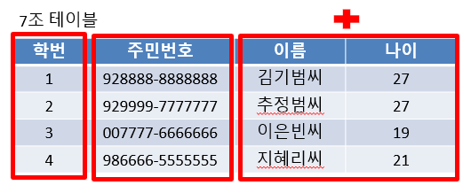
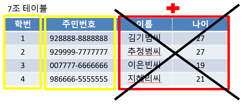
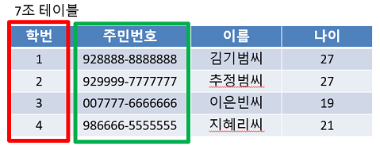
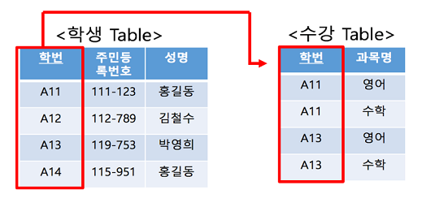

# Key (기본키, 후보키, 슈퍼키 등등...) 에 대해 설명해 주세요.
> - 무언가를 식별하는 고유한 식별자
> - 데이터베이스에서 조건에 만족하는 관계의 행을 찾거나 순서대로 정렬할 때 다른 행과 구별할 수 있는 유리한 기준이 되는 속성의 집합
> - 기본키, 슈퍼키, 후보키, 대체키, 외래키 등이 있다.

## 슈퍼키
> - 테이블에서 각 행을 유일하게 식별할 수 있는 하나 또는 그 이상의 속성들의 집합
> - 유일성만 만족하면 슈퍼키가 될 수 있다.
>   - 유일성 : 하나의 키로 특정 행을 바로 찾아낼 수 있는 고유한 데이터 속성
> - 

## 후보키
> - 테이블에서 각 행을 유일하게 식별할 수 있는 최소한의 속성들의 집합
> - 기본키가 될 수 있는 후보들
> - 유일성과 최소성을 동시에 만족해야 한다.
> - 

## 기본키
> - 후보키들중에서 하나를 선택한 키로 최소성과 유일성을 만족하는 속성
> - 테이블에서 기본키는 오직 1개
> - 테이블 안에서 유일하게 각 행들을 구별할 수 있도록 쓰인다.
> - NULL 값을 절대 가질 수 없고, 중복된 값을 가질 수 없다.

## 대체키
> - 후보키가 두 개 이상일 때, 하나를 기본키로 지정하고 남은 후보키들을 대체키라고 한다.
> - 기본키로 선정되지 않은 후보키
> - 

## 외래키
> - 테이블이 다른 테이블의 데이터를 참조하여 테이블간의 관계를 연결한다.
> - 다른 테이블의 데이터를 참조할 때 없는 값을 참조할 수 없도록 제약을 주는 것
> - 참조될 열의 값은 테이블에서 기본키로 설정되어 있어야 한다.
> - 외래키는 참조되는 테이블의 기본키와 동일한 키 속성을 가진다.
> - 부모 테이블이 먼저 생성된 뒤 데이터를 넣고, 참조하는 자식 테이블이 다음에 생겨야 된다.
>   - 부모 테이블 먼저 삭제될 수 없다.
> - 

## 기본키(Primary Key)
- 값 중복을 허용하지 않는다.
- 식별키이다.
- NULL값을 허용하지 않는다.
- 테이블에서 한 개만 생성 가능하다.
## 유니크키(Unique Key, Unique Index)
- 값 중복을 허용하지 않는다.
- NULL값을 허용한다.
- 테이블에서 여러 개 생성 가능하다.

---

## 기본키는 수정이 가능한가요?
> - 기본키는 기본적으로 유일성과 최소성을 만족해야하기 때문에, 기본키 값은 수정해서는 안된다.
>   - 기본키가 변경되면 해당 레코드를 참조하는 다른 테이블의 외래키와 관련된 문제(데이터의 무결성을 해칠 가능성)가 발생할 수 있다.

## 사실 MySQL의 경우, 기본키를 설정하지 않아도 테이블이 만들어집니다. 어떻게 이게 가능한 걸까요?
> - Generated Invisible Primary Keys라는 특성을 통해 기본 키를 설정하지 않아도 자동으로 생성되는 기본 키를 생성할 수도 있고, 기본 키 없이 테이블을 생성할 수도 있다.

## 외래키 값은 NULL이 들어올 수 있나요?
> - NULL 값이 허용된다.
> - 해당 행이 다른 테이블을 참조하지 않는 다는 것을 의미
> - 하지만, 외래키 참조 무결성 조건으로 인해, NULL 값을 두지 않는 것이 좋다.

## 어떤 칼럼의 정의에 UNIQUE 키워드가 붙는다고 가정해 봅시다. 이 칼럼을 활용한 쿼리의 성능은 그렇지 않은 것과 비교해서 어떻게 다를까요?
> - 기본키와 유니크 키 모두 내부적으로 인덱스를 생성한다.
>   - 인덱스는 데이터베이스에서 데이터를 빠르게 검색할 수 있게 해주므로, 검색 쿼리 속도가 빨라진다.
> - UNIQUE 컬럼은 중복된 값을 허용하지 않는다.
>   - 중복 검사 속도가 빨라진다.
> - 인덱스의 고질적 문제, 조회에는 성능이 향상되지만, 업데이트, 삽입, 삭제 시 인덱스를 유지해야 하기 때문에 오버헤드가 발생한다.

## 출처
https://jerryjerryjerry.tistory.com/49