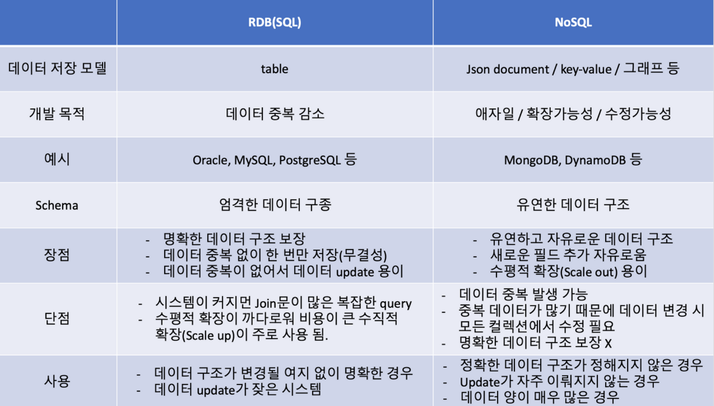
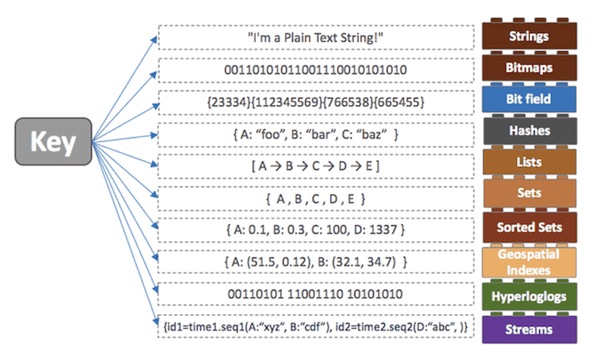

# RDB vs NoSQL
## RDB
- Relational Database
  - 관계형 모델을 기반으로 하는 데이터베이스
  - 이를 유지하고 관리하기 위한 시스템을 `RDBMS`라고 부른다.
- 주로 SQL을 이용해 데이터를 조회하고 관리한다.
- 2차원 데이터(테이블) 형태로 표현된다.
- 상호관련성을 가진 테이블의 집합으로 구성
- 테이블 사이의 관계를 외래키로 나타낸다.
- Vertical Scalable 하지만, Horizontal Scale은 어렵다.
  - 다양한 테이블과 Join되어 있기 때문
  - 데이터가 여러 테이블에 의존해 있다.
- ACID 성질을 갖는다.

## NoSQL
- Not Only SQL or Non-Relational Operational DataBase
  - 비관계형 데이터베이스
    - 테이블 간 연결해서 조회하는 `Join`도 없음
- 빅데이터의 등장으로 데이터와 트래픽이 증가함에 따라 RDBMS의 단점인 성능을 향상시키기 위해 등장
  - RDBMS가 Consistency에 중점을 두었다면, NoSQL은 Scalability에 중점을 두었다.
    - RDBMS는 데이터 무결성을 유지하기 위해 트랜잭션 ACID원칙을 따른다.
- 다양한 방식으로 데이터를 표현한다.
- Horizontal Scale이 쉽다.
- 스키마가 없기 때문에 유연하며 자유로운 데이터 구조를 갖고 있다.
  - 레코드마다 다른 구조, 다른 데이터 타입 가능
    - Key-Value Database
      - Redis, Memcached
    - Wild-Column Database
    - Document Database
      - MongoDB
    - Graph Database

---
## NoSQL의 강점과, 약점이 무엇인가요?
### 강점
- RDBMS에 비해 저렴한 비용으로 분산처리와 병렬 처리 가능
- 비정형 데이터 구조 설계로 설계 비용 감소
- Big Data 처리에 효과적
- 가변적인 구조로 데이터 저장이 가능
- 데이터 모델의 유연한 변화가 가능

### 단점
- 데이터 업데이트 중 장애가 발생하면 데이터 손실 발생 가능
- 데이터 일관성이 항상 보장되지 않음
  - ACID 특성을 제공하지 않는다.
  - 데이터 무결성 보장 X

## RDB의 어떠한 특징 때문에 NoSQL에 비해 부하가 많이 걸릴 "수" 있을까요? (주의: 무조건 NoSQL이 RDB 보다 빠르다라고 생각하면 큰일 납니다!)
> - RDB는 테이블 간의 관계를 맺고 있어 JOIN문을 필요로 한다.
> - JOIN문이 많아지게 되면 여러 테이블을 조회해야해 많은 부하가 걸릴 수 있다.

## NoSQL을 활용한 경험이 있나요? 있다면, 왜 RDB를 선택하지 않고 해당 DB를 선택했는지 설명해 주세요.
### Redis
- Remote Dictionary Server
- 다양한 자료구조
- 
- 인메모리 데이터 스토리지
  - Disk가 아닌 RAM에 저장함으로써 읽기/쓰기가 훨씬 빠르다
  - 용량으로 인해 데이터 유실이 발생할 수 있다.
    - https://www.digitaltoday.co.kr/news/articleView.html?idxno=212904
- 로컬 캐시
  - 저장 공간
    - 각 어플리케이션의 인스턴스의 메모리 공간을 사용
  - 접근성
    - 오직 해당 어플리케이션 인스턴스에만 접근 가능
    - 서버끼리 동기화 X
- Single Thread

### JWT의 RefreshToken
- JWT는 AccessToken, RefreshToken으로 분리되어 있다.
  - AccessToken이 RefreshToken보다 유효기간이 훨씬 짧으며, RefreshToken은 AccessToken을 새로 발급해주기 위한 토큰이다.
- AccessToken으로 인증/인가를 수행하는데, AccessToken이 탈취당한다 해도, AccessToken의 유효기간이 짧기 때문에 피해를 최소화할 수 있다.
- 근데, AccessToken과 RefreshToken 둘다 탈취당하면, AccessToken을 계속 재발급하며 악용할 수 있다.
- 이를 방지하기 위해서 DB에 저장해놓고 사용하는데, 해킹당한 상황에서 사용자가 RefreshToken을 통해 AccessToken과 RefreshToken 둘 다 갱신하면, 그 순간 DB의 RefreshToken이 변경되어 해커가 탈취한 이전의 RefreshToken은 만료되어 해커는 더이상 토큰을 재발급받을 수 없다.
#### DB중에서 굳이 Redis?
- Redis는 인메모리 방식의 데이터베이스이기 때문에 DB 읽기랑 쓰기가 훨씬 빠르고 비용이 적게 든다.
- 만료시간이 지나면 없어져야 하는 RefreshToken 특성상 Redis는 개발자가 만료일을 설정할 수 있다.
- 접근 빈도가 높은 RefreshToken은 RDB에 저장하는 것보다, 인메모리 DB에 저장해두고 사용하는 것이 훨씬 효율이 좋다.

### Redis vs Memcached
- 둘 다 인메모리 스토리지에 key-value database
- Spring Framework에서는 Redis를 통한 공식 의존성이 있다.
  - Memcached는 없기 때문에 외부 써드파티 라이브러리를 의존해야 한다.
- Memcached는 멀티쓰레드 기반이기 때문에 데이터 유실 가능성이 있다.
  - Redis가 싱글쓰레드라고 해서 멀티쓰레드인 Memcached보다 성능이 많이 떨어지지도 않다.
- Memcached는 value에 문자열만 되고, redis는 다양하게 둘 수 있다.
  - *나는 JWT구축할 때 Json 객체로 구축한다.

## 출처
> - https://ud803.github.io/%EB%8D%B0%EC%9D%B4%ED%84%B0%EB%B2%A0%EC%9D%B4%EC%8A%A4/2021/11/16/RDB-vs.-NoSQL-%EC%96%B8%EC%A0%9C-%EB%88%84%EA%B5%AC%EB%A5%BC-%EC%8D%A8%EC%95%BC%ED%95%A0%EA%B9%8C/