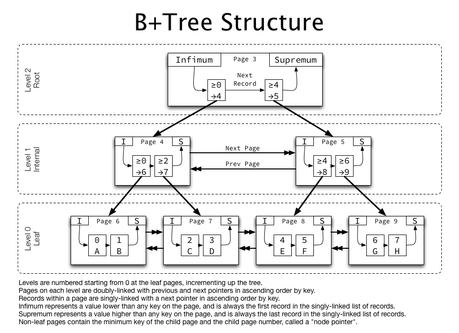

# 인덱스가 무엇이고, 언제 사용하는지 설명해 주세요.
## Index
> - 추가적인 `쓰기 작업`과 `저장 공간`을 활용하여 데이터베이스 테이블의 `검색 속도`를 향상시키기 위한 자료구조
> - 기본적으로 `B-TREE`와 `B+ TREE`(대부분) 구조로 된 INDEX를 사용한다.  

> - 책에서 원하는 내용을 찾으려고 할 때, 모든 페이지를 찾아보는 것은 오랜 시간이 걸린다.
> - 그래서 저자들은 책의 맨 앞에 `색인`을 추가하는데, 데이터베이스의 index는 책의 색인과 같다.
> - 

> - 만약 index를 사용하지 않은 컬럼을 조회해야 하는 상황이라면 전체를 탐색하는 `FULL TABLE SCAN`을 수행해야 한다.

## INDEX의 관리
> - DBMS는 index를 `항상 최신의 정렬`된 상태로 유지해야 원하는 값을 빠르게 탐색할 수 있다.
> - 그렇기 때문에 인덱스가 적용된 컬럼에 INSERT, UPDATE, DELETE를 하면 수행 후에 `INDEX를 정렬하는 연산이 추가`되기 때문에 그에 따른 오버헤드가 발생한다.
> - index는 테이블 크기의 `10%` 정도의 저장 공간을 차지한다.

## INDEX의 장단점
> - 장점
>   - 테이블을 `조회`하는 속도와 그에 따른 성능을 향상시킬 수 있다.
>   - 전반적인 시스템의 `부하`를 줄일 수 있다.
> - 단점
>   - 인덱스를 관리하기 위해 DB의 약 10%에 해당하는 `저장공간`이 필요하다.
>   - 인덱스를 관리하기 위해 `추가 작업`이 필요하다.
>   - 잘못 사용할 경우 오히려 성능이 저하된다.

## INDEX를 사용하면 좋은 경우
> - 규모가 `작지 않은` 테이블
> - INSERT, UPDATE, DELETE가 `자주 발생하지 않는` 컬럼
> - `JOIN`이나 `WHERE` 또는 `ORDER BY`에 자주 사용되는 컬럼
> - 데이터의 `중복도가 낮은` 컬럼

## B+ 트리
> - 
> - B+ 트리의 리프 노드는 `연결 리스트`로 서로 연결되어, 형제 노드끼리도 `옮겨가며 조회`할 수 있다.
>   - 연결된 리프 노드의 리스트를 따라가면서 `범위 검색` 쿼리를 할 수 있어서, 범위 검색 성능이 좋다.
> - internal 노드에는 `키만` 저장되며, 이 키를 사용해서 자식 노드의 `메모리 상 위치`를 판단한다.
>   - 실제 데이터는 `리프 노드`에만 저장되어 있다.
>   - 모든 값이 조회에 `균일한 성능`을 보인다.

## Clustered Index VS Non-Clustered Index
> - 책에 비유하자면,
> - 클러스터 인덱스는 페이지를 알기 때문에 `바로` 그 페이지를 펴는 것
> - 논클러스터 인덱스는 목차에서 찾고자 하는 내용의 `페이지를 찾고` 그 페이지로 이동하는 것

### Clustered Index
> - 
> - `실제 데이터`가 인덱스에 따라 정렬되고 저장된다.
>   - 실제 물리적인 정렬순서와 인덱스의 정렬순서와 같음
> - 하나의 테이블엔 `하나`의 클러스터 인덱스만 존재
>   - 그렇기 때문에 보통 `pk`로 지정
> - pk를 설정한 테이블의 경우 default로 pk가 클러스터드 인덱스로 설정

### Non Clustered Index
> - 
> - 하나의 테이블에 `여러 개`의 인덱스 생성 가능
> - 인덱스 자체에 data가 저장되지 않고 `data의 주소`가 저장
> - 실제 물리적인 정렬순서와 인덱스의 정렬 순서는 `다름`

---

## ORDER BY/GROUP BY 연산의 동작 과정을 인덱스의 존재여부와 연관지어서 설명해 주세요.
> ### ORDER BY
> - 인덱스가 있는 경우
>   - 인덱스를 통해 빠르게 정렬된 순서대로 데이터를 조회할 수 있다.
>   - 인덱스는 이미 정렬이 되어있기 때문에 빠르게 조회
> - 인덱스가 없는 경우
>   - DBMS는 전체 테이블을 스캔한 후, ORDER BY 절에 명시된 컬럼 값을 읽어야 한다.
> ### GROUP BY
> - 인덱스가 있는 경우
>   - 인덱스가 정렬된 상태를 유지하고 있으므로, 그룹화 작업이 효율적으로 수행.
> - 인덱스가 없는 경우
>   - 역시 DBMS는 전체 테이블을 스캔하여 데이터를 읽어야 한다.

> - 실제 데이터가 정렬되는 `클러스터링 인덱스`에서 효율적
> - 인덱스가 있는 경우 정렬, 그룹화 작업이 효율적이며, 없는 경우 전체 테이블 스캔 후 메모리 내에서 정렬, 그룹화를 수행해야 한다.

## 기본키는 인덱스라고 할 수 있을까요? 그렇지 않다면, 인덱스와 기본키는 어떤 차이가 있나요?
> - 기본키는 `자동으로 인덱스`가 적용된다.
> - 기본키는 `물리적으로 따로 저장`되지 않는다.
> - 인덱스는 데이터의 `일관성`을 보장하지 않는다.
>   - 기본키는 null값 허용X, 중복값 허용 X

## 인덱스가 데이터의 물리적 저장에도 영향을 미치나요? 그렇지 않다면, 데이터는 어떤 순서로 물리적으로 저장되나요?
> - 클러스터 인덱스를 설정하면, 데이터가 인데스 키 값에 따라 물리적으로 정렬된다.
> - 논클러스터 인덱스는 데이터의 물리적 저장 순서에 영향을 미치지 않는다.

## 우리가 아는 RDB가 아닌 NoSQL (ex. Redis, MongoDB 등)는 인덱스를 갖고 있나요? 만약 있다면, RDB의 인덱스와는 어떤 차이가 있을까요?
> NoSQL도 인덱스를 가지고 있다. 하지만, RDB의 인덱스와 여러 면에서 다르다.

> ### MongoDB
> - MongoDB는 `스키마가 없기` 때문에, 데이터들이 다양한 구조를 가질 수 있다.
>   - 인덱싱은 이러한 `유연성`을 반영해야 하기 때문에, 다양한 형태의 인덱스가 있다.
>   - 단일 필드 인덱스, 복합 인덱스, 다중 키 인덱스,...
> ### Redis
> - Redis의 인덱스는 `수동으로 구현`해야 하며, `sorted sets`을 통해 인덱스를 생성한다.
>   - 그렇기 때문에 어떤 기준으로 정렬할 지도 본인이 구현을 해야 한다.

## (A, B) 와 같은 방식으로 인덱스를 설정한 테이블에서, A 조건 없이 B 조건만 사용하여 쿼리를 요청했습니다. 해당 쿼리는 인덱스를 탈까요?
> - 여러 값을 복합한 복합 인덱스에서 A조건 없이 B만 사용하면, `인덱스를 타지 않는다`.
> - ### **먼저 첫 번째 열의 값에 따라 정렬이 되고, 그 후 두 번째 열의 값에 따라 정렬된다.**
> - 반대로, A만 설정한다면 `A 조건만으로도` 인덱스를 활용할 수 있다.

## 출처
> - https://mangkyu.tistory.com/96