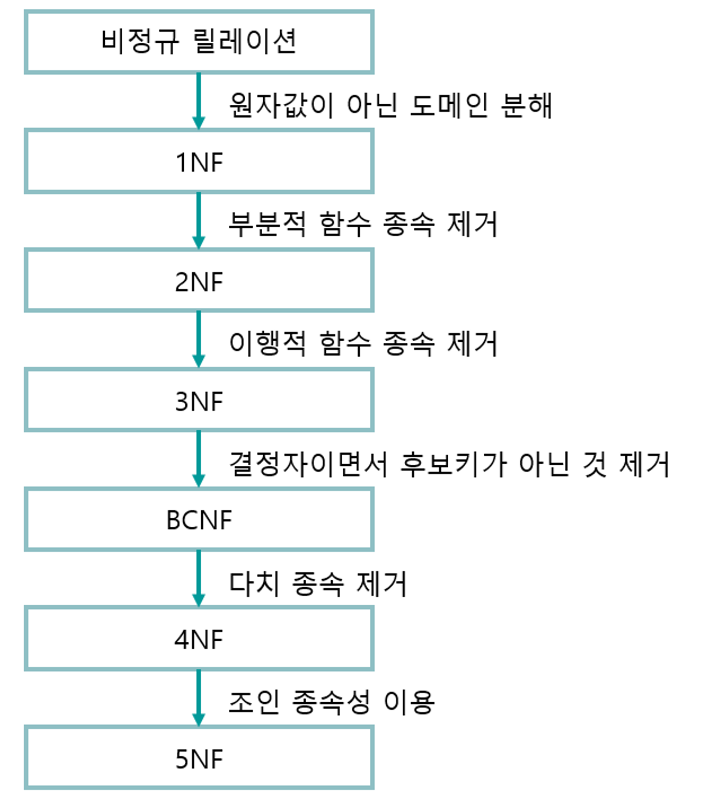
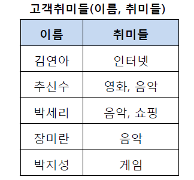
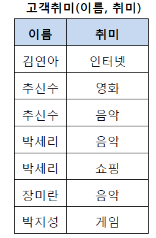
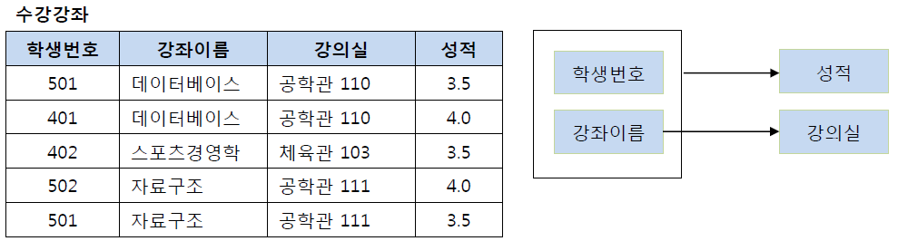
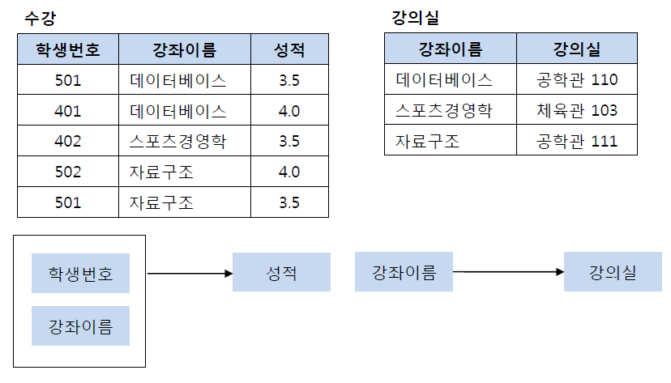
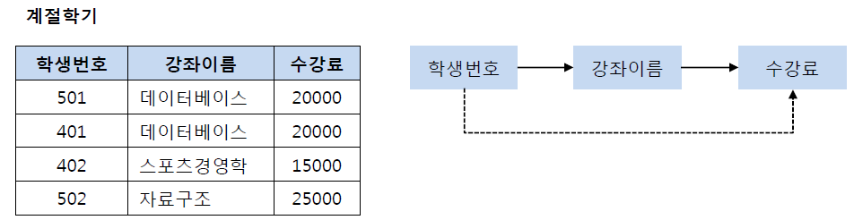
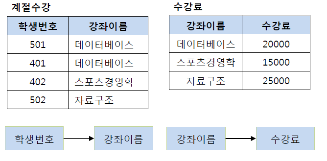
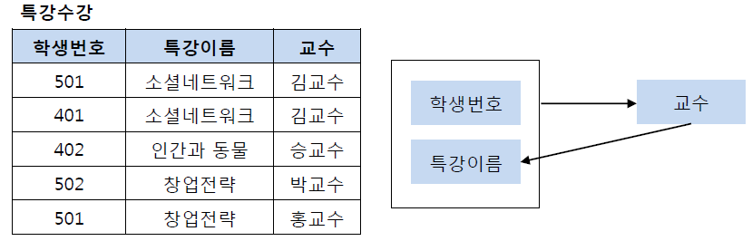
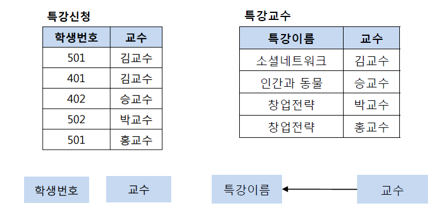
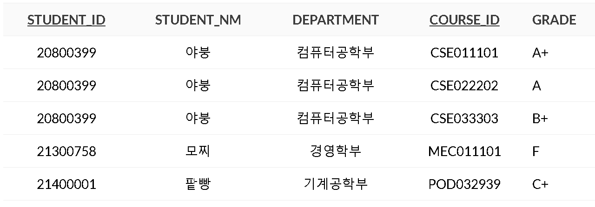

# 정규화가 무엇인가요?
> - `이상현상`이 있는 릴레이션을 분해하여 이상현상을 없애는 과정
> - 정규화의 기본 목표는 테이블 간에 `중복`된 데이터를 허용하지 않는 것
>   - `무결성`을 유지할 수 있으며, DB의 저장 용량 역시 줄일 수 있다.
> - 테이블을 분해하는 정규화 `단계`가 정의되어 있는데, 테이블을 어떻게 분해하는지에 따라 정규화 단계가 달라진다.

## 정규화의 장점
> - 데이터베이스 변경 시 `이상 현상을 제거`할 수 있다.
> - 정규화된 데이터베이스 구조에서는 새로운 데이터 형의 추가로 인한 확장 시, 그 구조를 변경하지 않아도되거나 일부만 변경해도 된다.
> - 데이터베이스와 연동된 응용프로그램에 최소한의 영향만을 미치게 된다.

## 정규화의 단점
> - 릴레이션의 분해로 인해 릴레이션 간에 `JOIN 연산`이 많아진다.
> - 데이터 처리 시간이 `느려질 수도 있다`.
> - 조인이 많아져서 성능 저하가 나타나면 `역정규화`를 적용하기도 한다.

## 함수 종속성
> - 어떤 속성 A의 값을 알면 다른 속성 B의 값이 `유일`하게 정해지는 의존 관계
>   - 속성 B는 속성 A에 종속한다.
>   - 속성 A는 속성 B를 결정한다.
>   - `A -> B`, A는 B의 결정자
> - 종속 EX)
>   - 학생번호 -> 학생이름 
>   - 학생번호 -> 주소 
>   - 강좌이름 -> 강의실 
>   - 학과 -> 학과사무실
> - 학번을 알면 학생이름을 바로 알 수 있고, 학번을 알면 주소를 바로 알 수 있다.
> 
> - 종속 X EX)
>   - 학생이름 -> 강좌이름
>   - 학과 -> 학생번호
> - 한 학생이 여러 개의 강좌를 들을 수 있고, 한 학과는 여러명의 학생을 가지고 있기 때문에, 종속하지 않는다.

## 제 1 정규화
- 테이블의 컬럼이 `원자값`을 갖도록 테이블을 분해하는 것
- 
- 이 테이블에서 추신수와 박세리는 여러 개의 취미를 갖고 있어서, 제 1 정규형을 만족하지 못하고 있다.
- 

## 제 2 정규화
- 제 1 정규화를 진행한 테이블에 대해 `완전 함수 종속`을 만족하도록 테이블을 분해하는 것
  - 완전 함수 종속 : 기본키의 부분집합이 `결정자`가 되어선 안된다.
- 
- 이 테이블에서 기본키는 (학생번호, 강좌이름)으로 `복합키`다.
- (학생번호, 강좌이름)인 기본키는 성적을 결정하고 있다.
- 그런데 강의실이라는 컬럼은 기본키의 `부분 집합`인 강좌이름에 의해 결정된다.
  - 즉, 기본키의 `부분 집합이 결정자`가 되고 있다.
- 

## 제 3 정규화
- 제 2 정규화를 진행한 테이블에 대해 `이행적 종속`을 없애도록 테이블을 분해하는 것
  - 이행적 종속 : A -> B, B-> C가 성립할 때 A-> C가 성립되는 것
- 
- 학생 번호는 강좌이름을 결정하고 있고, 강좌 이름은 수강료를 결정하고 있다.
  - (학생 번호, 강좌 이름) 테이블과 (강좌 이름, 수강료) 테이블로 분해해야 한다.

### 이행적 종속 제거 이유?
- 중간 컬럼 값(B)을 변경하면 그에 따른 C도 변경해주어야 해서 번거롭다.

## BCNF 정규화
- 제 3 정규화를 진행한 테이블에 대해 `모든 결정자가 후보키`가 되도록 테이블을 분해하는 것
- 
- 기본키는 (학생번호, 특강이름)이고, 기본키는 교수를 결정하고 있지만, 교수도 특강이름을 결정하고 있다.
- 교수가 특강이름을 결정하는 결정자이지만, 후보키가 아니다.
- 

---

## 정규화를 하지 않을 경우, 발생할 수 있는 이상현상에 대해 설명해 주세요.
### 삽입 이상
> - 데이터를 삽입하기 위해 불필요한 데이터도 함께 `삽입`해야 하는 문제
> - 
> - 아무 수업도 안들은 학생을 추가하려면 컬럼을 `NULL`로 삽입해야 한다.

### 갱신 이상
> - 중복 튜플 중 `일부만 변경`하여 데이터가 불일치하게 되는 문제
> - 야붕의 학부를 다른 학부로 바꾸려면 값을 3개 다 바꿔야 하는데 2개 값만 바꾸면 문제가 생긴다.

### 삭제 이상
> - 튜플을 삭제하면 `꼭 필요한 데이터까지 같이 삭제`되는 데이터 손실 문제
> - 모찌가 수업하나 드랍하게 되면 모찌의 학생정보가 모두 삭제된다.

## 정규화가 무조건 좋은가요? 그렇지 않다면, 어떤 상황에서 역정규화를 하는게 좋은지 설명해 주세요.
### 역정규화
> 정규화된 엔티티, 속성, 관계에 대해 시스템의 성능향상과 개발과 운영의 단순화를 위해 `중복, 통합, 분리` 등을 수행하는 데이터 모델링 기법
> - 중복, 통합을 수행하기 때문에 데이터 `무결성이 깨질 수 있다`.
> - 정규화된 데이터베이스에서 성능을 개선하기 위해 사용되는 전략
>   - 과도화된 조인으로 성능 저하시에 수행