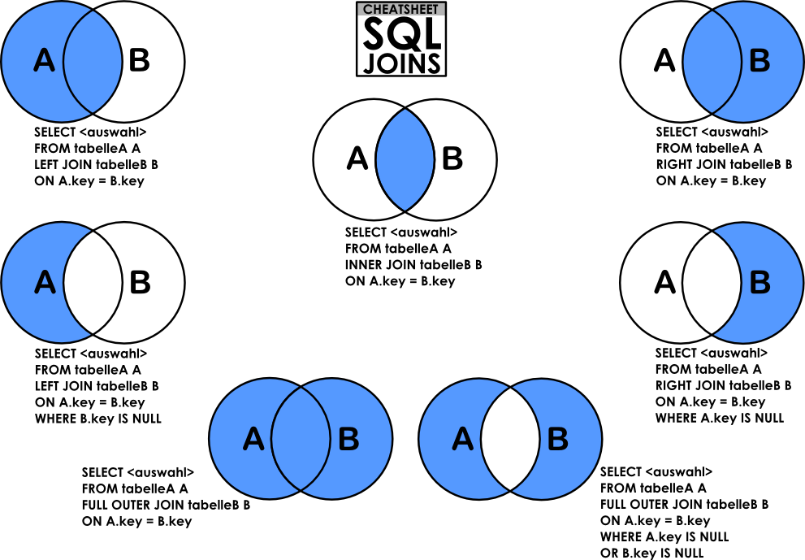
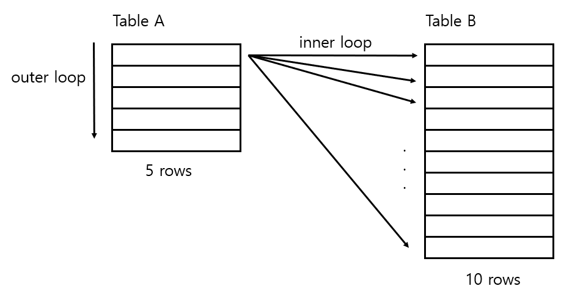

## DB Join이 무엇인지 설명하고, 각각의 종류에 대해 설명해 주세요.
> - 데이터베이스에서 두 개 이상의 테이블을 결합하여 관련된 데이터를 조회할 때 사용하는 SQL 연산
> - 서로 다른 테이블에 저장된 데이터를 조합하여 하나의 결과 집합으로 반환 가능
> - 테이블 간에 외래 키로 연결된 데이터를 조회할 때 사용


### Inner Join
> - 두 테이블 간의 공통된 데이터를 조회할 때 사용
> - 결합된 테이블의 교집합을 반환하며, 조건에 맞는 레코드만 결과로 반환

### Left (Outer) Join
> - 왼쪽 테이블의 모든 데이터를 반환하며, 오른쪽 테이블에서 일치하는 데이터가 있는 경우에만 데이터 포함.
> - 오른쪽 테이블에 일치하는 데이터가 없으면 `NULL`로 채워짐.
> - Right (Outer) Join도 마찬가지

### Full (Outer) Join
> - 두 테이블의 모든 데이터 반환
> - 두 테이블 간에 일치하는 데이터가 있는 경우에는 결합된 데이터를 반환
> - 일치하지 않는 경우에는 해당 테이블의 데이터는 `NULL`로 채워짐

### Natural Join
> - 두 테이블 간에 공통으로 존재하는 모든 컬럼을 기준으로 `자동으로` 조인
> - 조인 조건을 명시할 필요 없이, 동일한 이름을 가진 컬럼들 간에 자동으로 조인
>   - 조인 조건(using절, on절) 수행 시 오류
> - Join은 `Inner Join`으로 실행
```sql
SELECT * FROM table1 NATURAL JOIN table2;
```

### Self Join
> - 동일한 테이블을 서로 다른 두 개의 테이블처럼 취급하여 조인

### Cross Join
> - 두 테이블 간의 카르시안 곱을 수행.
>   - 모든 행이 서로 결합된 결과를 반환
> - 두 테이블 간의 조인 조건이 필요 없으며, 모든 행이 결합되어 조합된 결과가 반환
>   - 결과는 A테이블 M개 행과 B테이블 N개 행을 곱한 `M*N`만큼 결과 반환

## 조건절
### ON
> - 두 테이블 간의 특정 컬럼들 간의 관계 지정 가능
> - 일반적으로 `=` 연산자를 사용하여 두 컬럼의 값을 비교
>   - 물론 `<`, `>`, `BETWEEN`, `LIKE` 등도 사용 가능
> - 조인할 컬럼들이 이름이 다르더라도 사용 가능
> - 여러 조건 결합하거나 복잡한 조건 지정 가능
```sql
SELECT *
FROM employees e
INNER JOIN departments d
ON e.department_id = d.department_id;
```

### USING
> - 두 테이블 간에 `동일한` 이름을 가진 컬럼을 기준으로 조인 수행
> - 컬럼 이름을 한 번만 지정
> - 해당 컬럼이 두 테이블에 모두 존재해야 함
> - 컬럼 하나를 쓰지 않고 ON절처럼 연산자를 쓸 경우 오류 발생
```sql
SELECT *
FROM employees e
INNER JOIN departments d
USING (department_id);
```

---

## 사실, JOIN은 상당한 시간이 걸릴 수 있기에 내부적으로 다양한 구현 방식을 사용하고 있습니다. 그 예시에 대해 설명해 주세요.
> - Join 연산은 데이터베이스 시스템에서 많은 양의 데이터를 처리할 때 성능에 큰 영향을 줄 수 있다.
> - 이를 최적화하기 위해 다양한 Join 알고리즘을 구현하고 있다.
> - 어떤 알고리즘을 선택할지는 데이터베이스 옵티마이저가 데이터의 크기, 인덱스, 결합 키와 같은 요인을 참고하여 정하게 된다.

### DBMS(Query) Optimizer
> - 가장 효율적인 방법으로 SQL을 수행할 최적의 처리 경로를 생성해주는 DBMS의 핵심 엔진

### Nested Loop Join
> - 가장 기본적인 Join 방식
> - 두 테이블에서 각각의 레코드 쌍을 비교하면서 일치하는 레코드를 찾는 방식
> - 한 테이블을 Outer Loop로 설정하고, 다른 테이블을 Inner Loop로 설정하여, 외부 테이블의 각 레코드에 대해 내부 테이블의 모든 레코드를 비교한다.
> - 데이터 양이 적은 경우에 효과적
> - 

### Hash Join
> - Join 조건이 동등 비교일 때 효과적.
> - 하나의 테이블을 메모리에 로드하여 해시 테이블을 만들고, 다른 테이블의 데이터를 이 해시 테이블과 비교하면서 Join tngod
> - 먼저, 작은 테이블이나 서브 쿼리의 결과를 메모리에 로드하고, Join 키를 기반으로 해시 테이블을 생성.
> - 이후, 다른 테이블의 각 레코드를 해시 테이블에서 조회하여 일치하는 레코드를 찾기.
> - 대규모 데이터셋에서 효율적이며, 동등 조건(=) 비교에서 특히 성능이 좋다.
> - 해시 충돌 시 성능 저하가 발생할 수 있다.

### Sort-Merge Join
> - 두 테이블을 각각 정렬한 후, 정렬된 상태에서 병합하면서 Join 수행
> - 먼저, 두 테이블을 Join 키 기준으로 정렬
> - 정렬된 데이터를 하나씩 비교하면서 일치하는 레코드를 병합
> - order by가 있는 쿼리에 대해서 효율이 좋다.

> 인덱스가 있는 경우, 데이터베이스는 테이블 전체를 스캔하지 않고도 인덱스를 사용해 필요한 데이터에 직접 접근할 수 있다.

## 3중 조인 부터는 동작 방식이 약간 바뀝니다. 어떻게 동작하는지, 그리고 그 방식이 성능에 어떠한 영향을 주는지 설명해 주세요.
> - 기본적으로 두 개의 테이블을 조인하는 것과 비슷하게 작동하지만, 조인 순서와 조인 전략이 더 중요하게 작동
> - SQL 쿼리는 일반적으로 왼쪽에서 오른쪽으로 읽히지만, `A JOIN B JOIN C`이라고 해서 `A JOIN B`를 먼저 수행한 후, 결과 값에 C를 조인하는 게 아니다.
>   - 쿼리 옵티마이저가 뭘 먼저 조인했을 때 더 효율적인지 판단하고 수행하게 된다.

### 순차적 조인
> - 먼저, 두 개의 테이블을 조인한 다음, 그 결과를 일시적인 중간 테이블에 저장하고, 그 중간 테이블과 세 번째 테이블과 조인한다.

### 조인 순서 최적화
> - 쿼리 옵티마이저가 세 개의 테이블 중 어떤 두 테이블을 먼저 조인할지 선택

### Multi-way Join
> - 세 개 이상의 테이블을 한 번에 조인하는 것이 아니라, 각 테이블 간의 조인 연산을 단계적으로 수행
> - 옵티마이저가 다양한 방법을 시도하여 최적의 방법을 선택