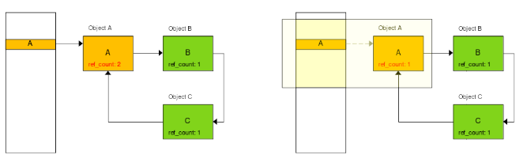

# Garbage Collection

### 본인이 사용하는 언어에서는 GC를 어떻게 구현했나요?

#### Java Garbage Collection

1.  Marking

    

    > 사용하는 메모리 조각과 사용하지 않는 메모리 조작을 식별한다.<br>

2.  Deletion

    - Normal Deletion

     

    > 참조되지 않은 객체를 제거하고 메모리 할당자는 새 개체를 할당할 수 있는 여유 공간 블록의 참조를 보유한다.

    - Deletion with Compacting

     

    > 참조된 나머지를 압축하여 개체를 이동하여 새로운 메모리 할당을 쉽게 한다.<br>
    > 사용중인 클래스를 기반으로 런타임시 JVM에 의해 채워진다.

    ***

#### JVM Generations

<br>


1.  Young Generation<br>
    > 모든 새로운 객체가 할당되고 노화되는 곳
    > 가득차게 되면 `minor garbage collection`이 발생한다
2.  Old Generation<br>
    > 오래 살아남는 객체(참조가 계속되는)를 저장한느데 사용된다.<br>
    > Young Generation에서 임계값을 정하고 Age가 충족되면 넘어온다.
3.  Permanent Generation<br>
    > JVM이 App에 사용되는 클래스와 메소드를 설명하는 메타데이터가 포함되어있다.

`minor GC(garbage collection)` - Stop the World event로 이 작업이 모두 완료될 때까지 모든 App 스레드가 중지된다

---

#### 데이터 관리

   
   
   > Eden 영역에 새로운 객체 할당, Surivor은 빈공간

   

> Eden 영역이 가득차게되면 Minor GC 실행

   

> 참조가 있는 객체는 S0 survivor space로 이동<br>
> 참조가 없는 객체는 제거

   

> 다음 Minor GC가 실행될 때 Eden 영역은 계속 반복<br>
> 참조가 살아있는 객체들은 S1 space로 이동(Aging)<br>
> S1 space는 Aging 이 다른 객체들이 각기 존재

   

> S1 space에 살아있는 객체는 S0 space로 이동된다<br>
> Minor GC 과정에서 같은 과정이 반복<br>
> S0, S1 둘중 하나는 비어있음

   

> Minor GC 후 특정 Age 임계치를 넘으면 Old Generation으로 Promotion한다

   

> Minor GC가 계속 발생하면 계속 Promotion하여 공간이 부족하게 된다

   

> Old Generation이 가득차면 major GC가 공간을 정리하고 압축하기위해 발생하게 된다

---

### GC의 장단점에 대해 설명해 주세요.

#### 장점

> 개발자가 동적으로 할당된 메모리 전제츨 관리할 필요가 없어져 코드 개발에 장점이 있다.

#### 단점

> GC가 수행될 정확한 시점을 알 수 없어 App을 중지시키는 Stop The World가 수행될때 오버헤드를 일으킬 수 있다.

---

### GC는 어떤 영역에 있는 데이터를 관리하나요?


> 자바에서 heap 영억은 JVM 존재하는 Runtion Data Area 안에 존재
>
> 따라서 GC는 heap 영역 안의 데이터를 관리한다

### Reference Counting 방식에 대해 설명하고, 이 알고리즘에서 발생할 수 있는 순환 참조 및 Retain Cycle에 대해 설명해 주세요.

---

#### 참조 횟수 계산 방식(Reference Counting)

> 객체에 참조값을 넣어 참조되면 1 증가 참조하지 않게되면 1 감소하여 0이되면 유효한 객체로 보지 않아 제거하는 방식이다

매번 참조할 때마다 참조값을 검사해야함으로 많은 수의 객체를 사용하게 되면 검사에 대한 부하가 커진다

---

#### 순환참조(Circular Reference)



둘 혹은 그 이상의 객체가 서로를 참조하는 상황

---

#### Retain Cycle


A를 참조하는 a,b 인스턴스의 some이 아래와 같이 있다.

```
a.some = b
b.some = a
```


인스턴스들의 null이 된다면 아래의 some끼리 연결되어 있는 것은 영원히 해제되지 않고 남아 메모리 누수(memory leak)를 발생시킨다

> 강한 참조로 인해 메모리가 해제되지 않고 유지되어 메모리 누수가 발생하는 현상

Retain

클래스와 같이 추상화된 것으로 부터 객체를 만들어내는 것

---

GC의 기본 Algorithm

Reference Counting Algorithm<br>
Mark-and-Sweep Alogrithm<br>
Mark-and-Compact Algorithm<br>
Copying Algorithm<br>
Generational Algorithm<br>

---

https://www.oracle.com/webfolder/technetwork/tutorials/obe/java/gc01/index.html

https://woooongs.tistory.com/51

https://mangkyu.tistory.com/118
