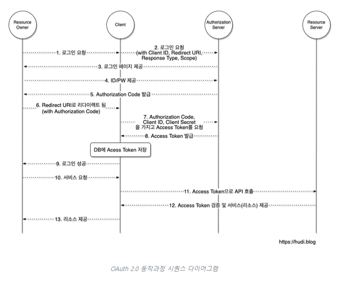

# Authentication(인증) & Authorization(인가)

## Authentication(인증)

> 로그인과 같이 사용자 또는 프로세스의 신원을 확인하는 프로세스

|  Factor  | 설명                              | 예                 |
| :------: | --------------------------------- | ------------------ |
| 지식기반 | 사용자만 알고 있는 것             | 패스워드, 주민번호 |
| 소유기반 | 사용자만 소유하고 있는 것         | 인증서, OTP        |
| 속성기반 | 생체기반으로 사용자만의 고유 속성 | 지문, 홍채         |

### Authentication Techniques

비밀번호 없는 인증

- 매직링크 또는 이메일 또는 문자 메시지를 통해 전달된 OTP로 인증

2FA(Two Factor Authentication)/ MFA(Multi Factor Authentication)

- 2단계 또는 다중 요소 인증을 사용

SSO(Single Sign On)

- 단일 자격 증명 세트로 여러 응용 프로그램에 액세스 할 수 있음

Social Authentication

- 소셜 네트워킹 플랫폼의 기존 자격 증명으로 확인하고 인증

API Authentication

- 서버에서 서비스에 엑세스하려는 사용자 식별을 인증하는 프로세스

생체 인증

- 홍채 지문, 얼굴 등의 생체 데이터로 인증

---

## Authorization(인가)

> 누가 무엇을 할 수 있는지 결정하는 규칙

- 권한 부여는 사용자의 신원이 성공적으로 인증된 후 발생한다

### Authorization Techniques

`RBAC(Roll-Based Access Control)`

> 조직내의 역할에 따라 권한을 부여하여 사용한다

- 사전 정의된 역할을 통해 신규직원이 온보딩할 때 작업량이 적다
- 직원이 퇴사하거나 직무를 변경하는 경우 빠른 변경 및 해고 가능하다
- 역할기반으로 액세스를 관리할 때 관리자의 권한 부여에 실수가 적다

> 하지만 정적 인증 형식으로 정책변경시 쉽게 업데이트 할 수 없다

`PBAC(Policy-Based Access Control)`

> 사전 정의된 정책에 따라 사용자의 접근권한을 결정한다<br>

```
    <사전 정의된 정책>
 -사용작의 역할, 자원에 대한 접근 권한 등 명시적 규칙
 -사용자의 위치, 시간, 장치 등 상황 정보를 고려하여 접근 권한을 동적으로 조정
 -정책은 중앙에서 관리되며, 이를 통해 일관된 보안 정책 적용이 가능
```

- 보안 요구사항을 쉽게 반영가능하다
- 사용자 역할과 속성을 사용해 효과적으로 관리가능하다
- 상황에 따라 실시간으로 접근 권한을 조정가능하다

`ABAC(Attribute-Based Access Control)`

> 사용자의 속성 또는 특성을 사용하여 사용자 액세스 권한을 동적으로 결정하는 인증 접근 방식이다<br>
> PBAC와 유사하게 관리자는 사용자 역할 및 속성을 기반으로 액세스 정책을 만들고 액세스를 동적으로 결정하는 이러한 역할 및 속성에 관한 규칙을 설정한다<br>
> PBAC는 리소스에 대한 사용자 액세스를 허용하거나 거부하는 정책에 중점을 두고, ABAC는 정책에 영향을 미치는 특정 속성에 중점을 둔다

- 역할이 아닌 속성을 사용하여 사용자와 리소스 간의 관계를 지정하므로 관리자는 추가 역할을 생성할 필요 없이 정확하게 대상이 지정된 규칙을 생성할 수 있다
- 관리자는 규칙을 수정하거나 새 역할을 생성하는 대신 관련 속성을 새 사용자나 리소스에 할당하기만 하면 된다
- 관리자는 필요에 맞게 속성을 수정하고 상황에 맞는 규칙을 만들 수 있다

```
PBAC와 ABAC 차이 예시
특정 부서 직원만 재무 데이터에 접근할 수 있다"는 정책을 수립할 수 있습니다. 반면 ABAC를 사용하면 "직급이 과장 이상이고, 근무 시간이 오전 9시~오후 6시이며, 사내 네트워크에서 접속한 경우에만 재무 데이터에 접근할 수 있다"와 같이 더 세부적인 정책을 수립할 수 있습니다.

PBAC
사용자의 역할, 직무, 조직요구사항 등을 기반으로 정책을 정의

ABAC
사용자, 객체, 직업, 환경 등 다양한 속성을 기반으로 제어 규칙 정의

```

`PAM(Privileged Access Management)`

> 특권 계정의 사용을 모니터링하고 제어하는 기능을 제공한다<br>
> 이를 통해 중요한 디지털 자산에 대한 무단 접근을 방지한다

---

인증 방법

`API keys`

- 사용자가 시스템에 대한 권한을 얻을 때 API key를 생성받아 사용

`HMAC (Hash-Based Message Authentication Code)`

- 암호화 해시 기능과 비밀 암호화 키를 포함하는 특정 유형의 메시지 인증 코드

`JWT/JSON Web Token`

- 당사자간에 안전하게 데이터를 전송하기위한 공개 표준이며 사용자는 공개 / 개인 키 쌍을 사용하여 권한을 부여받음

`SAML(Security Assurance Markup Language)`

- 디지털 서명 된 XML 문서를 통해 인증 정보를 교환하는 표준 싱글 사인온 형식 (SSO)
- 서비스 공급자와 아이덴티티 공급자라는 두 엔터티 간의 XML 기반 인증 및 권한 부여 시스템

`OpenID`

- 인증 서버의 인증을 기반으로 사용자 신원을 확인하게 Authentication에 더 가깝다
- 최종사용자의 신원을 알수 있고, 최종 사용자와 상호작용 가능하다

`OAuth`

## OAuth가 무엇인지 설명하고, 이것은 인증인지 인가인지에 대해 설명해 주세요.

### OAuth란?

`OAuth`가 나오기 이전에는 각자의 방법대로 사용자를 인증해왔다 이러한 인증방법들을 표준화한 인증방식이다<br>
`OAuth`에서 인증을 하면 이 인증을 공유하는 App에서는 별도의 인증이 필요없게되어 여러 App를 통합하여 사용가능하다

> 사용자가 자신의 정보에 대한 접근 권한을 제3자 애플리케이션에 안전하게 위임할 수 있도록 해주는 인증 프로토콜

구성

- resource owner : 사용자
- Clien : 우리가 이용하고자 하는 서비스
- Authorization Server : 사용자 인증 및 권한 부여를 담당하는 서버

<br>



1~2 로그인 요청

3~4 로그인 페이지 제공 ID/PW 제공

5~6 Authoriztion Code 발급, Redirect URI 로 리디렉트

- OAuth 2.0 서비스는 인증이 성공한 사용자를 사전에 등록된 Redirect URI로만 리디렉션 시킨다
- Authorization Code: Client가 Access Token을 획득하기 위해 사용하는 임시 코드

7~8 Authorization Code와 Access Token 교환

9 로그인 성공

10~13 Access Token으로 리소스 접근

https://baek.dev/post/24/

https://hudi.blog/oauth-2.0/
