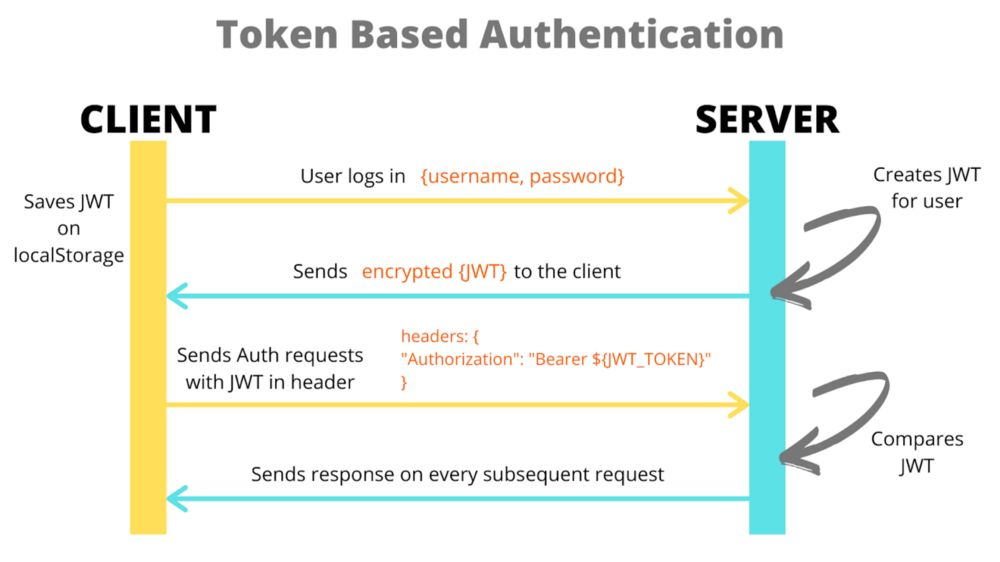
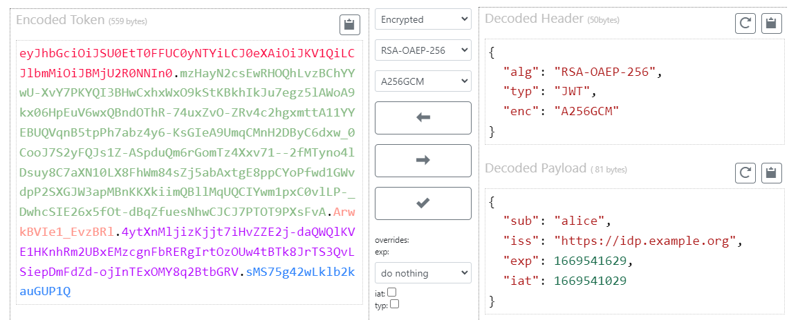
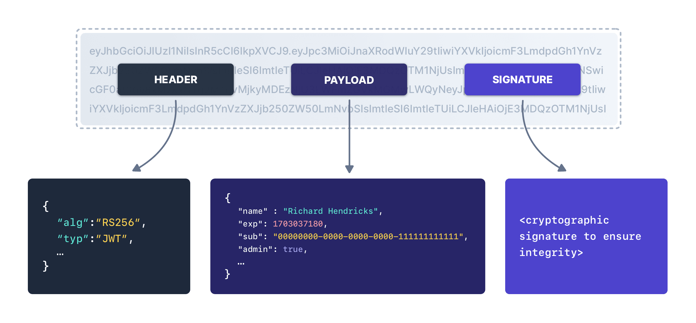

## JWT 인증 방식이 무엇인가요?
`JWT 인증 방식`이란, *두 당사자 간 전송할 `클레임(claim)`* 을 나타내는 `JWT(JSON 웹 토큰)`을 통해 사용자를 인증하는 방식을 말합니다.   
`JWT`는 공간이 제약된 환경, 예를 들어 `HTTP Authorization 헤더`, `URI 쿼리 매개변수`와 같은 환경에서 `클레임들`을 주고 받을 수 있도록 `간결화`하는 것이 목적입니다.  
- `클레임`: `키-값 쌍`으로 이뤄진 데이터
### JWT?
`JWT(JSON Web Token)`는 당사자 간 정보를 `JSON 객체`로 안전하게 전송하기 위한 간결하고 독립적인 방법을 정의하는 개방형 표준([RFC 7519](https://datatracker.ietf.org/doc/html/rfc7519))입니다.  
`JWT`는 `정보(클레임 집합)`를 `선택적 서명(JWS 구조로 인코딩)/암호화(JWE 구조로 인코딩)`한 `JSON 객체`라고 할 수 있으며, 이 `JSON 객체`는 `0개 이상의 클레임`을 가질 수 있습니다.  

> 출처: [How to Sign and Validate JSON Web Tokens – JWT Tutorial (freecodecamp.org)](https://www.freecodecamp.org/news/how-to-sign-and-validate-json-web-tokens/)

주로 인증 과정에서 사용자가 자격 증명을 통해 로그인에 성공하면 JWT가 반환되며, 사용자가 `보호된 경로/리소스`에 접근할 경우 `Bearer` 스키마를 통해 `Authorization` 헤더에 JWT를 첨부해 요청해야 합니다.  
즉, 다음과 같은 형태를 띄어야 합니다.  
```
Authorization: Bearer <token>
```
#### JWE(JSON Web Encryption) [RFC 7516](https://datatracker.ietf.org/doc/html/rfc7516)

> 출처: [Using JSON Web Encryption (JWE) - DZone](https://dzone.com/articles/using-json-web-encryption-jwe)

- JWT 내용을 디지털 방식으로 암호화 함.
	- 따라서 `무결성 검증` 및 `콘텐츠 보호`에 사용할 수 있음.
	- 또한 `인증된 암호화(AUtehmticated Encryption)`를 통해 평문의 `기밀성`과 `무결성`, `JWE 보호 헤더(JWE Protected Header)`의 `무결성`을 보장.
- 본질적으로 콘텐츠를 암호화 하므로, `HTTP 상에서 사용할 수 있음. 
- 일반적인 구조
```
<Base64URL 인코딩 된 UTF8 인코딩 형태의 JWE Protected Header>.<Base64URL 인코딩 된 JWE Encrypted Key>.<Base64URL 인코딩 된 JWE Initialization Vector>.<Base64URL 인코딩 된 JWE Ciphertext>.<Base64URL 인코딩 된 JWE Authentication Tag>
```
- 과정
	- `JWT Protected Header`를 선언한다.  
		- 헤더는 다음 두 가지를 갖고있다.  
		- `alg`: `콘텐츠 암호화 키(Content Encryption Key)`를 어떤 알고리즘을 사용해 암호화할지 나타냄.
		- `enc`: 어떤 알고리즘을 사용해 `인증된 암호화(AUtehmticated Encryption)`를 수행할지 지 나타냄.
			- `인증된 암호화`는 평문에 대해 수행되어, `암호화된 텍스트(ciphertext)`와 `인증 태그(Authentication Tag)`를 생성함.
		- 이후 이를 `UTF-8`로 인코딩 한 뒤, `Base64URL`로 인코딩 한다.
	- 랜덤한 `CEK(콘텐츠 암호화 키)`를 생성한다.
	- `CEK`를 `RSAES-OAEP` 알고리즘을 사용해 수신자의 `공개키`로 암호화하여, `JWE Encrypted Key`를 생성한 뒤, `Base64URL` 인코딩을 수행한다.
	- 랜덤한 `JWE Initialization Vector`를 생성한 뒤, Base64URL 인코딩을 수행한다.
	- 평문에 `AES GCM` 알고리즘을 사용해 `인증된 암호화`를 수행한다.
		- `CEK`를 `암호화 키`로 사용하며, 추가로 `JWE Initialization Vector`, `AAD` 역시 사용한다.
		- 이를 통해 `Ciphertext(암호문)`와 128비트 `JWE Authentication Tag`를 만들어내고, 이들에 대해 Base64URL 인코딩을 수행한다.

#### JWS(JSON Web Signature) [RFC 7515](https://datatracker.ietf.org/doc/html/rfc7515)

> 출처: [Components of JWTs Explained (fusionauth.io)](https://fusionauth.io/articles/tokens/jwt-components-explained)

- 디지털 서명을 통해 발신자-수신자 간 전송되는 JWT 내용이 `변조되지 않음`을 `보장`하는 `JWT`
- 일반적으로 `JWT 인증`에 사용되는 형태는 `JWS`라고 할 수 있음
- 특징
	- `내용(클레임)`은 타인도 읽을 수 있음.
		- 따라서 비밀번호와 같은 `민감 데이터`를 `전송하는데 사용해서는 안 됨`.
	- 본질적으로 타인이 데이터를 읽는 것을 방지하지 않으므로, `HTTPS` 또는 `SSL`를 통해 전송됨.
	- `비밀(secret)`(`HMAC` 알고리즘) 또는 `공개-개인 키 쌍`(`RSA`, `ECDSA` 알고리즘)을 사용해 `서명`할 수 있음.
- 일반적인 구조
```
<Base64URL 인코딩된 헤더>.<Base64URL 인코딩된 페이로드>.<Base64URL 인코딩된 시그니처>
```
### JWT의 구조
`JWT`는 점(`.`)으로 구분된 `세 가지 부분`으로 `구성`되어 있음
즉, `<header>.<payload>.<signature>`와 같은 형태
- `header`
	- 일반적으로 두 부분을 갖는 `JSON 객체`로, Base64URL 인코딩을 거쳐 JWT의 첫 번째 부분을 맡음.
		- `typ`: 토큰의 `유형`
		- `alg`: 사용된 `서명 알고리즘`
- `Payload`
	- 0개 이상의 `클레임`을 포함하는 JSON 객체로, `엔티티`(주로 `사용자`)와 추가적인 데이터로 이뤄짐.
	- `클레임`은 `registered`, `public`, `private` 세 가지 종류가 있음.
		- `registered`
			- **미리 정의된** `클레임 셋`으로, 필수는 아니지만 권장되는 사항으로 유용하며 상호 운용 가능함.
				- `iss`(issuer): JWT를 `발급한 주체`를 식별
				- `sub`(subject): JWT의 주제가 되는 `주체(인증가능한 엔티티)`. 
					- JWT의 클레임은 일반적으로 `subject`에 대한 진술임.
					- 또한, 발행자의 컨텍스트상에서 또는 전역적으로 `subject`는 고유해야함.
				- `aud`(Audience): JWT가 `의도하는 수신자`를 식별
					- 즉, JWT를 처리하는 각 주체들은 `aud` 클레임 값으로 자신을 식별해야 함.
				- `exp`(expiration time): JWT 처리가 허용되어서는 안되는 `만료 시간(또는 그 이후)`
				- `nbf`(not before): JWT 처리가 허용되어서는 안되는 `이전 시간`
				- `iat`(issued at): JWT가 `발행된 시점`을 식별
				- `jti`(jwt id): JWT의 `고유 식별자`
		- `public`
			- JWT를 `사용하는 측`에서 `마음대로 정의`할 수 있음
			- 다만 충돌 방지를 위해선 `IANA JSON Web Token Registry`에 정의되어 있거나, `충돌 방지 네임스페이스가 포함된 URI`로 정의해야 함.
		- `private`
			- `사용자 지정 클레임`으로, 사용에 동의한 당사자 간에 정보 공유하기 위해 만듦
- `signature`
	- Base64 인코딩된 `헤더`, `페이로드`, `비밀`을 가져와 `헤더에 지정된 알고리즘`으로 `서명`한 값
		- 예를 들어, `HMAC SHA256` 알고리즘으로 서명하는 경우 다음과 같음
			- `HMACSHA256(base64UrlEncode(header) + "." + base64UrlEncode(payload), secret)`
	- `서명`은 메시지가 `도중에 변경되진 않았는지 확인`하는데 사용
		- `개인 키로 서명된 토큰`은 JWT 발신자가 `본인이 맞는지 확인`할 수도 있음
### JWT의 장점
`SSO`와 같은 시스템에서 주로 사용되는 또 다른 인증 포맷인 `SAML 토큰` 대비 
#### 더 간결하다
- `JSON`은 `XML`보다 장황하지 않아 웬만한 경우 `JWT`가 `SAML 토큰`보다 작음. 
	- `SAML(Security Assertion Markup Language)`: `SSO`와 같은 인증 방식에서 사용되는 포맷으로, XML을 기반으로 `인증 대상자가 누구인지` 알려주는 표준화된 방법
		- [SAML | Okta Identity Korea](https://www.okta.com/kr/blog/2020/09/what-is-saml/)
		- [SAML이란? | SAML 인증이 작동하는 방식 | Cloudflare](https://www.cloudflare.com/ko-kr/learning/access-management/what-is-saml/)
- 따라서 `HTML` 및 `HTTP`환경에서 전달하기 용이함
#### 더 안전하다
- JWT는 서명을 위해 `X.509 인증서` 형식의 `공개-개인키 쌍`을 사용하거나, `HMAC 알고리즘`을 사용해 `공유된 비밀`로 대칭적 서명이 가능
- `SAML 토큰`은 JWT와 같이 `공개-개인키 쌍`을 사용할 수 있지만, 취약점없이 `XML 디지털 서명`을 통해 XML에 서명하는것은 `JSON 서명`의 **`단순성`** 에 비하면 매우 어려움
#### 더 대중적이다
- `JSON parser`는 `JSON`이 객체에 직접 매핑되므로 대부분의 프로그래밍 언어에서 `일반적`임
- 반면 `XML`은 자연스러운 `문서-to-객체` 매핑이 없음
	- 따라서 `SAML assertion` 대비 작업이 더 쉬움

## Signature는 어떻게 만들어지나요?
- Base64 인코딩된 `헤더`, `페이로드`, `비밀`을 가져와 `헤더에 지정된 알고리즘`으로 `signature`를 만듦
	- 예를 들어, `HMAC SHA256` 알고리즘으로 서명하는 경우 다음과 같음
		- `HMACSHA256(base64UrlEncode(header) + "." + base64UrlEncode(payload), secret)`
## 만약 Access Token이 탈취되면, 어떻게 대응할 수 있을까요? / 반대로 Refresh Token이 탈취되면, 어떻게 대응해야 할까요?
토큰이 탈취 당한 경우, 아래와 같은 방법들을 통해 `토큰을 무효화`해야합니다.
### 토큰 블랙리스트
- 유효하지 않은 것으로 간주되어야 할 토큰의 `jti` 클레임, 또는 `사용자 id`와 같은 `식별자`를 `서버측 블랙리스트`에서 관리하는 방법
- API 엔드포인트에 토큰이 제시되면, 서버는 블랙리스트에 포함되었는지 확인
- 블랙리스트는 주로 `Redis`와 같이 접근 속도가 빠른 `인-메모리 저장소`에 저장하거나,  `DB`에 저장
- 장점
	- `세분화된 제어`: 다른 토큰들에 영향 없이 특정 토큰만 무효화 할 수 있음
	- `호환성`: 다양한 백엔드 환경에서 사용 가능함
- 단점
	- `확장성`: 블랙리스트에 포함된 `토큰 수가 증가`하면 `블랙리스트 조회 성능이 저하`될 수 있음
	- `서비스가 Stateful해짐`: 블랙리스트를 계속 유지한다는 것은, `상태를 계속 유지`한다는 것과 사실상 동일. 이는 `JWT`의 `Stateless`한 특성과 상충됨
### 짧은 토큰 수명
- 토큰의 수명(`exp`)을 `매우 짧게 설정`해, 공격자가 액세스 토큰을 탈취해도 많이 사용할 수 없음.
- 이는 공격자가 `리프레시 토큰`은 탈취하지 못한 경우 매우 유용
- 장점
	- `노출 감소`: 토큰이 탈취되어도 `공격에 노출되는 시간이 최소화`됨
	- `Stateless 유지`: 별도의 `서버 측 저장소가 필요하지 않음`
- 단점
	- `사용자 경험`: 사용자가 `더 자주 인증`해야 함
	- `즉각적인 해지 불가능`: 탈취당해도 해당 토큰이 `수명에 다다르길 기다려야 함`
### 비밀 로테이션
- `JWT` 서명에 사용되는 `비밀(secret) 키`를 주기적으로 교체하면, 이전 `비밀 키`로 서명된 `모든 기존 토큰들을 무효화` 할 수 있음
	- 이는 보안 사고가 발생했거나, 인증 전략을 변경한 뒤 `많은 수의 토큰`을 `동시에 해지`해야할 때 특히 유용
- 장점
	- `매우 안전`: 정기적으로 로테이션되는 `비밀`은 보안 계층을 추가하는 셈
	- `광범위한 영향`: 기존의 모든 토큰들을 `한 번에 무효화 해야하는 케이스`에 매우 효과적
- 단점
	- `복잡한 키 관리`: 실수로 `합법적인 토큰`을 무효화하지 않도록 신중한 관리가 필요
	- `토큰 재생성`: `비밀 로테이션` 이후 클라이언트는 새로운 JWT를 획득해야 해 클라이언트-백엔드 간 `상호 작용 복잡`하게 만들 수 있음
### 토큰 버전 관리
- 발행된 각 `JWT`에 `버전 번호`를 할당한 뒤, 사용자의 계정 정보와 함께 `DB에 저장`
- 만약 토큰을 무효화해야 할 경우, `DB`의 `버전 번호를 증가`시켜 `이전 토큰들을 무효화`
	- 증가된 이후, 사용자가 인증을 시도할 경우 `업데이트된 버전이 포함된 토큰`을 제시해야 함
- 장점
	- `선택적 무효화`: 사용자의 계정 상태나 기타 기준에 따라 `특정 대상만 무효화` 할 수 있음
	- `호환성`: 다양한 신원 제공자 및 인증 시스템과 `함께 사용`될 수 있음
- 단점
	- `복잡성 증가`: 토큰 버전 역시 검증해야 하므로 `추가적인 로직`이 필요
	- `데이터베이스 종속성`: DB 검색을 통해 토큰 버전을 검증하므로, 검색하는데 `지연 시간`이 발생할 수 있음
### 사용자 로그아웃 및 강제 토큰 무효화
-  사용자가 `로그아웃` 할 때, `서버에서 마킹`하거나 `세션을 만료`시켜 `JWT 토큰`을 `무효화`
	- 로그아웃 이후 탈취된 토큰을 사용하는 것을 방지
- 장점
	- `즉시 발동`: 토큰이 `즉시 무효화` 됨
	- `사용자 제어`: 사용자는 로그아웃을 통해 `본인의 세션 보안을 제어`할 수 있음
- 단점
	- `Stateful함`: 토큰 무효화를 위해 `서버측 상태를 유지`해야 함
	- `구현 복잡성`: `분산 환경`과 같이 여러 엔드포인트가 있는 경우 `구현하기 어려울 수` 있음
### 토큰 무효화 목록(Token Revocation List, TRL)
- `토큰 블랙리스트`와 유사하지만, `토큰 취소 여부`를 확인하기 위한 **`쿼리`** 가 가능한 `중앙 집중/분산형 서비스`로 구현됨
	- 이는 `여러 서비스, 엔드포인트`에서 취소 여부를 확인해야 하는 `대규모 분산 시스템`에 효과적
- 장점
	- `확장성`:  분산 환경에서 높은 부하를 처리하도록 설계됨
	- `중앙 집중식 관리`: 토큰 무효화를 `중앙 집중화`해 토큰 무효화 정책의 관리를 간소화
- 단점
	- `지연 시간`: `토큰 무효화 목록`이 인-메모리 DB에 저장되지 않거나 최적화가 되어있지 않은 경우 지연시간 발생 가능
	- `복잡성`: `TRL`의 구현 및 유지를 위한 신중한 설계 필요
### 토큰에 유저 컨텍스트 포함하기 [#](https://cheatsheetseries.owasp.org/cheatsheets/JSON_Web_Token_for_Java_Cheat_Sheet.html#token-sidejacking)
- 토큰에 `유저 컨텍스트`를 추가해 사용자인지 공격자인지 식별.
- `유저 컨텍스트`는 다음과 같은 정보로 구성됨
	- 인증 단계에서 `무작위 문자열`을 생성해, `굳어진 쿠키(hardend cookie)`로 클라이언트에게 전송
		- `굳어진 쿠키`는 `HttpOnly` + `Secure` + `SameSite` + `Max-Age` + `cookie prefixes`와 같은 플래그가 설정된 쿠키
		- 이때, `쿠키의 수명(Max-Age)`은 `JWT 만료값(exp)`보다 작거나 같도록 설정해야 함
	- 공격자가 이를 읽고 예상되는 쿠키를 설정하는 `XSS 문제`를 방지하기 위해, `무작위 문자열`의 `SHA256 해시`를 원본 값 대신 토큰에 저장
- 서버는 `토큰 검증` 중 **올바른 컨텍스트가 포함되지 않은 경우**, `토큰을 거부`해야 함.


# 참고
- [RFC 7519 - JSON Web Token (JWT) (ietf.org)](https://datatracker.ietf.org/doc/html/rfc7519)
- [RFC 7515 - JSON Web Signature (JWS) (ietf.org)](https://datatracker.ietf.org/doc/html/rfc7515)
- [RFC 7516 - JSON Web Encryption (JWE) (ietf.org)](https://datatracker.ietf.org/doc/html/rfc7516)
- [JWT authentication - IBM Documentation](https://www.ibm.com/docs/en/order-management?topic=users-jwt-authentication)
- [JSON Web Encryption (auth0.com)](https://auth0.com/docs/secure/tokens/access-tokens/json-web-encryption)
- [Understanding JSON Web Encryption (JWE) (scottbrady91.com)](https://www.scottbrady91.com/jose/json-web-encryption)
- [JSON Web Token Introduction - jwt.io](https://jwt.io/introduction)
- [SAML이란? | SAML 인증이 작동하는 방식 | Cloudflare](https://www.cloudflare.com/ko-kr/learning/access-management/what-is-saml/)
- [SAML | Okta Identity Korea](https://www.okta.com/kr/blog/2020/09/what-is-saml/)
- [7 Ways To Revoke JWT Tokens - SuperTokens](https://supertokens.com/blog/revoking-access-with-a-jwt-blacklist#)
- [JSON Web Token for Java - OWASP Cheat Sheet Series](https://cheatsheetseries.owasp.org/cheatsheets/JSON_Web_Token_for_Java_Cheat_Sheet.html)
- 추후 참고할 것
	- [Session Management - OWASP Cheat Sheet Series](https://cheatsheetseries.owasp.org/cheatsheets/Session_Management_Cheat_Sheet.html)
	- [JSON Web Encryption (JWE) (openid.net)](https://openid.net/specs/draft-jones-json-web-encryption-02.html)