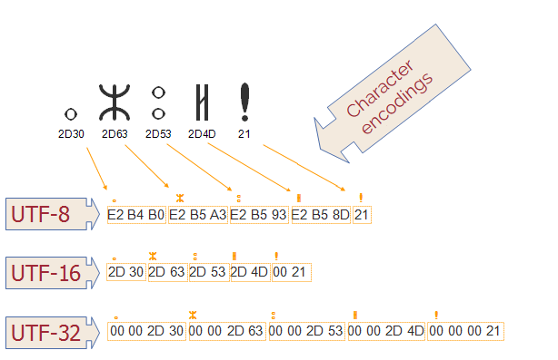
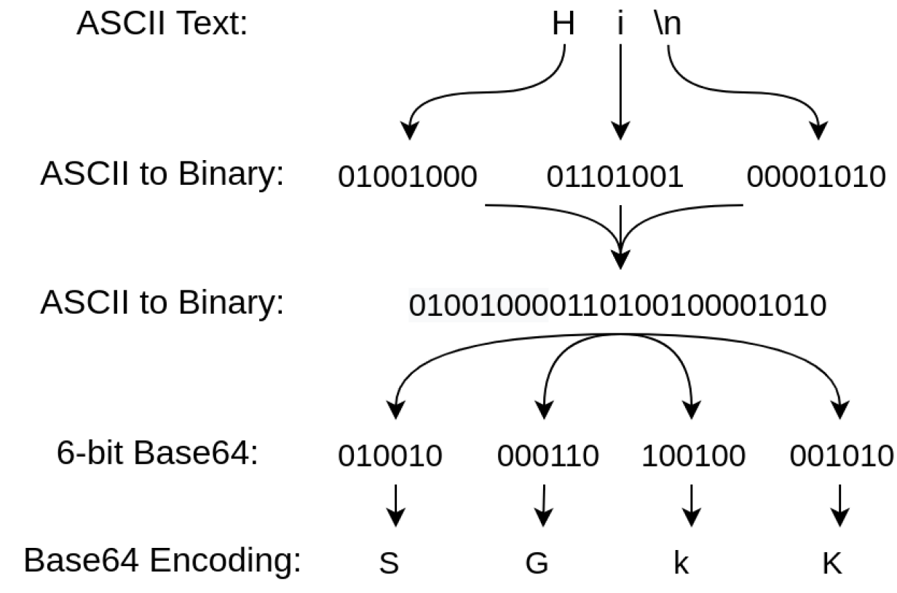

## 문자열 인코딩에 대해 설명해 주세요.
`문자열 인코딩`이란, 문자열을 컴퓨터가 이해할 수 있는 `이진수`(`바이트` 데이터)로 변환하기 위한 방법을 말합니다.  
*구체적으로 말하자면* `문자열 인코딩`은 특정 바이트나 바이트 시퀀스를 특정 문자에 매핑하는 키, 즉 바이트-문자 간의 매핑 집합입니다.  
특정 목적을 위한 문자들(ex. 각 언어별 문자)은 `문자열 세트(레퍼토리)`로 그룹화 됩니다.  
인코딩 체계를 어떤 것을 사용하느냐에 따라 동일한 `바이트 시퀀스`에 대해 다른 해석이 가능합니다.  
### `문자열 세트(Character Set)`
**문자 체계**에서 사용되는 **문자와 기호의 집합**을 말합니다.  
예시로, `ASCII 문자열 세트`는 영어 텍스트에 필요한 문자와 기호를, `ISO-8859-6 문자열 세트`의 경우 아랍 문자를 기반으로 하는 여러 언어에 필요한 문자 및 기호를 다룹니다.  
초기에는 각 국마다 사용하는 언어의 차이로 자체 문자열 세트(ex. 일본어 - EUC-JP, 중국 - Big5, 한국 - KSC5601-87 등)를 개발해 사용했으나, 이후 `Unicode`가 표준으로 자리잡게 되었습니다.  
### 코드 포인트
문자열이 인코딩을 거치면 특정 문자에 매핑되는 유일한 식별자인 `코드 포인트`로 변환되게 됩니다.  
이러한 코드 포인트는 하나 이상의 바이트로 표시되며, 인코딩 별로 주어진 인코딩 집합 내 가능한 모든 코드 포인트의 집합이 인코딩 별 코드스페이스를 구성합니다.  
### 종류
주로 사용되는 문자열 세트로는 `ASCII`, `ISO 8859`, `EUC`, `Unicode` 등이 있습니다.
#### ASCII(American Standard Code for Information Interchange)
1963년 처음 발표된 인코딩으로, 256개의 슬롯을 문자, 숫자, 기타 문자로 구분하는 7비트 코드 표준입니다.  
33개의 출력 불가능한 제어 문자와, 95개의 출력 가능한 문자로 이루어져 있습니다.  
#### ISO 8859
ISO와 IEC의 공동 표준으로, 8비트 코드 표준입니다.  
`ASCII`에 포함된 95자로는 각 국의 언어에 존재하는 특수한 기호를 사용할 수 없어 이를 해소하고자 여러 `ISO 8859` 매핑이 개발되었습니다.  
`ASCII`에서 1비트 확장해 128자의 추가 문자를 할당합니다.
#### EUC(Extended Unix Code)
한국어, 중국어, 일본어 문자 전산화에 사용되는 8비트 코드 표준입니다.  
ISO 2022 표준에 기반한 구조를 가지고 있으며, EUC-CN(중국어), EUC-JP(일본어), EUC-KR(한국어), EUC-TW(대만) 등이 존재합니다.
#### Unicode
전 세계 모든 문자를 일관되게 표현하고 처리할 수 있도록 설계된 표준입니다.  
궁극적으로 현존하는 모든 문자 인코딩 방법을 대체하는것을 목표로 하고 있습니다.  

##### UTF-8
유니코드를 위한 가변 길이 문자 인코딩 방식으로, 한 문자에 1바이트~4바이트를 사용합니다.
`U+0000`부터 `U+007F` 까지는 `ASCII`와 동일해 하위 호환성이 보장됩니다.  
이후 2바이트는 다른 알파벳 블록의 문자를, `BMP`의 문자에 3바이트, 보조 문자에 4바이트를 사용합니다.  
Java에서는 내부 텍스트 표현에 사용되는 UTF-16를 문자열 직렬화 하기 위해 수정된 UTF-8(Modified UTF-8)을 사용합니다. 주로 객체 직렬화, `JNI`, `DataInput`, `DataOutput`에서 사용합니다.  
- `BMP(Basic Multilingual Plane)`: 일반적으로 사용되는 대부분의 문자를 포함한 코드 포인트의 집합입니다.
##### UTF-16
BMP의 모든 문자에 2바이트, 보조 문자에 4바이트를 사용하는 인코딩 방식입니다.
##### UTF-32
모든 유니코드 문자를 같은 4바이트 길이로 표현하는 인코딩 방식입니다.
## Base64 인코딩
Base64 인코딩이란, 이진 데이터를 6비트 단위로 분할한 뒤 ASCII 영역의 문자들로만 이루어진 문자열로 변환하는 인코딩을 말합니다.  
대부분의 문자열 인코딩 방식에서 ASCII 영역을 그대로 유지하기 때문에, 문자열 인코딩 방식의 영향을 받지 않습니다.  
인코딩 후 데이터는, 의미없는 영어와 숫자로 이뤄진 문자열로 변환됩니다.

### 사용 이유
- 특정 환경에서는 **`ASCII` 문자열로만 데이터를 제한**하는 경우가 있는데, 이때 필요한 데이터를 `ASCII`로 **위장**해 **제한을 통과**할 수 있습니다.  
- **호환되지 않는 데이터**를 전송해야할 때, 예를 들어 **텍스트** 메세지에 **이미지를 첨부**해야할 때, 이미지를 Base64 인코딩을 거쳐 텍스트로 함께 보낼 수 있습니다.  
- **텍스트만 저장할 수 있는 곳(ex. 브라우저 쿠키)** 에 텍스트가 아닌 데이터를 저장해야할 때 인코딩을 거쳐 저장할 수 있습니다.  
# 참고 문서
- [UTF-8 - MDN Web Docs 용어 사전: 웹 용어 정의 | MDN (mozilla.org)](https://developer.mozilla.org/ko/docs/Glossary/UTF-8)
- [유니코드 - 위키백과, 우리 모두의 백과사전 (wikipedia.org)](https://ko.wikipedia.org/wiki/%EC%9C%A0%EB%8B%88%EC%BD%94%EB%93%9C)
- [UTF-16 - 위키백과, 우리 모두의 백과사전 (wikipedia.org)](https://ko.wikipedia.org/wiki/UTF-16)
- [Base64 encoding: What sysadmins need to know | Enable Sysadmin (redhat.com)](https://www.redhat.com/sysadmin/base64-encoding)
- [What is base64 Encoding and Why is it Necessary? (freecodecamp.org)](https://www.freecodecamp.org/news/what-is-base64-encoding/)
- [베이스64 - 위키백과, 우리 모두의 백과사전 (wikipedia.org)](https://ko.wikipedia.org/wiki/%EB%B2%A0%EC%9D%B4%EC%8A%A464)
- [문자 인코딩 - 위키백과, 우리 모두의 백과사전 (wikipedia.org)](https://ko.wikipedia.org/wiki/%EB%AC%B8%EC%9E%90_%EC%9D%B8%EC%BD%94%EB%94%A9)
- [Character Sets and Encodings (w3.org)](https://www.w3.org/International/getting-started/characters)
- [Character encodings: Essential concepts (w3.org)](https://www.w3.org/International/articles/definitions-characters/)
- [Character encodings for beginners (w3.org)](https://www.w3.org/International/questions/qa-what-is-encoding)
- [What is Character Encoding System? - GeeksforGeeks](https://www.geeksforgeeks.org/what-is-character-encoding-system/)
- [Code point - Wikipedia](https://en.wikipedia.org/wiki/Code_point)
- [코드 포인트 (Code point) - MDN Web Docs 용어 사전: 웹 용어 정의 | MDN (mozilla.org)](https://developer.mozilla.org/ko/docs/Glossary/Code_point)
- [Character set - MDN Web Docs Glossary: Definitions of Web-related terms | MDN (mozilla.org)](https://developer.mozilla.org/en-US/docs/Glossary/Character_set)
- [문자 집합(Character Set)과 인코딩(Encoding) (navercorp.com)](https://nuli.navercorp.com/community/article/1079940)
- [DataInput (Java 2 Platform SE 5.0) (oracle.com)](https://docs.oracle.com/javase/1.5.0/docs/api/java/io/DataInput.html#modified-utf-8)