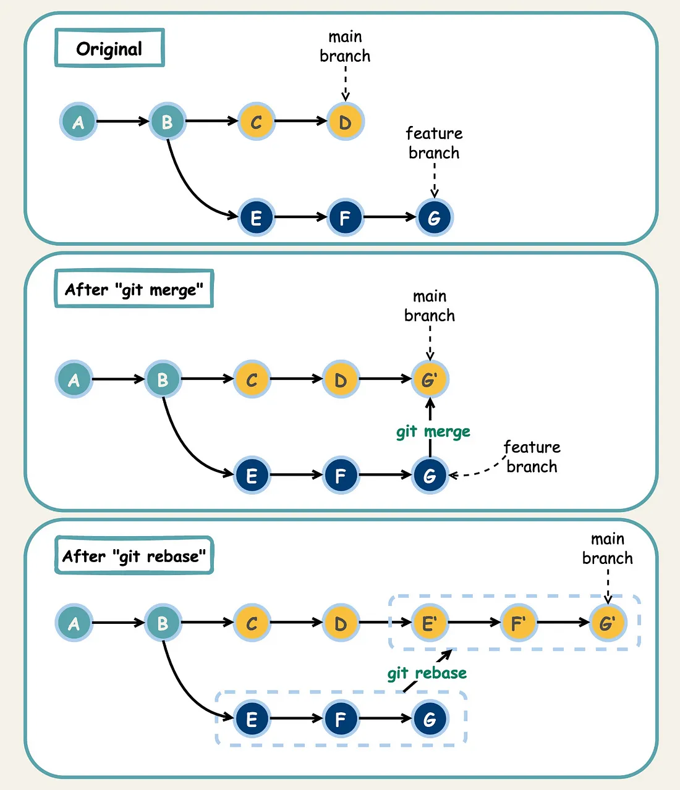

# Git
> - 분산 버전관리 시스템
> - 여러명의 개발자가 하나의 소프트웨어 개발 프로젝트에 참여할 때, 소스 코드를 관리하는 데 주로 사용
> - 각각의 개발자가 branch에서 개발한 뒤, 본 프로그램에 합치는 merge방식을 통한 병렬 개발 가능

## Git merge VS rebase
> 브랜치를 병합하는 두 가지 주요 방법
### merge
> 두 브랜치를 합치는 과정에서 병합 커밋이 생성되며, 두 브랜치의 히스토리 모두 보존
> - 장점
>   - 모든 커밋 히스토리가 보존되므로, 개발 과정 추적 용이
>   - 충돌 해결 후에도 원본 브랜치 히스토리 유지
> - 단점
>   - 병합 커밋이 추가됨

### rebase
> 브랜치의 기반을 다른 브랜치로 이동시키는 작업
> - 장점
>   - 히스토리가 선형으로 만들어져 더 깔끔하고 이해하기 쉬운 커밋 로그 유지 가능
>   - 불필요한 병합 커밋 생성X
> - 단점
>   - 이미 공유된 브랜치에 `rebase`를 수행하면 다른 사람에게 혼란을 줄 수 있다.

### 정리
> - 히스토리가 복잡해지더라도 모든 변경 내역을 명확히 추적할 수 있는 merge
> - 히스토리의 가독성을 중요시하는 경우, 깔끔한 커밋 로그를 유지할 수 있는 rebase
> - 

여러 브랜치를 합쳐야 할 때, 어떤 방법을 사용할 수 있는지 "모두" 설명해 주세요.