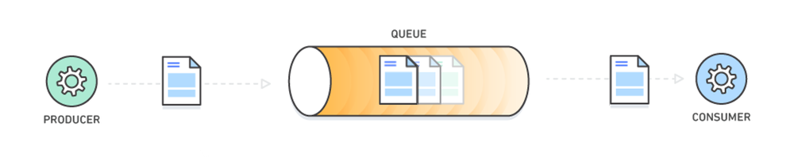
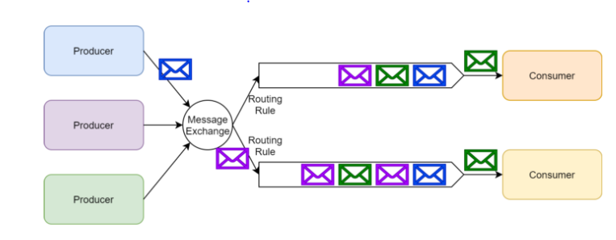
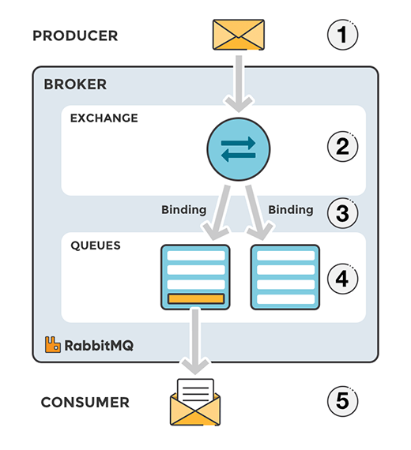
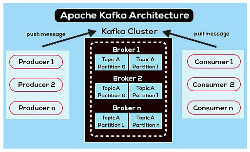
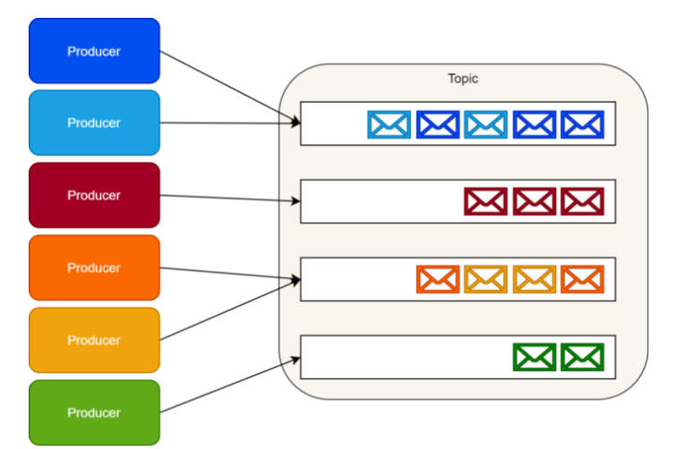
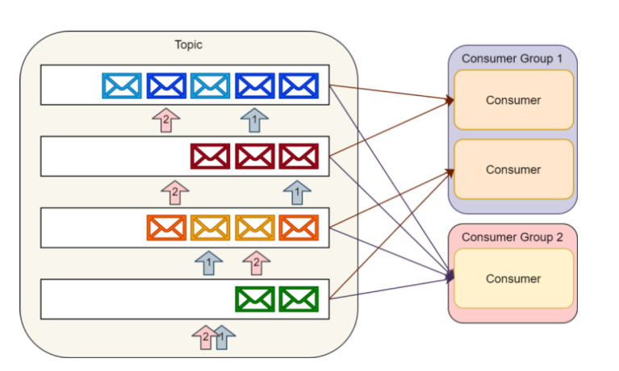
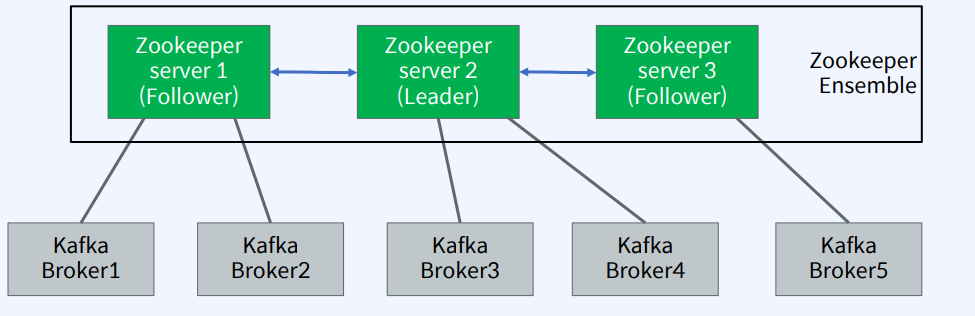

# Message Queue

## Message?
> - 한 시스템에서 또 다른 시스템으로 process되는 게 예상되어지는 information의 한 조각
> - ex) Data payload, file, meta data 등등

## Queue?
> - 데이터를 저장하는 자료구조
> - FIFO(First In First Out)
> - Message는 순차적으로 Queue에 들어오게 되고,
> - Queue는 순차적으로 들어오는 Message를 받아서 갖고 있다가 하나하나 순서에 맞게 전달

## Message Broker?
> - Message Queue를 관리하는 시스템
> - Message Queue를 생성하고, Message를 보내고, 받는다.
> - Message를 `제공하는 Produer`와 `소비하는 Consumer` 사이에서 사용되는 API set가 있다.
> - RabbitMQ, Kafka,...

## MOM?
> - 메시지 지향 미들웨어(Message Oriented Middleware)의 약자
> - `비동기` 메시지를 사용하는 `다른 응용 프로그램 사이`에서 `데이터 송수신`
> - MOM을 구현한 시스템을 메시지 큐(Message Queue : MQ)라고 부른다.

## 메시지 큐의 장점?
> - `비동기(Asynchronous)` : Queue에 넣기 때문에 나중에 처리할 수 있다.
> - `비동조(Decoupling)` : 애플리케이션과 분리할 수 있다.
> - `탄력성(Resilience)` : 일부가 실패해도 전체에 영향을 미치지 않는다.
> - `확장성(Scalability)` : 메시지 큐를 사용하여 여러 서버에 메시지를 분산할 수 있다.
> - `유연성(Flexibility)` : 다양한 시스템과 연동할 수 있다.
> - `신뢰성(Reliability)` : 메시지 큐가 다운되어도 메시지는 보존된다.

## 메시지 큐의 사용처
> - 다른 곳의 API로부터 데이터 송수신이 가능하다.
> - 다양한 애플리케이션에서 비동기 통신을 할 수 있다.
> - 많은 양의 프로세스들을 처리할 수 있다.
> - 이메일
>   - 메시지를 보내면 받은 편지함에 저장
>   - 상대방이 받았는지, 응답을 하는지 상관없음 (의존 X)

## RabbitMQ
> - AMQP 프로토콜을 구현한 Message Broker
> - AMQP : Advanced Message Queuing Protocol
>   - 클라이언트가 메시지 브로커와 통신할 수 있게 해주는 메시지 프로토콜
>   - Exchange : Producer로부터 수신한 메시지를 큐에 분배하는 라우터의 역할
>   - Queue : 메시지를 메모리나 디스크에 저장했다가 Consumer에 메시지를 전달하는 방식
>   - Binding : Exchange와 Queue를 연결하는 것
> - 전통적인 Message Queue 방식
> - 
> - 
> - 정해진 규칙에 따라 큐에 routing 되고, Consumer들이 메시지를 처리한다.

### exchange
> - producer가 전달한 메시지를 queue에 전달하는 역할
> - queue에 들어가기 전 exchange라는 하나의 단계를 더 거친다.

---

## Kafka
> - AMQP의 구현체인 RabbitMQ와 다르게 Kafka는 `분산` 스트리밍 플랫폼
> - pub-sub 모델의 메시지 큐
>   - 메시지가 특정 Topic에 발행되면(Publish), 해당 Topic을 구독(Subscribe)하는 모든 Consumer에게 메시지가 전달된다.
>   - publisher와 subscriber는 오로지 topic 정보만 알 뿐, 서로에 대해서 모른다.
> - 
> - 실시간 스트림 처리를 위한 Stream API 및 다양한 데이터의 손쉬운 통합을 위한 Connector API 제공

### Kafka Cluster
> - kafka 본체
> - 여러 Broker가 모인 것

### Broker
> - kafka 클러스터는 각각의 kafka server들로 이루어졌고 각각의 `kafka server`를 Broker라고 한다.

### Topic
> - 카프카는 큐를 구현하지 않는다.
> - 대신에 토픽이라고 불리는 카테고리에 데이터 집합을 저장한다.
> - 각각의 토픽에, Kafka는 분할된 메세지 로그를 가지고 있다.
> - 하나의 토픽에 하나의 파티션 혹은 여러개의 파티션을 가질 수 있다.
>   - 병렬로 처리하기 위해 분산 저장한다.
> - 
> - 

### Zookeeper
> - Kafka Cluster에서 분산 메시지 큐의 정보를 관리해주는 역할
> - 분산 어플리케이션을 사용하기 위해선 분산 어플리케이션 관리를 위한 안정적인 코디네이션 어플리케이션이 필요하게 됨
>   - 각각의 브로커들의 정보를 관리하고, 브로커들 간의 정보를 동기화하는 역할
> - Broker를 관리(Broker 들의 목록/설정을 관리, `분산처리`)하는 소프트웨어
> - 
> - Zookeeper를 사용하여 멀티 Kafka Broker들 간의 정보(변경 사항 포함) 공유, 동기화 등을 수행한다.

### kafka 동작 순서
> 1. Producer에서 데이터를 kafka 클러스터에 전달한다.
> 2. 지정된 topic 내 partition에 데이터를 저장한다.
> 3. 설정된 replication값에 따라 또 다른 topic 내 partition에 복제를 위한 메시지를 저장한다.
> 4. Consumer Group 안에 있는 어느 하나의 Consumer가 수신하고 메시지 처리를 수행한다.

### kafka & zookeeper 실행
```yaml
version: '3.8'
services:
  zookeeper:
    image: zookeeper:3.5
    ports:
      - "2181:2181"
    environment:
      ZOO_MY_ID: 1
      ZOO_PORT: 2181
      ZOO_SERVERS: server.1=zookeeper:2888:3888;2181
    restart: unless-stopped

  kafka:
    image: wurstmeister/kafka
    ports:
      - "9092:9092"
    environment:
      KAFKA_BROKER_ID: 1
      KAFKA_ZOOKEEPER_CONNECT: zookeeper:2181
      KAFKA_LISTENERS: PLAINTEXT://:9092
      KAFKA_ADVERTISED_LISTENERS: PLAINTEXT://39.116.209.82:9092
      KAFKA_LISTENER_SECURITY_PROTOCOL_MAP: PLAINTEXT:PLAINTEXT
      KAFKA_INTER_BROKER_LISTENER_NAME: PLAINTEXT
    depends_on:
      - zookeeper
    restart: unless-stopped

```


## Message Queue를 이용한 MSA 마이크로 서비스간 통신
### Producer Service
```yaml
spring:
  kafka:
    bootstrap-servers: localhost:9092
    producer:
      key-serializer: org.apache.kafka.common.serialization.StringSerializer
      value-serializer: org.apache.kafka.common.serialization.StringSerializer

```
```java
@RestController
public class MessageController {

    @Autowired
    private KafkaTemplate<String, String> kafkaTemplate;

    @PostMapping("/publish")
    public String sendMessage(@RequestBody String message) {
        kafkaTemplate.send("example-topic", message);
        return "Message sent to Kafka";
    }
}

```

### Consumer Service
```yaml
spring:
  kafka:
    bootstrap-servers: localhost:9092
    consumer:
      group-id: example-group
      auto-offset-reset: earliest
      key-deserializer: org.apache.kafka.common.serialization.StringDeserializer
      value-deserializer: org.apache.kafka.common.serialization.StringDeserializer

```


```java
@Service
public class KafkaConsumerService {

    @KafkaListener(topics = "example-topic", groupId = "example-group")
    public void listen(String message) {
        System.out.println("Received message in group 'example-group': " + message);
    }
}

```

## RabbitMQ vs Kafka
### 1. 동작 아키텍처
> - Kafka : Producer -> broker -> partition -> Consumer
> - RabbitMQ : Producer -> Exchange -> binding rules -> queue -> Consumer

### 2. 성능
> - Kafka : 순차적인 disk I/O 방식을 통해 성능 향상. 적은 비용으로 많은 데이터 유지, 1초에 수백만개의 메세지 처리 가능
> - RabbitMQ : 큐가 비어있을 때만 성능이 빠름, 1초에 수백만개의 메세지 처리 가능하지만 자원이 더 필요하다.

### 3. 메세지 순서 보장
> - Kafka : 같은 토픽 파티션으로 보내진 메세지는 순서대로 처리됨을 보장.
>   - 하지만, 같은 토픽 내에 여러개의 파티션 사이에서 처리 순서 보장 X
>     - 디폴트가 라운드 로빈
>     - 파티션을 키로 지정하면 같은 키를 가진 메세지는 같은 파티션으로 보내짐
> - RabbitMQ : 메세지 소비자가 하나라면, 메세지 순서 보장. 하지만, 여러개의 소비자가 있다면 순서 보장 X

### 4. 용도
> - Kafka : 클러스터를 통해 병렬처리가 주요 차별점인 만큼 `방대한 양의 데이터 처리` 장점
> - RabbitMQ : 데이터 처리보단 `Manage UI를 제공하는 만큼 관리적인 측면, 다양한 기능 구현을 위한 서비스 구축`