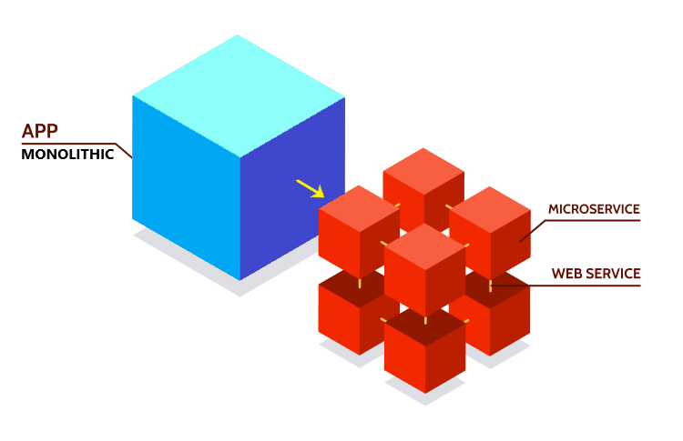
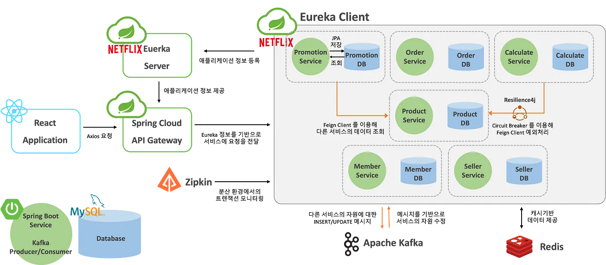
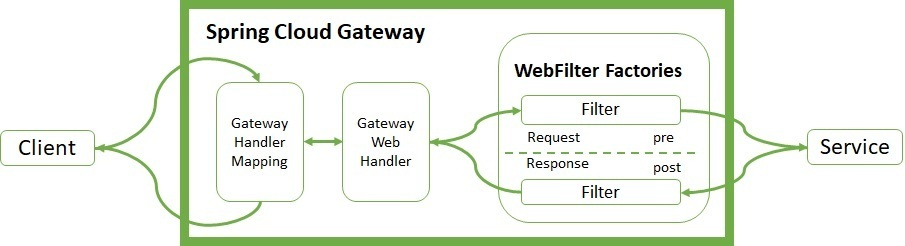
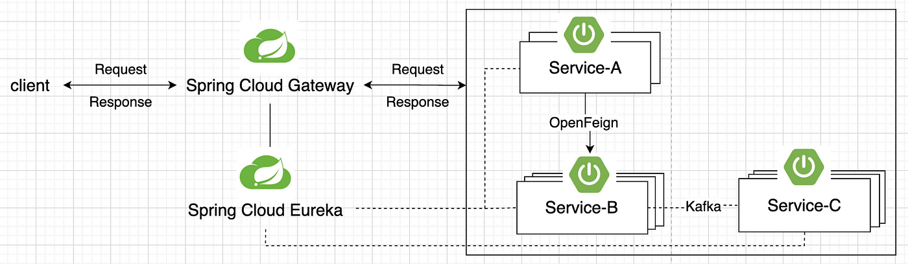
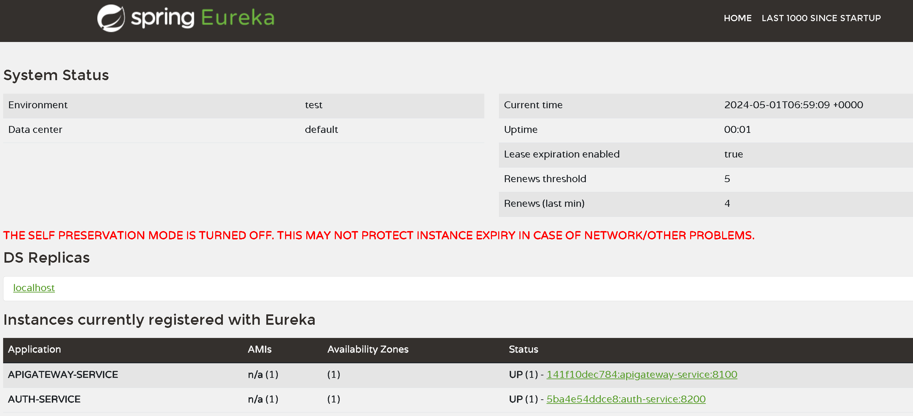
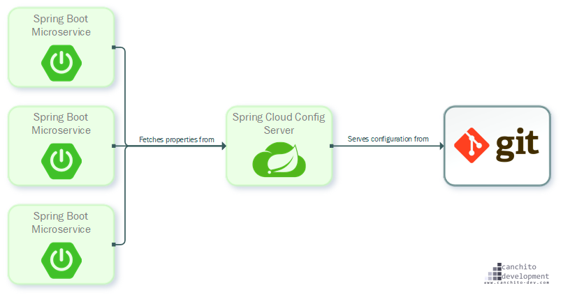

# MSA
> - MicroService Architecture의 줄임말
> - 작고 독립적으로 배포 가능한 각각의 기능을 수행하는 서비스로 구성된 프레임워크

## MSA 등장배경

> Monolithic Architecture는 소프트웨어의 모든 구성요소가 한 프로젝트에 통합되어 있는 서비스

### 기존 Monolithic Architecture의 한계
> - 부분 장애가 전체 서비스의 장애로 확대될 수 있음
> - 전체 시스템 구조 파악이 어려움
> - 서비스 변경이 어렵고, 수정 시 영향도 파악이 힘듦
> - 빌드 시간 및 테스트, 배포 시간의 급증
> - 서비스의 특정 부분만 Scale-Out하기 어려움
> - 한 Framework와 언어에 종속적

## MSA 특징
> - MSA는 API를 통해서 상호작용할 수 있다.
> - 마이크로 서비스는 각 서비스의 EndPoint를 API형태로 외부에 노출하고, 실질적인 세부사항은 모두 `추상화`한다.
> - 제대로 설계된 마이크로서비스는 하나의 비즈니스 범위에 맞춰 만들어지므로 하나의 기능만 수행한다.
> - 마이크로 서비스간 통신으로 REST등 가벼운 통신 아키텍처(RestTemplate, WebClient), Message Queue(Kafka) 등을 이용한 message stream을 주로 사용한다.

## MSA 장점
### 1. 배포
> - 서비스별 개별 배포가 가능하다.
> - 특정 서비스를 배포해도 전체 서비스의 중단이 없다.
> - 특정 서비스의 요구사항만을 반영하여, 빠르게 배포 가능하다.

### 2. 확장
> - 특정 서비스에 대한 확장성(Scale-Out)이 유리하다.
> - 클라우드 기반 서비스 사용에 적합하다.
>   - 클라우드 서버에서는 실제 운영되는 서버 규격에 따라 클라우드 서버 성능을 자유롭게 변경할 수 있다.

### 3. 장애
> - 일부 장애가 전체 서비스로 확장될 가능성이 적다.
> - 부분적으로 발생하는 장애에 대한 격리가 수월하다.

### 4. 언어
> - 서비스별로 다양하고 별도의 언어와 framework로 구현이 가능하다.

### 5. 분석
> - 각각의 서비스에 대한 구조 파악 및 분석이 모놀리식 구조에 비해 쉽다.

## MSA 단점
### 1. 설계의 어려움
> - 서비스가 모두 분산되어 있기 때문에 개발자는 내부 시스템의 통신을 어떻게 가져가야할지 정해야한다.
> - 통신의 장애와 서버의 부하 등이 있을 경우 어떻게 transaction을 유지할지 결정하고 구현해야 한다.

### 2. 성능
> - 서비스 간 호출 시 API를 사용하므로, 통신 비용이나 Latency에 대해 이슈가 존재한다.

### 3. 테스트
> - 모놀리식에서는 단일 트랜잭션을 유지하면 됐지만, MSA에서는 비즈니스에 대한 DB를 가지고 있는 서비스도 각기 다르고, 서비스의 연결을 위해서는 통신이 포함되기 때문에 트랜잭션을 유지하는게 어렵다.
> - 통합 테스트가 어렵다. 개발 환경과 운영환경을 동일하게 가져가는게 쉽지 않다.

### 4. 데이터 관리
> - 데이터가 여러 서비스에 분산되어 있어 조회하기 어렵다.
> - 데이터를 관리하기 어렵다.

## Spring Cloud MSA
### Spring Cloud Gateway(API Gateway)
> - API를 라우팅하는 방법 제공
> - securtiy(인증/인가), monitoring, load balancing 제공
> - https://github.com/orm712/Concerting/tree/gateway/deploy
#### 동작 순서
> 1. Client는 Spring Cloud Gateway 서버로 요청을 보냄
> 2. Gateway Handler Mapping에서 요청이 매핑된다고 판단하면 Gateway Web Handler로 요청을 보냄
> 3. Gateway Web Handler는 매핑되는 요청을 위한 필터 체인을 거쳐 요청을 실행함
> 

#### 장점
> - 요청을 다른 서버로 라우팅시키는 부분을 간단한 yaml파일로 완성할 수 있음
> - Non-Blocking 기술 기반이라 라우팅에 집중된(I/O 작업이 많은) 프로젝트에 최고의 성능을 보일 수 있음
> - 애플리케이션의 내부 구조를 캡슐화
>   - 클라이언트는 특정 서비스를 호출하지 않고 단순히 게이트웨이랑 통신하며, 각 종류의 클라이언트에 특정 API를 제공
> - 라우팅 전/후에 손쉽게 부가 기능을 추가할 수 있음(GatewayFilter)
#### 단점
> - 추가 기능의 구현을 WebFlux 기반(리액티브)로 작성해야 하므로 어려울 수 있음
> - 개발, 배포 및 관리해야 하는 지점 증가

### Spring Cloud Eureka(Service Discovery)
> - 다수의 마이크로 서비스서비스(API 서버)들의 위치(IP, PORT)와 상태 정보 파악하는 서버
> - 마이크로 서비스에서 주소록 역할
> - 클라우드 환경에서는 서버의 스케일 업과 스케일 다운이 자주 발생하여 꺼졌다 켜졌다 하면 ip주소가 동적으로 변한다.
> - ip주소가 유동적으로 바뀌기 때문에 이에 대한 위치를 파악하고 있는 Eureka 서버 필요
> - https://github.com/orm712/Concerting/tree/eureka/deploy
> 
> 

### Spring Cloud Config(Config Server)
> - 분산 시스템에서 외부화된 설정 정보를 서버 및 클라이언트에게 제공하는 시스템
> - 다양한 서비스의 yml파일, properties 파일 관리
> 
#### 장점
> - 여러 서버의 설정 파일을 중앙 서버에서 관리할 수 있음
> - 서버를 재배포하지 않고 설정 파일의 변경사항을 반영할 수 있음

#### 단점
> - Git 서버 또는 설정 서버에 의한 장애가 전파될 수 있음