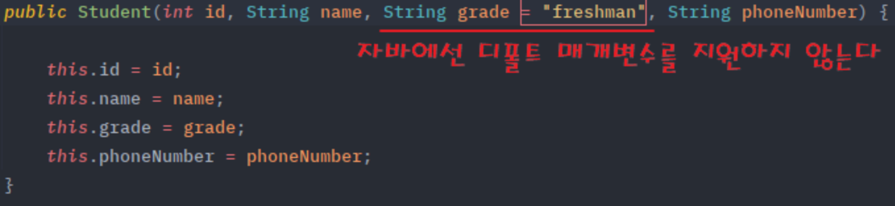
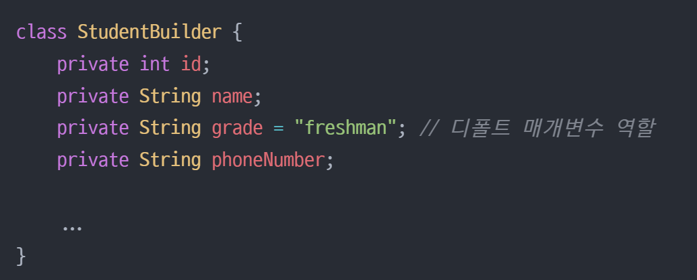
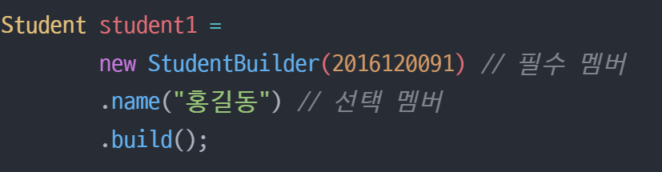

# 빌더 패턴
> 빌더는 복잡한 Object들을 단계별로 구축할 수 있는 생성 디자인 패턴

> - 복잡한 객체의 생성 과정과 표현 방법을 분리하여 다양한 구성의 인스턴스를 만드는 생성 패턴
> - 생성자에 들어갈 매개 변수를 메서드로 하나하나 받아들이고 마지막에 통합 빌드해서 객체를 생성하는 방식

## 뛰어난 예시 - 서브웨이
> - 빵이나 패티 등 속재료들은 주문하는 사람이 마음대로 결정된다.
> - 속재료들을 보다 유연하게 받아 다양한 타입의 인스턴스를 생성할 수 있어, 클래스의 선택적 매개변수가 많은 상황에서 유용하게 사용된다.
> - 

## 탄생 배경
### 점층적 생성자 패턴
>   - 필수 매개편수와 함께 선택 매개변수를 0개, 1개, 2개, ... 받는 형태로, 다양한 매개변수를 입력받아 인스턴스를 생성하고 싶을때 사용하던 생성자를 오버로딩하는 방식
>   - [EX1.java](EX1_생성자.java)
>   - 이러한 방식은 클래스 인스턴스 필드들이 많을 수록 헷갈려진다.
>   - 또한 억지로 파라미터에 0을 전달해야 된다.
### 자바 빈 패턴
>   - 이러한 단점을 보완하기 위해 Setter 메소드를 사용한 자바 빈 패턴이 고안되었다.
>   - 매개변수가 없는 생성자로 객체 생성 후 Setter 메소드를 이용해 클래스 필드의 초깃값을 설정하는 방식
>   - [EX2_자바빈.java](EX2_%C0%DA%B9%D9%BA%F3.java)
>   - 기존 생성자 오버로딩에서 나타났던 가독성 문제점이 사라졌다.
>   - 하지만, 객체 생성 시점에 모든 값을 주입하지 않아 일관성 문제와 불변성 문제가 나타난다.
#### 일관성 문제
>     - 필수 매개변수란 객체가 초기화될 때 반드시 설정되어야 하는 값
>     - 하지만, setter를 호출하지 않으면 이 객체를 일관성이 무너진 상태가 된다.
#### 불변성 문제
> - 객체를 생성했음에도 외부적으로 Setter 메소드를 노출하고 있으므로 객체가 조작되기 너무 쉽다.

## 빌더 패턴
> - 별도의 Builder 클래스를 만들어 메소드를 통해 step-by-step으로 값을 입력받은 후에 최종적으로 build() 메소드로 하나의 인스턴스를 생성하여 리턴하는 패턴이다.
> - StringBuilder 빌더 클래스의 메서드를 체이닝 형태로 호출함으로써 자연스럽게 인스턴스를 구성하고 마지막에 build() 메서드를 통해 최종적으로 객체를 생성하도록 되어 있다.
> - 더이상 생성자 오버로딩 열거를 하지 않아도 되며, 데이터의 순서에 상관없이 객체를 만들어낼 수 있다.
>   - 생성자 인자 순서를 파악할 필요도 없다.
>   - 잘못된 값을 넣는 실수도 하지 않게 된다.

## 빌더 패턴의 장점
> 1. 객체 생성 과정을 일관된 프로세스로 표현
>    - 생성자 방식은 매개변수가 많아질수록 가독성이 떨어진다.
>    - 빌더 패턴을 적용하면 직관적으로 어떤 데이터에 어떤 값이 설정되는지 한눈에 파악할 수 있게 된다.
> 2. 디폴트 매개변수 생략을 간접적으로 지원
>    - 자바에서는 디폴트 매개변수를 지원하지 않는다.
>    - 
>    - 하지만 빌더 패턴은 디폴트 매개변수를 적용할 수 있다.
>    - 
> 3. 필수 멤버와 선택적 멤버를 분리 가능
>    - 초기화가 필수인 멤버 변수가 있고 선택적인 멤버 변수가 있으면, 생성자를 오버로딩을 통해 열거하거나, 혹은 전체 멤버를 인자로 받는 생성자만을 선언하고 매개변수에 null을 받는 식으로 구성하여야 한다.
>    - `Student student = new Student(2010234455, null, null, null);`
>    - 

## 빌더 패턴의 단점
> 1. 생성자보다 성능은 떨어진다.
>   - 많은 차이가 나지는 않지만, 빌더를 거쳐 인스턴스화하기 때문에 성능 차이가 있다.
> 2. 코드 복잡성 증가
>   - N개의 클래스에 대해서 N개의 빌더 클래스를 만들어야 하기 때문에, 구조가 복잡해질 수 있다.

## Lombok Builder
> 별도의 빌더 클래스없이 `@Builder` 어노테이션을 사용하면 간단하게 빌더 패턴을 사용할 수 있다.
### 클래스 전체 Builder
```java
@Getter @Builder // ✨ 클래스 전체 필드를 빌더로 사용 가능!
public class UserLombok {

  private Long id;
  private String email;
  private String password;
  private String name;
}
```
### 특정 생성자에만 Builder 적용
```java
@Getter
public class UserLombok {

  private Long id;
  private String email;
  private String password;
  private String name;

  @Builder // ✨ 빌더는 email, password만 사용 가능
  public UserLombok(String email, String password) {
    this.email = email;
    this.password = password;
  }

  public UserLombok(Long id, String email, String password, String name) {
    this.id = id;
    this.email = email;
    this.password = password;
    this.name = name;
  }
}
```