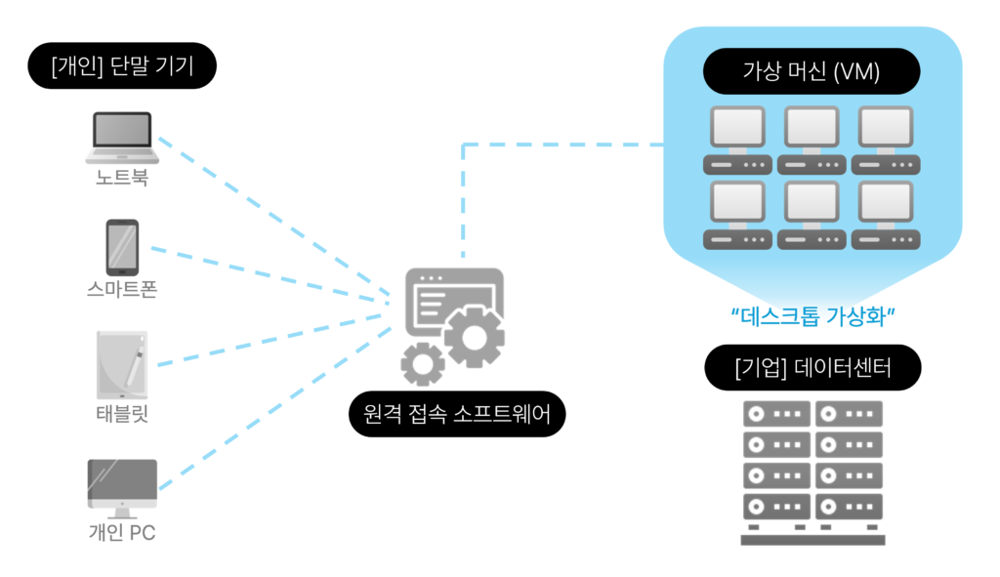
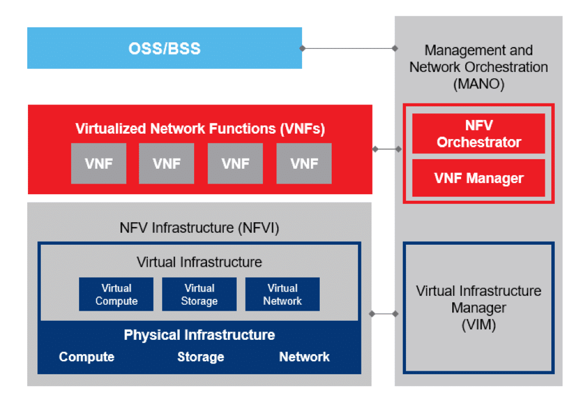
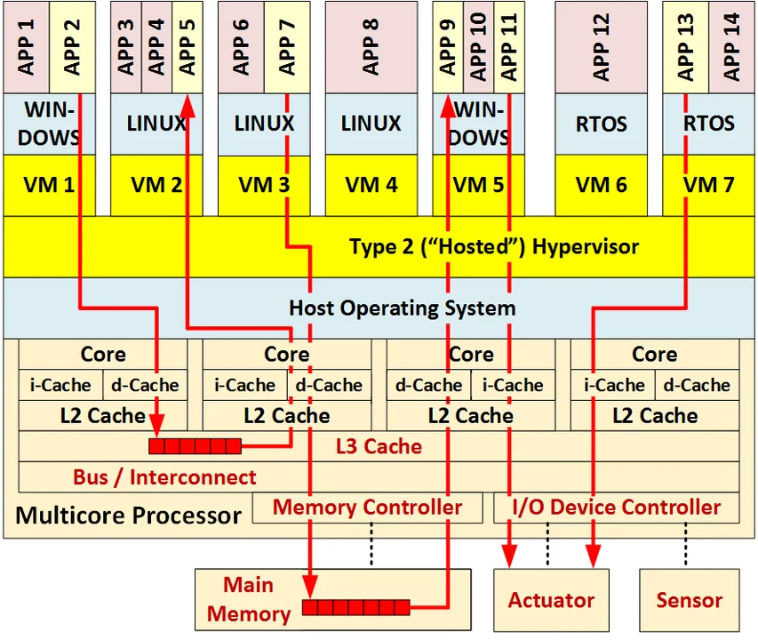
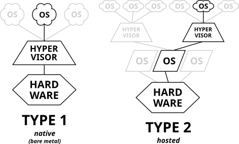
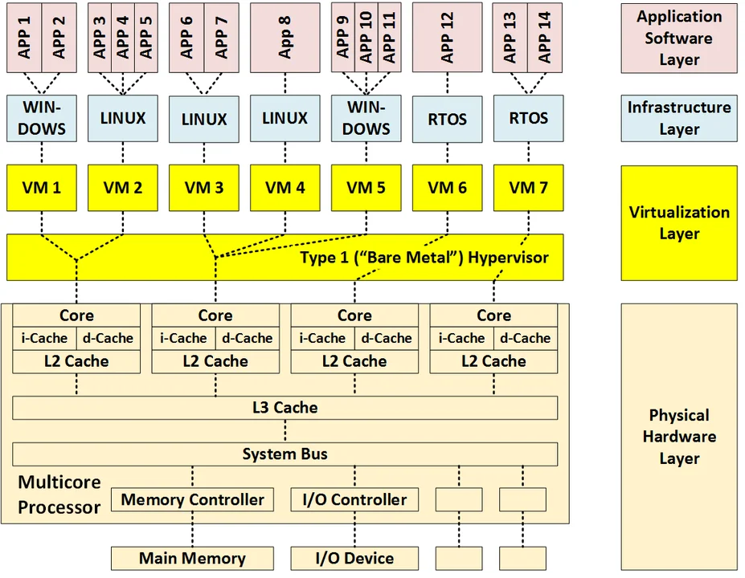
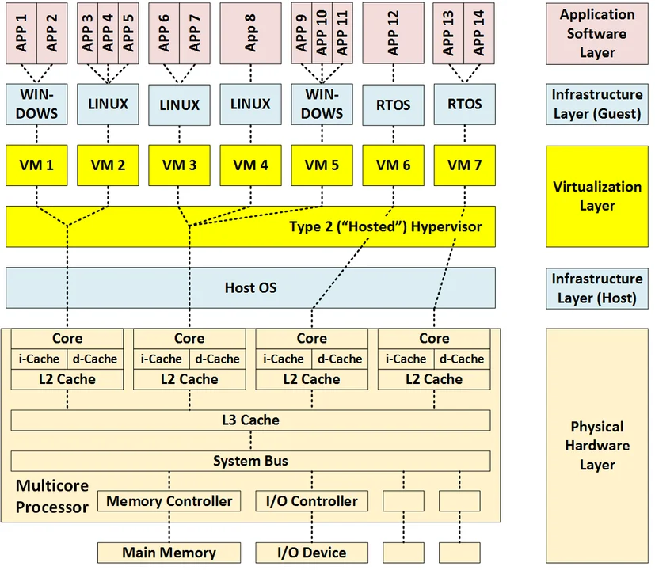
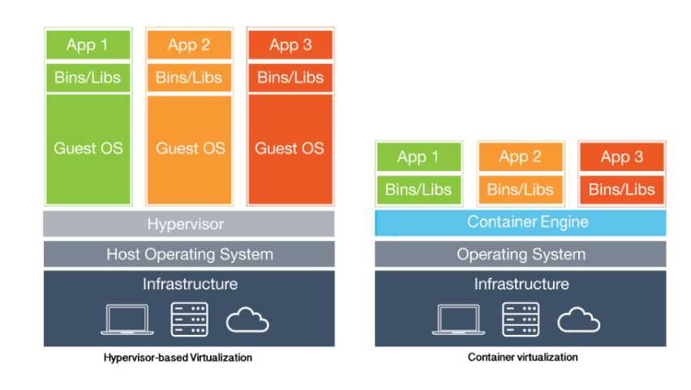

## 가상화가 무엇이고, 이것이 가상머신과 어떠한 차이가 있는지 설명해 주세요.
### `가상화`란?
`가상화(Virtualization)`란 하나의 `물리적인 하드웨어 시스템`(컴퓨터) 위에 `추상화 계층`을 생성해, 여러 개의 시뮬레이션 환경 또는 전용 리소스로 분할할 수 있게 해주는 기술을 말합니다. 즉, 하드웨어에 묶여있던 `자원들`을 `추상화`를 통해 `분산하여 사용`할 수 있게 해주는 기술인 것입니다.  
이러한 분리는 `하이퍼바이저(Hypervisor)`라고 부르는 소프트웨어를 통해 이뤄지며, 가상화를 통해 생성된 가상 표현을 `VM(Virtual Machine, 가상 머신)`이라고 합니다.  

#### 가상화의 역사
`가상화`는 1960년대 대형 메인프레임 컴퓨터를 사용하던 시절, 각 메인프레임들이 `한 번에 한 프로세스만 수행`하던 것을 **개선**하고자 등장하게 되었습니다.  
당시 고객의 요구로 한 메인프레임이 동시에 둘 이상의 사용자, 또는 둘 이상의 프로세스를 지원할 수 있어야 했고, 이를 위해 IBM에서는 `가상 메모리`를 도입한 `하이퍼바이저`인 [IBM CP-40](https://en.wikipedia.org/wiki/IBM_CP-40), [CP-67](https://en.wikipedia.org/wiki/CP-67) OS를 출시하며 가상화 SW가 시장에 등장하게 되었습니다.  
이후 단일 공급자 IT 스택, 레거시 애플리케이션의 리소스 사용 방식으로는 변화에 유연하게 대응하기 어렵다는 점이 대두되고 인터넷이 성장하자 가상화 사용이 점점 증가하게 되었습니다.  

#### 가상화의 종류
`도커`의 등장으로 가장 잘 알려진 가상화인 `운영체제 가상화(OS-Level Virtualization)`(또는 `컨테이너화(Containerization)`)이외에도 여러 유형의 가상화들이 존재합니다.  

##### 운영체제 가상화(OS-Level Virtualization)
`컨테이너화(Containerization)`라고도 불리는 이 방법은, OS의 중앙 자원 및 작업 관리자인 커널이 여러 `사용자 공간(커널 외부에서 실행되는 모든 코드)` 인스턴스를 허용하는 가상화를 말합니다.  
`사용자 공간 인스턴스(user space instance)`로는 `컨테이너(LXC, Solaris Container, Docker)`, `존(Solaris Container)`, `가상 커널(DragonFly BSD)`등이 있습니다.  
각 `컨테이너`들은 컴퓨터 전체에 가용한 자원 중 일부만 할당되며, 컨테이너상에서 실행되는 프로그램들은 컨테이너에 할당된 리소스들을 현재 컴퓨터(컨테이너)의 가용한 전체 리소스로 인식합니다.  
- [OS-level virtualization - Wikipedia](https://en.wikipedia.org/wiki/OS-level_virtualization)

##### 데스크톱 가상화(Desktop Virtualization)

> 출처: [VDI(가상 데스크톱 인프라)란? (feat. VDI vs. DaaS 비교 분석) | 가비아 라이브러리 (gabia.com)](https://library.gabia.com/contents/infrahosting/13429/)

중앙 서버에서 `가상 머신`들을 생성해 여러 데스크톱 환경을 실행하고 이를 클라이언트 기기에서 로그인한 사용자에게 스트리밍하므로써, 물리적 클라이언트 장치와 데스크톱 환경을 분리하는 것을 말합니다.  
이를 `가상 데스크톱 인프라(Virtual Desktop Infrastructure, VDI)`라고도 합니다.  
또한 `VDI`를 클라우드 환경을 통해 제공하는 것을 `서비스형 데스크톱(Desktop-as-a-Service, DaaS)`라고 합니다.  
- [What is virtual desktop infrastructure (VDI)? - IBM Blog](https://www.ibm.com/blog/what-is-virtual-desktop-infrastructure/)
- [DaaS(Desktop-as-a-Service)란 무엇인가요? | IBM](https://www.ibm.com/kr-ko/topics/desktop-as-a-service)

##### 서버 가상화(Server Virtualization)
하나의 서버 컴퓨터에서 여러 개의 가상 머신을 구동해 컴퓨팅 자원을 최대한 활용하고 여러 어플리케이션을 구동할 수 있는 가상화입니다. [#](https://computer.howstuffworks.com/server-virtualization.htm)

##### 네트워크 기능 가상화(Network Function Virtualization)

> NFV의 아키텍처

네트워크 하드웨어로부터 `라우터`, `방화벽`, `로드 밸런서`등의 물리적인 네트워크 `기능을 추상화`하여, 하이퍼바이저위에서 실행중인 소프트웨어로 추상화하는 가상화를 말합니다.  
따라서 네트워크 관리자는 하드웨어들을 건드리지 않고도 네트워크를 관리할 수 있고, 서비스 제공업체에 새로운 기능을 요청하면 제공업체는 새 VM을 가동해 해당 요청을 처리할 수 있게 됩니다.  
- [NFV란? (redhat.com)](https://www.redhat.com/ko/topics/virtualization/what-is-nfv)
- [NFV란? - Ciena KR](https://www.ciena.kr/insights/what-is/What-is-Network-Functions-Virtualization_ko_KR.html)
- [Network Functions Virtualization - GeeksforGeeks](https://www.geeksforgeeks.org/network-functions-virtualization/)

#### 장점
##### 자원의 효율화
가상화 이전에는 `하나의 애플리케이션`에 `하나의 서버(물리적인 CPU를 포함한)`가 필요했습니다.
이러한 형태는 한 서버에서 `가용한 자원`을 `최대로 활용할 수 없으며` 사용중이지 않은 `자원은 낭비` 되어왔습니다.  
이와 다르게, `서버 가상화`를 통해 단일 컴퓨터에 `자체 OS를 포함한 VM들`을 실행해 `다수의 애플리케이션을 실행`하므로써 하드웨어의 `컴퓨팅 자원을 효율적으로 사용`할 수 있게 되었습니다.  

##### 시스템 관리
물리적 `컴퓨팅 자원들`이 가상화되었으므로, 이들을 `소프트웨어 도구를 사용해 관리`할 수 있게 됩니다.  
`인프라를 복제`하는데도 `자동화`를 할 수 있고, `프로비저닝이 더 빨라집니다`.

##### 빠른 장애 복구
기존의 경우, 시스템 장애가 일어나면 *IT 인프라 현장에 직접 접근해 `물리적 서버를 교체 및 수리`* 하는데 `많은 시간`이 걸렸습니다.  
반면 가상 환경에서는 `중복되는 가상 머신으로 대체`하여 빠르게 장애를 복구할 수 있습니다.

#### 단점
##### 자원 효율성
시스템에 가상화를 도입하게 되면 `VM`, `하이퍼바이저`, `게스트 OS`에서 더 많은 컴퓨팅 능력을 요구할 수 있어 때때로 하드웨어 자원 요구량을 증가시키기도 합니다.

##### 공유 자원
`VM`들은 `하이퍼바이저`, `호스트 OS`, `프로세서 내부 자원(L3 캐시, 시스템 버스 등)`, `프로세스 외부 자원(메인 메모리, I/O 기기 및 네트워크)`을 공유하기 때문에, 단일 장애 지점이 존재할 수 밖에 없습니다.  
또한 한 VM에서 실행중인 소프트웨어가 `다른 VM에서 실행중인 소프트웨어`에 `영향`을 미칠 수도 있습니다. (= 격리 위반이 발생할 수 있습니다.)  

##### 간섭
`공간적 격리 실패(공유 메모리로 인한)` 또는 `시간적 격리 실패(간섭 지연 또는 페널티로 인한)`에 의해 한 VM에서 실행중인 소프트웨어가 다른 VM에서 실행중인 소프트웨어의 동작에 영향을 미칠 수 있습니다.  
이러한 `간섭`이 가능한 경로의 수는 VM의 수가 늘어남에 따라 빠르게 증가합니다.  
예시로 아래 그림은 6개의 `공유 자원(빨간색으로 표시된)`을 사용하는 애플리케이션 쌍 간에 발생 가능한 3가지 `간섭 경로`를 나타냅니다.  

> 출처: [Virtualization via Virtual Machines (cmu.edu)](https://insights.sei.cmu.edu/blog/virtualization-via-virtual-machines/)

### `하이퍼바이저(Hypervisor)`
`하이퍼바이저`(또는 `가상 머신 모니터(VMM)`)란, `호스트 머신`에서 `가상 머신(VM)`을 생성 및 실행하는 소프트웨어로 VM들을 생성 및 관리합니다.  
`하이퍼바이저`는 *CPU, 메모리, 스토리지 등* 컴퓨팅 자원들을 기존 게스트 머신 간에, 또는 새로운 VM으로 쉽게 재배치할 수 있는 자원 풀로 취급해 물리적 자원과 가상 환경을 분리합니다.  

일반적으로 `하이퍼바이저`는 하드웨어상에서 직접 실행되는 `타입 1(bare-metal)` 또는 호스트 운영체제 위에서 실행되는 `타입 2(Hosted)`로 나뉩니다.  
- [What is a hypervisor? (redhat.com)](https://www.redhat.com/en/topics/virtualization/what-is-a-hypervisor)
- [하이퍼바이저 - 위키백과, 우리 모두의 백과사전 (wikipedia.org)](https://ko.wikipedia.org/wiki/%ED%95%98%EC%9D%B4%ED%8D%BC%EB%B0%94%EC%9D%B4%EC%A0%80)
#### 타입 1

> 출처: [Virtualization via Virtual Machines (cmu.edu)](https://insights.sei.cmu.edu/blog/virtualization-via-virtual-machines/)

`타입 1` 하이퍼바이저는 **`호스트의 하드웨어에서 직접 실행`** 되어 게스트 OS들을 관리합니다.   
그리고 `호스트 OS`를 대신해 하드웨어에 직접 `가상 머신`들의 자원들을 조정합니다.  
`타입 1`과 같은 형태의 하이퍼바이저는 1960년대 `IBM CP`에서 시작되었으며, 엔터프라이즈 및 서버기반 환경에서 일반적인 형태입니다.  
[KVM(커널-기반 가상 머신)](https://linux-kvm.org/page/Main_Page), [MS Hyper-V](https://learn.microsoft.com/ko-kr/windows-server/virtualization/hyper-v/hyper-v-technology-overview), [VMWare vSphere](https://docs.vmware.com/kr/VMware-vSphere/index.html) 등이 `타입 1`의 대표적인 예시 입니다.  

#### 타입 2

> 출처 : [Virtualization via Virtual Machines (cmu.edu)](https://insights.sei.cmu.edu/blog/virtualization-via-virtual-machines/)

`타입 2` 하이퍼바이저는 일반 프로그램처럼 **`호스트 OS 위`** 에서 실행되는 하이퍼바이저를 말합니다.   
`게스트 OS`를 `호스트 OS`로부터 추상화시키는 방식으로 동작하며, `가상 머신`들의 자원은 `호스트 OS`에 의해 스케줄링되며 이후 하드웨어에 의해 실행됩니다.  
`타입 2`에 해당하는 하이퍼바이저로는 [Oracle VirtualBox](https://www.virtualbox.org/), [VMWare Workstation](https://www.vmware.com/info/workstation-player/evaluation) 등이 있습니다.  

### `가상 머신(Virtual Machine)`
`가상 머신`(또는 `게스트 머신`)이란, `하드웨어 자원 풀에서 생성된 컴퓨팅 환경`으로, *자체 CPU, 메모리, 네트워크 인터페이스, 저장공간 등*을 갖춘 `격리된 시스템`을 말합니다.  
달리 말하자면, 게스트 OS를 위한 가상 운영 환경을 제공하는 하드웨어 플랫폼의 소프트웨어 시뮬레이션이라고 할 수 있습니다.  
이러한 VM들을 실행하는 물리적 기기를 `호스트 머신`이라고 부르며, 호스트 머신의 자원을 사용하는 VM들을 `게스트 머신`이라고 부릅니다.  
`가상 머신`을 사용하게 되면, 한 컴퓨터에서 여러 개의 서로 다른 OS를 동시에 실행할 수 있으며 각 OS는 `호스트 머신`에서 실행되는 것과 동일한 방식으로 실행됩니다.  
- [What is a virtual machine (VM)? (redhat.com)](https://www.redhat.com/en/topics/virtualization/what-is-a-virtual-machine)

## 그렇다면 Docker는 둘 중 어디에 속하나요? 왜 사람들이 Docker를 많이 채택할까요?
OS 가상화, 즉 `컨테이너화`와 `가상 머신`을 사용하는 가상화 중 Docker는 `컨테이너화`에 속한다고 할 수 있습니다.  
### 가상 머신 - 컨테이너의 차이점

`가상 머신`의 경우, `하이퍼바이저`를 사용해 물리적 하드웨어를 가상화하게 됩니다.  따라서 각 가상 머신에 게스트 OS와 이에 필요한 프로세서, 메모리 등의 자원을 할당하여 사용합니다.  
또한 서로 다른 OS를 실행하는 가상 머신들이 하나의 물리적 하드웨어 위에서 구동될 수 있습니다.  
`컨테이너`는 *하드웨어 대신*  `운영체제`를 **가상화**하기 때문에 *`별도의 게스트 OS` 없이* `호스트 OS`위에서 구동됩니다. 따라서 각 컨테이너들은 애플리케이션과 이에 필요한 의존성 및 라이브러리만 포함하며, 가상 머신과 달리 `메인 메모리` 등의 자원을 미리 `할당할 필요가 없습니다`.   

### Docker의 장점
도커는 앞서 말씀드린 것 처럼 여러 패키지, 종속성들을 묶어 이미지화 할 수 있어 `이식성`이 뛰어나다는 장점이 있습니다.  
이는 *여러 클라우드 환경이 보편화*된 **현재**에 상당한 장점인데, 특히 어제는 A 공급자의 클라우드에서 실행하던 것을 오늘은 B 공급자의 클라우드에 배포해야하는 등 유연함이 필요한 상황에 빛을 발합니다.  
이에 더해 `운영체제`와 관련된 세부 정보를 `추상화`하므로, 개발/테스트/프로덕션 등 다양한 환경에서 배포할 때의 문제를 해결하고, CI/CD를 포함한 자동화 및 파이프라인 구현에 알맞습니다.  
그리고 미리 일정량의 자원을 할당해주어야 하는 VM과 달리, 도커 컨테이너는 온디맨드 방식으로 자원을 요청하기 때문에 더 `시스템 자원을 효율적으로 사용`할 수 있습니다.  
- [Docker 및 VM 비교 - 애플리케이션 배포 기술 간의 차이 - AWS (amazon.com)](https://aws.amazon.com/ko/compare/the-difference-between-docker-vm/)
- [Difference Between Docker and Virtualization - GeeksforGeeks](https://www.geeksforgeeks.org/difference-between-docker-and-virtualization/)
- [컨테이너와 VM 비교 - 배포 기술 간의 차이점 - AWS (amazon.com)](https://aws.amazon.com/ko/compare/the-difference-between-containers-and-virtual-machines/)

## 하나의 Host OS에서 돌아간다면 충분히 한 컨테이너가 다른 컨테이너에 간섭할 수 있는 위험이 있지 않을까요? 이를 어떻게 방어할 수 있을까요?
Docker는 기본적으로 Linux OS 위에서만 실행됩니다.  
따라서 Linux에서 프로세스 격리를 위해 사용되는 `namespace`와 `cgroup`를 사용해 격리성을 높일 수 있습니다.  
### `namespace`
`namespace`는 `Linux 커널`의 기능으로, `전역 시스템 자원(커널 자원)`을 `추상화`하여 각 네임스페이스내에 `격리된 자체 전역 자원 인스턴스`가 있는 것처럼 보이게하는 기능입니다.  
즉, 각 프로세스들은 본인이 속한 네임스페이스의 자원을 볼 수 있으며, 다른 네임스페이스의 자원은 볼 수 없습니다.  
이러한 네임스페이스 유형으로는 `cgroup`, `IPC`, `Network`, `Mount`, `PID(Process ID)` 등이 있습니다.  
일반적으로 Linux에서는 새로운 프로세스를 실행할 경우 1번 프로세스의 네임스페이스를 공유하게 됩니다.  
- [Linux namespaces - Wikipedia](https://en.wikipedia.org/wiki/Linux_namespaces)
- [namespaces(7) - Linux manual page (man7.org)](https://man7.org/linux/man-pages/man7/namespaces.7.html)
- [리눅스 네임스페이스(Linux Namespace)란? | 44BITS](https://www.44bits.io/ko/keyword/linux-namespace)

### `cgroup`
`cgroup(control group)`은 `Linux 커널`의 기능으로, `CPU 시간`, `시스템 메모리`, `네트워크 대역폭` 등의 자원을 프로세스 모음에 할당 및 제한하고, 이들을 모니터링할 수 있는 기능입니다.  
프로세스들은 일련의 매개변수 또는 제한(limits)에 의해 각각의 프로세스 모음에 바인딩됩니다.  
부모로 부터 자식 프로세스가 생성되는 `Linux 프로세스 모델`처럼, `cgroup` 모델 역시 계층적이며 자식 `cgroup`은 부모 `cgroup`의 특정 속성을 상속하는 등 유사한 형태를 띕니다.  
- [cgroups - Wikipedia](https://en.wikipedia.org/wiki/Cgroups)
- [1장. 컨트롤 그룹 (Cgroups) 소개 | Red Hat Product Documentation](https://docs.redhat.com/ko/documentation/red_hat_enterprise_linux/6/html/resource_management_guide/ch01#sec-How_Control_Groups_Are_Organized)
- [cgroups(7) - Linux manual page (man7.org)](https://man7.org/linux/man-pages/man7/cgroups.7.html)

### `Enhanced Container Isolation (ECI)` 
`ECI(Enhanced Container Isolation)`는 컨테이너에서 실행되는 악성 워크로드들이 Docker 또는 호스트를 손상시키지 못하게 추가적인 보안 계층을 제공하는 기능입니다.  
`ECI`는 모든 프로세스를 `Linux 사용자-네임스페이스`를 통해 `권한 없이(unprivileged) 실행`하며, `--privileged` 플래그도 무시합니다. 또한 컨테이너나 유저가 내부 설정을 수정할 수 없게해 Docker VM의 불변성을 보장합니다.  
그리고 컨테이너 탈출을 방지하기 위해 몇몇 중요 system call을 검사하고, 컨테이너 내부의 `/proc`과 `/sys` 일부를 가상화해 추가적으로 격리를 진행합니다.  
또한 사용자 콘솔에서 Docker Desktop VM에 접근하지 못하도록 차단합니다.  
`ECI`를 사용하면 기능 및 성능에 대한 영향을 최소화한체, 이러한 기능들이 적용됩니다.  
- [What is Enhanced Container Isolation? | Docker Docs](https://docs.docker.com/security/for-admins/hardened-desktop/enhanced-container-isolation/)
- [Docker security | Docker Docs](https://docs.docker.com/engine/security/)

## Docker 위에 Docker를 올릴 순 없을까요?
가능합니다.  
크게 도커 컨테이너 내부에서 `privileged` 모드를 통해 도커 데몬을 실행하는 `DinD(Docker in Docker)` 방식과, 동일한 도커 데몬상에 컨테이너를 추가 생성한 뒤 `소켓 파일`(`/var/run/docker.sock`)을 공유해 `호스트 컨테이너(도커 서버)`가 **도커 명령을 실행**하는 방식인 `DooD(Docker out of Docker)` 두 가지가 있습니다.  
- [도커 컨테이너 안에서 도커 실행하기(Docke.. : 네이버블로그 (naver.com)](https://blog.naver.com/isc0304/222274955992)
- [Docker in Docker vs Docker Outside of Docker | NIXKNIGHT](https://www.nixknight.com/2022/01/dind-vs-dood/)
- [Jenkins - Docker-in-Docker | NIXKNIGHT](https://www.nixknight.com/2021/04/jenkins-docker-in-docker/)
- [Docker can now run within Docker | Docker](https://www.docker.com/blog/docker-can-now-run-within-docker/)

# 참고
- [가상화란? 개념, 가상화 기술, 서버 가상화에 대한 포괄적인 안내 (redhat.com)](https://www.redhat.com/ko/topics/virtualization/what-is-virtualization)
- [What is virtualization? (redhat.com)](https://www.redhat.com/en/topics/virtualization/what-is-virtualization)
- [가상화란? | IBM](https://www.ibm.com/kr-ko/topics/virtualization)
- [What Is Virtualization? | IBM](https://www.ibm.com/topics/virtualization)
- [Virtualization - Wikipedia](https://en.wikipedia.org/wiki/Virtualization)
- [Desktop virtualization - Wikipedia](https://en.wikipedia.org/wiki/Desktop_virtualization)
- [Virtualization via Virtual Machines (cmu.edu)](https://insights.sei.cmu.edu/blog/virtualization-via-virtual-machines/)